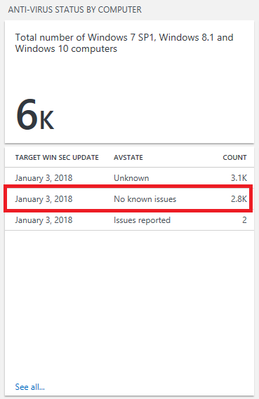
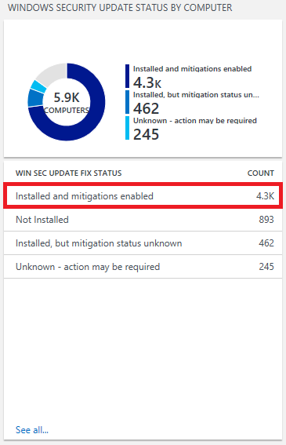

# Upgrade Readiness - Additional insights

This topic provides information on additional features that are available in Upgrade Readiness to provide insights into your environment. These include:

- [Spectre and Meltdown protections](#spectre-and-meltdown-protection-status): Status of devices with respect to their anti-virus, security update, and firmware updates related to protection from the "Spectre" and "Meltdown" vulnerabilities.
- [Site discovery](#site-discovery): An inventory of web sites that are accessed by client computers running Windows 7, Windows 8.1, or Windows 10 using Internet Explorer.
- [Office add-ins](#office-add-ins): A list of the Microsoft Office add-ins that are installed on client computers.

## Spectre and Meltdown protection status
Microsoft has published guidance for IT Pros that outlines the steps you can take to improve protection against the hardware vulnerabilities known as "Spectre" and "Meltdown." See [Windows Client Guidance for IT Pros to protect against speculative execution side-channel vulnerabilities](https://go.microsoft.com/fwlink/?linkid=867468) for details about the vulnerabilities and steps you can take.
 
Microsoft recommends three steps to help protect against the Spectre and Meltdown vulnerabilities:
- Verify that you are running a supported antivirus application.
- Apply all available Windows operating system updates, including the January 2018 and later Windows security updates.
- Apply any applicable processor firmware (microcode) updates provided by your device manufacturer(s).
 
Upgrade Readiness reports on status of your devices in these three areas.

>[!IMPORTANT]
>To provide these blades with data, ensure that your devices can reach the endpoint **http://adl.windows.com**. (See [Enrolling devices in Windows Analytics](https://docs.microsoft.com/windows/deployment/update/windows-analytics-get-started) for more about necessary endpoints and how to whitelist them.)

### Anti-virus status blade
This blade helps you determine if your devices' anti-virus solution is compatible with the latest Windows operating system updates. It shows the number of devices that have an anti-virus solution with no known issues, issues reported, or an unknown status for a particular Windows security update. In the following example, an anti-virus solution that has no known issues with the January 3, 2018 Windows update is installed on about 2,800 devices.

### Security update status blade
This blade indicates whether a Windows security update that includes Spectre- or Meltdown-related fixes (January 3, 2018 or later) has been installed, as well as whether specific fixes have been disabled. Though protections are enabled by default on devices running Windows (but not Windows Server) operating systems, some IT administrators might choose to disable specific protections. In the following example, about 4,300 devices have a Windows security update that includes Spectre or Meltdown protections installed, and those protections are enabled.

>[!IMPORTANT]
>If you are seeing computers with statuses of either “Unknown – action may be required” or “Installed, but mitigation status unknown,” it is likely that you need to whitelist the **http://adl.windows.com** endpoint.

### Firmware update status blade
This blade reports the number of devices that have installed a firmware update that includes Spectre or Meltdown protections. The blade might report a large number of blank, “unknown”, or “to be determined” statuses at first. As CPU information is provided by partners, the blade will automatically update with no further action required on your part.

## Site discovery

The IE site discovery feature in Upgrade Readiness provides an inventory of web sites that are accessed by client computers using Internet Explorer on Windows 7, Windows 8.1, and Windows 10. Site discovery does not include sites that are accessed using other Web browsers, such as Microsoft Edge. Site inventory information is provided as optional data related to upgrading to Windows 10 and Internet Explorer 11, and is meant to help prioritize compatibility testing for web applications. You can make more informed decisions about testing based on usage data.

> [!NOTE]
> Site discovery data is disabled by default; you can find documentation on what is collected in the [Windows 7, Windows 8, and Windows 8.1 appraiser diagnostic data events and fields](https://go.microsoft.com/fwlink/?LinkID=822965). After you turn on this feature, data is collected on all sites visited by Internet Explorer, except during InPrivate sessions. The data collection process is silent, without notification to the employee. You are responsible for ensuring that your use of this feature complies with all applicable local laws and regulatory requirements, including any requirements to provide notice to employees.
> 
> IE site discovery is disabled on devices running Windows 7 and Windows 8.1 that are in Switzerland and EU countries.

In order to use site discovery, a separate opt-in is required; see [Enrolling devices in Windows Analytics](https://docs.microsoft.com/windows/deployment/update/windows-analytics-get-started).

### Review most active sites

This blade indicates the most visited sites by computers in your environment. Review this list to determine which web applications and sites are used most frequently. The number of visits is based on the total number of views, and not by the number of unique devices accessing a page.

For each site, the fully qualified domain name will be listed. You can sort the data by domain name or by URL. 

 

Click the name of any site in the list to drill down into more details about the visits, including the time of each visit and the computer name. 

### Review document modes in use 

This blade provides information about which document modes are used in the sites that are visited in your environment. Document modes are used to provide compatibility with older versions of Internet Explorer. Sites that use older technologies may require additional testing and are less likely to be compatible with Microsoft Edge. Counts are based on total page views and not the number of unique devices. For more information about document modes, see [Deprecated document modes](https://technet.microsoft.com/itpro/internet-explorer/ie11-deploy-guide/deprecated-document-modes).

### Run browser-related queries 

You can run predefined queries to capture more info, such as sites that have Enterprise Mode enabled, or the number of unique computers that have visited a site. For example, this query returns the most used ActiveX controls. You can modify and save the predefined queries. 

## Office add-ins

Office add-ins provides a list of the Microsoft Office add-ins in your environment, and enumerates the computers that have these add-ins installed.  This information should not affect the upgrade decision workflow, but can be helpful to an administrator.

## Related topics

[Manage Windows upgrades with Upgrade Readiness](manage-windows-upgrades-with-upgrade-readiness.md)
