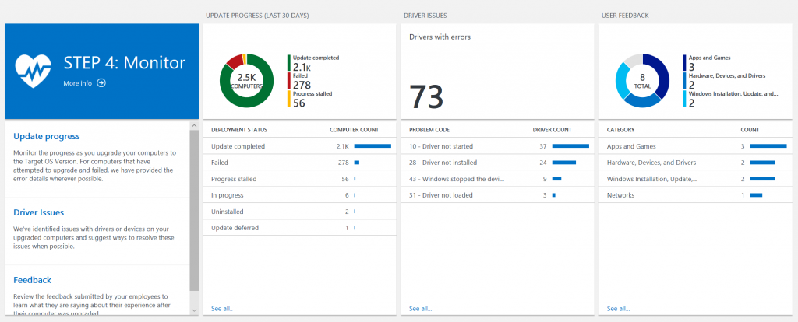
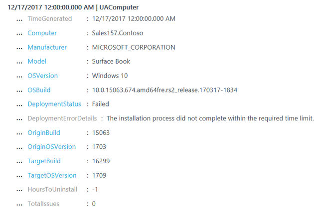
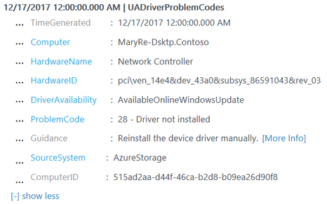
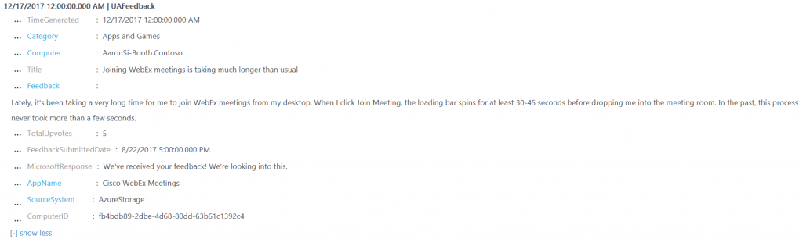

# Upgrade Readiness - Step 4: Monitor

Now that you have started deploying an update with Upgrade Readiness, you can use it to monitor important elements.

 
 
## Update progress

The **Update progress** blade allows you to monitor the progress and status of your deployment. Any device that has attepted to upgrade in the last 30 days displays the **DeploymentStatus** attribute. You'll be able to see the number of computers that have successfully upgraded, failed to upgrade, are stalled, etc.
 
 
Selecting this blade allows you to view device-level details about the deployment. For example, select **Failed** to view the original operating system version, the target operating system version, and the reason the update failed for each of the devices that failed to upgrade. In the case of the device illustrated in the following image, an attempt was made to upgrade from Windows 10, version 1703 to 1709, but the operation timed out.

## Driver issues

The **Driver issues** blade allows you to see Device Manager errors for your upgraded devices. We include data for all compatibility-related device errors, such as "driver not found" and "driver not started." The blade summarizes errors by error type, but you can select a particular error type to see device-level details about which device(s) are failing and where to obtain a driver.
 
 
For example, by selecting error code **28 - driver not installed**, you would see that the device in the following image is missing the driver for a network controller. Upgrade Readiness also notifies that a suitable driver is available online through Windows Update. If this device is configured to automatically receive updates from Windows Update, this issue would likely resolve itself following the device's next Windows Update scan. If this device does not automatically receive updates from Windows Update, you would need to deliver the driver manually. 

 
## User feedback

The **User Feedback** blade focuses on gathering subjective feedback from your end users. If a user submits feedback through the Feedback Hub app on a device in your workspace, we will make that feedback visible to you in this blade. The Feedback Hub app is built into Windows 10 and can be accessed by typing "Feedback Hub" in the Cortana search bar.
 
 
We recommend that you encourage your end users to submit any feedback they have through Feedback Hub. Not only will this feedback be sent directly to Microsoft for review, but you'll also be able to see it by using Upgrade Readiness. You should be aware that **feedback submitted through Feedback Hub will be publicly visible**, so it's best to avoid submitting feedback about internal line-of-business applications.
 
When viewing user feedback in Upgrade Readiness, you'll be able to see the raw "Title" and "Feedback" text from the user's submission in Feedback Hub, as well as the number of upvotes the submission has received. (Since feedback is publicly visible, the number of upvotes is a global value and not specific to your company.)  If a Microsoft engineer has responded to the submission in Feedback Hub, we'll pull in the Microsoft response for you to see as well.

 
