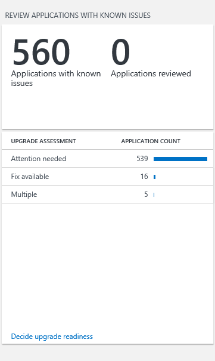
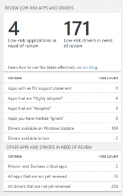
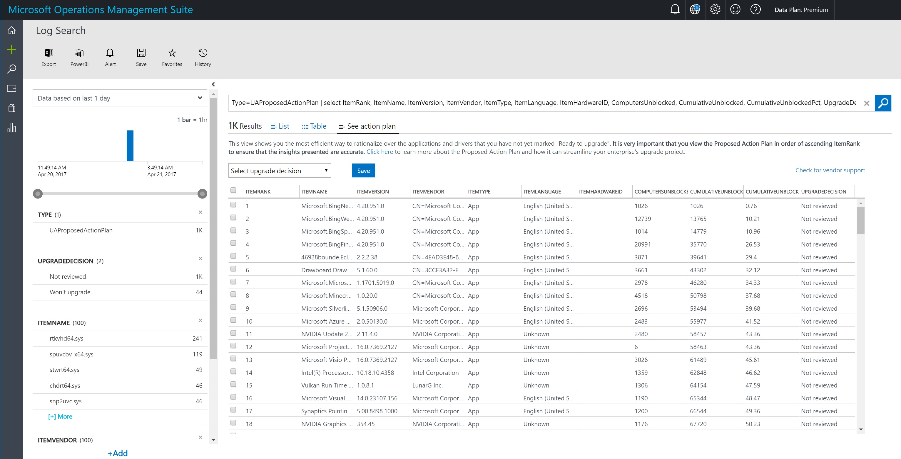

# Upgrade Readiness - Step 2: Resolve app and driver issues

This section of the Upgrade Readiness workflow reports application and driver inventory and shows you which applications have known issues, which applications have no known issues, and which drivers have issues. We identify applications and drivers that need attention and suggest fixes when we know about them.

## In this section

The blades in the **Step 2: Resolve issues** section are:

- [Review applications with known issues](#review-applications-with-known-issues)
- [Review known driver issues](#review-drivers-with-known-issues)
- [Review low-risk apps and drivers](#review-low-risk-apps-and-drivers)
- [Prioritize app and driver testing](#prioritize-app-and-driver-testing)

>You can change an application’s upgrade decision and a driver’s upgrade decision from the blades in this section. To change an application’s or a driver’s importance level, select **User changes**. Select the item you want to change and then select the appropriate option from the **Select upgrade decision** list.

Upgrade decisions include:

|  Upgrade decision  |                                                                                                                                                                  When to use it                                                                                                                                                                  |                                                                                                                                                                                                                                                   Guidance                                                                                                                                                                                                                                                   |
|--------------------|--------------------------------------------------------------------------------------------------------------------------------------------------------------------------------------------------------------------------------------------------------------------------------------------------------------------------------------------------|--------------------------------------------------------------------------------------------------------------------------------------------------------------------------------------------------------------------------------------------------------------------------------------------------------------------------------------------------------------------------------------------------------------------------------------------------------------------------------------------------------------|
|    Not reviewed    |                                                                             All drivers are marked as Not reviewed by default.  Any app that has not been marked **Low install count** will also have an upgrade decision of **Not reviewed** by default.                                                                               |                                                                                                                        Apps you have not yet reviewed or are waiting to review later should be marked as **Not reviewed**. When you start to investigate an application or a driver to determine upgrade readiness, change their upgrade decision to **Review in progress**.                                                                                                                           |
| Review in progress | When you start to investigate an application or a driver to determine upgrade readiness, change its upgrade decision to **Review in progress**.  Until you’ve determined that applications and drivers will migrate successfully or you’ve resolved blocking issues, leave the upgrade decision status as **Review in progress**.    |                                                                                                                                                                        Once you’ve fixed any issues and validated that the application or driver will migrate successfully, change the upgrade decision to **Ready to upgrade**.                                                                                                                                                                          |
|  Ready to upgrade  |                                                                        Mark applications and drivers **Ready to upgrade** once you’ve resolved all blocking issues and you’re confident that they will upgrade successfully, or if you’ve decided to upgrade them as-is.                                                                         | Applications with no known issues and with low installation rates are marked **Ready to upgrade** by default.  In Step 1, you might have marked some of your apps as **Ignore**.  These should be marked as **Ready to upgrade**. Apps with low installation rates are marked as **Ready to upgrade** by default.  Be sure to review any low install count applications for any business critical or important applications that are not yet upgrade-ready, despite their low installation rates.   |
|   Won’t upgrade    |                                    By default, no applications or drivers are marked **Won’t upgrade** because only you can make that determination.   Use **Won’t upgrade** for applications and drivers that you do not work on your target operating system, or that you are unable to upgrade.                                      |                                                                                                                                                                         If, during your investigation into an application or driver, you determine that they should not or cannot be upgraded, mark them **Won’t upgrade**.                                                                                                                                                                            |

As you review applications with known issues, you can also see ISV support statements or applications using [Ready for Windows](https://www.readyforwindows.com/).

## Review applications with known issues

Applications with issues known to Microsoft are listed, grouped by upgrade assessment into **Attention needed** or **Fix available**.

<!-- PRESERVING ORIGINAL IMAGE CODING JUST IN CASE

-->

To change an application's upgrade decision:

1. Select **Decide upgrade readiness** to view applications with issues. 
2. In the table view, select an **UpgradeDecision** value. 
3. Select **Decide upgrade readiness** to change the upgrade decision for each application.
4. Select the applications you want to change to a specific upgrade decision and then select the appropriate option from the **Select upgrade decision** list.
5. Click **Save** when finished.  

IMPORTANT: Ensure that you have the most recent versions of the compatibility update and related KBs installed to get the most up-to-date compatibility information.

For applications assessed as **Attention needed**, review the table below for details about known issues and for guidance about how to resolve them, when possible.

| Upgrade Assessment | Action required prior to upgrade? | Issue     | What it means   | Guidance   |
|--------------------|-----------------------------------|-----------|-----------------|------------|
| Attention needed   | No                                | Application is removed during upgrade              | Compatibility issues were detected and the application will not migrate to the new operating system.                                                                                                                                               | No action is required for the upgrade to proceed.                                                                                                                                                                                                                                                                                                                                         |
| Attention needed   | Yes                               | Blocking upgrade                                   | Blocking issues were detected and Upgrade Readiness is not able to remove the application during upgrade.   The application may work on the new operating system.                                                                        | Remove the application before upgrading, and reinstall and test on new operating system.                                                                                                                                                                                                                                                                                                  |
| Attention needed   | No                                | Evaluate application on new OS                     | The application will migrate, but issues were detected that may impact its performance on the new operating system.                                                                                                                                     | No action is required for the upgrade to proceed, but be sure to test the application on the new operating system.                                                                                                                                                                                                                                                                   |
| Attention needed   | No                                | Does not work with new OS, but won’t block upgrade | The application is not compatible with the new operating system, but won’t block the upgrade.                                                                                                                                                           | No action is required for the upgrade to proceed, however, you’ll have to install a compatible version of the application on the new operating system.                                                                                                                                                                                                                               |
| Attention needed   | Yes                               | Does not work with new OS, and will block upgrade  | The application is not compatible with the new operating system and will block the upgrade.                                                                                                                                                             | Remove the application before upgrading.   A compatible version of the application may be available.                                                                                                                                                                                                                                                                       |
| Attention needed   | Yes                               | May block upgrade, test application                | Issues were detected that may interfere with the upgrade, but need to be investigated further.                                                                                                                                                     | Test the application’s behavior during upgrade. If it blocks the upgrade, remove it before upgrading and reinstall and test it on the new operating system.                                                                                                                                                                                                                          |
| Attention needed   | Maybe                             | Multiple                                           | Multiple issues are affecting the application. See detailed view for more information.| When you see Multiple in the query detailed view, click **Query** to see details about what issues were detected with the different versions of the application. |

For applications assessed as **Fix available**, review the table below for details about known issues and ways to fix them that are known to Microsoft.

| Upgrade Assessment | Action required prior to upgrade? | Issue    | What it means   | Guidance    |
|--------------------|-----------------------------------|----------|-----------------|-------------|
| Fix available      | Yes                               | Blocking upgrade, update application to newest version   | The existing version of the application is not compatible with the new operating system and won’t migrate. A compatible version of the application is available.   | Update the application before upgrading.                                                             |
| Fix available      | No                                | Reinstall application after upgrading                    | The application is compatible with the new operating system, but must be reinstalled after upgrading. The application is removed during the upgrade process.  | No action is required for the upgrade to proceed. Reinstall application on the new operating system. |
| Fix available      | Yes                               | Blocking upgrade, but can be reinstalled after upgrading | The application is compatible with the new operating system, but won’t migrate.                                                                                    | Remove the application before upgrading and reinstall on the new operating system.              |
| Fix available      | Yes                               | Disk encryption blocking upgrade                         | The application’s encryption features are blocking the upgrade.                                                                                                    | Disable the encryption feature before upgrading and enable it again after upgrading.            |

### ISV support for applications with Ready for Windows

[Ready for Windows](https://www.readyforwindows.com/) lists software solutions that are supported and in use for Windows 10. This site leverages data about application adoption from commercial Windows 10 installations and helps IT managers upgrade to Windows 10 with confidence. For more information, see [Ready for Windows Frequently Asked Questions](https://developer.microsoft.com/windows/ready-for-windows/#/faq/). 

Click **Review Applications With Known Issues** to see the status of applications for Ready for Windows and corresponding guidance. For example:

If there are known issues with an application, the specific guidance for that known issue takes precedence over the Ready for Windows guidance.

If you query with RollupLevel="NamePublisher", each version of the application can have a different status for Ready for Windows. In this case, different values appear for Ready for Windows. 

> [!TIP]
> Within the Upgrade Readiness data model, an object of Type **UAApp** refers to a particular application installed on a specific computer.  
> 
> To support dynamic aggregation and summation of data the Upgrade Readiness solution "rolls up" (aggregates) data in preprocessing.  Rolling up to the **Granular** level enables display of the **App** level.  In Upgrade Readiness terminology, an **App** is a unique combination of: app name, app vendor, app version, and app language.  Thus, at the Granular level, you can see attributes such as **total install count**, which is the number of machines with a specific **App** installed.
> 
> Upgrade Readiness also has a roll up level of **NamePublisher**, This level enables you to ignore different app versions within your organization for a particular app.  In other words, **NamePublisher** displays statistics about a given app, aggregated across all versions.

The following table lists possible values for **ReadyForWindows** and what they mean. For more information, see [What does the Adoption Status mean?](https://developer.microsoft.com/en-us/windows/ready-for-windows#/faq/?scrollTo=faqStatuses)

| Ready for Windows Status | Query rollup level | What this means | Guidance |
|-------------------|--------------------------|-----------------|----------|
|Supported version available    | Granular | The software provider has declared support for one or more versions of this application on Windows 10. | The ISV has declared support for a version of this application on Windows 10. |
|  Highly adopted | Granular | This version of this application has been highly adopted within the Windows 10 Enterprise ecosystem. | This application has been installed on at least 100,000 commercial Windows 10 devices. | 
| Adopted   | Granular | This version of this application has been adopted within the Windows 10 Enterprise ecosystem. | This application has been installed on at least 10,000 commercial Windows 10 devices. |
| Insufficient Data | Granular | Too few commercial Windows 10 devices are sharing information about this version of this application for Microsoft to categorize its adoption. | N/A |
| Contact developer | Granular | There may be compatibility issues with this version of the application, so Microsoft recommends contacting the software provider to learn more. | Check [Ready for Windows](https://www.readyforwindows.com/) for additional information.|
|Supported version available | NamePublisher | The software provider has declared support for this application on Windows 10. | The ISV has declared support for a version of this application on Windows 10.|
|Adoption status available | NamePublisher | A Ready for Windows adoption status is available for one or more versions of this application. Please check Ready for Windows to learn more. |Check [Ready for Windows](https://www.readyforwindows.com/) for adoption information for this application.|
| Unknown | Any | There is no Ready for Windows information available for this version of this application. Information may be available for other versions of the application at [Ready for Windows](https://www.readyforwindows.com/). | N/A |

## Review drivers with known issues

Drivers that won’t migrate to the new operating system are listed, grouped by availability.

Availability categories are explained in the table below.

| Driver availability   | Action required before or after upgrade? | What it means  | Guidance     |
|-----------------------|------------------------------------------|----------------|--------------|
| Available in-box                         | No, for awareness only                   | The currently installed version of an application or driver won’t migrate to the new operating system; however, a compatible version is installed with the new operating system.                          | No action is required for the upgrade to proceed.                                                                                                                     |
| Import from Windows Update               | Yes                                      | The currently installed version of a driver won’t migrate to the new operating system; however, a compatible version is available from Windows Update.                                                    | If the computer automatically receives updates from Windows Update, no action is required. Otherwise, import a new driver from Windows Update after upgrading.   |
| Available in-box and from Windows Update | Yes                                      | The currently installed version of a driver won’t migrate to the new operating system.   Although a new driver is installed during upgrade, a newer version is available from Windows Update.   | If the computer automatically receives updates from Windows Update, no action is required. Otherwise, import a new driver from Windows Update after upgrading.   |
| Check with vendor                        | Yes                                      | The driver won’t migrate to the new operating system and we are unable to locate a compatible version.                                                                                                    | Check with the independent hardware vendor (IHV) who manufactures the driver for a solution.                                                                          |

To change a driver’s upgrade decision:

1.  Select **Decide upgrade readiness** and then select the group of drivers you want to review. Select **Table** to view the list in a table.

2.  Select **User changes** to enable user input.

3.  Select the drivers you want to change to a specific upgrade decision and then select the appropriate option from the **Select upgrade decision** list.

4.  Click **Save** when finished.

## Review low-risk apps and drivers

Applications and drivers that are meet certain criteria to be considered low risk are displayed on this blade.

The first row reports the number of your apps that have an official statement of support on Windows 10 from the software vendor, so you can be confident that they will work on your target operating system.

The second row (**Apps that are "Highly adopted"**) shows apps that have a ReadyForWindows status of "Highly adopted". This means that they have been installed on at least 100,000 commercial Windows 10 devices, and that Microsoft has not detected significant issues with the app in diagnostic data. Since these apps are prevalent in the ecosystem at large, you can be confident that they will work in your environment as well.

Each row of the blade uses a different criterion to filter your apps or drivers. You can view a list of applications that meet the criterion by clicking into a row of the blade. For example, if you click the row that says "Apps that are 'Highly adopted'", the result is a list of apps that have a ReadyForWindows status of "Highly adopted". From here, you can bulk-select the results, select **Ready to upgrade**, and then click **Save**.  This will mark all apps meeting the "Highly adopted" criterion as "Ready to upgrade"--no further validation is required. Any applications that you have marked as *Mission critical* or *Business critical* are filtered out, as well as any app that has an issue known to Microsoft. This allows you to work with apps in bulk without having to worry about missing a critical app.

You can customize the criteria further by using the Log Search query language. For example, if a ReadyForWindows status of "Adopted" is not sufficient by itself for you to be confident in an app's compatibility, you can add additional filters. To do this, click the row labeled **Apps that are 'Adopted'**.  Then, modify the resulting query to fit your company's risk tolerance. If, for example, you prefer that an app must be "Adopted" and have fewer than 1,000 installations, then add *TotalInstalls < 1000* to the end of the Log Search query. Similarly, you can append additional criteria by using other attributes such as monthly active users or app importance.

>[!NOTE]
>Apps that you have designated as *Mission critical* or *Business critical* are automatically **excluded** from the counts on this blade. If an app is critical, you should always validate it manually it prior to upgrading.

 At the bottom of the blade, the **OTHER APPS AND DRIVERS IN NEED OF REVIEW** section allows you to quickly access apps you have designated as **Mission critical** or **Business critical**, your remaining apps that still need to be reviewed, and your remaining drivers that need to be reviewed.

## Prioritize app and driver testing

Planning and executing an OS upgrade project can be overwhelming. When you are tasked with evaluating thousands of applications and drivers to ensure a successful upgrade, it can be difficult to decide where to start. The Upgrade Readiness solution provides valuable assistance for you, helping to determine the most important apps and drivers to unblock and enabling you yo create a proposed action plan.   

### Proposed action plan

The Upgrade Readiness proposed action plan is an optimally ordered list of apps and drivers that are in need of review.  By testing apps and drivers in the order suggested by the proposed action plan, you are able to increase your number of “Ready to upgrade” computers in an efficient manner.  The action plan can be a very powerful tool during upgrade planning – but it’s most helpful when it’s used correctly.  This topic explains the proposed action plan, describes how to use it, and calls out a few misconceptions and invalid use cases that you should avoid.

The proposed action plan represents the order thath Microsoft recommends you rationalize the upgrade-readiness of your apps and drivers.  By validating apps and drivers in the order proposed, you can ensure that you are testing efficiently.  

Each item in the proposed action plan represents either an application or a driver that you have not yet marked “Ready to upgrade.”

>Since “Low install count” apps are automatically marked “Ready to upgrade”, you will not see any of these apps in the proposed action plan.  

Each item in the plan has the following attributes: 

| Attribute   | Description | Example value  |
|-----------------------|------------------------------------------|----------------|
| ItemRank | The location of this item in the context of the proposed action plan.  For example, the item with ItemRank 7 is the 7th item in the Plan.  It is crucial that the Plan is viewed in order by increasing ItemRank.  Sorting the Plan in any other way invalidates the insights that the Plan provides. | 7 | 
| ItemType | Whether this item is an app or driver -- possible values are: "App" and "Driver." | App | 
| ItemName | The name of the app or driver that is in need of review.  | Microsoft Visual C++ 2005 Redistributable (x64) | 
| ItemVendor | The vendor of the app or driver.   | Microsoft Corporation | 
| ItemVersion | The version of the app or driver.  | 12.1.0.1 | 
| ItemLanguage | If this item is an application, then this field will be the language of the app.  If the item is a driver, then this will say "N/A." | English | 
| ItemHardwareId | If this item is a driver, then this field will be the hardware id of the driver.  If the item is an app, then this will say "N/A." | N/A | 
| Upgrade Decision | The upgrade decision you have provided for this app or driver.  If you have not defined an upgrade decision, then you will see the default value of “Not reviewed.”  | Review in progress | 
| ComputersUnblocked | Assuming you have already marked all previous items in the proposed action plan “Ready to upgrade”, this represents the number of additional computers that will become “Ready to upgrade” by testing this app or driver and giving it an upgrade decision of “Ready to upgrade”.  For example, if ComputersUnblocked is 200, then resolving any issues associated with the app/driver in question will make 200 new computers “Ready to upgrade.” | 200 | 
| CumulativeUnblocked | The total number of computers that will become “Ready to upgrade” if you validate and mark this and all prior items in the proposed action plan “Ready to upgrade”.  For example, if ItemRank is 7, and CumulativeUnblocked is 950, then fixing items 1 thru 7 in the proposed action plan will cause 950 of your computers to become “Ready to upgrade.” | 950 | 
| CumulativeUnblockedPct | The percentage of your machines that will become “Ready to upgrade” if you make this and all prior items in the proposed action plan “Ready to upgrade.” | 0.24 |   

See the following example action plan items (click the image for a full-size view):

 
In this example, the 3rd item is an application: <strong>Microsoft Bing Sports</strong>, a modern app, version <strong>4.20.951.0</strong>, published by Microsoft.  By validating this app and making its UpgradeDecision “Ready to upgrade”, you can potentially make <strong>1014</strong> computers “Ready to upgrade” – but only after you have already validated items 1 and 2 in the list.  By marking items 1, 2, and 3 “Ready to upgrade”, 14779 of your computers will become upgrade-ready.  This represents 10.96% of the machines in this workspace.  

#### Using the proposed action plan

There are several valid use cases for the proposed action plan.  But it’s always important to remember that the information presented in the Plan is only accurate when sorted by increasing Item Rank!  Here are three potential cases in which you could use the proposed action plan: 

1. Quickly determine how many apps and drivers you’ll need to validate in order to make x% of your computers upgrade-ready.  To determine this, simply find the first item in the Plan with a CumulativeUnblockedPct greater than or equal to your desired percentage of upgrade-ready computers.  The corresponding ItemRank represents the smallest number of apps and drivers that you can validate in order to reach your upgrade readiness goal.  The prior items in the proposed action plan itself represent the most efficient route to reaching your goal. 

2. Use the proposed action plan to prepare a small portion of your machines for a pilot of your target Operating System.  Let’s say you want to test a new Operating System by upgrading a few hundred computers.  You can use the proposed action plan to determine how many apps and drivers you will need to validate before you can be confident that your pilot will be successful.   

3. If your project deadline is approaching and you only have time to validate a few more apps and drivers, you can use the proposed action plan to determine which apps and drivers you should focus on to maximize the number of computers that you can confidently upgrade. 

#### Misconceptions and things to avoid

The most common misconceptions about the proposed action plan involve the assumption that each item in the plan is independent of those around it.  The apps and drivers in the plan must be considered in the correct order to draw valid conclusions.  For example, if you choose to validate items 1, 3, 4, and 5 and mark each of them “Ready to upgrade,” the proposed action plan cannot tell you how many computers will become upgrade-ready as a result of your testing.  Even the non-cumulative “ComputersUnblocked” count is dependent upon all prior issues having already been resolved.   

If an item with ItemRank = 7 has a ComputersUnblocked value of 50, do not assume that 50 of your computers will become upgrade-ready if you test this item.  However, if you validate items 1 through 6 in the plan, you can make an additional 50 computers upgrade-ready by validating the 7th item in the plan. 
