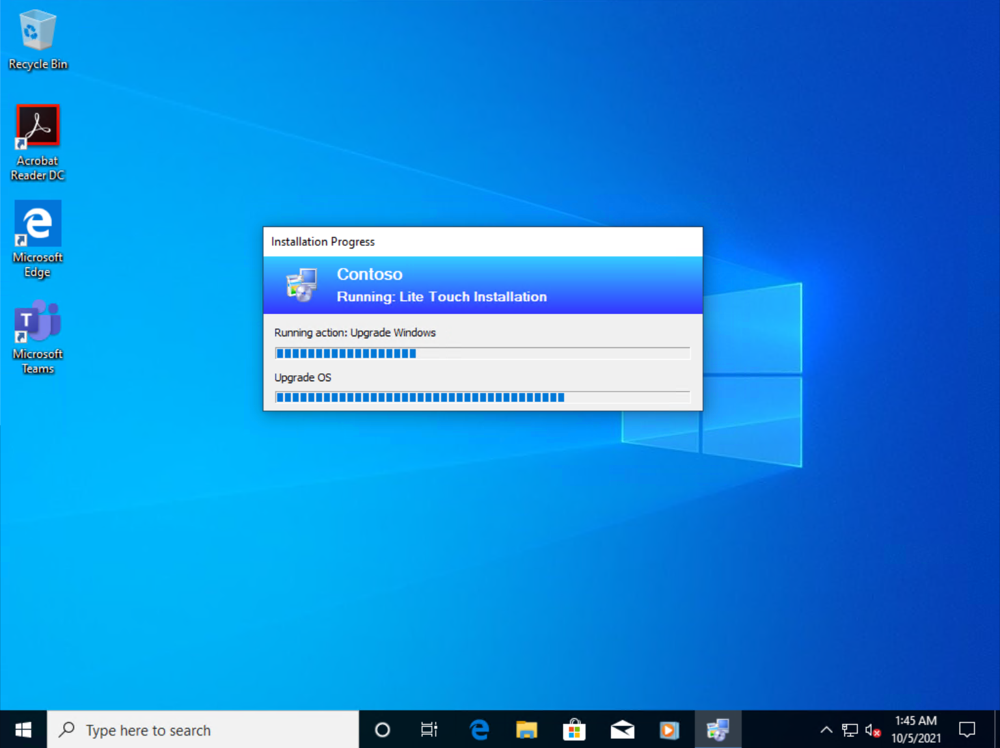

# Perform an in-place upgrade to Windows 10 with MDT

**Applies to**
-   Windows 10

The simplest path to upgrade PCs that are currently running Windows 7, Windows 8, or Windows 8.1 to Windows 10 is through an in-place upgrade. You can use a Microsoft Deployment Toolkit (MDT) 2013 Update 2 task sequence to completely automate the process.

## Proof-of-concept environment

For the purposes of this topic, we will use four machines: DC01, MDT01, and PC0001. DC01 is a domain controller and MDT01 is a Windows Server 2012 R2 standard machine, fully patched with the latest security updates, and configured as a member server in the fictional contoso.com domain. PC0001 is a machine with Windows 7 SP1, targeted for the Windows 10 upgrade. For more details on the setup for this topic, please see [Deploy Windows 10 with the Microsoft Deployment Toolkit](../deploy-windows-mdt/deploy-windows-10-with-the-microsoft-deployment-toolkit.md).

Figure 1. The machines used in this topic.

## Set up the upgrade task sequence

MDT adds support for Windows 10 deployment, including a new in-place upgrade task sequence template that makes the process really simple.

## Create the MDT production deployment share

The steps to create the deployment share for production are the same as when you created the deployment share to create the custom reference image:

1. On MDT01, log on as Administrator in the CONTOSO domain with a password of <strong>P@ssw0rd</strong>.
2. Using the Deployment Workbench, right-click **Deployment Shares** and select **New Deployment Share**.
3. On the **Path** page, in the **Deployment share path** text box, type **E:\\MDTProduction**, and then click **Next**.
4. On the **Share** page, in the **Share name** text box, type **MDTProduction$**, and then click **Next**.
5. On the **Descriptive Name** page, in the **Deployment share** description text box, type **MDT Production**, and then click **Next**.
6. On the **Options** page, accept the default settings and click **Next** twice, and then click **Finish**.
7. Using File Explorer, verify that you can access the **\\\\MDT01\\MDTProduction$** share.

## Add Windows 10 Enterprise x64 (full source)

In these steps we assume that you have copied the content of a Windows 10 Enterprise x64 ISO to the E:\\Downloads\\Windows 10 Enterprise x64 folder.

1.  Using the Deployment Workbench, expand the **Deployment Shares** node, and then expand **MDT Production**.
2.  Right-click the **Operating Systems** node, and create a new folder named **Windows 10**.
3.  Expand the **Operating Systems** node, right-click the **Windows 10** folder, and select **Import Operating System**. Use the following settings for the Import Operating System Wizard:
    -   Full set of source files
    -   Source directory: E:\\Downloads\\Windows 10 Enterprise x64
    -   Destination directory name: W10EX64RTM
4.  After you add the operating system, in the **Operating Systems / Windows 10** folder, double-click the added operating system name in the **Operating System** node and change the name to the following: **Windows 10 Enterprise x64 RTM Default Image**

Figure 2. The imported Windows 10 operating system after you rename it.

## Create a task sequence to upgrade to Windows 10 Enterprise

1.  Using the Deployment Workbench, select **Task Sequences** in the **MDT Production** node, and create a folder named **Windows 10**.
2.  Right-click the new **Windows 10** folder and select **New Task Sequence**. Use the following settings for the New Task Sequence Wizard:
    -   Task sequence ID: W10-X64-UPG
    -   Task sequence name: Windows 10 Enterprise x64 RTM Upgrade
    -   Template: Standard Client Upgrade Task Sequence
    -   Select OS: Windows 10 Enterprise x64 RTM Default Image
    -   Specify Product Key: Do not specify a product key at this time
    -   Full Name: Contoso
    -   Organization: Contoso
    -   Internet Explorer home page: about:blank
    -   Admin Password: Do not specify an Administrator Password at this time

Figure 3. The task sequence to upgrade to Windows 10.

## Perform the Windows 10 upgrade

To initiate the in-place upgrade, perform the following steps on PC0003 (currently running Windows 7 SP1).

1. Start the MDT deployment wizard by running the following command: **\\\\MDT01\\MDTProduction$\\Scripts\\LiteTouch.vbs**
2. Select the **Windows 10 Enterprise x64 RTM Upgrade** task sequence, and then click **Next**.

   

   Figure 4. Upgrade task sequence.
    
3. On the **Credentials** tab, specify the **MDT\_BA** account, <strong>P@ssw0rd</strong> password, and **CONTOSO** for the domain. (Some or all of these values can be specified in Bootstrap.ini so they are automatically populated.)
4. On the **Ready** tab, click **Begin** to start the task sequence.
   When the task sequence begins, it automatically initiates the in-place upgrade process by invoking the Windows setup program (Setup.exe) with the necessary command-line parameters to perform an automated upgrade, which preserves all data, settings, apps, and drivers.

Figure 5. Upgrade from Windows 7 to Windows 10 Enterprise x64 with a task sequence.

After the task sequence completes, the computer will be fully upgraded to Windows 10.

## Related topics

[Windows 10 deployment scenarios](../windows-10-deployment-scenarios.md)

[Microsoft Deployment Toolkit downloads and resources](https://go.microsoft.com/fwlink/p/?LinkId=618117)
 
