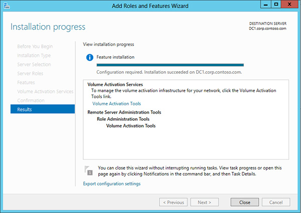

# Activate using Key Management Service

**Applies to**
-   Windows 10
-   Windows 8.1
-   Windows 8
-   Windows 7
-   Windows Server 2012 R2
-   Windows Server 2012
-   Windows Server 2008 R2

**Looking for retail activation?**

-   [Get Help Activating Microsoft Windows](https://go.microsoft.com/fwlink/p/?LinkId=618644)

There are three possible scenarios for volume activation of Windows 10 or Windows Server 2012 R2 by using a Key Management Service (KMS) host:
-   Host KMS on a computer running Windows 10
-   Host KMS on a computer running Windows Server 2012 R2
-   Host KMS on a computer running an earlier version of Windows

Check out [Windows 10 Volume Activation Tips](https://blogs.technet.microsoft.com/askcore/2015/09/15/windows-10-volume-activation-tips/).

## Key Management Service in Windows 10

Installing a KMS host key on a computer running Windows 10 allows you to activate other computers running Windows 10 against this KMS host and earlier versions of the client operating system, such as Windows 8.1 or Windows 7.
Clients locate the KMS server by using resource records in DNS, so some configuration of DNS may be required. This scenario can be beneficial if your organization uses volume activation for clients and MAK-based activation for a smaller number of servers.
To enable KMS functionality, a KMS key is installed on a KMS host; then, the host is activated over the Internet or by phone using Microsoft’s activation services.

**Configure KMS in Windows 10**

1.  Open an elevated command prompt.
2.  Enter one of the following commands.
    -   To install a KMS key, type **slmgr.vbs /ipk &lt;KmsKey&gt;**.
    -   To activate online, type **slmgr.vbs /ato**.
    -   To activate by using the telephone, type **slui.exe 4**.
3.  After activating the KMS key, restart the Software Protection Service.

For more information, see the information for Windows 7 in [Deploy KMS Activation](https://go.microsoft.com/fwlink/p/?LinkId=717032).

## Key Management Service in Windows Server 2012 R2
Installing a KMS host key on a computer running Windows Server allows you to activate computers running Windows Server 2012 R2, Windows Server 2008 R2, Windows Server 2008, Windows 10, Windows 8.1, Windows 7, and Windows Vista.

**Note**  
You cannot install a client KMS key into the KMS in Windows Server.

This scenario is commonly used in larger organizations that do not find the overhead of using a server a burden.

**Note**  

If you receive error 0xC004F015 when trying to activate Windows 10 Enterprise, see [KB 3086418](https://go.microsoft.com/fwlink/p/?LinkId=620687).

**Configure KMS in Windows Server 2012 R2**

1.  Sign in to a computer running Windows Server 2012 R2 with an account that has local administrative credentials.
2.  Launch Server Manager.
3.  Add the Volume Activation Services role, as shown in Figure 4.

    
	
    **Figure 4**. Adding the Volume Activation Services role in Server Manager\
	
4.  When the role installation is complete, click the link to launch the Volume Activation Tools (Figure 5).

    
	
    **Figure 5**. Launching the Volume Activation Tools

	5.  Select the **Key Management Service (KMS)** option, and specify the computer that will act as the KMS host (Figure 6).
    This can be the same computer on which you installed the role or another computer. For example, it can be a client computer running Windows 10.
    
	
	
    **Figure 6**. Configuring the computer as a KMS host
	
6.  Install your KMS host key by typing it in the text box, and then click **Commit** (Figure 7).

    
	
    **Figure 7**. Installing your KMS host key
	
7.  If asked to confirm replacement of an existing key, click **Yes**.
8.  After the product key is installed, you must activate it. Click **Next** (Figure 8).

    
	
    **Figure 8**. Activating the software

	The KMS key can be activated online or by phone. See Figure 9.

	

	**Figure 9**. Choosing to activate online

Now that the KMS host is configured, it will begin to listen for activation requests. However, it will not activate clients successfully until the activation threshold is met.

## Verifying the configuration of Key Management Service

You can verify KMS volume activation from the KMS host server or from the client computer. KMS volume activation requires a minimum threshold of 25 computers before activation requests will be processed. The verification process described here will increment the activation count each time a client computer contacts the KMS host, but unless the activation threshold is reached, the verification will take the form of an error message rather than a confirmation message.
**Note**  

If you configured Active Directory-based activation before configuring KMS activation, you must use a client computer that will not first try to activate itself by using Active Directory-based activation. You could use a workgroup computer that is not joined to a domain or a computer running Windows 7 or Windows Server 2008 R2.

To verify that KMS volume activation works, complete the following steps:

1.  On the KMS host, open the event log and confirm that DNS publishing is successful.
2.  On a client computer, open a Command Prompt window, type **Slmgr.vbs /ato**, and then press ENTER.

The **/ato** command causes the operating system to attempt activation by using whichever key has been installed in the operating system. The response should show the license state and detailed Windows version information.
3.  On a client computer or the KMS host, open an elevated Command Prompt window, type **Slmgr /dlv**, and then press ENTER.

The **/dlv** command displays the detailed licensing information. The response should return an error that states that the KMS activation count is too low. This confirms that KMS is functioning correctly, even though the client has not been activated.

For more information about the use and syntax of slmgr.vbs, see [Slmgr.vbs Options](https://go.microsoft.com/fwlink/p/?LinkId=733639).

## Key Management Service in earlier versions of Windows

If you have already established a KMS infrastructure in your organization for an earlier version of Windows, you may want to continue using that infrastructure to activate computers running Windows 10 or Windows Server 2012 R2. Your existing KMS host must be running Windows 7 or later. To upgrade your KMS host, complete the following steps:

1.  Download and install the correct update for your current KMS host operating system. Restart the computer as directed.
2.  Request a new KMS host key from the Volume Licensing Service Center.
3.  Install the new KMS host key on your KMS host.
4.  Activate the new KMS host key by running the slmgr.vbs script.

For detailed instructions, see [Update that enables Windows 8.1 and Windows 8 KMS hosts to activate a later version of Windows](https://go.microsoft.com/fwlink/p/?LinkId=618265) and [Update that enables Windows 7 and Windows Server 2008 R2 KMS hosts to activate Windows 10](https://go.microsoft.com/fwlink/p/?LinkId=626590).

## See also
-   [Volume Activation for Windows 10](volume-activation-windows-10.md)
