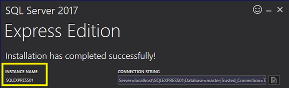
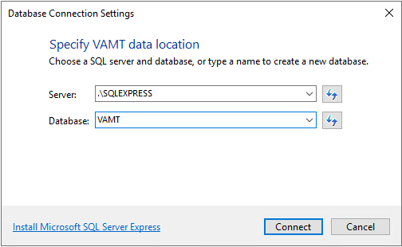

# Install VAMT

This topic describes how to install the Volume Activation Management Tool (VAMT).

## Install VAMT

You install VAMT as part of the Windows Assessment and Deployment Kit (ADK) for Windows 10.

>[!IMPORTANT]
>VAMT requires local administrator privileges on all managed computers in order to deposit confirmation IDs (CIDs), get the client products’ license status, and install product keys. If VAMT is being used to manage products and product keys on the local host computer and you do not have administrator privileges, start VAMT with elevated privileges. For best results when using Active Directory-based activation, we recommend running VAMT while logged on as a domain administrator. 

>[!NOTE]
>The VAMT Microsoft Management Console snap-in ships as an x86 package. 

### Requirements

- [Windows Server with Desktop Experience](/windows-server/get-started/getting-started-with-server-with-desktop-experience), with internet access (for the main VAMT console) and all updates applied
- Latest version of the [Windows 10 ADK](/windows-hardware/get-started/adk-install)
- Any supported [SQL Server Express](https://www.microsoft.com/sql-server/sql-server-editions-express) version, the latest is recommended
- Alternatively, any supported **full** SQL instance

### Install SQL Server Express / alternatively use any full SQL instance

1. Download and open the [SQL Server Express](https://www.microsoft.com/sql-server/sql-server-editions-express) package.

2. Select **Basic**.

3. Accept the license terms.

4. Enter an install location or use the default path, and then select **Install**.

5. On the completion page, note the instance name for your installation, select **Close**, and then select **Yes**. 

    

### Install VAMT using the ADK

1. Download the latest version of [Windows 10 ADK](/windows-hardware/get-started/adk-install).

   If an older version is already installed, it is recommended to uninstall the older ADK and install the latest version. Existing VAMT data is maintained in the VAMT database.

2. Enter an install location or use the default path, and then select **Next**.

3. Select a privacy setting, and then select **Next**.

4. Accept the license terms.

5. On the **Select the features you want to install** page, select **Volume Activation Management Tool (VAMT)**, and then select **Install**. (You can select additional features to install as well.)

6. On the completion page, select **Close**.

### Configure VAMT to connect to SQL Server Express or full SQL Server

1. Open **Volume Active Management Tool 3.1** from the Start menu.

2. Enter the server instance name (for a remote SQL use the FQDN) and a name for the database, select **Connect**, and then select **Yes** to create the database. See the following image for an example for SQL.

   

   For remote SQL Server, use `servername.yourdomain.com`.

## Uninstall VAMT

To uninstall VAMT using the **Programs and Features** Control Panel:

1.  Open **Control Panel** and select **Programs and Features**.

2.  Select **Assessment and Deployment Kit** from the list of installed programs and click **Change**. Follow the instructions in the Windows ADK installer to remove VAMT.

 
