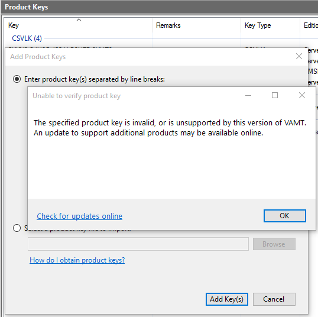

# VAMT known issues

The current known issues with the Volume Activation Management Tool (VAMT), versions 3.0. and 3.1, include:

- VAMT Windows Management Infrastructure (WMI) remote operations might take longer to execute if the target computer is in a sleep or standby state.
- When you open a Computer Information List (CIL) file that was saved by using a previous version of VAMT, the edition information is not shown for each product in the center pane. You must update the product status again to obtain the edition information.
- The remaining activation count can only be retrieved for Multiple Activation Key (MAKs).

## Workarounds for adding CSVLKs for Windows 10 activation to VAMT 3.1

Another known issue is that when you try to add a Windows 10 Key Management Service (KMS) Host key (CSVLK) or a Windows Server 2012 R2 for Windows 10 CSVLK into VAMT 3.1 (version 10.0.10240.0), you receive the error message shown here.



This issue occurs because VAMT 3.1 does not contain the correct Pkconfig files to recognize this kind of key. To work around this issue, use one of the following methods.

### Method 1

Do not add the CSVLK to the VAMT 3.1 tool. Instead, use the **slmgr.vbs /ipk \<*CSVLK*>** command to install a CSVLK on a KMS host. In this command, \<*CSVLK*> represents the specific key that you want to install. For more information about how to use the Slmgr.vbs tool, see [Slmgr.vbs options for obtaining volume activation information](https://docs.microsoft.com/windows-server/get-started/activation-slmgr-vbs-options).

### Method 2

On the KMS host computer, perform the following steps:

1. Download the hotfix from [July 2016 update rollup for Windows 8.1 and Windows Server 2012 R2](https://support.microsoft.com/help/3172614/).

1. In Windows Explorer, right-click **485392_intl_x64_zip** and extract the hotfix to C:\KB3058168.

1. To extract the contents of the update, run the following command:

   ```console
   expand c:\KB3058168\Windows8.1-KB3058168-x64.msu -f:* C:\KB3058168\
   ```

1. To extract the contents of Windows8.1-KB3058168-x64.cab, run the following command:

   ```console
   expand c:\KB3058168\Windows8.1-KB3058168-x64.cab -f:pkeyconfig-csvlk.xrm-ms c:\KB3058168
   ```

1. In the C:\KB3058168\x86_microsoft-windows-s..nent-sku-csvlk-pack_31bf3856ad364e35_6.3.9600.17815_none_bd26b4f34d049716 folder, copy the pkeyconfig-csvlk.xrm-ms file. Paste this file into the C:\Program Files (x86)\Windows Kits\10\Assessment and Deployment Kit\VAMT3\pkconfig folder.

1. Restart VAMT.
