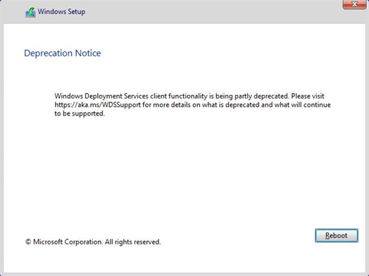

# Windows Deployment Services (WDS) boot.wim support

Applies to: 
- Windows 10 
- Windows 11

The operating system deployment functionality of [Windows Deployment Services](/previous-versions/windows/it-pro/windows-server-2012-r2-and-2012/hh831764(v=ws.11)) (WDS) is being partially deprecated. Starting with Windows 11, workflows that rely on **boot.wim** from installation media or on running Windows Setup in WDS mode will no longer be supported.

When you PXE-boot from a WDS server that uses the **boot.wim** file from installation media as its boot image, Windows Setup automatically launches in WDS mode. This workflow is deprecated for Windows 11 and newer boot images. The following deprecation message is displayed:

  

## Deployment scenarios impacted

The table below provides support details for specific deployment scenarios.

 
<table cellpadding="1">
    <tr>
        <td>&nbsp;&nbsp;&nbsp;&nbsp;&nbsp;&nbsp;</td>
        <td>&nbsp;</td>
        <th>Windows 10</th>
        <th>Windows Server 2016</th>
        <th>Windows Server 2019</th>
        <th>Windows Server 2022</th>
        <th>Windows Windows 11</th>
    </tr>
    <tr>
        <th rowspan="6" valign="middle">Boot image version</th>
    </tr>
    <tr>
        <td><b>Windows 10</b></td>
        <td>Supported, using a boot image from matching or newer version.</td>
        <td>Supported, using a boot image from Windows 10, version 1607 or later.</td>
        <td>Supported, using a boot image from Windows 10, version 1809 or later.</td>
        <td>Not supported.</td>
        <td>Not supported.</td>
    </tr>
    <tr>
        <td><b>Windows Server 2016</b></td>
        <td>Supported, using a boot image from Windows 10, version 1607 or later.</td>
        <td>Supported.</td>
        <td>Not supported.</td>
        <td>Not supported.</td>
        <td>Not supported.</td>
    </tr>
    <tr>
        <td><b>Windows Server 2019</b></td>
        <td>Supported, using a boot image from Windows 10, version 1809 or later.</td>
        <td>Supported.</td>
        <td>Supported.</td>
        <td>Not supported.</td>
        <td>Not supported.</td>
    </tr>
    <tr>
        <td><b>Windows Server 2022</b></td>
        <td>Deprecated, with a warning message.</td>
        <td>Deprecated, with a warning message.</td>
        <td>Deprecated, with a warning message.</td>
        <td>Deprecated, with a warning message.</td>
        <td>Not supported.</td>
    </tr>
    <tr>
        <td><b>Windows 11</b></td>
        <td>Not supported, blocked.</td>
        <td>Not supported, blocked.</td>
        <td>Not supported, blocked.</td>
        <td>Not supported, blocked.</td>
        <td>Not supported, blocked.</td>
    </tr>
   </table>

## Reason for the change

Alternatives to WDS, such as [Microsoft Endpoint Configuration Manager](/mem/configmgr/) and [Microsoft Deployment Toolkit](/mem/configmgr/mdt/) (MDT) provide a better, more flexible, and feature-rich experience for deploying Windows images. 

## Not impacted

WDS PXE boot is not affected by this change. You can still use WDS to PXE boot devices with a custom boot images, but you will no longer be able to use **boot.wim** as the boot image, and run Windows Setup in WDS mode.

You can still run Windows Setup from a network share. Workflows that leverage a custom boot.wim, such as MDT or Configuration Manager are not affected by this change.

## Summary

- Windows 11 workflows that rely on **boot.wim** from installation media will be blocked. You cannot perform an end to end deployment of Windows 11 using only WDS.
- Windows 10, Windows Server 2019, and previous operating system versions are not affected by this change.
- Windows Server 2022 workflows that rely on **boot.wim** from installation media will show a non-blocking deprecation notice that can be dismissed, but the workflow is not blocked.
- Windows Server workflows after Windows Server 2022 that rely on **boot.wim** from installation media are blocked.

If you currently use WDS with **boot.wim** from installation media for end-to-end operating system deployment, and your OS version is not supported, deprecated, or blocked, it is recommended that you use deployment tools such as MDT, Configuration Manager, or a non-Microsoft solution with a custom boot.wim image. 

## Also see

[Create a custom Windows PE boot image with Configuration Manager](deploy-windows-cm/create-a-custom-windows-pe-boot-image-with-configuration-manager.md) 
[Prepare for deployment with MDT](deploy-windows-mdt/prepare-for-windows-deployment-with-mdt.md) 
[Features removed or no longer developed starting with Windows Server 2022](/windows-server/get-started/removed-deprecated-features-windows-server-2022)