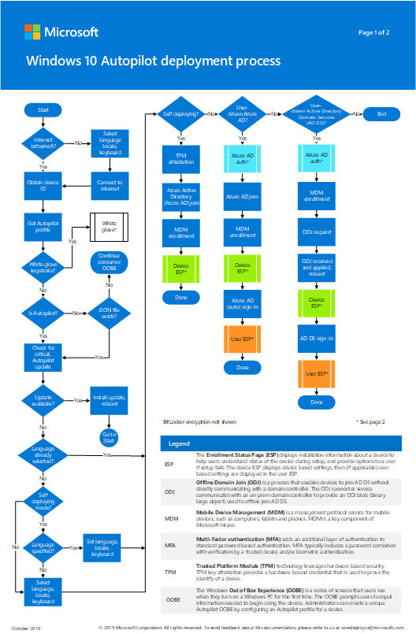
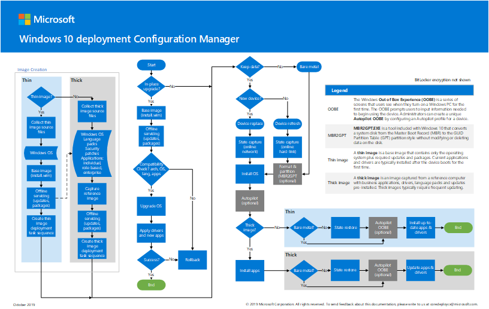

#  Windows 10 deployment process posters

**Applies to**
-   Windows 10

The following posters step through various options for deploying Windows 10 with Windows Autopilot or Microsoft Endpoint Configuration Manager.  

## Deploy Windows 10 with Autopilot

The Windows Autopilot poster is two pages in portrait mode (11x17). Click the image to view a PDF in your browser. You can also download this poster in [PDF](https://github.com/MicrosoftDocs/windows-itpro-docs/raw/public/windows/deployment/media/Windows10AutopilotFlowchart.pdf) or [Visio](https://github.com/MicrosoftDocs/windows-itpro-docs/raw/public/windows/deployment/media/Windows10Autopilotflowchart.vsdx) format.

## Deploy Windows 10 with Microsoft Endpoint Configuration Manager

The Configuration Manager poster is one page in landscape mode (17x11). Click the image to view a PDF in your browser. You can also download this poster in [PDF](https://github.com/MicrosoftDocs/windows-itpro-docs/raw/public/windows/deployment/media/Windows10DeploymentConfigManager.pdf) or [Visio](https://github.com/MicrosoftDocs/windows-itpro-docs/raw/public/windows/deployment/media/Windows10DeploymentConfigManager.vsdx) format.

## See also

[Overview of Windows Autopilot](/windows/deployment/windows-autopilot/windows-autopilot) 
[Scenarios to deploy enterprise operating systems with Configuration Manager](/configmgr/osd/deploy-use/scenarios-to-deploy-enterprise-operating-systems)