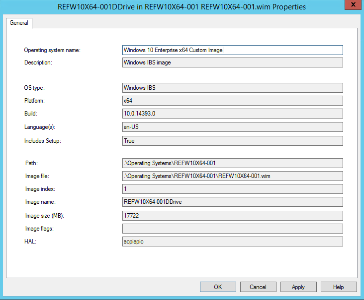
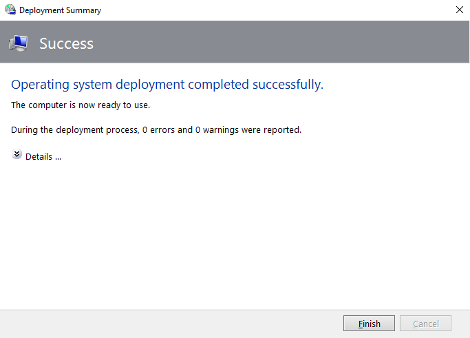

# Deploy Windows 10 in a test lab using Microsoft Deployment Toolkit

**Applies to**

-   Windows 10

**Important**: This guide leverages the proof of concept (PoC) environment configured using procedures in the following guide: 
- [Step by step guide: Configure a test lab to deploy Windows 10](windows-10-poc.md)

Please complete all steps in the prerequisite guide before starting this guide. This guide requires about 5 hours to complete, but can require less time or more time depending on the speed of the Hyper-V host. After completing the current guide, also see the companion guide:
- [Deploy Windows 10 in a test lab using System Center Configuration Manager](windows-10-poc-sc-config-mgr.md)

The PoC environment is a virtual network running on Hyper-V with three virtual machines (VMs):
- **DC1**: A contoso.com domain controller, DNS server, and DHCP server.
- **SRV1**: A dual-homed contoso.com domain member server, DNS server, and default gateway providing NAT service for the PoC network.
- **PC1**: A contoso.com member computer running Windows 7, Windows 8, or Windows 8.1 that has been shadow-copied from a physical computer on your corporate network.

>This guide uses the Hyper-V server role. If you do not complete all steps in a single session, consider using [checkpoints](https://technet.microsoft.com/library/dn818483.aspx) and [saved states](https://technet.microsoft.com/library/ee247418.aspx) to pause, resume, or restart your work.

## In this guide

This guide provides instructions to install and configure the Microsoft Deployment Toolkit (MDT) to deploy a Windows 10 image.

Topics and procedures in this guide are summarized in the following table. An estimate of the time required to complete each procedure is also provided. Time required to complete procedures will vary depending on the resources available to the Hyper-V host and assigned to VMs, such as processor speed, memory allocation, disk speed, and network speed.

<br>

<div style='font-size:9.0pt'>

<table border="1" cellspacing="0" cellpadding="0">
<tr><td BGCOLOR="#a0e4fa"><B>Topic</B><td BGCOLOR="#a0e4fa"><B>Description</B><td BGCOLOR="#a0e4fa"><B>Time</B>

<tr><td><a href="#about-mdt" data-raw-source="[About MDT](#about-mdt)">About MDT</a><td>A high-level overview of the Microsoft Deployment Toolkit (MDT).<td>Informational
<tr><td><a href="#install-mdt" data-raw-source="[Install MDT](#install-mdt)">Install MDT</a><td>Download and install MDT.<td>40 minutes
<tr><td><a href="#create-a-deployment-share-and-reference-image" data-raw-source="[Create a deployment share and reference image](#create-a-deployment-share-and-reference-image)">Create a deployment share and reference image</a><td>A reference image is created to serve as the template for deploying new images.<td>90 minutes
<tr><td><a href="#deploy-a-windows-10-image-using-mdt" data-raw-source="[Deploy a Windows 10 image using MDT](#deploy-a-windows-10-image-using-mdt)">Deploy a Windows 10 image using MDT</a><td>The reference image is deployed in the PoC environment.<td>60 minutes
<tr><td><a href="#refresh-a-computer-with-windows-10" data-raw-source="[Refresh a computer with Windows 10](#refresh-a-computer-with-windows-10)">Refresh a computer with Windows 10</a><td>Export user data from an existing client computer, wipe the computer, install a new operating system, and then restore user data and settings.<td>60 minutes
<tr><td><a href="#replace-a-computer-with-windows-10" data-raw-source="[Replace a computer with Windows 10](#replace-a-computer-with-windows-10)">Replace a computer with Windows 10</a><td>Back up an existing client computer, then restore this backup to a new computer.<td>60 minutes
<tr><td><a href="#troubleshooting-logs-events-and-utilities" data-raw-source="[Troubleshooting logs, events, and utilities](#troubleshooting-logs-events-and-utilities)">Troubleshooting logs, events, and utilities</a><td>Log locations and troubleshooting hints.<td>Informational
</TABLE>

</div>

## About MDT

MDT performs deployments by using the Lite Touch Installation (LTI), Zero Touch Installation (ZTI), and User-Driven Installation (UDI) deployment methods. 
- LTI is the deployment method used in the current guide, requiring only MDT and performed with a minimum amount of user interaction.
- ZTI is fully automated, requiring no user interaction and is performed using MDT and System Center Configuration Manager. After completing the steps in the current guide, see [Step by step: Deploy Windows 10 in a test lab using System Center Configuration Manager](windows-10-poc-sc-config-mgr.md) to use the ZTI deployment method in the PoC environment.
- UDI requires manual intervention to respond to installation prompts such as machine name, password and language settings. UDI requires MDT and System Center Configuration Manager. 

## Install MDT

1. On SRV1, temporarily disable IE Enhanced Security Configuration for Administrators by typing the following commands at an elevated Windows PowerShell prompt:

    ```
    $AdminKey = "HKLM:\SOFTWARE\Microsoft\Active Setup\Installed Components\{A509B1A7-37EF-4b3f-8CFC-4F3A74704073}"
    Set-ItemProperty -Path $AdminKey -Name “IsInstalled” -Value 0
    Stop-Process -Name Explorer
    ```
2. Download and install the 64-bit version of [Microsoft Deployment Toolkit (MDT)](https://www.microsoft.com/download/details.aspx?id=54259) on SRV1 using the default options. As of the writing of this guide, the latest version of MDT was 8443.

3. Download and install the latest [Windows Assessment and Deployment Kit (ADK)](https://developer.microsoft.com/en-us/windows/hardware/windows-assessment-deployment-kit) on SRV1 using the default installation settings. The current version is the ADK for Windows 10, version 1703. Installation might require several minutes to acquire all components.

3. If desired, re-enable IE Enhanced Security Configuration:

    ```
    Set-ItemProperty -Path $AdminKey -Name “IsInstalled” -Value 1
    Stop-Process -Name Explorer
    ```

## Create a deployment share and reference image

A reference image serves as the foundation for Windows 10 devices in your organization.

1. In [Step by step guide: Configure a test lab to deploy Windows 10](windows-10-poc.md), the Windows 10 Enterprise .iso file was saved to the c:\VHD directory as **c:\VHD\w10-enterprise.iso**. The first step in creating a deployment share is to mount this file on SRV1.  To mount the Windows 10 Enterprise DVD on SRV1, open an elevated Windows PowerShell prompt on the Hyper-V host computer and type the following command:

    ```
    Set-VMDvdDrive -VMName SRV1 -Path c:\VHD\w10-enterprise.iso
    ```
2. On SRV1, verify that the Windows Enterprise installation DVD is mounted as drive letter D.

3. The Windows 10 Enterprise installation files will be used to create a deployment share on SRV1 using the MDT deployment workbench. To open the deployment workbench, click **Start**, type **deployment**, and then click **Deployment Workbench**.

4. To enable quick access to the application, right-click **Deployment Workbench** on the taskbar and then click **Pin this program to the taskbar**.

5. In the Deployment Workbench console, right-click **Deployment Shares** and select **New Deployment Share**.

6. Use the following settings for the New Deployment Share Wizard:
    - Deployment share path: **C:\MDTBuildLab**<BR>
    - Share name: **MDTBuildLab$**<BR>
    - Deployment share description: **MDT build lab**<BR>
    - Options: click **Next** to accept the default<BR>
    - Summary: click **Next**<BR>
    - Progress: settings will be applied<BR>
    - Confirmation: click **Finish**


7. Expand the **Deployment Shares** node, and then expand **MDT build lab**.

8. Right-click the **Operating Systems** node, and then click **New Folder**. Name the new folder **Windows 10**. Complete the wizard using default values and click **Finish**.

9. Right-click the **Windows 10** folder created in the previous step, and then click **Import Operating System**.

10. Use the following settings for the Import Operating System Wizard: 
    - OS Type: **Full set of source files**<BR>
    - Source: **D:\\** <BR>
    - Destination: **W10Ent_x64**<BR>
    - Summary: click **Next**
    - Progress: wait for files to be copied
    - Confirmation: click **Finish**

    >For purposes of this test lab, we will only add the prerequisite .NET Framework feature. Commerical applications (ex: Microsoft Office) will not be added to the deployment share. For information about adding applications, see the [Add applications](https://technet.microsoft.com/itpro/windows/deploy/create-a-windows-10-reference-image#sec03) section of the [Create a Windows 10 reference image](deploy-windows-mdt/create-a-windows-10-reference-image.md) topic in the TechNet library.

11. The next step is to create a task sequence to reference the operating system that was imported. To create a task sequence, right-click the **Task Sequences** node and then click **New Task Sequence**. Use the following settings for the New Task Sequence Wizard:
    - Task sequence ID: **REFW10X64-001**<BR>
    - Task sequence name: **Windows 10 Enterprise x64 Default Image** <BR>
    - Task sequence comments: **Reference Build**<BR>
    - Template: **Standard Client Task Sequence**
    - Select OS: click **Windows 10 Enterprise Evaluation in W10Ent_x64 install.wim**
    - Specify Product Key: **Do not specify a product key at this time**
    - Full Name: **Contoso**
    - Organization: **Contoso**
    - Internet Explorer home page: **http://www.contoso.com**
    - Admin Password: **Do not specify an Administrator password at this time**
    - Summary: click **Next**
    - Confirmation: click **Finish**


12. Edit the task sequence to add the Microsoft NET Framework 3.5, which is required by many applications. To edit the task sequence, double-click **Windows 10 Enterprise x64 Default Image** that was created in the previous step.

13. Click the **Task Sequence** tab. Under **State Restore** click **Tatto** to highlight it, then click **Add** and choose **New Group**.

14. On the Properties tab of the group that was created in the previous step, change the Name from **New Group** to **Custom Tasks (Pre-Windows Update)** and then click **Apply**. Click another location in the window to see the name change.

15. Click the **Custom Tasks (Pre-Windows Update)** group again, click **Add**, point to **Roles**, and then click **Install Roles and Features**.

16. Under **Select the roles and features that should be installed**, select **.NET Framework 3.5 (includes .NET 2.0 and 3.0)** and then click **Apply**.

17. Enable Windows Update in the task sequence by clicking the **Windows Update (Post-Application Installation)** step, clicking the **Options** tab, and clearing the **Disable this step** checkbox.
    
    >Note: Since we are not installing applications in this test lab, there is no need to enable the Windows Update Pre-Application Installation step. However, you should enable this step if you are also installing applications.

18. Click **OK** to complete editing the task sequence.

19. The next step is to configure the MDT deployment share rules. To configure rules in the Deployment Workbench, right-click **MDT build lab (C:\MDTBuildLab)** and click **Properties**, and then click the **Rules** tab.

20. Replace the default rules with the following text:

    ```
    [Settings]
    Priority=Default

    [Default]
    _SMSTSORGNAME=Contoso
    UserDataLocation=NONE
    DoCapture=YES
    OSInstall=Y
    AdminPassword=pass@word1
    TimeZoneName=Pacific Standard Time
    OSDComputername=#Left("PC-%SerialNumber%",7)#
    JoinWorkgroup=WORKGROUP
    HideShell=YES
    FinishAction=SHUTDOWN
    DoNotCreateExtraPartition=YES
    ApplyGPOPack=NO
    SkipAdminPassword=YES
    SkipProductKey=YES
    SkipComputerName=YES
    SkipDomainMembership=YES
    SkipUserData=YES
    SkipLocaleSelection=YES
    SkipTaskSequence=NO
    SkipTimeZone=YES
    SkipApplications=YES
    SkipBitLocker=YES
    SkipSummary=YES
    SkipRoles=YES
    SkipCapture=NO
    SkipFinalSummary=NO
    ```

21. Click **Apply** and then click **Edit Bootstrap.ini**. Replace the contents of the Bootstrap.ini file with the following text, and save the file:

    ```
    [Settings]
    Priority=Default

    [Default]
    DeployRoot=\\SRV1\MDTBuildLab$
    UserDomain=CONTOSO
    UserID=MDT_BA
    UserPassword=pass@word1
    SkipBDDWelcome=YES
    ```

22. Click **OK** to complete the configuration of the deployment share.

23. Right-click **MDT build lab (C:\MDTBuildLab)** and then click **Update Deployment Share**.

24. Accept all default values in the Update Deployment Share Wizard by clicking **Next** twice.  The update process will take 5 to 10 minutes. When it has completed, click **Finish**.

25. Copy **c:\MDTBuildLab\Boot\LiteTouchPE_x86.iso** on SRV1 to the **c:\VHD** directory on the Hyper-V host computer. Note that in MDT, the x86 boot image can deploy both x86 and x64 operating systems, except on computers based on Unified Extensible Firmware Interface (UEFI).

    >Hint: To copy the file, right-click the **LiteTouchPE_x86.iso** file and click **Copy** on SRV1, then open the **c:\VHD** folder on the Hyper-V host, right-click inside the folder and click **Paste**.

26. Open a Windows PowerShell prompt on the Hyper-V host computer and type the following commands:

    <div style='font-size:8.0pt'>
    <pre style="overflow-y: visible">

    New-VM REFW10X64-001 -SwitchName poc-internal -NewVHDPath "c:\VHD\REFW10X64-001.vhdx" -NewVHDSizeBytes 60GB
    Set-VMMemory REFW10X64-001 -DynamicMemoryEnabled $true -MinimumBytes 1024MB -MaximumBytes 1024MB -Buffer 20
    Set-VMDvdDrive REFW10X64-001 -Path c:\VHD\LiteTouchPE_x86.iso
    Start-VM REFW10X64-001
    vmconnect localhost REFW10X64-001
	</pre>
    </div>
    
    The VM will require a few minutes to prepare devices and boot from the LiteTouchPE_x86.iso file. 

27. In the Windows Deployment Wizard, select **Windows 10 Enterprise x64 Default Image**, and then click **Next**.

28. Accept the default values on the Capture Image page, and click **Next**. Operating system installation will complete after 5 to 10 minutes, and then the VM will reboot automatically. Allow the system to boot normally (do not press a key). The process is fully automated.

	Additional system restarts will occur to complete updating and preparing the operating system. Setup will complete the following procedures:

	- Install the Windows 10 Enterprise operating system.
	- Install added applications, roles, and features.
	- Update the operating system using Windows Update (or WSUS if optionally specified).
	- Stage Windows PE on the local disk.
	- Run System Preparation (Sysprep) and reboot into Windows PE.
	- Capture the installation to a Windows Imaging (WIM) file.
	- Turn off the virtual machine.<BR><BR>

    This step requires from 30 minutes to 2 hours, depending on the speed of the Hyper-V host. After some time, you will have a Windows 10 Enterprise x64 image that is fully patched and has run through Sysprep. The image is located in the C:\MDTBuildLab\Captures folder on your deployment server (SRV1). The file name is **REFW10X64-001.wim**.

## Deploy a Windows 10 image using MDT

This procedure will demonstrate how to deploy the reference image to the PoC environment using MDT.

1. On SRV1, open the MDT Deployment Workbench console, right-click **Deployment Shares**, and then click **New Deployment Share**. Use the following values in the New Deployment Share Wizard:
     - **Deployment share path**: C:\MDTProd
     - **Share name**: MDTProd$
     - **Deployment share description**: MDT Production
     - **Options**: accept the default


2. Click **Next**, verify the new deployment share was added successfully, then click **Finish**.

3. In the Deployment Workbench console, expand the MDT Production deployment share, right-click **Operating Systems**, and then click **New Folder**. Name the new folder **Windows 10** and complete the wizard using default values.

4. Right-click the **Windows 10** folder created in the previous step, and then click **Import Operating System**.

5. On the **OS Type** page, choose **Custom image file** and then click **Next**.

6. On the Image page, browse to the **C:\MDTBuildLab\Captures\REFW10X64-001.wim** file created in the previous procedure, click **Open**, and then click **Next**.

7. On the Setup page, select **Copy Windows 7, Windows Server 2008 R2, or later setup files from the specified path**. 

8. Under **Setup source directory**, browse to **C:\MDTBuildLab\Operating Systems\W10Ent_x64** click **OK** and then click **Next**.

9. On the Destination page, accept the default Destination directory name of **REFW10X64-001**, click **Next** twice, wait for the import process to complete, and then click **Finish**.

10. In the **Operating Systems** > **Windows 10** node, double-click the operating system that was added to view its properties. Change the operating system name to **Windows 10 Enterprise x64 Custom Image** and then click **OK**. See the following example:

    


### Create the deployment task sequence

1. Using the Deployment Workbench, right-click **Task Sequences** under the **MDT Production** node, click **New Folder** and create a folder with the name: **Windows 10**.

2. Right-click the **Windows 10** folder created in the previous step, and then click **New Task Sequence**. Use the following settings for the New Task Sequence Wizard:
    - Task sequence ID: W10-X64-001
    - Task sequence name: Windows 10 Enterprise x64 Custom Image
    - Task sequence comments: Production Image
    - Select Template: Standard Client Task Sequence
    - Select OS: Windows 10 Enterprise x64 Custom Image
    - Specify Product Key: Do not specify a product key at this time
    - Full Name: Contoso
    - Organization: Contoso
    - Internet Explorer home page: http://www.contoso.com
    - Admin Password: pass@word1 
    
### Configure the MDT production deployment share

1. On SRV1, open an elevated Windows PowerShell prompt and type the following commands:

    ```
    copy-item "C:\Program Files\Microsoft Deployment Toolkit\Templates\Bootstrap.ini" C:\MDTProd\Control\Bootstrap.ini -Force
    copy-item "C:\Program Files\Microsoft Deployment Toolkit\Templates\CustomSettings.ini" C:\MDTProd\Control\CustomSettings.ini -Force
    ``` 
2. In the Deployment Workbench console on SRV1, right-click the **MDT Production** deployment share and then click **Properties**.

3. Click the **Rules** tab and replace the rules with the following text (don't click OK yet):

    ```
    [Settings]
    Priority=Default
    
    [Default]
    _SMSTSORGNAME=Contoso
    OSInstall=YES
    UserDataLocation=AUTO
    TimeZoneName=Pacific Standard Time
    OSDComputername=#Left("PC-%SerialNumber%",7)#
    AdminPassword=pass@word1
    JoinDomain=contoso.com
    DomainAdmin=administrator
    DomainAdminDomain=CONTOSO
    DomainAdminPassword=pass@word1
    ScanStateArgs=/ue:*\* /ui:CONTOSO\*
    USMTMigFiles001=MigApp.xml
    USMTMigFiles002=MigUser.xml
    HideShell=YES
    ApplyGPOPack=NO
    SkipAppsOnUpgrade=NO
    SkipAdminPassword=YES
    SkipProductKey=YES
    SkipComputerName=YES
    SkipDomainMembership=YES
    SkipUserData=YES
    SkipLocaleSelection=YES
    SkipTaskSequence=NO
    SkipTimeZone=YES
    SkipApplications=NO
    SkipBitLocker=YES
    SkipSummary=YES
    SkipCapture=YES
    SkipFinalSummary=NO
    EventService=http://SRV1:9800
    ```
    **Note**: The contents of the Rules tab are added to c:\MDTProd\Control\CustomSettings.ini.
    
    >In this example a **MachineObjectOU** entry is not provided. Normally this entry describes the specific OU where new client computer objects are created in Active Directory. However, for the purposes of this test lab clients are added to the default computers OU, which requires that this parameter be unspecified.

    If desired, edit the follow line to include or exclude other users when migrating settings. Currently, the command is set to user exclude (ue) all users except for CONTOSO users specified by the user include option (ui):
    
    ```
    ScanStateArgs=/ue:*\* /ui:CONTOSO\*
    ```

    For example, to migrate **all** users on the computer, replace this line with the following:

    ```
    ScanStateArgs=/all
    ```   

    For more information, see [ScanState Syntax](https://technet.microsoft.com/library/cc749015.aspx).

4. Click **Edit Bootstap.ini** and replace text in the file with the following text:

    ```
    [Settings]
    Priority=Default
    
    [Default]
    DeployRoot=\\SRV1\MDTProd$
    UserDomain=CONTOSO
    UserID=MDT_BA
    UserPassword=pass@word1
    SkipBDDWelcome=YES
    ```
5. Click **OK** when finished. 

### Update the deployment share

1. Right-click the **MDT Production** deployment share and then click **Update Deployment Share**.

2. Use the default options for the Update Deployment Share Wizard. The update process requires 5 to 10 minutes to complete.

3. Click **Finish** when the update is complete.

### Enable deployment monitoring

1. In the Deployment Workbench console, right-click **MDT Production** and then click **Properties**.

2. On the **Monitoring** tab, select the **Enable monitoring for this deployment share** checkbox, and then click **OK**.

3. Verify the monitoring service is working as expected by opening the following link on SRV1 in Internet Explorer: [http://localhost:9800/MDTMonitorEvent/](http://localhost:9800/MDTMonitorEvent/). If you do not see "**You have created a service**" at the top of the page, see [Troubleshooting MDT 2012 Monitoring](https://blogs.technet.microsoft.com/mniehaus/2012/05/10/troubleshooting-mdt-2012-monitoring/).

4. Close Internet Explorer.

### Configure Windows Deployment Services

1. Initialize Windows Deployment Services (WDS) by typing the following command at an elevated Windows PowerShell prompt on SRV1:

    ```
    WDSUTIL /Verbose /Progress /Initialize-Server /Server:SRV1 /RemInst:"C:\RemoteInstall"
    WDSUTIL /Set-Server /AnswerClients:All
    ```

2. Click **Start**, type **Windows Deployment**, and then click **Windows Deployment Services**.

3. In the Windows Deployment Services console, expand **Servers**, expand **SRV1.contoso.com**, right-click **Boot Images**, and then click **Add Boot Image**.

4. Browse to the **C:\MDTProd\Boot\LiteTouchPE_x64.wim** file, click **Open**, click **Next**, and accept the defaults in the Add Image Wizard. Click **Finish** to complete adding a boot image.

### Deploy the client image

1. Before using WDS to deploy a client image, you must temporarily disable the external network adapter on SRV1. This is just an artifact of the lab environment. In a typical deployment environment WDS would not be installed on the default gateway. 

    >**Note**: Do not disable the *internal* network interface. To quickly view IP addresses and interface names configured on the VM, type **Get-NetIPAddress | ft interfacealias, ipaddress**
    
    Assuming the external interface is named "Ethernet 2", to disable the *external* interface on SRV1, open a Windows PowerShell prompt on SRV1 and type the following command:

    ```
    Disable-NetAdapter "Ethernet 2" -Confirm:$false
    ```

    >Wait until the disable-netadapter command completes before proceeding.


2. Next, switch to the Hyper-V host and open an elevated Windows PowerShell prompt. Create a generation 2 VM on the Hyper-V host that will load its OS using PXE. To create this VM, type the following commands at an elevated Windows PowerShell prompt:

    ```
    New-VM –Name "PC2" –NewVHDPath "c:\vhd\pc2.vhdx" -NewVHDSizeBytes 60GB -SwitchName poc-internal -BootDevice NetworkAdapter -Generation 2
    Set-VMMemory -VMName "PC2" -DynamicMemoryEnabled $true -MinimumBytes 720MB -MaximumBytes 2048MB -Buffer 20
    ```

    >Dynamic memory is configured on the VM to conserve resources. However, this can cause memory allocation to be reduced past what is required to install an operating system. If this happens, reset the VM and begin the OS installation task sequence immediately. This ensures the VM memory allocation is not decreased too much while it is idle.

3. Start the new VM and connect to it:

    ```
    Start-VM PC2
    vmconnect localhost PC2
    ```
4. When prompted, hit ENTER to start the network boot process.

5. In the Windows Deployment Wizard, choose the **Windows 10 Enterprise x64 Custom Image** and then click **Next**.

6. After MDT lite touch installation has started, be sure to re-enable the external network adapter on SRV1. This is needed so the client can use Windows Update after operating system installation is complete.To re-enable the external network interface, open an elevated Windows PowerShell prompt on SRV1 and type the following command:

    ```
    Enable-NetAdapter "Ethernet 2"
    ```
7. On SRV1, in the Deployment Workbench console, click on **Monitoring** and view the status of installation. Right-click **Monitoring** and click **Refresh** if no data is displayed.
8. OS installation requires about 10 minutes. When the installation is complete, the system will reboot automatically, configure devices, and install updates, requiring another 10-20 minutes.  When the new client computer is finished updating, click **Finish**. You will be automatically signed in to the local computer as administrator.
    
    


This completes the demonstration of how to deploy a reference image to the network. To conserve resources, turn off the PC2 VM before starting the next section.

## Refresh a computer with Windows 10

This section will demonstrate how to export user data from an existing client computer, wipe the computer, install a new operating system, and then restore user data and settings. The scenario will use PC1, a computer that was cloned from a physical device to a VM, as described in [Step by step guide: Deploy Windows 10 in a test lab](windows-10-poc.md). 

1. If the PC1 VM is not already running, then start and connect to it:
    
    ```
    Start-VM PC1
    vmconnect localhost PC1
    ```

2. Switch back to the Hyper-V host and create a checkpoint for the PC1 VM so that it can easily be reverted to its current state for troubleshooting purposes and to perform additional scenarios.  Checkpoints are also known as snapshots. To create a checkpoint for the PC1 VM, type the following command at an elevated Windows PowerShell prompt on the Hyper-V host:

    ```
    Checkpoint-VM -Name PC1 -SnapshotName BeginState
    ```

3. Sign on to PC1 using the CONTOSO\Administrator account.

    >Specify **contoso\administrator** as the user name to ensure you do not sign on using the local administrator account. You must sign in with this account so that you have access to the deployment share.

4. Open an elevated command prompt on PC1 and type the following:

    ```
    cscript \\SRV1\MDTProd$\Scripts\Litetouch.vbs
    ```

    **Note**: Litetouch.vbs must be able to create the C:\MININT directory on the local computer.

5. Choose the **Windows 10 Enterprise x64 Custom Image** and then click **Next**.

6. Choose **Do not back up the existing computer** and click **Next**.

    **Note**: The USMT will still back up the computer.

7. Lite Touch Installation will perform the following actions:
   - Back up user settings and data using USMT.
   - Install the Windows 10 Enterprise X64 operating system.
   - Update the operating system via Windows Update.
   - Restore user settings and data using USMT.

     You can review the progress of installation on SRV1 by clicking on the **Monitoring** node in the deployment workbench. When OS installation is complete, the computer will restart, set up devices, and configure settings.

8. Sign in with the CONTOSO\Administrator account and verify that all CONTOSO domain user accounts and data have been migrated to the new operating system, or other user accounts as specified [previously](#configure-the-mdt-production-deployment-share).

9. Create another checkpoint for the PC1 VM so that you can review results of the computer refresh later. To create a checkpoint, type the following command at an elevated Windows PowerShell prompt on the Hyper-V host:

    ```
    Checkpoint-VM -Name PC1 -SnapshotName RefreshState
    ```

10. Restore the PC1 VM to it's previous state in preparation for the replace procedure. To restore a checkpoint, type the following command at an elevated Windows PowerShell prompt on the Hyper-V host:

    ```
    Restore-VMSnapshot -VMName PC1 -Name BeginState -Confirm:$false
    Start-VM PC1
    vmconnect localhost PC1
    ```
    
11. Sign in to PC1 using the contoso\administrator account.

## Replace a computer with Windows 10

At a high level, the computer replace process consists of:<BR>
- A special replace task sequence that runs the USMT backup and an optional full Window Imaging (WIM) backup.<BR>
- A standard OS deployment on a new computer. At the end of the deployment, the USMT backup from the old computer is restored.

### Create a backup-only task sequence

1. On SRV1, in the deployment workbench console, right-click the MDT Production deployment share, click **Properties**, click the **Rules** tab, and change the line **SkipUserData=YES** to **SkipUserData=NO**.
2. Click **OK**, right-click **MDT Production**, click **Update Deployment Share** and accept the default options in the wizard to update the share.
3. Type the following commands at an elevated Windows PowerShell prompt on SRV1:

    ```
    New-Item -Path C:\MigData -ItemType directory
    New-SmbShare -Name MigData$ -Path C:\MigData -ChangeAccess EVERYONE
    icacls C:\MigData /grant '"contoso\administrator":(OI)(CI)(M)'
    ```
4. On SRV1 in the deployment workbench, under **MDT Production**, right-click the **Task Sequences** node, and click **New Folder**.
5. Name the new folder **Other**, and complete the wizard using default options.
6. Right-click the **Other** folder and then click **New Task Sequence**. Use the following values in the wizard:
    - **Task sequence ID**: REPLACE-001
    - **Task sequence name**: Backup Only Task Sequence
    - **Task sequence comments**: Run USMT to back up user data and settings
    - **Template**: Standard Client Replace Task Sequence (note: this is not the default template)
7. Accept defaults for the rest of the wizard and then click **Finish**. The replace task sequence will skip OS selection and settings.
8. Open the new task sequence that was created and review it. Note the type of capture and backup tasks that are present. Click **OK** when you are finished reviewing the task sequence.

### Run the backup-only task sequence

1. If you are not already signed on to PC1 as **contoso\administrator**, sign in using this account. To verify the currently signed in account, type the following command at an elevated command prompt:

    ```
    whoami
    ```
2. To ensure a clean environment before running the backup task sequence, type the following at an elevated Windows PowerShell prompt on PC1:

    ```
    Remove-Item c:\minint -recurse
    Remove-Item c:\_SMSTaskSequence -recurse
    Restart-Computer
    ```
3. Sign in to PC1 using the contoso\administrator account, and then type the following at an elevated command prompt:

    ```
    cscript \\SRV1\MDTProd$\Scripts\Litetouch.vbs
    ```
4. Complete the deployment wizard using the following:
    - **Task Sequence**: Backup Only Task Sequence
    - **User Data**: Specify a location: **\\\\SRV1\MigData$\PC1**
    - **Computer Backup**: Do not back up the existing computer.
5. While the task sequence is running on PC1, open the deployment workbench console on SRV1 and click the **Monitoring* node. Press F5 to refresh the console, and view the status of current tasks.  
6. On PC1, verify that **The user state capture was completed successfully** is displayed, and click **Finish** when the capture is complete.
7. On SRV1, verify that the file **USMT.MIG** was created in the **C:\MigData\PC1\USMT** directory. See the following example:

    ```
    PS C:\> dir C:\MigData\PC1\USMT

        Directory: C:\MigData\PC1\USMT

    Mode                LastWriteTime     Length Name
    ----                -------------     ------ ----
    -a---          9/6/2016  11:34 AM   14248685 USMT.MIG
    ```
   ### Deploy PC3 

8. On the Hyper-V host, type the following commands at an elevated Windows PowerShell prompt:

    ```
    New-VM –Name "PC3" –NewVHDPath "c:\vhd\pc3.vhdx" -NewVHDSizeBytes 60GB -SwitchName poc-internal -BootDevice NetworkAdapter -Generation 2
    Set-VMMemory -VMName "PC3" -DynamicMemoryEnabled $true -MinimumBytes 512MB -MaximumBytes 2048MB -Buffer 20
    ```
9. Temporarily disable the external network adapter on SRV1 again, so that we can successfully boot PC3 from WDS. To disable the adapter, type the following command at an elevated Windows PowerShell prompt on SRV1:

    ```
    Disable-NetAdapter "Ethernet 2" -Confirm:$false
    ```

    >As mentioned previously, ensure that you disable the **external** network adapter, and wait for the command to complete before proceeding.


10. Start and connect to PC3 by typing the following commands at an elevated Windows PowerShell prompt on the Hyper-V host:

     ```
     Start-VM PC3
     vmconnect localhost PC3
     ```

11. When prompted, press ENTER for network boot.

12. On PC3, use the following settings for the Windows Deployment Wizard:
     - **Task Sequence**: Windows 10 Enterprise x64 Custom Image
     - **Move Data and Settings**: Do not move user data and settings
     - **User Data (Restore)**: Specify a location: **\\\\SRV1\MigData$\PC1**

13. When OS installation has started on PC1, re-enable the external network adapter on SRV1 by typing the following command on SRV1:

     ```
     Enable-NetAdapter "Ethernet 2"
     ```
14. Setup will install the Windows 10 Enterprise operating system, update via Windows Update, and restore the user settings and data from PC1.

15. When PC3 has completed installing the OS, sign in to PC3 using the contoso\administrator account. When the PC completes updating, click **Finish**.

16. Verify that settings have been migrated from PC1. This completes demonstration of the replace procedure.

17. Shut down PC3 in preparation for the [next](windows-10-poc-sc-config-mgr.md) procedure.

## Troubleshooting logs, events, and utilities

Deployment logs are available on the client computer in the following locations:
- Before the image is applied: X:\MININT\SMSOSD\OSDLOGS
- After the system drive has been formatted: C:\MININT\SMSOSD\OSDLOGS
- After deployment: %WINDIR%\TEMP\DeploymentLogs

You can review WDS events in Event Viewer at: **Applications and Services Logs > Microsoft > Windows > Deployment-Services-Diagnostics**. By default, only the **Admin** and **Operational** logs are enabled. To enable other logs, right-click the log and then click **Enable Log**.

Tools for viewing log files, and to assist with troubleshooting are available in the [System Center 2012 R2 Configuration Manager Toolkit](https://www.microsoft.com/download/details.aspx?id=50012)

Also see [Resolve Windows 10 upgrade errors](upgrade/resolve-windows-10-upgrade-errors.md) for detailed troubleshooting information.

## Related Topics

[Microsoft Deployment Toolkit](https://technet.microsoft.com/windows/dn475741)<BR>
[Prepare for deployment with MDT](deploy-windows-mdt/prepare-for-windows-deployment-with-mdt.md)

 


