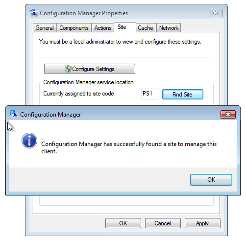
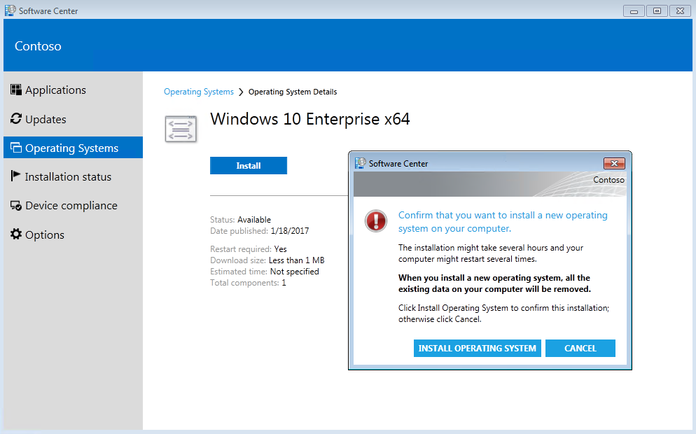

# Deploy Windows 10 in a test lab using Configuration Manager

*Applies to:*

- Windows 10

> [!IMPORTANT]
> This guide uses the proof of concept (PoC) environment, and some settings that are configured in the following guides:
>
> - [Step by step guide: Deploy Windows 10 in a test lab](windows-10-poc.md)
> - [Deploy Windows 10 in a test lab using the Microsoft Deployment Toolkit](windows-10-poc-mdt.md)
>
> Complete all steps in these guides before you start the procedures in this guide. If you want to skip the Windows 10 deployment procedures in the MDT guide, and move directly to this guide, at least install MDT and the Windows ADK before starting this guide. All steps in the first guide are required before attempting the procedures in this guide.

The PoC environment is a virtual network running on Hyper-V with three virtual machines (VMs):

- **DC1**: A contoso.com domain controller, DNS server, and DHCP server.
- **SRV1**: A dual-homed contoso.com domain member server, DNS server, and default gateway providing NAT service for the PoC network.
- **PC1**: A contoso.com member computer running Windows 7, Windows 8, or Windows 8.1 that has been cloned from a physical computer on your network for testing purposes.

This guide uses the Hyper-V server role to perform procedures. If you don't complete all steps in a single session, consider using [checkpoints](/previous-versions/windows/it-pro/windows-server-2012-R2-and-2012/dn818483(v=ws.11)) and [saved states](/previous-versions/windows/it-pro/windows-server-2008-R2-and-2008/ee247418(v=ws.10)) to pause, resume, or restart your work.

Multiple features and services are installed on SRV1 in this guide. This configuration isn't a typical installation, and is only done to set up a lab environment with a bare minimum of resources. However, if less than 4 GB of RAM is allocated to SRV1 in the Hyper-V console, some procedures will be slow to complete. If resources are limited on the Hyper-V host, consider reducing RAM allocation on DC1 and PC1, and then increasing the RAM allocation on SRV1. You can adjust RAM allocation for a VM by right-clicking the VM in the Hyper-V Manager console, select **Settings**, select **Memory**, and modify the value next to **Maximum RAM**.

## In this guide

This guide provides end-to-end instructions to install and configure Microsoft Configuration Manager, and use it to deploy a Windows 10 image. Depending on the speed of your Hyper-V host, the procedures in this guide will require 6-10 hours to complete.

The procedures in this guide are summarized in the following table. An estimate of the time required to complete each procedure is also provided. Time required to complete procedures will vary depending on the resources available to the Hyper-V host and assigned to VMs, such as processor speed, memory allocation, disk speed, and network speed.

|Procedure|Description|Time|
|--- |--- |--- |
|[Install prerequisites](#install-prerequisites)|Install prerequisite Windows Server roles and features, download, install and configure SQL Server, configure firewall rules, and install the Windows ADK.|60 minutes|
|[Install Microsoft Configuration Manager](#install-microsoft-configuration-manager)|Download Microsoft Configuration Manager, configure prerequisites, and install the package.|45 minutes|
|[Download MDOP and install DaRT](#download-mdop-and-install-dart)|Download the Microsoft Desktop Optimization Pack 2015 and install DaRT 10.|15 minutes|
|[Prepare for Zero Touch installation](#prepare-for-zero-touch-installation)|Prerequisite procedures to support Zero Touch installation.|60 minutes|
|[Create a boot image for Configuration Manager](#create-a-boot-image-for-configuration-manager)|Use the MDT wizard to create the boot image in Configuration Manager.|20 minutes|
|[Create a Windows 10 reference image](#create-a-windows-10-reference-image)|This procedure can be skipped if it was done previously, otherwise instructions are provided to create a reference image.|0-60 minutes|
|[Add a Windows 10 OS image](#add-a-windows-10-os-image)|Add a Windows 10 OS image and distribute it.|10 minutes|
|[Create a task sequence](#create-a-task-sequence)|Create a Configuration Manager task sequence with MDT integration using the MDT wizard|15 minutes|
|[Finalize the OS configuration](#finalize-the-os-configuration)|Enable monitoring, configure rules, and distribute content.|30 minutes|
|[Deploy Windows 10 using PXE and Configuration Manager](#deploy-windows-10-using-pxe-and-configuration-manager)|Deploy Windows 10 using Configuration Manager deployment packages and task sequences.|60 minutes|
|[Replace a client with Windows 10 using Configuration Manager](#replace-a-client-with-windows-10-using-configuration-manager)|Replace a client computer with Windows 10 using Configuration Manager.|90 minutes|
|[Refresh a client with Windows 10 using Configuration Manager](#refresh-a-client-with-windows-10-using-configuration-manager)|Use a task sequence to refresh a client with Windows 10 using Configuration Manager and MDT|90 minutes|

## Install prerequisites

1. Before installing Microsoft Configuration Manager, we must install prerequisite services and features. Enter the following command at an elevated Windows PowerShell prompt on SRV1:

    ```powershell
    Install-WindowsFeature Web-Windows-Auth,Web-ISAPI-Ext,Web-Metabase,Web-WMI,BITS,RDC,NET-Framework-Features,Web-Asp-Net,Web-Asp-Net45,NET-HTTP-Activation,NET-Non-HTTP-Activ
    ```

    > [!NOTE]
    > If the request to add features fails, retry the installation by typing the command again.

2. Download [SQL Server](https://www.microsoft.com/evalcenter/evaluate-sql-server-2022) from the Microsoft Evaluation Center as an .ISO file on the Hyper-V host computer. Save the file to the **C:\VHD** directory.

    > [!NOTE]
    > The rest of this article describes the installation of SQL Server 2014. If you download a different version of SQL Server, you may need to modify the installation steps.

1. When you've downloaded the file **SQLServer2014SP2-FullSlipstream-x64-ENU.iso** and placed it in the C:\VHD directory, enter the following command at an elevated Windows PowerShell prompt on the Hyper-V host:

    ```powershell
    Set-VMDvdDrive -VMName SRV1 -Path c:\VHD\SQLServer2014SP2-FullSlipstream-x64-ENU.iso
    ```

    This command mounts the .ISO file to drive D on SRV1.

4. Enter the following command at an elevated Windows PowerShell prompt on SRV1 to install SQL Server:

    ```cmd
    D:\setup.exe /q /ACTION=Install /ERRORREPORTING="False" /FEATURES=SQLENGINE,RS,IS,SSMS,TOOLS,ADV_SSMS,CONN /INSTANCENAME=MSSQLSERVER /INSTANCEDIR="C:\Program Files\Microsoft SQL Server" /SQLSVCACCOUNT="NT AUTHORITY\System" /SQLSYSADMINACCOUNTS="BUILTIN\ADMINISTRATORS" /SQLSVCSTARTUPTYPE=Automatic /AGTSVCACCOUNT="NT AUTHORITY\SYSTEM" /AGTSVCSTARTUPTYPE=Automatic /RSSVCACCOUNT="NT AUTHORITY\System" /RSSVCSTARTUPTYPE=Automatic /ISSVCACCOUNT="NT AUTHORITY\System" /ISSVCSTARTUPTYPE=Disabled /ASCOLLATION="Latin1_General_CI_AS" /SQLCOLLATION="SQL_Latin1_General_CP1_CI_AS" /TCPENABLED="1" /NPENABLED="1" /IAcceptSQLServerLicenseTerms
    ```

    Installation will take several minutes. When installation is complete, the following output will be displayed:

    ```console
    Microsoft (R) SQL Server 2014 12.00.5000.00
    Copyright (c) Microsoft Corporation.  All rights reserved.

    Microsoft (R) .NET Framework CasPol 2.0.50727.7905
    Copyright (c) Microsoft Corporation.  All rights reserved.

    Success
    Microsoft (R) .NET Framework CasPol 2.0.50727.7905
    Copyright (c) Microsoft Corporation.  All rights reserved.

    Success
    One or more affected files have operations pending.
    You should restart your computer to complete this process.
    ```

5. Enter the following commands at an elevated Windows PowerShell prompt on SRV1:

    ```powershell
    New-NetFirewallRule -DisplayName "SQL Server" -Direction Inbound -Protocol TCP -LocalPort 1433 -Action allow
    New-NetFirewallRule -DisplayName "SQL Admin Connection" -Direction Inbound -Protocol TCP -LocalPort 1434 -Action allow
    New-NetFirewallRule -DisplayName "SQL Database Management" -Direction Inbound -Protocol UDP -LocalPort 1434 -Action allow
    New-NetFirewallRule -DisplayName "SQL Service Broker" -Direction Inbound -Protocol TCP -LocalPort 4022 -Action allow
    New-NetFirewallRule -DisplayName "SQL Debugger/RPC" -Direction Inbound -Protocol TCP -LocalPort 135 -Action allow
    ```

6. Download and install the latest [Windows Assessment and Deployment Kit (ADK)](/windows-hardware/get-started/adk-install) on SRV1 using the default installation settings. The current version is the ADK for Windows 10, version 2004. Installation might require several minutes to acquire all components.

## Install Microsoft Configuration Manager

1. On SRV1, temporarily disable IE Enhanced Security Configuration for Administrators by typing the following commands at an elevated Windows PowerShell prompt:

    ```powershell
    $AdminKey = "HKLM:\SOFTWARE\Microsoft\Active Setup\Installed Components\{A509B1A7-37EF-4b3f-8CFC-4F3A74704073}"
    Set-ItemProperty -Path $AdminKey -Name "IsInstalled" -Value 0
    Stop-Process -Name Explorer
    ```

2. Download [Microsoft Configuration Manager (current branch)](https://www.microsoft.com/evalcenter/evaluate-microsoft-endpoint-configuration-manager) and extract the contents on SRV1.

3. Open the file, enter **C:\configmgr** for **Unzip to folder**, and select **Unzip**. The `C:\configmgr` directory will be automatically created. Select **OK** and then close the **WinZip Self-Extractor** dialog box when finished.

4. Before starting the installation, verify that WMI is working on SRV1. See the following examples. Verify that **Running** is displayed under **Status** and **True** is displayed next to **TcpTestSucceeded**:

    ```powershell
    Get-Service Winmgmt

    Status   Name               DisplayName
    ------   ----               -----------
    Running  Winmgmt            Windows Management Instrumentation

    Test-NetConnection -ComputerName 192.168.0.2 -Port 135 -InformationLevel Detailed

    ComputerName             : 192.168.0.2
    RemoteAddress            : 192.168.0.2
    RemotePort               : 135
    AllNameResolutionResults :
    MatchingIPsecRules       :
    NetworkIsolationContext  : Internet
    InterfaceAlias           : Ethernet
    SourceAddress            : 192.168.0.2
    NetRoute (NextHop)       : 0.0.0.0
    PingSucceeded            : True
    PingReplyDetails (RTT)   : 0 ms
    TcpTestSucceeded         : True
    ```

    You can also verify WMI using the WMI console by typing **wmimgmt.msc**, right-clicking **WMI Control (Local)** in the console tree, and then clicking **Properties**.

    If the WMI service isn't started, attempt to start it or reboot the computer.  If WMI is running but errors are present, see [winmgmt](/windows/win32/wmisdk/winmgmt) for troubleshooting information.

5. To extend the Active Directory schema, enter the following command at an elevated Windows PowerShell prompt:

    ```cmd
    C:\configmgr\SMSSETUP\BIN\X64\extadsch.exe
    ```

6. Temporarily switch to the DC1 VM, and enter the following command at an elevated command prompt on DC1:

    ```cmd
    adsiedit.msc
    ```

7. Right-click **ADSI Edit**, select **Connect to**, select **Default (Domain or server that you logged in to)** under **Computer** and then select **OK**.

8. Expand **Default naming context**>**DC=contoso,DC=com**, and then in the console tree right-click **CN=System**, point to **New**, and then select **Object**.

9. Select **container** and then select **Next**.

10. Next to **Value**, enter **System Management**, select **Next**, and then select **Finish**.

11. Right-click **CN=system Management** and then select **Properties**.

12. On the **Security** tab, select **Add**, select **Object Types**, select **Computers**, and select **OK**.

13. Under **Enter the object names to select**, enter **SRV1** and select **OK**.

14. The **SRV1** computer account will be highlighted, select **Allow** next to **Full control**.

15. Select **Advanced**, select **SRV1 (CONTOSO\SRV1$)** and select **Edit**.

16. Next to **Applies to**, choose **This object and all descendant objects**, and then select **OK** three times.

17. Close the ADSI Edit console and switch back to SRV1.

18. To start Configuration Manager installation, enter the following command at an elevated Windows PowerShell prompt on SRV1:

    ```cmd
    C:\configmgr\SMSSETUP\BIN\X64\Setup.exe
    ```

19. Provide the following information in the Configuration Manager Setup Wizard:

    - **Before You Begin**: Read the text and select *Next*.
    - **Getting Started**: Choose **Install a Configuration Manager primary site** and select the **Use typical installation options for a stand-alone primary site** checkbox.
        - Select **Yes** in response to the popup window.
    - **Product Key**: Choose **Install the evaluation edition of this Product**.
    - **Microsoft Software License Terms**: Read the terms and then select the **I accept these license terms** checkbox.
    - **Prerequisite Licenses**: Review license terms and select all three checkboxes on the page.
    - **Prerequisite Downloads**: Choose **Download required files** and enter **c:\windows\temp** next to **Path**.
    - **Site and Installation Settings**: Site code: **PS1**, Site name: **Contoso**.
        - use default settings for all other options
    - **Usage Data**: Read the text and select **Next**.
    - **Service Connection Point Setup**: Accept the default settings (SRV1.contoso.com is automatically added under Select a server to use).
    - **Settings Summary**: Review settings and select **Next**.
    - **Prerequisite Check**: No failures should be listed. Ignore any warnings and select **Begin Install**.

    > [!NOTE]
    > There should be at most three warnings present: WSUS on site server, configuration for SQL Server memory usage, and SQL Server process memory allocation. These warnings can safely be ignored in this test environment.

    Depending on the speed of the Hyper-V host and resources allocated to SRV1, installation can require approximately one hour. Select **Close** when installation is complete.

20. If desired, re-enable IE Enhanced Security Configuration at this time on SRV1:

    ```powershell
    Set-ItemProperty -Path $AdminKey -Name "IsInstalled" -Value 1
    Stop-Process -Name Explorer
    ```

## Download MDOP and install DaRT

> [!IMPORTANT]
> This step requires a Visual Studio subscription or volume license agreement. For more information, see [MDOP information experience](/microsoft-desktop-optimization-pack/).

1. Download the Microsoft Desktop Optimization Pack 2015 to the Hyper-V host from Visual Studio Online or from the [Microsoft Volume Licensing website (MVLS)](https://go.microsoft.com/fwlink/p/?LinkId=166331) site. Download the .ISO file (mu_microsoft_desktop_optimization_pack_2015_x86_x64_dvd_5975282.iso, 2.79 GB) to the C:\VHD directory on the Hyper-V host.

2. Enter the following command at an elevated Windows PowerShell prompt on the Hyper-V host to mount the MDOP file on SRV1:

    ```powershell
    Set-VMDvdDrive -VMName SRV1 -Path c:\VHD\mu_microsoft_desktop_optimization_pack_2015_x86_x64_dvd_5975282.iso
    ```

3. Enter the following command at an elevated Windows PowerShell prompt on SRV1:

    ```cmd
    D:\DaRT\DaRT 10\Installers\en-us\x64\MSDaRT100.msi
    ```

4. Install DaRT 10 using default settings.

5. Enter the following commands at an elevated Windows PowerShell prompt on SRV1:

    ```powershell
    Copy-Item "C:\Program Files\Microsoft DaRT\v10\Toolsx64.cab" -Destination "C:\Program Files\Microsoft Deployment Toolkit\Templates\Distribution\Tools\x64"
    Copy-Item "C:\Program Files\Microsoft DaRT\v10\Toolsx86.cab" -Destination "C:\Program Files\Microsoft Deployment Toolkit\Templates\Distribution\Tools\x86"
    ```

## Prepare for Zero Touch installation

This section contains several procedures to support Zero Touch installation with Microsoft Configuration Manager.

### Create a folder structure

1. Enter the following commands at a Windows PowerShell prompt on SRV1:

    ```powershell
    New-Item -ItemType Directory -Path "C:\Sources\OSD\Boot"
    New-Item -ItemType Directory -Path "C:\Sources\OSD\OS"
    New-Item -ItemType Directory -Path "C:\Sources\OSD\Settings"
    New-Item -ItemType Directory -Path "C:\Sources\OSD\Branding"
    New-Item -ItemType Directory -Path "C:\Sources\OSD\MDT"
    New-Item -ItemType Directory -Path "C:\Logs"
    New-SmbShare -Name Sources$ -Path C:\Sources -ChangeAccess EVERYONE
    New-SmbShare -Name Logs$ -Path C:\Logs -ChangeAccess EVERYONE
    ```

### Enable MDT ConfigMgr integration

1. On SRV1, select **Start**, enter `configmgr`, and then select **Configure ConfigMgr Integration**.

2. Enter `PS1` as the **Site code**, and then select **Next**.

3. Verify **The process completed successfully** is displayed, and then select **Finish**.

### Configure client settings

1. On SRV1, select **Start**, enter **configuration manager**, right-click **Configuration Manager Console**, and then select **Pin to Taskbar**.

2. Select **Desktop**, and then launch the Configuration Manager console from the taskbar.

3. If the console notifies you that an update is available, select **OK**. It isn't necessary to install updates to complete this lab.

4. In the console tree, open the **Administration** workspace (in the lower left corner) and select **Client Settings**.

5. In the display pane, double-click **Default Client Settings**.

6. Select **Computer Agent**, next to **Organization name displayed in Software Center** enter **Contoso**, and then select **OK**.

### Configure the network access account

1. in the **Administration** workspace, expand **Site Configuration** and select **Sites**.

2. On the **Home** ribbon at the top of the console window, select **Configure Site Components** and then select **Software Distribution**.

3. On the **Network Access Account** tab, choose **Specify the account that accesses network locations**.

4. Select the yellow starburst and then select **New Account**.

5. Select **Browse** and then under **Enter the object name to select**, enter **CM_NAA** and select **OK**.

6. Next to **Password** and **Confirm Password**, enter **pass\@word1**, and then select **OK** twice.

### Configure a boundary group

1. in the **Administration** workspace, expand **Hierarchy Configuration**, right-click **Boundaries** and then select **Create Boundary**.

2. Next to **Description**, enter **PS1**, next to **Type** choose **Active Directory Site**, and then select **Browse**.

3. Choose **Default-First-Site-Name** and then select **OK** twice.

4. in the **Administration** workspace, right-click **Boundary Groups** and then select **Create Boundary Group**.

5. Next to **Name**, enter **PS1 Site Assignment and Content Location**, select **Add**, select the **Default-First-Site-Name** boundary and then select **OK**.

6. On the **References** tab in the **Create Boundary Group** window, select the **Use this boundary group for site assignment** checkbox.

7. Select **Add**, select the **\\\SRV1.contoso.com** checkbox, and then select **OK** twice.

### Add the state migration point role

1. in the **Administration** workspace, expand **Site Configuration**, select **Sites**, and then in on the **Home** ribbon at the top of the console select **Add Site System Roles**.

2. In the Add site System Roles Wizard, select **Next** twice and then on the Specify roles for this server page, select the **State migration point** checkbox.

3. Select **Next**, select the yellow starburst, enter **C:\MigData** for the **Storage folder**, and select **OK**.

4. Select **Next**, and then verify under **Boundary groups** that **PS1 Site Assignment and Content Location** is displayed.

5. Select **Next** twice and then select **Close**.

### Enable PXE on the distribution point

> [!IMPORTANT]
> Before enabling PXE in Configuration Manager, ensure that any previous installation of WDS does not cause conflicts. Configuration Manager will automatically configure the WDS service to manage PXE requests. To disable a previous installation, if it exists, enter the following commands at an elevated Windows PowerShell prompt on SRV1:

```cmd
WDSUTIL.exe /Set-Server /AnswerClients:None
```

1. Determine the MAC address of the internal network adapter on SRV1. Enter the following command at an elevated Windows PowerShell prompt on SRV1:

    ```powershell
    (Get-NetAdapter "Ethernet").MacAddress
    ```

    > [!NOTE]
    > If the internal network adapter, assigned an IP address of 192.168.0.2, isn't named "Ethernet" then replace the name "Ethernet" in the previous command with the name of this network adapter. You can review the names of network adapters and the IP addresses assigned to them by typing **ipconfig**.

2. In the Configuration Manager console, in the **Administration** workspace, select **Distribution Points**.

3. In the display pane, right-click **SRV1.CONTOSO.COM** and then select **Properties**.

4. On the PXE tab, select the following settings:

   - **Enable PXE support for clients**. Select **Yes** in the popup that appears.
   - **Allow this distribution point to respond to incoming PXE requests**
   - **Enable unknown computer support**. Select **OK** in the popup that appears.
   - **Require a password when computers use PXE**
   - **Password** and **Confirm password**: pass@word1
   - **Respond to PXE requests on specific network interfaces**: Select the yellow starburst and then enter the MAC address determined in the first step of this procedure.

     See the following example:
     

5. Select **OK**.

6. Wait for a minute, then enter the following command at an elevated Windows PowerShell prompt on SRV1, and verify that the files displayed are present:

    ```cmd
    dir /b C:\RemoteInstall\SMSBoot\x64

    abortpxe.com
    bootmgfw.efi
    bootmgr.exe
    pxeboot.com
    pxeboot.n12
    wdsmgfw.efi
    wdsnbp.com
    ```

    > [!NOTE]
    > If these files aren't present in the C:\RemoteInstall directory, verify that the REMINST share is configured as C:\RemoteInstall. You can view the properties of this share by typing `net.exe share REMINST` at a command prompt. If the share path is set to a different value, then replace C:\RemoteInstall with your REMINST share path.
    >
    > You can also enter the following command at an elevated Windows PowerShell prompt to open CMTrace. In the tool, select **File**, select **Open**, and then open the **distmgr.log** file. If errors are present, they will be highlighted in red:
    >
    > ```cmd
    > "C:\Program Files\Microsoft Configuration Manager\tools\cmtrace.exe"
    > ```
    >
    > The log file is updated continuously while Configuration Manager is running. Wait for Configuration Manager to repair any issues that are present, and periodically recheck that the files are present in the REMINST share location. Close CMTrace when done. You'll see the following line in distmgr.log that indicates the REMINST share is being populated with necessary files:
    >
    > `Running: WDSUTIL.exe /Initialize-Server /REMINST:"C:\RemoteInstall"`
    >
    > Once the files are present in the REMINST share location, you can close the CMTrace tool.

### Create a branding image file

1. If you have a bitmap (.BMP) image for suitable use as a branding image, copy it to the C:\Sources\OSD\Branding folder on SRV1. Otherwise, use the following step to copy a branding image.

2. Enter the following command at an elevated Windows PowerShell prompt:

    ```powershell
    Copy-Item -Path "C:\ProgramData\Microsoft\User Account Pictures\user.bmp" -Destination "C:\Sources\OSD\Branding\contoso.bmp"
    ```

    > [!NOTE]
    > You can open C:\Sources\OSD\Branding\contoso.bmp in Microsoft Paint to customize this image.

### Create a boot image for Configuration Manager

1. In the Configuration Manager console, in the **Software Library** workspace, expand **Operating Systems**, right-click **Boot Images**, and then select **Create Boot Image using MDT**.

2. On the Package Source page, under **Package source folder to be created (UNC Path):**, enter **\\\SRV1\Sources$\OSD\Boot\Zero Touch WinPE x64**, and then select **Next**.

    - The Zero Touch WinPE x64 folder doesn't yet exist. The folder will be created later.

3. On the General Settings page, enter **Zero Touch WinPE x64** next to **Name**, and select **Next**.

4. On the Options page, under **Platform** choose **x64**, and select **Next**.

5. On the Components page, in addition to the default selection of **Microsoft Data Access Components (MDAC/ADO) support**, select the **Microsoft Diagnostics and Recovery Toolkit (DaRT)** checkbox, and select **Next**.

6. On the Customization page, select the **Use a custom background bitmap file** checkbox, and under **UNC path**, enter or browse to **\\\SRV1\Sources$\OSD\Branding\contoso.bmp**, and then select **Next** twice. It will take a few minutes to generate the boot image.

7. Select **Finish**.

8. In the console display pane, right-click the **Zero Touch WinPE x64** boot image, and then select **Distribute Content**.

9. In the Distribute Content Wizard, select **Next**, select **Add** and select **Distribution Point**, select the **SRV1.CONTOSO.COM** checkbox, select **OK**, select **Next** twice, and then select **Close**.

10. Use the CMTrace application to view the **distmgr.log** file again and verify that the boot image has been distributed. To open CMTrace, enter the following command at an elevated Windows PowerShell prompt on SRV1:

    ```powershell
    Invoke-Item 'C:\Program Files\Microsoft Configuration Manager\tools\cmtrace.exe'
    ```

    In the trace tool, select **Tools** on the menu and choose **Find**. Search for "**STATMSG: ID=2301**". For example:

    ```console
    STATMSG: ID=2301 SEV=I LEV=M SOURCE="SMS Server" COMP="SMS_DISTRIBUTION_MANAGER" SYS=SRV1.CONTOSO.COM SITE=PS1 PID=924 TID=1424 GMTDATE=Tue Oct 09 22:36:30.986 2018 ISTR0="Zero Touch WinPE x64" ISTR1="PS10000A" ISTR2="" ISTR3="" ISTR4="" ISTR5="" ISTR6="" ISTR7="" ISTR8="" ISTR9="" NUMATTRS=1 AID0=400 AVAL0="PS10000A"    SMS_DISTRIBUTION_MANAGER    10/9/2018 3:36:30 PM    1424 (0x0590)
    ```

11. You can also review status by clicking the **Zero Touch WinPE x64** image, and then clicking **Content Status** under **Related Objects** in the bottom right-hand corner of the console, or by entering **\Monitoring\Overview\Distribution Status\Content Status** on the location bar in the console. Double-click **Zero Touch WinPE x64** under **Content Status** in the console tree and verify that a status of **Successfully distributed content** is displayed on the **Success** tab.

12. Next, in the **Software Library** workspace, double-click **Zero Touch WinPE x64** and then select the **Data Source** tab.

13. Select the **Deploy this boot image from the PXE-enabled distribution point** checkbox, and select **OK**.

14. Review the distmgr.log file again for "**STATMSG: ID=2301**" and verify that there are three folders under **C:\RemoteInstall\SMSImages** with boot images. See the following example:

    ```cmd
    dir /s /b C:\RemoteInstall\SMSImages

    C:\RemoteInstall\SMSImages\PS100004
    C:\RemoteInstall\SMSImages\PS100005
    C:\RemoteInstall\SMSImages\PS100006
    C:\RemoteInstall\SMSImages\PS100004\boot.PS100004.wim
    C:\RemoteInstall\SMSImages\PS100005\boot.PS100005.wim
    C:\RemoteInstall\SMSImages\PS100006\WinPE.PS100006.wim
    ```

    > [!NOTE]
    > The first two images (`*.wim` files) are default boot images. The third is the new boot image with DaRT.

### Create a Windows 10 reference image

If you've already completed steps in [Deploy Windows 10 in a test lab using Microsoft Deployment Toolkit](windows-10-poc-mdt.md) then you've already created a Windows 10 reference image. In this case, skip to the next procedure in this guide: [Add a Windows 10 OS image](#add-a-windows-10-os-image). If you've not yet created a Windows 10 reference image, complete the steps in this section.

1. In [Step by step guide: Deploy Windows 10 in a test lab](windows-10-poc.md) the Windows 10 Enterprise .iso file was saved to the c:\VHD directory as **c:\VHD\w10-enterprise.iso**. The first step in creating a deployment share is to mount this file on SRV1.  To mount the Windows 10 Enterprise DVD on SRV1, open an elevated Windows PowerShell prompt on the Hyper-V host computer and enter the following command:

    ```powershell
    Set-VMDvdDrive -VMName SRV1 -Path c:\VHD\w10-enterprise.iso
    ```

2. Verify that the Windows Enterprise installation DVD is mounted on SRV1 as drive letter D.

3. The Windows 10 Enterprise installation files will be used to create a deployment share on SRV1 using the MDT deployment workbench. To open the deployment workbench, select **Start**, enter **deployment**, and then select **Deployment Workbench**.

4. In the Deployment Workbench console, right-click **Deployment Shares** and select **New Deployment Share**.

5. Use the following settings for the New Deployment Share Wizard:
    - Deployment share path: **C:\MDTBuildLab**
    - Share name: **MDTBuildLab$**
    - Deployment share description: **MDT build lab**
    - Options: Select **Next** to accept the default
    - Summary: Select **Next**
    - Progress: settings will be applied
    - Confirmation: Select **Finish**

6. Expand the **Deployment Shares** node, and then expand **MDT build lab**.

7. Right-click the **Operating Systems** node, and then select **New Folder**. Name the new folder **Windows 10**. Complete the wizard using default values and select **Finish**.

8. Right-click the **Windows 10** folder created in the previous step, and then select **Import Operating System**.

9. Use the following settings for the Import Operating System Wizard:
    - OS Type: **Full set of source files**
    - Source: **D:\\**
    - Destination: **W10Ent_x64**
    - Summary: Select **Next**
    - Confirmation: Select **Finish**

10. For purposes of this test lab, we won't add applications, such as Microsoft Office, to the deployment share. For more information about adding applications, see [Add applications](deploy-windows-mdt/create-a-windows-10-reference-image.md#add-applications).

11. The next step is to create a task sequence to reference the OS that was imported. To create a task sequence, right-click the **Task Sequences** node under **MDT Build Lab** and then select **New Task Sequence**. Use the following settings for the New Task Sequence Wizard:

    - Task sequence ID: **REFW10X64-001**
    - Task sequence name: **Windows 10 Enterprise x64 Default Image**
    - Task sequence comments: **Reference Build**
    - Template: **Standard Client Task Sequence**
    - Select OS: Select **Windows 10 Enterprise Evaluation in W10Ent_x64 install.wim**
    - Specify Product Key: **Do not specify a product key at this time**
    - Full Name: **Contoso**
    - Organization: **Contoso**
    - Internet Explorer home page: **`http://www.contoso.com`**
    - Admin Password: **Do not specify an Administrator password at this time**
    - Summary: Select **Next**
    - Confirmation: Select **Finish**

12. Edit the task sequence to add the Microsoft NET Framework 3.5, which is required by many applications. To edit the task sequence, double-click **Windows 10 Enterprise x64 Default Image** that was created in the previous step.

13. Select the **Task Sequence** tab. Under **State Restore**, select **Tattoo** to highlight it, then select **Add** and choose **New Group**. A new group will be added under Tattoo.

14. On the Properties tab of the group that was created in the previous step, change the Name from New Group to **Custom Tasks (Pre-Windows Update)** and then select **Apply**. To see the name change, select **Tattoo**, then select the new group again.

15. Select the **Custom Tasks (Pre-Windows Update)** group again, select **Add**, point to **Roles**, and then select **Install Roles and Features**.

16. Under **Select the roles and features that should be installed**, select **.NET Framework 3.5 (includes .NET 2.0 and 3.0)** and then select **Apply**.

17. Enable Windows Update in the task sequence by clicking the **Windows Update (Post-Application Installation)** step, clicking the **Options** tab, and clearing the **Disable this step** checkbox.

    > [!NOTE]
    > Since we aren't installing applications in this test lab, there's no need to enable the Windows Update Pre-Application Installation step. However, you should enable this step if you're also installing applications.

18. Select **OK** to complete editing the task sequence.

19. The next step is to configure the MDT deployment share rules. To configure rules in the Deployment Workbench, right-click MDT build lab (C:\MDTBuildLab) and select **Properties**, and then select the **Rules** tab.

20. Replace the default rules with the following text:

    ```ini
    [Settings]
    Priority=Default

    [Default]
    _SMSTSORGNAME=Contoso
    UserDataLocation=NONE
    DoCapture=YES
    OSInstall=Y
    AdminPassword=pass@word1
    TimeZoneName=Pacific Standard TimeZoneName
    OSDComputername=#Left("PC-%SerialNumber%",7)#
    JoinWorkgroup=WORKGROUP
    HideShell=YES
    FinishAction=SHUTDOWN
    DoNotCreateExtraPartition=YES
    ApplyGPOPack=NO
    SkipAdminPassword=YES
    SkipProductKey=YES
    SkipComputerName=YES
    SkipDomainMembership=YES
    SkipUserData=YES
    SkipLocaleSelection=YES
    SkipTaskSequence=NO
    SkipTimeZone=YES
    SkipApplications=YES
    SkipBitLocker=YES
    SkipSummary=YES
    SkipRoles=YES
    SkipCapture=NO
    SkipFinalSummary=NO
    ```

21. Select **Apply** and then select **Edit Bootstrap.ini**. Replace the contents of the Bootstrap.ini file with the following text, and save the file:

    ```ini
    [Settings]
    Priority=Default

    [Default]
    DeployRoot=\\SRV1\MDTBuildLab$
    UserDomain=CONTOSO
    UserID=MDT_BA
    UserPassword=pass@word1
    SkipBDDWelcome=YES
    ```

22. Select **OK** to complete the configuration of the deployment share.

23. Right-click **MDT build lab (C:\MDTBuildLab)** and then select **Update Deployment Share**.

24. Accept all default values in the Update Deployment Share Wizard by clicking **Next**.  The update process will take 5 to 10 minutes. When it has completed, select **Finish**.

25. Copy **c:\MDTBuildLab\Boot\LiteTouchPE_x86.iso** on SRV1 to the **c:\VHD** directory on the Hyper-V host computer. In MDT, the x86 boot image can deploy both x86 and x64 operating systems, except on computers based on Unified Extensible Firmware Interface (UEFI).

    > [!TIP]
    > To copy the file, right-click the **LiteTouchPE_x86.iso** file, and select **Copy** on SRV1. Then open the **c:\VHD** folder on the Hyper-V host, right-click inside the folder, and select **Paste**.

26. Open a Windows PowerShell prompt on the Hyper-V host computer and enter the following commands:

    ```powershell
    New-VM -Name REFW10X64-001 -SwitchName poc-internal -NewVHDPath "c:\VHD\REFW10X64-001.vhdx" -NewVHDSizeBytes 60GB
    Set-VMMemory -VMName REFW10X64-001 -DynamicMemoryEnabled $true -MinimumBytes 1024MB -MaximumBytes 1024MB -Buffer 20
    Set-VMDvdDrive -VMName REFW10X64-001 -Path c:\VHD\LiteTouchPE_x86.iso
    Start-VM REFW10X64-001
    vmconnect localhost REFW10X64-001
    ```

27. In the Windows Deployment Wizard, select **Windows 10 Enterprise x64 Default Image**, and then select **Next**.

28. Accept the default values on the Capture Image page, and select **Next**. OS installation will complete after 5 to 10 minutes and then the VM will reboot automatically. Allow the system to boot normally, don't press a key. The process is fully automated.

    Other system restarts will occur to complete updating and preparing the OS. Setup will complete the following procedures:

    - Install the Windows 10 Enterprise OS.
    - Install added applications, roles, and features.
    - Update the OS using Windows Update (or WSUS if optionally specified).
    - Stage Windows PE on the local disk.
    - Run System Preparation (Sysprep) and reboot into Windows PE.
    - Capture the installation to a Windows Imaging (WIM) file.
    - Turn off the virtual machine.

    This step requires from 30 minutes to 2 hours, depending on the speed of the Hyper-V host and your network's download speed. After some time, you'll have a Windows 10 Enterprise x64 image that is fully patched and has run through Sysprep. The image is located in the C:\MDTBuildLab\Captures folder on SRV1. The file name is **REFW10X64-001.wim**.

### Add a Windows 10 OS image

1. Enter the following commands at an elevated Windows PowerShell prompt on SRV1:

    ```powershell
    New-Item -ItemType Directory -Path "C:\Sources\OSD\OS\Windows 10 Enterprise x64"
    cmd /c copy /z "C:\MDTBuildLab\Captures\REFW10X64-001.wim" "C:\Sources\OSD\OS\Windows 10 Enterprise x64"
    ```

2. In the Configuration Manager console, in the **Software Library** workspace, expand **Operating Systems**, right-click **Operating System Images**, and then select **Add Operating System Image**.

3. On the Data Source page, under **Path:**, enter or browse to **\\\SRV1\Sources$\OSD\OS\Windows 10 Enterprise x64\REFW10X64-001.wim**, and select **Next**.

4. On the General page, next to **Name:**, enter **Windows 10 Enterprise x64**, select **Next** twice, and then select **Close**.

5. Distribute the OS image to the SRV1 distribution point by right-clicking the **Windows 10 Enterprise x64** OS image and then clicking **Distribute Content**.

6. In the Distribute Content Wizard, select **Next**, select **Add**, select **Distribution Point**, add the **SRV1.CONTOSO.COM** distribution point, select **OK**, select **Next** twice and then select **Close**.

7. Enter **\Monitoring\Overview\Distribution Status\Content Status** on the location bar. (Make sure there's no space at the end of the location or you'll get an error.) Select **Windows 10 Enterprise x64** and monitor the status of content distribution until it's successful and no longer in progress. Refresh the view with the F5 key or by right-clicking **Windows 10 Enterprise x64** and clicking **Refresh**. Processing of the image on the site server can take several minutes.

    > [!NOTE]
    > If content distribution isn't successful, verify that sufficient disk space is available.

### Create a task sequence

> [!TIP]
> Complete this section slowly. There are a large number of similar settings from which to choose.

1. In the Configuration Manager console, in the **Software Library** workspace expand **Operating Systems**, right-click **Task Sequences**, and then select **Create MDT Task Sequence**.

2. On the Choose Template page, select the **Client Task Sequence** template and select **Next**.

3. On the General page, enter **Windows 10 Enterprise x64** under **Task sequence name:** and then select **Next**.

4. On the Details page, enter the following settings:

   - Join a domain: **contoso.com**
   - Account: Select **Set**
     - User name: **contoso\CM_JD**
     - Password: **pass@word1**
     - Confirm password: **pass@word1**
     - Select **OK**
   - Windows Settings
       - User name: **Contoso**
       - Organization name: **Contoso**
       - Product key: \<blank\>
   - Administrator Account: **Enable the account and specify the local administrator password**
     - Password: **pass@word1**
     - Confirm password: **pass@word1**
   - Select **Next**

5. On the Capture Settings page, accept the default settings and select **Next**.

6. On the Boot Image page, browse and select the **Zero Touch WinPE x64** boot image package, select **OK**, and then select **Next**.

7. On the MDT Package page, select **Create a new Microsoft Deployment Toolkit Files package**, under **Package source folder to be created (UNC Path):**, enter **\\\SRV1\Sources$\OSD\MDT\MDT** (MDT is repeated here, not a typo), and then select **Next**.

8. On the MDT Details page, next to **Name:** enter **MDT** and then select **Next**.

9. On the OS Image page, browse and select the **Windows 10 Enterprise x64** package, select **OK**, and then select **Next**.

10. On the Deployment Method page, accept the default settings for **Zero Touch Installation** and select **Next**.

11. On the Client Package page, browse and select the **Microsoft Corporation Configuration Manager Client package**, select **OK**, and then select **Next**.

12. On the USMT Package page, browse and select the **Microsoft Corporation User State Migration Tool for Windows 10.0.14393.0** package, select **OK**, and then select **Next**.

13. On the Settings Package page, select **Create a new settings package**, and under **Package source folder to be created (UNC Path):**, enter **\\\SRV1\Sources$\OSD\Settings\Windows 10 x64 Settings**, and then select **Next**.

14. On the Settings Details page, next to **Name:**, enter **Windows 10 x64 Settings**, and select **Next**.

15. On the Sysprep Package page, select **Next** twice.

16. On the Confirmation page, select **Finish**.

### Edit the task sequence

1. In the Configuration Manager console, in the **Software Library** workspace, select **Task Sequences**, right-click **Windows 10 Enterprise x64**, and then select **Edit**.

2. Scroll down to the **Install** group and select the **Set Variable for Drive Letter** action.

3. Change the Value under **OSDPreserveDriveLetter** from **False** to **True**, and then select **Apply**.

4. In the **State Restore** group, select the **Set Status 5** action, select **Add** in the upper left corner, point to **User State**, and select **Request State Store**. This action adds a new step immediately after **Set Status 5**.

5. Configure this **Request State Store** step with the following settings:

    - Request state storage location to: **Restore state from another computer**
    - Select the **If computer account fails to connect to state store, use the Network Access account** checkbox.
    - Options tab: Select the **Continue on error** checkbox.
    - Add Condition: **Task Sequence Variable**:
        - Variable: **USMTLOCAL**
        - Condition: **not equals**
        - Value: **True**
        - Select **OK**
    - Select **Apply**

6. In the **State Restore** group, select **Restore User State**, select **Add**, point to **User State**, and select **Release State Store**.

7. Configure this **Release State Store** step with the following settings:

    - Options tab: Select the **Continue on error** checkbox.
    - Add Condition: **Task Sequence Variable**:
        - Variable: **USMTLOCAL**
        - Condition: **not equals**
        - Value: **True**
        - Select **OK**
    - Select **OK**

### Finalize the OS configuration

> [!NOTE]
> If you completed all procedures in [Deploy Windows 10 in a test lab using Microsoft Deployment Toolkit](windows-10-poc-mdt.md) then the MDT deployment share is already present on SRV1. In this case, skip the first four steps below and begin with step 5 to edit CustomSettings.ini.

1. In the MDT deployment workbench on SRV1, right-click **Deployment Shares** and then select **New Deployment Share**.

2. Use the following settings for the New Deployment Share Wizard:
    - Deployment share path: **C:\MDTProduction**
    - Share name: **MDTProduction$**
    - Deployment share description: **MDT Production**
    - Options: Select **Next** to accept the default
    - Summary: Select **Next**
    - Progress: settings will be applied
    - Confirmation: Select **Finish**

3. Right-click the **MDT Production** deployment share, and select **Properties**.

4. Select the **Monitoring** tab, select the **Enable monitoring for this deployment share** checkbox, and then select **OK**.

5. Enter the following command at an elevated Windows PowerShell prompt on SRV1:

    ```cmd
    notepad.exe "C:\Sources\OSD\Settings\Windows 10 x64 Settings\CustomSettings.ini"
    ```

6. Replace the contents of the file with the following text, and then save the file:

    ```ini
    [Settings]
    Priority=Default
    Properties=OSDMigrateConfigFiles,OSDMigrateMode

    [Default]
    DoCapture=NO
    ComputerBackupLocation=NONE
    OSDMigrateMode=Advanced
    OSDMigrateAdditionalCaptureOptions=/ue:*\* /ui:CONTOSO\*
    OSDMigrateConfigFiles=Miguser.xml,Migapp.xml
    SLSHARE=\\SRV1\Logs$
    EventService=http://SRV1:9800
    ApplyGPOPack=NO
    ```

    > [!NOTE]
    > To migrate accounts other than those in the Contoso domain, then change the OSDMigrateAdditionalCaptureOptions option. For example, the following option will capture settings from all user accounts:
    >
    > ```ini
    > OSDMigrateAdditionalCaptureOptions=/all
    > ```

7. Return to the Configuration Manager console, and in the **Software Library** workspace, expand **Application Management**, select **Packages**, right-click **Windows 10 x64 Settings**, and then select **Update Distribution Points**. Select **OK** in the popup that appears.

8. In the **Software Library** workspace, expand **Operating Systems**, select **Task Sequences**, right-click **Windows 10 Enterprise x64**, and then select **Distribute Content**.

9. In the Distribute Content Wizard, select **Next** twice, select **Add**, select **Distribution Point**, select the **SRV1.CONTOSO.COM** distribution point, select **OK**, select **Next** twice and then select **Close**.

10. Enter **\Monitoring\Overview\Distribution Status\Content Status\Windows 10 Enterprise x64** on the location bar, double-click **Windows 10 Enterprise x64**, and monitor the status of content distribution until it's successful and no longer in progress. Refresh the view with the F5 key or by right-clicking **Windows 10 Enterprise x64** and clicking **Refresh**.

### Create a deployment for the task sequence

1. In the **Software Library** workspace, expand **Operating Systems**, select **Task Sequences**, right-click **Windows 10 Enterprise x64**, and then select **Deploy**.

2. On the General page, next to **Collection**, select **Browse**, select the **All Unknown Computers** collection, select **OK**, and then select **Next**.

3. On the Deployment Settings page, use the following settings:
    - Purpose: **Available**
    - Make available to the following clients: **Only media and PXE**
    - Select **Next**.
4. Select **Next** five times to accept defaults on the Scheduling, User Experience, Alerts, and Distribution Points pages.

5. Select **Close**.

## Deploy Windows 10 using PXE and Configuration Manager

In this first deployment scenario, you'll deploy Windows 10 using PXE. This scenario creates a new computer that doesn't have any migrated users or settings.

1. Enter the following commands at an elevated Windows PowerShell prompt on the Hyper-V host:

    ```powershell
    New-VM -Name "PC4" -NewVHDPath "c:\vhd\pc4.vhdx" -NewVHDSizeBytes 40GB -SwitchName poc-internal -BootDevice NetworkAdapter -Generation 2
    Set-VMMemory -VMName "PC4" -DynamicMemoryEnabled $true -MinimumBytes 512MB -MaximumBytes 2048MB -Buffer 20
    Start-VM PC4
    vmconnect localhost PC4
    ```

2. Press ENTER when prompted to start the network boot service.

3. In the Task Sequence Wizard, provide the password: **pass@word1**, and then select **Next**.

4. Before you select **Next** in the Task Sequence Wizard, press the **F8** key. A command prompt will open.

5. At the command prompt, enter **explorer.exe** and review the Windows PE file structure.

6. The smsts.log file is critical for troubleshooting any installation problems that might be encountered. Depending on the deployment phase, the smsts.log file is created in different locations:
   - X:\Windows\temp\SMSTSLog\smsts.log before disks are formatted.
   - X:\smstslog\smsts.log after disks are formatted.
   - C:\\_SMSTaskSequence\Logs\Smstslog\smsts.log before the Configuration Manager client is installed.
   - C:\Windows\ccm\logs\Smstslog\smsts.log after the Configuration Manager client is installed.
   - C:\Windows\ccm\logs\smsts.log when the task sequence is complete.

     Note: If a reboot is pending on the client, the reboot will be blocked as long as the command window is open.

7. In the explorer window, select **Tools** and then select **Map Network Drive**.

8. Don't map a network drive at this time. If you need to save the smsts.log file, you can use this method to save the file to a location on SRV1.

9. Close the Map Network Drive window, the Explorer window, and the command prompt.

10. The **Windows 10 Enterprise x64** task sequence is selected in the Task Sequence Wizard. Select **Next** to continue with the deployment.

11. The task sequence will require several minutes to complete. You can monitor progress of the task sequence using the MDT Deployment Workbench under Deployment Shares > MDTProduction > Monitoring. The task sequence will:

    - Install Windows 10
    - Install the Configuration Manager client and hotfix
    - Join the computer to the contoso.com domain
    - Install any applications that were specified in the reference image

12. When Windows 10 installation has completed, sign in to PC4 using the **contoso\administrator** account.

13. Right-click **Start**, select **Run**, enter **control appwiz.cpl**, press ENTER, select **Turn Windows features on or off**, and verify that **.NET Framework 3.5 (includes .NET 2.0 and 3.0)** is installed. This feature is included in the reference image.

14. Shut down the PC4 VM.

> [!NOTE]
> The following two procedures 1) Replace a client with Windows 10 and 2) Refresh a client with Windows 10 have been exchanged in their order in this guide compared to the previous version. This is to avoid having to restore Hyper-V checkpoints to have access to PC1 before the OS is upgraded. If this is your first time going through this guide, you won't notice any change, but if you have tried the guide previously then this change should make it simpler to complete.

## Replace a client with Windows 10 using Configuration Manager

> [!NOTE]
> Before you start this section, you can delete computer objects from Active Directory that were created as part of previous deployment procedures. Use the Active Directory Users and Computers console on DC1 to remove stale entries under contoso.com\Computers, but do not delete the computer account (hostname) for PC1. There should be at least two computer accounts present in the contoso.com\Computers container: one for SRV1, and one for the hostname of PC1. It's not required to delete the stale entries, this action is only done to remove clutter.


In the replace procedure, PC1 won't be migrated to a new OS. It's simplest to perform this procedure before performing the refresh procedure. After you refresh PC1, the OS will be new. The next (replace) procedure doesn't install a new OS on PC1 but rather performs a side-by-side migration of PC1 and another computer (PC4), to copy users and settings from PC1 to the new computer.

### Create a replace task sequence

1. On SRV1, in the Configuration Manager console, in the **Software Library** workspace, expand **Operating Systems**, right-click **Task Sequences**, and then select **Create MDT Task Sequence**.

2. On the Choose Template page, select **Client Replace Task Sequence** and select **Next**.

3. On the General page, enter the following information:

    - Task sequence name: **Replace Task Sequence**
    - Task sequence comments: **USMT backup only**

4. Select **Next**, and on the Boot Image page, browse and select the **Zero Touch WinPE x64** boot image package. Select **OK** and then select **Next** to continue.

5. On the MDT Package page, browse and select the **MDT** package. Select **OK** and then select **Next** to continue.

6. On the USMT Package page, browse and select the **Microsoft Corporation User State Migration Tool for Windows** package. Select **OK** and then select **Next** to continue.

7. On the Settings Package page, browse and select the **Windows 10 x64 Settings** package. Select **OK** and then select **Next** to continue.

8. On the Summary page, review the details and then select **Next**.

9. On the Confirmation page, select **Finish**.

> [!NOTE]
> If an error is displayed at this stage, it can be caused by a corrupt MDT integration. To repair it, close the Configuration Manager console, remove MDT integration, and then restore MDT integration.

### Deploy PC4

Create a VM named PC4 to receive the applications and settings from PC1. This VM represents a new computer that will replace PC1. To create this VM, enter the following commands at an elevated Windows PowerShell prompt on the Hyper-V host:

```powershell
New-VM -Name "PC4" -NewVHDPath "c:\vhd\pc4.vhdx" -NewVHDSizeBytes 60GB -SwitchName poc-internal -BootDevice NetworkAdapter -Generation 2
Set-VMMemory -VMName "PC4" -DynamicMemoryEnabled $true -MinimumBytes 1024MB -MaximumBytes 2048MB -Buffer 20
Set-VMNetworkAdapter -VMName PC4 -StaticMacAddress 00-15-5D-83-26-FF
```

> [!NOTE]
> Hyper-V lets you define a static MAC address on PC4. In a real-world scenario, you must determine the MAC address of the new computer.

### Install the Configuration Manager client on PC1

1. Verify that the PC1 VM is running and in its original state, which was saved as a checkpoint and then restored in [Deploy Windows 10 in a test lab using Microsoft Deployment Toolkit](windows-10-poc-mdt.md).

2. If you haven't already saved a checkpoint for PC1, then do it now. Enter the following commands at an elevated Windows PowerShell prompt on the Hyper-V host:

    ```powershell
    Checkpoint-VM -Name PC1 -SnapshotName BeginState
    ```

3. On SRV1, in the Configuration Manager console, in the **Administration** workspace, expand **Hierarchy Configuration** and select on **Discovery Methods**.

4. Double-click **Active Directory System Discovery** and on the **General** tab select the **Enable Active Directory System Discovery** checkbox.

5. Select the yellow starburst, select **Browse**, select **contoso\Computers**, and then select **OK** three times.

6. When a popup dialog box asks if you want to run full discovery, select **Yes**.

7. In the **Assets and Compliance** workspace, select **Devices** and verify that the computer account names for SRV1 and PC1 are displayed. See the following example (GREGLIN-PC1 is the computer account name of PC1 in this example):

    > [!TIP]
    > If you don't see the computer account for PC1, select **Refresh** in the upper right corner of the console.

    The **Client** column indicates that the Configuration Manager client isn't currently installed. This procedure will be carried out next.

8. Sign in to PC1 using the contoso\administrator account and enter the following command at an elevated command prompt to remove any pre-existing client configuration, if it exists.

    > [!Note]
    > This command requires an elevated command prompt, not an elevated Windows PowerShell prompt.

    ```cmd
    sc.exe stop ccmsetup
    "\\SRV1\c$\Program Files\Microsoft Configuration Manager\Client\CCMSetup.exe" /Uninstall
    ```

    > [!NOTE]
    > If PC1 still has Configuration Manager registry settings that were applied by Group Policy, startup scripts, or other policies in its previous domain, these might not all be removed by `CCMSetup /Uninstall` and can cause problems with installation or registration of the client in its new environment. It might be necessary to manually remove these settings if they are present. For more information, see [Manual removal of the Configuration Manager client](/archive/blogs/michaelgriswold/manual-removal-of-the-sccm-client).

9. On PC1, temporarily stop Windows Update from queuing items for download and clear all BITS jobs from the queue. From an elevated command prompt, enter:

    ```cmd
    net.exe stop wuauserv
    net.exe stop BITS
    ```

    Verify that both services were stopped successfully, then enter the following command at an elevated command prompt:

    ```cmd
    del "%ALLUSERSPROFILE%\Application Data\Microsoft\Network\Downloader\qmgr*.dat"
    net.exe start BITS
    bitsadmin.exe /list /allusers
    ```

    Verify that BITSAdmin displays zero jobs.

10. To install the Configuration Manager client as a standalone process, enter the following command at an elevated command prompt:

    ```cmd
    "\\SRV1\c$\Program Files\Microsoft Configuration Manager\Client\CCMSetup.exe" /mp:SRV1.contoso.com /logon SMSSITECODE=PS1
    ```

11. On PC1, using file explorer, open the **C:\Windows\ccmsetup** directory. During client installation, files will be downloaded here.

12. Installation progress will be captured in the file: **c:\windows\ccmsetup\logs\ccmsetup.log**. You can periodically open this file in notepad, or you can enter the following command at an elevated Windows PowerShell prompt to monitor installation progress:

    ```powershell
    Get-Content -Path c:\windows\ccmsetup\logs\ccmsetup.log -Wait
    ```

    Installation might require several minutes, and display of the log file will appear to hang while some applications are installed. This behavior is normal. When setup is complete, verify that **CcmSetup is existing with return code 0** is displayed on the last line of the ccmsetup.log file. Then press **CTRL-C** to break out of the Get-Content operation. If you're viewing the log file in Windows PowerShell, the last line will be wrapped. A return code of `0` indicates that installation was successful and you should now see a directory created at **C:\Windows\CCM** that contains files used in registration of the client with its site.

13. On PC1, open the Configuration Manager control panel applet by typing the following command from a command prompt:

    ```cmd
    control.exe smscfgrc
    ```

14. Select the **Site** tab, select **Configure Settings**, and select **Find Site**. The client will report that it has found the PS1 site. See the following example:

    

    If the client isn't able to find the PS1 site, review any error messages that are displayed in **C:\Windows\CCM\Logs\ClientIDManagerStartup.log** and **LocationServices.log**. A common reason the client can't locate the site code is because a previous configuration exists. For example, if a previous site code is configured at **HKLM\SOFTWARE\Microsoft\SMS\Mobile Client\GPRequestedSiteAssignmentCode**, delete or update this entry.

15. On SRV1, in the **Assets and Compliance** workspace, select **Device Collections** and then double-click **All Desktop and Server Clients**. This node will be added under **Devices**.

16. Select **All Desktop and Server Clients** and verify that the computer account for PC1 is displayed here with **Yes** and **Active** in the **Client** and **Client Activity** columns, respectively. You might have to refresh the view and wait few minutes for the client to appear here.  See the following example:

    

    > [!NOTE]
    > It might take several minutes for the client to fully register with the site and complete a client check. When it's complete you will see a green check mark over the client icon as shown above. To refresh the client, select it and then press **F5** or right-click the client and select **Refresh**.

### Create a device collection and deployment

1. On SRV1, in the Configuration Manager console, in the **Assets and Compliance** workspace, right-click **Device Collections** and then select **Create Device Collection**.

2. Use the following settings in the **Create Device Collection Wizard**:

    - General > Name: **Install Windows 10 Enterprise x64**
    - General > Limiting collection: **All Systems**
    - Membership Rules > Add Rule: **Direct Rule**
    - The **Create Direct Membership Rule Wizard** opens, select **Next**
    - Search for Resources > Resource class: **System Resource**
    - Search for Resources > Attribute name: **Name**
    - Search for Resources > Value: **%**
    - Select Resources > Value: Select the computername associated with the PC1 VM
    - Select **Next** twice and then select **Close** in both windows (Next, Next, Close, then Next, Next, Close)

3. Double-click the Install Windows 10 Enterprise x64 device collection and verify that the PC1 computer account is displayed.

4. In the **Software Library** workspace, expand **Operating Systems**, select **Task Sequences**, right-click **Windows 10 Enterprise x64** and then select **Deploy**.

5. Use the following settings in the Deploy Software wizard:
    - General > Collection: Select Browse and select **Install Windows 10 Enterprise x64**
    - Deployment Settings > Purpose: **Available**
    - Deployment Settings > Make available to the following clients: **Configuration Manager clients, media and PXE**
    - Scheduling > select **Next**
    - User Experience > select **Next**
    - Alerts > select **Next**
    - Distribution Points > select **Next**
    - Summary > select **Next**
    - Verify that the wizard completed successfully and then select **Close**

### Associate PC4 with PC1

1. On SRV1 in the Configuration Manager console, in the **Assets and Compliance** workspace, right-click **Devices** and then select **Import Computer Information**.

2. On the Select Source page, choose **Import single computer** and select **Next**.

3. On the Single Computer page, use the following settings:

    - Computer Name: **PC4**
    - MAC Address: **00:15:5D:83:26:FF**
    - Source Computer: \<enter the hostname of PC1, or select **Search** twice, select the hostname, and select **OK**\>

4. Select **Next**, and on the User Accounts page choose **Capture and restore specified user accounts**, then select the yellow starburst next to **User accounts to migrate**.

5. Select **Browse** and then under **Enter the object name to select** enter **user1** and select **OK** twice.

6. Select the yellow starburst again and repeat the previous step to add the **contoso\administrator** account.

7. Select **Next** twice, and on the Choose Target Collection page, choose **Add computers to the following collection**, select **Browse**, choose **Install Windows 10 Enterprise x64**, select **OK**, select **Next** twice, and then select **Close**.

8. In the **Assets and Compliance** workspace, select **User State Migration** and review the computer association in the display pane. The source computer will be the computername of PC1 (GREGLIN-PC1 in this example), the destination computer will be **PC4**, and the migration enter will be **side-by-side**.

9. Right-click the association in the display pane and then select **Specify User Accounts**. You can add or remove user account here. Select **OK**.

10. Right-click the association in the display pane and then select **View Recovery Information**. You'll see that a recovery key has been assigned, but a user state store location hasn't. Select **Close**.

11. Select **Device Collections** and then double-click **Install Windows 10 Enterprise x64**. Verify that **PC4** is displayed in the collection. You might have to update and refresh the collection, or wait a few minutes, but don't proceed until PC4 is available. See the following example:

    

### Create a device collection for PC1

1. On SRV1, in the Configuration Manager console, in the **Assets and Compliance** workspace, right-click **Device Collections** and then select **Create Device Collection**.

2. Use the following settings in the **Create Device Collection Wizard**:

    - General > Name: **USMT Backup (Replace)**
    - General > Limiting collection: **All Systems**
    - Membership Rules > Add Rule: **Direct Rule**
    - The **Create Direct Membership Rule Wizard** opens, select **Next**
    - Search for Resources > Resource class: **System Resource**
    - Search for Resources > Attribute name: **Name**
    - Search for Resources > Value: **%**
    - Select Resources > Value: Select the computername associated with the PC1 VM (GREGLIN-PC1 in this example).
    - Select **Next** twice and then select **Close** in both windows.

3. Select **Device Collections** and then double-click **USMT Backup (Replace)**. Verify that the computer name/hostname associated with PC1 is displayed in the collection. Don't proceed until this name is displayed.

### Create a new deployment

In the Configuration Manager console, in the **Software Library** workspace, under **Operating Systems**, select **Task Sequences**, right-click **Replace Task Sequence**, select **Deploy**, and use the following settings:

- General > Collection: **USMT Backup (Replace)**
- Deployment Settings > Purpose: **Available**
- Deployment Settings > Make available to the following clients: **Only Configuration Manager Clients**
- Scheduling: Select **Next**
- User Experience: Select **Next**
- Alerts: Select **Next**
- Distribution Points: Select **Next**
- Select **Next** and then select **Close**.

### Verify the backup

1. On PC1, open the Configuration Manager control panel applet by typing the following command in a command prompt:

    ```cmd
    control.exe smscfgrc
    ```

2. On the **Actions** tab, select **Machine Policy Retrieval & Evaluation Cycle**, select **Run Now**, select **OK**, and then select **OK** again. This method is one that you can use to run a task sequence in addition to the Client Notification method that will be demonstrated in the computer refresh procedure.

3. Enter the following command at an elevated command prompt to open the Software Center:

    ```cmd
    C:\Windows\CCM\SCClient.exe
    ```

4. In Software Center, select **Available Software**, and then select the **Replace Task Sequence** checkbox. See the following example:

    

    > [!NOTE]
    > If you don't see any available software, try running step #2 again to start the Machine Policy Retrieval & Evaluation Cycle. You should see an alert that new software is available.

5. Select **INSTALL SELECTED** and then select **INSTALL OPERATING SYSTEM**.

6. Allow the **Replace Task Sequence** to complete, then verify that the C:\MigData folder on SRV1 contains the USMT backup.

### Deploy the new computer

1. Start PC4 and press ENTER for a network boot when prompted. To start PC4, enter the following commands at an elevated Windows PowerShell prompt on the Hyper-V host:

    ```powershell
    Start-VM PC4
    vmconnect localhost PC4
    ```

2. In the **Welcome to the Task Sequence Wizard**, enter **pass@word1** and select **Next**.

3. Choose the **Windows 10 Enterprise X64** image.

4. Setup will install the OS using the Windows 10 Enterprise x64 reference image, install the configuration manager client, join PC4 to the domain, and restore users and settings from PC1.

5. Save checkpoints for all VMs if you wish to review their status at a later date. This action isn't required, as checkpoints do take up space on the Hyper-V host.

    > [!Note]
    > The next procedure will install a new OS on PC1, and update its status in Configuration Manager and in Active Directory as a Windows 10 device. So you can't return to a previous checkpoint only on the PC1 VM without a conflict. Therefore, if you do create a checkpoint, you should do this action for all VMs.

    To save a checkpoint for all VMs, enter the following commands at an elevated Windows PowerShell prompt on the Hyper-V host:

    ```powershell
    Checkpoint-VM -Name DC1 -SnapshotName cm-refresh
    Checkpoint-VM -Name SRV1 -SnapshotName cm-refresh
    Checkpoint-VM -Name PC1 -SnapshotName cm-refresh
    ```

## Refresh a client with Windows 10 using Configuration Manager

### Initiate the computer refresh

1. On SRV1, in the **Assets and Compliance** workspace, select **Device Collections** and then double-click **Install Windows 10 Enterprise x64**.

2. Right-click the computer account for PC1, point to **Client Notification**, select **Download Computer Policy**, and select **OK** in the popup dialog box.

3. On PC1, in the notification area, select **New software is available** and then select **Open Software Center**.

4. In the Software Center, select **Operating Systems**, select **Windows 10 Enterprise x64**, select **Install** and then select **INSTALL OPERATING SYSTEM**. See the following example:

    

    The computer will restart several times during the installation process. Installation includes downloading updates, reinstalling the Configuration Manager Client Agent, and restoring the user state. You can view status of the installation in the Configuration Manager console by accessing the **Monitoring** workspace, clicking **Deployments**, and then double-clicking the deployment associated with the **Install Windows 10 Enterprise x64** collection. Under **Asset Details**, right-click the device and then select **More Details**. Select the **Status** tab to see a list of tasks that have been performed.  See the following example:

    

    You can also monitor progress of the installation by using the MDT deployment workbench and viewing the **Monitoring** node under **Deployment Shares\MDT Production**.

    When installation has completed, sign in using the contoso\administrator account or the contoso\user1 account and verify that applications and settings have been successfully backed up and restored to your new Windows 10 Enterprise OS.

    
