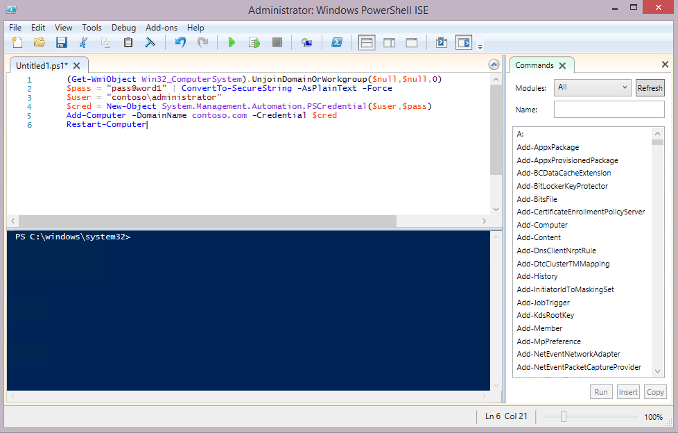

# Step by step guide: Configure a test lab to deploy Windows 10

**Applies to**

-   Windows 10

This guide contains instructions to configure a proof of concept (PoC) environment requiring a minimum amount of resources. The guide makes extensive use of Windows PowerShell and Hyper-V. Subsequent companion guides contain steps to deploy Windows 10 using the PoC environment. After completing this guide, see the following Windows 10 PoC deployment guides:

- [Step by step: Deploy Windows 10 in a test lab using MDT](windows-10-poc-mdt.md)<BR>
- [Step by step: Deploy Windows 10 in a test lab using System Center Configuration Manager](windows-10-poc-sc-config-mgr.md)<BR>

The PoC deployment guides are intended to provide a demonstration of Windows 10 deployment tools and processes for IT professionals that are not familiar with these tools, and those that are interested in setting up a proof of concept environment. The instructions in this guide should not be used in a production setting, and are not meant to replace the instructions found in production deployment guidance.

Approximately 3 hours are required to configure the PoC environment. You will need a Hyper-V capable computer running Windows 8.1 or later with at least 16GB of RAM. Detailed [requirements](#hardware-and-software-requirements) are provided below. You will also need to have a [Microsoft account](https://www.microsoft.com/account) to use for downloading evaluation software.

Windows PowerShell commands are provided to set up the PoC environment quickly. You do not need to be an expert in Windows PowerShell to complete the steps in the guide, however you are required to customize some commands to your environment.

>Instructions to "type" Windows PowerShell commands provided in this guide can be followed literally by typing the commands, but the preferred method is to copy and paste these commands.

>A Windows PowerShell window can be used to run all commands in this guide. However, when commands are specified for a command prompt, you must either type CMD at the Windows PowerShell prompt to enter the command prompt, or preface the command with "cmd /c", or if desired you can escape special characters in the command using the back-tick character (`). In most cases, the simplest thing is to type cmd and enter a command prompt, type the necessary commands, then type "exit" to return to Windows PowerShell.

Hyper-V is installed, configured and used extensively in this guide. If you are not familiar with Hyper-V, review the [terminology](#appendix-b-terminology-used-in-this-guide) used in this guide before starting.

## In this guide

This guide contains instructions for three general procedures: Install Hyper-V, configure Hyper-V, and configure VMs. If you already have a computer running Hyper-V, you can use this computer and skip the first procedure. In this case, your virtual switch settings must be modified to match those used in this guide, or the steps in this guide can be modified to use your existing Hyper-V settings.

After completing the instructions in this guide, you will have a PoC environment that enables you to test Windows 10 deployment procedures by following instructions in companion guides that are written to use the PoC environment. Links are provided to download trial versions of Windows Server 2012, Windows 10 Enterprise, and all deployment tools necessary to complete the lab.

Topics and procedures in this guide are summarized in the following table. An estimate of the time required to complete each procedure is also provided. Time required to complete procedures will vary depending on the resources available to the Hyper-V host and assigned to VMs, such as processor speed, memory allocation, disk speed, and network speed.

<br>

<div style='font-size:9.0pt'>

<table border="1" cellspacing="0" cellpadding="0">
<tr><TD BGCOLOR="#a0e4fa"><B>Topic</B></td><TD BGCOLOR="#a0e4fa"><B>Description</B></td><TD BGCOLOR="#a0e4fa"><B>Time</B></td></tr>
<tr><td>[Hardware and software requirements](#hardware-and-software-requirements)<td>Prerequisites to complete this guide.<td>Informational
<tr><td>[Lab setup](#lab-setup)<td>A description and diagram of the PoC environment.<td>Informational
<tr><td>[Configure the PoC environment](#configure-the-poc-environment)<td>Parent topic for procedures.<td>Informational
<tr><td>[Verify support and install Hyper-V](#verify-support-and-install-hyper-v)<td>Verify that installation of Hyper-V is supported, and install the Hyper-V server role.<td>10 minutes
<tr><td>[Download VHD and ISO files](#download-vhd-and-iso-files)<td>Download evaluation versions of Windows Server 2012 R2 and Windows 10 and prepare these files to be used on the Hyper-V host.<td>30 minutes
<tr><td>[Convert PC to VM](#convert-pc-to-vm)<td>Convert a physical computer on your network to a VM hosted in Hyper-V.<td>30 minutes
<tr><td>[Resize VHD](#resize-vhd)<td>Increase the storage capacity for one of the Windows Server VMs.<td>5 minutes
<tr><td>[Configure Hyper-V](#configure-hyper-v)<td>Create virtual switches, determine available RAM for virtual machines, and add virtual machines.<td>15 minutes
<tr><td>[Configure service and user accounts](#configure-vms)<td>Start virtual machines and configure all services and settings.<td>60 minutes
<tr><td>[Configure VMs](#configure-vms)<td>Start virtual machines and configure all services and settings.<td>60 minutes
<tr><td>[Appendix A: Verify the configuration](#appendix-a-verify-the-configuration)<td>Verify and troubleshoot network connectivity and services in the PoC environment.<td>30 minutes
<tr><td>[Appendix B: Terminology in this guide](#appendix-b-terminology-used-in-this-guide)<td>Terms used in this guide.<td>Informational
</table>
</div>

## Hardware and software requirements

One computer that meets the hardware and software specifications below is required to complete the guide; A second computer is recommended to validate the upgrade process.

- **Computer 1**: the computer you will use to run Hyper-V and host virtual machines. This computer should have 16 GB or more of installed RAM and a multi-core processor.
- **Computer 2**: a client computer from your corporate network. It is shadow-copied to create a VM that can be added to the PoC environment, enabling you to test a mirror image of a computer on your network. If you do not have a computer to use for this simulation, you can download an evaluation VHD and use it to represent this computer. Subsequent guides use this computer to simulate Windows 10 replace and refresh scenarios, so the VM is required even if you cannot create this VM using computer 2.

Harware requirements are displayed below:

<div style='font-size:9.0pt'>

<table border="1" cellspacing="0" cellpadding="0">
    <tr>
        <td></td>
        <td BGCOLOR="#a0e4fa">**Computer 1** (required)</td>
        <td BGCOLOR="#a0e4fa">**Computer 2** (recommended)</td>
    </tr>
    <tr>
        <td BGCOLOR="#a0e4fa">**Role**</td>
        <td>Hyper-V host</td>
        <td>Client computer</td>
    </tr>
    <tr>
        <td BGCOLOR="#a0e4fa">**Description**</td>
        <td>This computer will run Hyper-V, the Hyper-V management tools, and the Hyper-V Windows PowerShell module.</td>
        <td>This computer is a Windows 7 or Windows 8/8.1 client on your corporate network that will be converted to a VM to demonstrate the upgrade process.</td>
    </tr>
    <tr>
        <td BGCOLOR="#a0e4fa">**OS**</td>
        <td>Windows 8.1/10 or Windows Server 2012/2012 R2/2016<b>\*</b></td>
        <td>Windows 7 or a later</td>
    </tr>
    <tr>
        <td BGCOLOR="#a0e4fa">**Edition**</td>
        <td>Enterprise, Professional, or Education</td>
        <td>Any</td>
    </tr>
    <tr>
        <td BGCOLOR="#a0e4fa">**Architecture**</td>
        <td>64-bit</td>
        <td>Any<BR><I>Note: Retaining applications and settings requires that architecture (32 or 64-bit) is the same before and after the upgrade.</I></td>
    </tr>
    <tr>
        <td BGCOLOR="#a0e4fa">**RAM**</td>
        <td>8 GB RAM (16 GB recommended) to test Windows 10 deployment with MDT.
        <BR>16 GB RAM to test Windows 10 deployment with System Center Configuration Manager.</td>
        <td>Any</td>
    </tr>
    <tr>
        <td BGCOLOR="#a0e4fa">**Disk**</td>
        <td>200 GB available hard disk space, any format.</td>
        <td>Any size, MBR formatted.</td>
    </tr>
    <tr>
        <td BGCOLOR="#a0e4fa">**CPU**</td>
        <td>SLAT-Capable CPU</td>
        <td>Any</td>
    </tr>
    <tr>
        <td BGCOLOR="#a0e4fa">**Network**</td>
        <td>Internet connection</td>
        <td>Any</td>
    </tr>
</table>


<B>\*</B><I>The Hyper-V server role can also be installed on a computer running Windows Server 2008 R2. However, the Windows PowerShell module for Hyper-V is not available on Windows Server 2008 R2, therefore you cannot use many of the steps provided in this guide to configure Hyper-V. To manage Hyper-V on Windows Server 2008 R2, you can use Hyper-V WMI, or you can use the Hyper-V Manager console. Providing all steps in this guide as Hyper-V WMI or as 2008 R2 Hyper-V Manager procedures is beyond the scope of the guide.</I>
<BR>
<BR>The Hyper-V role cannot be installed on Windows 7 or earlier versions of Windows.

</div>

## Lab setup

The lab architecture is summarized in the following diagram:


- Computer 1 is configured to host four VMs on a private, PoC network.
    - Two VMs are running Windows Server 2012 R2 with required network services and tools installed.
    - Two VMs are client systems: One VM is intended to mirror a host on your corporate network (computer 2) and one VM is running Windows 10 Enterprise to demonstrate the hardware replacement scenario.

>If you have an existing Hyper-V host, you can use this host and skip the Hyper-V installation section in this guide.

<I>The two Windows Server VMs can be combined into a single VM to conserve RAM and disk space if required. However, instructions in this guide assume two server systems are used. Using two servers enables Active Directory Domain Services and DHCP to be installed on a server that is not directly connected to the corporate network. This mitigates the risk of clients on the corporate network receiving DHCP leases from the PoC network (i.e. "rogue" DHCP), and limits NETBIOS service broadcasts.</I>

## Configure the PoC environment

>**Hint**: Before you begin, ensure that Windows PowerShell is pinned to the taskbar for easy access. If the Hyper-V host is running Windows Server then Windows PowerShell is automatically pinned to the taskbar. To pin Windows PowerShell to the taskbar on Windows 8.1 or Windows 10: Click **Start**, type **power**, right click **Windows PowerShell**, and then click **Pin to taskbar**. After Windows PowerShell is pinned to the taskbar, you can open an elevated Windows PowerShell prompt by right-clicking the icon on the taskbar and then clicking **Run as Administrator**.

### Procedures in this section

[Verify support and install Hyper-V](#verify-support-and-install-hyper-v)<BR>
[Download VHD and ISO files](#download-vhd-and-iso-files)<BR>
[Convert PC to VM](#convert-pc-to-vm)<BR>
[Resize VHD](#resize-vhd)<BR>
[Configure Hyper-V](#configure-hyper-v)<BR>
[Configure VMs](#configure-vms)<BR>

### Verify support and install Hyper-V

Starting with Windows 8, the host computer’s microprocessor must support second level address translation (SLAT) to install Hyper-V. See [Hyper-V: List of SLAT-Capable CPUs for Hosts](https://social.technet.microsoft.com/wiki/contents/articles/1401.hyper-v-list-of-slat-capable-cpus-for-hosts.aspx) for more information.

1. To verify your computer supports SLAT, open an administrator command prompt,  type **systeminfo**, press ENTER, and review the section displayed at the bottom of the output, next to Hyper-V Requirements. See the following example:

    <pre style="overflow-y: visible">
    C:\>systeminfo

    ...
    Hyper-V Requirements:      VM Monitor Mode Extensions: Yes
                               Virtualization Enabled In Firmware: Yes
                               Second Level Address Translation: Yes
                               Data Execution Prevention Available: Yes
    </pre>

    In this example, the computer supports SLAT and Hyper-V.

    If one or more requirements are evaluated as **No** then the computer does not support installing Hyper-V.  However, if only the virtualization setting is incompatible, you might be able to enable virtualization in the BIOS and change the **Virtualization Enabled In Firmware** setting from **No** to **Yes**. The location of this setting will depend on the manufacturer and BIOS version, but is typically found associated with the BIOS security settings.

    You can also identify Hyper-V support using [tools](https://blogs.msdn.microsoft.com/taylorb/2008/06/19/hyper-v-will-my-computer-run-hyper-v-detecting-intel-vt-and-amd-v/) provided by the processor manufacturer, the [msinfo32](https://technet.microsoft.com/library/cc731397.aspx) tool, or you can download the [coreinfo](https://technet.microsoft.com/sysinternals/cc835722) utility and run it, as shown in the following example:

    <pre style="overflow-y: visible">
    C:\>coreinfo -v

    Coreinfo v3.31 - Dump information on system CPU and memory topology
    Copyright (C) 2008-2014 Mark Russinovich
    Sysinternals - www.sysinternals.com

    Intel(R) Core(TM) i7-2600 CPU @ 3.40GHz
    Intel64 Family 6 Model 42 Stepping 7, GenuineIntel
    Microcode signature: 0000001B
    HYPERVISOR      -       Hypervisor is present
    VMX             *       Supports Intel hardware-assisted virtualization
    EPT             *       Supports Intel extended page tables (SLAT)
    </pre>

    Note: A 64-bit operating system is required to run Hyper-V.

2. The Hyper-V feature is not installed by default. To install it, open an elevated Windows PowerShell window and type the following command:

    <pre style="overflow-y: visible">Enable-WindowsOptionalFeature -Online -FeatureName Microsoft-Hyper-V –All</pre>

    This command works on all operating systems that support Hyper-V, but on Windows Server operating systems you must type an additional command to add the Hyper-V Windows PowerShell module and the Hyper-V Manager console. This command will also install Hyper-V if it isn't already installed, so if desired you can just type the following command on Windows Server 2012 or 2016 instead of using the Enable-WindowsOptionalFeature command:

    <pre style="overflow-y: visible">Install-WindowsFeature -Name Hyper-V -IncludeManagementTools</pre>

    When you are prompted to restart the computer, choose **Yes**. The computer might restart more than once. After installation is complete, you can open Hyper-V Manager by typing **virtmgmt.msc** at an elevated command prompt.

    >Alternatively, you can install Hyper-V using the Control Panel in Windows under **Turn Windows features on or off** for a client operating system, or using Server Manager's **Add Roles and Features Wizard** on a server operating system, as shown below:

    

    

    <P>If you choose to install Hyper-V using Server Manager, accept all default selections. Also be sure to install both items under **Role Administration Tools\Hyper-V Management Tools**.

### Download VHD and ISO files

When you have completed installation of Hyper-V on the host computer, begin configuration of Hyper-V by downloading VHD and ISO files to the Hyper-V host. These files will be used to create the VMs used in the lab. Before you can download VHD and ISO files, you will need to register and sign in to the [TechNet Evaluation Center](https://www.microsoft.com/en-us/evalcenter/) using your Microsoft account.

1. Create a directory on your Hyper-V host named **C:\VHD** and download a single [Windows Server 2012 R2 VHD](https://www.microsoft.com/en-us/evalcenter/evaluate-windows-server-2012-r2) from the TechNet Evaluation Center to the **C:\VHD** directory.

    **Important**: This guide assumes that VHDs are stored in the **C:\VHD** directory on the Hyper-V host. If you use a different directory to store VHDs, you must adjust steps in this guide appropriately.

    After completing registration you will be able to download the 7.47 GB Windows Server 2012 R2 evaluation VHD. An example of the download offering is shown below.

    <TABLE BORDER="1">
    <tr><td>  </TD></TR>
    </TABLE>

2. Download the file to the **C:\VHD** directory. When the download is complete, rename the VHD file that you downloaded to **2012R2-poc-1.vhd**. This is done to make the filename simple to recognize and type.
3. Copy the VHD to a second file also in the **C:\VHD** directory and name this VHD **2012R2-poc-2.vhd**.
4. Download the [Windows 10 Enterprise ISO](https://www.microsoft.com/en-us/evalcenter/evaluate-windows-10-enterprise) from the TechNet Evaluation Center to the **C:\VHD** directory on your Hyper-V host.

    >During registration, you must specify the type, version, and language of installation media to download. In this example, a Windows 10 Enterprise, 64 bit, English ISO is chosen. You can choose a different version if desired. **Note: The evaluation version of Windows 10 does not support in-place upgrade**.

5. Rename the ISO file that you downloaded to **w10-enterprise.iso**. Again, this is done so that the filename is simple to type and recognize. After completing registration you will be able to download the 3.63 GB Windows 10 Enterprise evaluation ISO.

After completing these steps, you will have three files in the **C:\VHD** directory: **2012R2-poc-1.vhd**, **2012R2-poc-2.vhd**, **w10-enterprise.iso**.

The following displays the procedures described in this section, both before and after downloading files:

<pre style="overflow-y: visible">
C:\>mkdir VHD
C:\>cd VHD
C:\VHD>ren 9600*.vhd 2012R2-poc-1.vhd
C:\VHD>copy 2012R2-poc-1.vhd 2012R2-poc-2.vhd
   1 file(s) copied.
C:\VHD ren *.iso w10-enterprise.iso
C:\VHD>dir /B
2012R2-poc-1.vhd
2012R2-poc-2.vhd
w10-enterprise.iso
</pre>

### Convert PC to VM

>Important: Do not attempt to use the VM resulting from the following procedure as a reference image. Also, to avoid conflicts with existing clients, do not start the VM outside the PoC network.

<TABLE BORDER="2"><tr><td>
If you do not have a PC available to convert to VM, perform the following steps to download an evaluation VM:
<BR>
<OL>
<LI>Open the [Download virtual machines](https://developer.microsoft.com/en-us/microsoft-edge/tools/vms/) page.
<LI>Under **Virtual machine**, choose **IE11 on Win7**.
<LI>Under **Select platform** choose **HyperV (Windows)**.
<LI>Click **Download .zip**. The download is 3.31 GB.
<LI>Extract the zip file. Three directories are created.
<LI>Open the **Virtual Hard Disks** directory and then copy **IE11 - Win7.vhd** to the **C:\VHD** directory.
<LI>Rename **IE11 - Win7.vhd** to **w7.vhd** (do not rename the file to w7.vhdx).
<LI>In step 5 of the [Configure Hyper-V](#configure-hyper-v) section, replace the VHD file name **w7.vhdx** with **w7.vhd**.
</OL>
</TABLE>

If you have a PC available to convert to VM (computer 2):

1. Sign in on computer 2 using an account with Administrator privileges.

>Important: the account used in this step must have local administrator privileges. You can use a local computer account, or a domain account with administrative rights if domain policy allows the use of cached credentials. After converting the computer to a VM, you must be able to sign in on this VM with administrator rights while the VM is disconnected from the corporate network.

2. [Determine the VM generation and partition type](#determine-the-vm-generation-and-partition-type) that is required.
3. Based on the VM generation and partition type, perform one of the following procedures: [Prepare a generation 1 VM](#prepare-a-generation-1-vm), [Prepare a generation 2 VM](#prepare-a-generation-2-vm), or [prepare a generation 1 VM from a GPT disk](#prepare-a-generation-1-vm-from-a-gpt-disk).

#### Determine the VM generation and partition type

When creating a VM in Hyper-V, you must specify either generation 1 or generation 2. The following table describes requirements for these two types of VMs.

<div style='font-size:9.0pt'>

<table border="1" cellspacing="0" cellpadding="0">
    <tr>
        <td></td>
        <td>Architecture</td>
        <td>Operating system</td>
        <td>Partition style</td>
    </tr>
    <tr>
        <td>Generation 1</td>
        <td>32-bit or 64-bit</td>
        <td>Windows 7 or later</td>
        <td>MBR</td>
    </tr>
    <tr>
        <td>Generation 2</td>
        <td>64-bit</td>
        <td>Windows 8 or later</td>
        <td>MBR or GPT</td>
    </tr>
</table>

</div>

If the PC is running a 32-bit OS or the OS is Windows 7, it must be converted to a generation 1 VM. Otherwise, it can be converted to a generation 2 VM.

- To determine the OS and architecture of a PC, type **systeminfo** at a command prompt and review the output next to **OS Name** and **System Type**.
- To determine the partition style, open a Windows PowerShell prompt on the PC and type the following command:

<pre style="overflow-y: visible">
Get-WmiObject -Class Win32_DiskPartition | Select-Object -Property SystemName,Caption,Type
</pre>

If the **Type** column does not indicate GPT, then the disk partition format is MBR ("Installable File System" = MBR). In the following example, the disk is GPT:

<pre style="overflow-y: visible">
PS C:\> Get-WmiObject -Class Win32_DiskPartition | Select-Object -Property SystemName,Caption,Type

SystemName                           Caption                                 Type
----------                           -------                                 ----
USER-PC1                             Disk #0, Partition #0                   GPT: System
USER-PC1                             Disk #0, Partition #1                   GPT: Basic Data
</pre>

On a computer running Windows 8 or later, you can also type **Get-Disk** at a Windows PowerShell prompt to discover the partition style. The default output of this cmdlet displays the partition style for all attached disks. Both commands are displayed below. In this example, the client computer is running Windows 8.1 and uses a GPT style partition format:

<pre style="overflow-y: visible">
PS C:\> Get-WmiObject -Class Win32_DiskPartition | Select-Object -Property SystemName,Caption,Type

SystemName                            Caption                               Type
----------                            -------                               ----
PC-X1                                 Disk #0, Partition #0                 GPT: Unknown
PC-X1                                 Disk #0, Partition #1                 GPT: System
PC-X1                                 Disk #0, Partition #2                 GPT: Basic Data
PC-X1                                 Disk #0, Partition #3                 GPT: Basic Data
PC-X1                                 Disk #0, Partition #4                 GPT: Basic Data

PS C:\> Get-Disk

Number Friendly Name                  OperationalStatus                     Total Size Partition Style
------ -------------                  -----------------                     ---------- ---------------
0      INTEL SSDSCMMW240A3L           Online                                223.57 GB GPT
</pre>

<span id="determine-vm-generation"/>

**Choosing a VM generation**

The following table displays the Hyper-V VM generation to choose based on the OS, architecture, and partition style. Links to procedures to create the corresponding VMs are included.

<div style='font-size:9.0pt'>

<table border="1" cellspacing="0" cellpadding="0">
    <tr>
        <td>OS</td>
        <td>Partition style</td>
        <td>Architecture</td>
        <td>VM generation</td>
        <td>Procedure</td>
    </tr>
    <tr>
        <td rowspan="4">Windows 7</td>
        <td rowspan="2">MBR</td>
        <td>32</td>
        <td>1</td>
        <td>[Prepare a generation 1 VM](#prepare-a-generation-1-vm)</td>
    </tr>
    <tr>
        <td>64</td>
        <td>1</td>
        <td>[Prepare a generation 1 VM](#prepare-a-generation-1-vm)</td>
    </tr>
    <tr>
        <td rowspan="2">GPT</td>
        <td>32</td>
        <td>N/A</td>
        <td>N/A</td>
    </tr>
    <tr>
        <td>64</td>
        <td>1</td>
        <td>[Prepare a generation 1 VM from a GPT disk](#prepare-a-generation-1-vm-from-a-gpt-disk)</td>
    </tr>
    <tr>
        <td rowspan="4">Windows 8 or later</td>
        <td rowspan="2">MBR</td>
        <td>32</td>
        <td>1</td>
        <td>[Prepare a generation 1 VM](#prepare-a-generation-1-vm)</td>
    </tr>
    <tr>
        <td>64</td>
        <td>1, 2</td>
        <td>[Prepare a generation 1 VM](#prepare-a-generation-1-vm)</td>
    </tr>
    <tr>
        <td rowspan="2">GPT</td>
        <td>32</td>
        <td>1</td>
        <td>[Prepare a generation 1 VM from a GPT disk](#prepare-a-generation-1-vm-from-a-gpt-disk)</td>
    </tr>
    <tr>
        <td>64</td>
        <td>2</td>
        <td>[Prepare a generation 2 VM](#prepare-a-generation-2-vm)</td>
    </tr>
</table>

</div>

Notes:<BR>
<UL>
<LI>If the PC is running Windows 7, it can only be converted and hosted in Hyper-V as a generation 1 VM. This Hyper-V requirement means that if the Windows 7 PC is also using a GPT partition style, the OS disk can be shadow copied, but a new system partition must be created. In this case, see [Prepare a generation 1 VM from a GPT disk](#prepare-a-generation-1-vm-from-a-gpt-disk).
<LI>If the PC is running Windows 8 or later and uses the GPT partition style, you can capture the disk image and create a generation 2 VM. To do this, you must temporarily mount the EFI system partition which is accomplished using the **mountvol** command. In this case, see [Prepare a generation 2 VM](#prepare-a-generation-2-vm).
<LI>If the PC is using an MBR partition style, you can convert the disk to VHD and use it to create a generation 1 VM. If you use the Disk2VHD tool described in this guide, it is not necessary to mount the MBR system partition, but it is still necessary to capture it. In this case, see [Prepare a generation 1 VM](#prepare-a-generation-1-vm).
</UL>

#### Prepare a generation 1 VM

1. Download the [Disk2vhd utility](https://technet.microsoft.com/library/ee656415.aspx), extract the .zip file and copy **disk2vhd.exe** to a flash drive or other location that is accessible from the computer you wish to convert.

    >You might experience timeouts if you attempt to run Disk2vhd from a network share, or specify a network share for the destination. To avoid timeouts, use local, portable media such as a USB drive.

2. On the computer you wish to convert, double-click the disk2vhd utility to start the graphical user interface.
3. Select the checkboxes next to the **C:\** and the **system reserved** (BIOS/MBR) volumes. The system volume is not assigned a drive letter, but will be displayed in the Disk2VHD tool with a volume label similar to **\\?\Volume{**. See the following example. **Important**: You must include the system volume in order to create a bootable VHD. If this volume is not displayed in the disk2vhd tool, then the computer is likely to be using the GPT partition style. For more information, see [Determine VM generation](#determine-vm-generation).
4. Specify a location to save the resulting VHD or VHDX file (F:\VHD\w7.vhdx in the following example) and click **Create**. See the following example:

    

    >Disk2vhd can save VHDs to local hard drives, even if they are the same as the volumes being converted. Performance is better however when the VHD is saved on a disk different than those being converted, such as a flash drive.

5. When the Disk2vhd utility has completed converting the source computer to a VHD, copy the VHDX file (w7.vhdx) to your Hyper-V host in the C:\VHD directory. There should now be four files in this directory:

    <pre style="overflow-y: visible">
    C:\vhd>dir /B
    2012R2-poc-1.vhd
    2012R2-poc-2.vhd
    w10-enterprise.iso
    w7.VHDX
    </pre>

#### Prepare a generation 2 VM

1. Download the [Disk2vhd utility](https://technet.microsoft.com/library/ee656415.aspx), extract the .zip file and copy **disk2vhd.exe** to a flash drive or other location that is accessible from the computer you wish to convert.

    >You might experience timeouts if you attempt to run Disk2vhd from a network share, or specify a network share for the destination. To avoid timeouts, use local, portable media such as a USB drive.

2. On the computer you wish to convert, open an elevated command prompt and type the following command:

    <pre style="overflow-y: visible">mountvol s: /s</pre>

    This command temporarily assigns a drive letter of S to the system volume and mounts it. If the letter S is already assigned to a different volume on the computer, then choose one that is available (ex: mountvol z: /s).

3. On the computer you wish to convert, double-click the disk2vhd utility to start the graphical user interface.
4. Select the checkboxes next to the **C:\** and the **S:\** volumes, and clear the **Use Volume Shadow Copy checkbox**. Volume shadow copy will not work if the EFI system partition is selected.

    **Important**: You must include the EFI system partition in order to create a bootable VHD. The Windows RE tools partition (shown below) is not required, but it can also be converted if desired.

5. Specify a location to save the resulting VHD or VHDX file (F:\VHD\PC1.vhdx in the following example) and click **Create**. See the following example:

    

    >Disk2vhd can save VHDs to local hard drives, even if they are the same as the volumes being converted. Performance is better however when the VHD is saved on a disk different than those being converted, such as a flash drive.

6. When the Disk2vhd utility has completed converting the source computer to a VHD, copy the VHDX file (PC1.vhdx) to your Hyper-V host in the C:\VHD directory. There should now be four files in this directory:

    <pre style="overflow-y: visible">
    C:\vhd>dir /B
    2012R2-poc-1.vhd
    2012R2-poc-2.vhd
    w10-enterprise.iso
    PC1.VHDX
    </pre>

#### Prepare a generation 1 VM from a GPT disk

1. Download the [Disk2vhd utility](https://technet.microsoft.com/library/ee656415.aspx), extract the .zip file and copy **disk2vhd.exe** to a flash drive or other location that is accessible from the computer you wish to convert.

    >You might experience timeouts if you attempt to run Disk2vhd from a network share, or specify a network share for the destination. To avoid timeouts, use local, portable media such as a USB drive.

2. On the computer you wish to convert, double-click the disk2vhd utility to start the graphical user interface.
3. Select the checkbox next to the **C:\** volume and clear the checkbox next to **Use Vhdx**. Note: the system volume is not copied in this scenario, it will be added later.
4. Specify a location to save the resulting VHD file (F:\VHD\w7.vhd in the following example) and click **Create**. See the following example:

    

    >Disk2vhd can save VHDs to local hard drives, even if they are the same as the volumes being converted. Performance is better however when the VHD is saved on a disk different than those being converted, such as a flash drive.

5. When the Disk2vhd utility has completed converting the source computer to a VHD, copy the VHD file (w7.vhd) to your Hyper-V host in the C:\VHD directory. There should now be four files in this directory:

    <pre style="overflow-y: visible">
    C:\vhd>dir /B
    2012R2-poc-1.vhd
    2012R2-poc-2.vhd
    w10-enterprise.iso
    w7.VHD
    </pre>

    >In its current state, the w7.VHD file is not bootable. The VHD will be used to create a bootable VM later in the [Configure Hyper-V](#configure-hyper-v) section.

### Resize VHD

<HR size="4">
**<I>Enhanced session mode</I>**

**Important**: Before proceeding, verify that you can take advantage of [enhanced session mode](https://technet.microsoft.com/windows-server-docs/compute/hyper-v/learn-more/Use-local-resources-on-Hyper-V-virtual-machine-with-VMConnect) when completing instructions in this guide. Enhanced session mode enables you to copy and paste the commands from the Hyper-V host to VMs, between VMs, and between RDP sessions. After copying some text, you can paste into a Windows PowerShell window by simply right-clicking. Before right-clicking, do not left click other locations as this can empty the clipboard. You can also copy and paste <U>files</U> directly from one computer to another by right-clicking and selecting copy on one computer, then right-clicking and selecting paste on another computer.

To ensure that enhanced session mode is enabled on the Hyper-V host, type the following command at an elevated Windows PowerShell prompt on the Hyper-V host:

<pre style="overflow-y: visible">Set-VMhost -EnableEnhancedSessionMode $TRUE</pre>

>If enhanced session mode was not previously enabled, close any existing virtual machine connections and re-open them to enable access to enhanced session mode. As mentioned previously: instructions to "type" commands provided in this guide can be typed, but the preferred method is to copy and paste these commands. Most of the commands to this point in the guide have been brief, but many commands in sections below are longer and more complex.

<HR size="4">

The second Windows Server 2012 R2 VHD needs to be expanded in size from 40GB to 100GB to support installing imaging tools and storing OS images.

1. To add available space for the partition, type the following commands at an elevated Windows PowerShell prompt on the Hyper-V host:

    <pre style="overflow-y: visible">
    Resize-VHD –Path c:\VHD\2012R2-poc-2.vhd –SizeBytes 100GB
    $x = (Mount-VHD –Path c:\VHD\2012R2-poc-2.vhd -passthru | Get-Disk | Get-Partition | Get-Volume).DriveLetter
    Resize-Partition -DriveLetter $x -Size (Get-PartitionSupportedSize -DriveLetter $x).SizeMax
    </pre>

2. Verify that the mounted VHD drive is resized to 100 GB, and then dismount the drive:

    <pre style="overflow-y: visible">
    Get-Volume -DriveLetter $x
    Dismount-VHD –Path c:\VHD\2012R2-poc-2.vhd</pre>

### Configure Hyper-V

1. Open an elevated Windows PowerShell window and type the following command to create two virtual switches named "poc-internal" and "poc-external":

    >If the Hyper-V host already has an external virtual switch bound to a physical NIC, do not attempt to add a second external virtual switch. Attempting to add a second external switch will result in an error indicating that the NIC is **already bound to the Microsoft Virtual Switch protocol.** In this case, choose one of the following options:<BR>
    &nbsp;&nbsp;&nbsp;A) Remove the existing external virtual switch, then add the poc-external switch<BR>
    &nbsp;&nbsp;&nbsp;B) Rename the existing external switch to "poc-external"<BR>
    &nbsp;&nbsp;&nbsp;C) Replace each instance of "poc-external" used in this guide with the name of your existing external virtual switch<BR>
    If you choose B) or C), then do not run the second command below.

    <pre style="overflow-y: visible">
    New-VMSwitch -Name poc-internal -SwitchType Internal -Notes "PoC Network"
    New-VMSwitch -Name poc-external -NetAdapterName (Get-NetAdapter |?{$_.Status -eq "Up" -and !$_.Virtual}).Name -Notes "PoC External"
    </pre>

    **Note**: The second command above will temporarily interrupt network connectivity on the Hyper-V host.

    >Since an external virtual switch is associated to a physical network adapter on the Hyper-V host, this adapter must be specified when adding the virtual switch. The previous commands automate this by filtering for active non-virtual ethernet adapters using the Get-NetAdapter cmdlet ($_.Status -eq "Up" -and !$_.Virtual). If your Hyper-V host is dual-homed with multiple active ethernet adapters, this automation will not work, and the second command above will fail. In this case, you must edit the command used to add the "poc-external" virtual switch by inserting the appropriate NetAdapterName. The NetAdapterName value corresponds to the name of the network interface you wish to use. For example, if the network interface you use on the Hyper-V host to connect to the Internet is named "Ethernet 2" then type the following command to create an external virtual switch: New-VMSwitch -Name poc-external -NetAdapterName "Ethernet 2" -Notes "PoC External"

2. At the elevated Windows PowerShell prompt, type the following command to determine the megabytes of RAM that are currently available on the Hyper-V host:

    <pre style="overflow-y: visible">
    (Get-VMHostNumaNode).MemoryAvailable
    </pre>

    This command will display the megabytes of RAM available for VMs. On a Hyper-V host computer with 16 GB of physical RAM installed, 10,000 MB of RAM or greater should be available if the computer is not also running other applications. On a computer with 8 GB of physical RAM installed, at least 4000 MB should be available. If the computer has less RAM available than this, try closing applications to free up more memory.

3. Determine the available memory for VMs by dividing the available RAM by 4.  For example:

    <pre style="overflow-y: visible">
    (Get-VMHostNumaNode).MemoryAvailable/4
    2775.5
    </pre>

    In this example, VMs can use a maximum of 2700 MB of RAM each, to run four VMs simultaneously.

4. At the elevated Windows PowerShell prompt, type the following command to create two new VMs. Other VMs will be added later.
    >**Important**: Replace the value of 2700MB for $maxRAM in the first command below with the RAM value that you calculated in the previous step.

    <pre style="overflow-y: visible">
    $maxRAM = 2700MB
    New-VM -Name "DC1" -VHDPath c:\vhd\2012R2-poc-1.vhd -SwitchName poc-internal
    Set-VMMemory -VMName "DC1" -DynamicMemoryEnabled $true -MinimumBytes 512MB -MaximumBytes $maxRAM -Buffer 20
    Enable-VMIntegrationService -Name "Guest Service Interface" -VMName DC1
    New-VM -Name "SRV1" -VHDPath c:\vhd\2012R2-poc-2.vhd -SwitchName poc-internal
    Add-VMNetworkAdapter -VMName "SRV1" -SwitchName "poc-external"
    Set-VMMemory -VMName "SRV1" -DynamicMemoryEnabled $true -MinimumBytes 512MB -MaximumBytes $maxRAM -Buffer 80
    Enable-VMIntegrationService -Name "Guest Service Interface" -VMName SRV1
    </pre>

    **Note**: The RAM values assigned to VMs in this step are not permanent, and can be easily increased or decreased later if needed to address performance issues.

5. Using the same elevated Windows PowerShell prompt that was used in the previous step, type one of the following sets of commands, depending on the type of VM that was prepared in the [Determine VM generation](#determine-vm-generation) section, either generation 1, generation 2, or generation 1 with GPT.

    To create a generation 1 VM (using c:\vhd\w7.vhdx):

    <pre style="overflow-y: visible">
    New-VM -Name "PC1" -VHDPath c:\vhd\w7.vhdx -SwitchName poc-internal
    Set-VMMemory -VMName "PC1" -DynamicMemoryEnabled $true -MinimumBytes 512MB -MaximumBytes $maxRAM -Buffer 20
    Enable-VMIntegrationService -Name "Guest Service Interface" -VMName PC1
    </pre>

    To create a generation 2 VM (using c:\vhd\PC1.vhdx):

    <pre style="overflow-y: visible">
    New-VM -Name "PC1" -Generation 2 -VHDPath c:\vhd\PC1.vhdx -SwitchName poc-internal
    Set-VMMemory -VMName "PC1" -DynamicMemoryEnabled $true -MinimumBytes 512MB -MaximumBytes $maxRAM -Buffer 20
    Enable-VMIntegrationService -Name "Guest Service Interface" -VMName PC1
    </pre>

    To create a generation 1 VM from a GPT disk (using c:\vhd\w7.vhd):

    >Note: The following procedure is more complex because it includes steps to convert the OS partition from GPT to MBR format. Steps are included to create a temporary VHD and attach it to the VM, the OS image is saved to this drive, the OS drive is then reformatted to MBR, the OS image restored, and the temporary drive is removed.

    First, type the following commands at an elevated Windows PowerShell prompt on the Hyper-V host to create a temporary VHD that will be used to save the OS image. Do not forget to include a pipe (|) at the end of the first five commands:

    <pre style="overflow-y: visible">
    New-VHD -Path c:\vhd\d.vhd -SizeBytes 1TB |
    Mount-VHD -Passthru |
    Get-Disk -Number {$_.DiskNumber} |
    Initialize-Disk -PartitionStyle MBR -PassThru |
    New-Partition -UseMaximumSize |
    Format-Volume -Confirm:$false -FileSystem NTFS -force
    Dismount-VHD -Path c:\vhd\d.vhd
    </pre>

    Next, create the PC1 VM with two attached VHDs, and boot to DVD ($maxram must be defined previously using the same Windows PowerShell promt):

    <pre style="overflow-y: visible">
    New-VM -Name "PC1" -VHDPath c:\vhd\w7.vhd -SwitchName poc-internal
    Add-VMHardDiskDrive -VMName PC1 -Path c:\vhd\d.vhd
    Set-VMDvdDrive -VMName PC1 -Path c:\vhd\w10-enterprise.iso
    Set-VMMemory -VMName "PC1" -DynamicMemoryEnabled $true -MinimumBytes 512MB -MaximumBytes $maxRAM -Buffer 20
    Enable-VMIntegrationService -Name "Guest Service Interface" -VMName PC1
    Start-VM PC1
    vmconnect localhost PC1
    </pre>

    The VM will automatically boot into Windows Setup. In the PC1 window:

    1. Click **Next**.
    2. Click **Repair your computer**.
    3. Click **Troubleshoot**.
    4. Click **Command Prompt**.
    5. Type the following command to save an image of the OS drive:

    <pre style="overflow-y: visible">
    dism /Capture-Image /ImageFile:D:\c.wim /CaptureDir:C:\ /Name:Drive-C
    </pre>

    6. Wait for the OS image to complete saving, and then type the following commands to convert the C: drive to MBR:

    <pre style="overflow-y: visible">
    diskpart
    select disk 0
    clean
    convert MBR
    create partition primary size=100
    format fs=ntfs quick
    active
    create partition primary
    format fs=ntfs quick label=OS
    assign letter=c
    exit
    </pre>

    7. Type the following commands to restore the OS image and boot files:

    <pre style="overflow-y: visible">
    dism /Apply-Image /ImageFile:D:\c.wim /Index:1 /ApplyDir:C:\
    bcdboot c:\windows
    exit
    </pre>

    8. Click **Continue** and verify the VM boots successfully (do not boot from DVD).
    9. Click **Ctrl+Alt+Del**, and then in the bottom right corner, click **Shut down**.
    10. Type the following commands at an elevated Windows PowerShell prompt on the Hyper-V host to remove the temporary disks and drives from PC1:

    <pre style="overflow-y: visible">
    Remove-VMHardDiskDrive -VMName PC1 -ControllerType IDE -ControllerNumber 0 -ControllerLocation 1
    Set-VMDvdDrive -VMName PC1 -Path $null
    </pre>

### Configure VMs

1. At an elevated Windows PowerShell prompt on the Hyper-V host, start the first Windows Server VM and connect to it by typing the following commands:

    <pre style="overflow-y: visible">
    Start-VM DC1
    vmconnect localhost DC1
    </pre>

2. Click **Next** to accept the default settings, read the license terms and click **I accept**, provide an administrator password of **pass@word1**, and click **Finish**.
3. Click **Ctrl+Alt+Del** in the upper left corner of the virtual machine connection window, and then sign in to DC1 using the Administrator account.
4. Right-click **Start**, point to **Shut down or sign out**, and click **Sign out**. The VM connection will reset and a new connection dialog box will appear enabling you to choose a custom display configuration. Select a desktop size, click **Connect** and sign in again with the local Administrator account. Note: Signing in this way ensures that [enhanced session mode](https://technet.microsoft.com/windows-server-docs/compute/hyper-v/learn-more/Use-local-resources-on-Hyper-V-virtual-machine-with-VMConnect) is enabled. It is only necessary to do this the first time you sign in to a new VM.
5. If DC1 is configured as described in this guide, it will currently be assigned an APIPA address, have a randomly generated hostname, and a single network adapter named "Ethernet." Open an elevated Windows PowerShell prompt on DC1 and type or paste the following commands to provide a new hostname and configure a static IP address and gateway:

    <pre style="overflow-y: visible">
    Rename-Computer DC1
    New-NetIPAddress –InterfaceAlias Ethernet –IPAddress 192.168.0.1 –PrefixLength 24 -DefaultGateway 192.168.0.2
    Set-DnsClientServerAddress -InterfaceAlias Ethernet -ServerAddresses 192.168.0.1,192.168.0.2
    </pre>

    >The default gateway at 192.168.0.2 will be configured later in this guide.

    >Note: A list of available tasks for an app will be populated the first time you run it on the taskbar. Because these tasks aren't available until the App has been run, you will not see the **Run as Administrator** task until you have left-clicked Windows PowerShell for the first time. In this newly created VM, you will need to left-click Windows PowerShell one time, and then you can right-click and choose Run as Administrator to open an elevated Windows PowerShell prompt.

6. Install the Active Directory Domain Services role by typing the following command at an elevated Windows PowerShell prompt:

    <pre style="overflow-y: visible">
    Install-WindowsFeature -Name AD-Domain-Services -IncludeAllSubFeature -IncludeManagementTools
    </pre>

7. Before promoting DC1 to a Domain Controller, you must reboot so that the name change in step 3 above takes effect. To restart the computer, type the following command at an elevated Windows PowerShell prompt:

    <pre style="overflow-y: visible">
    Restart-Computer
    </pre>

8. When DC1 has rebooted, sign in again and open an elevated Windows PowerShell prompt. Now you can promote the server to be a domain controller. The directory services restore mode password must be entered as a secure string. Type the following commands at the elevated Windows PowerShell prompt:

    <pre style="overflow-y: visible">
    $pass = "pass@word1" | ConvertTo-SecureString -AsPlainText -Force
    Install-ADDSForest -DomainName contoso.com -InstallDns -SafeModeAdministratorPassword $pass -Force
    </pre>

    Ignore any warnings that are displayed. The computer will automatically reboot upon completion.

9. When the reboot has completed, reconnect to DC1, sign in using the CONTOSO\Administrator account, open an elevated Windows PowerShell prompt, and use the following commands to add a reverse lookup zone for the PoC network, add the DHCP Server role, authorize DHCP in Active Directory, and suppress the post-DHCP-install alert:

    <pre style="overflow-y: visible">
    Add-DnsServerPrimaryZone -NetworkID "192.168.0.0/24" -ReplicationScope Forest
    Add-WindowsFeature -Name DHCP -IncludeManagementTools
    netsh dhcp add securitygroups
    Restart-Service DHCPServer
    Add-DhcpServerInDC  dc1.contoso.com  192.168.0.1
    Set-ItemProperty –Path registry::HKEY_LOCAL_MACHINE\SOFTWARE\Microsoft\ServerManager\Roles\12 –Name ConfigurationState –Value 2
    </pre>

10. Next, add a DHCP scope and set option values:

    <pre style="overflow-y: visible">
    Add-DhcpServerv4Scope -Name "PoC Scope" -StartRange 192.168.0.100 -EndRange 192.168.0.199 -SubnetMask 255.255.255.0 -Description "Windows 10 PoC" -State Active
    Set-DhcpServerv4OptionValue -ScopeId 192.168.0.0 -DnsDomain contoso.com -Router 192.168.0.2 -DnsServer 192.168.0.1,192.168.0.2 -Force
    </pre>

    >The -Force option is necessary when adding scope options to skip validation of 192.168.0.2 as a DNS server because we have not configured it yet. The scope should immediately begin issuing leases on the PoC network. The first DHCP lease that will be issued is to vEthernet interface on the Hyper-V host, which is a member of the internal network. You can verify this by using the command: Get-DhcpServerv4Lease -ScopeId 192.168.0.0.

11. The DNS server role will also be installed on the member server, SRV1, at 192.168.0.2 so that we can forward DNS queries from DC1 to SRV1 to resolve Internet names without having to configure a forwarder outside the PoC network. Since the IP address of SRV1 already exists on DC1's network adapter, it will be automatically added during the DCPROMO process. To verify this server-level DNS forwarder on DC1, type the following command at an elevated Windows PowerShell prompt on DC1:

    <pre style="overflow-y: visible">
    Get-DnsServerForwarder
    </pre>

    The following output should be displayed:

    <pre style="overflow-y: visible">
    UseRootHint        : True
    Timeout(s)         : 3
    EnableReordering   : True
    IPAddress          : 192.168.0.2
    ReorderedIPAddress : 192.168.0.2
    </pre>

    If this output is not displayed, you can use the following command to add SRV1 as a forwarder:

    <pre style="overflow-y: visible">
    Add-DnsServerForwarder -IPAddress 192.168.0.2
    </pre>

    **Configure service and user accounts**

    Windows 10 deployment with MDT and System Center Configuration Manager requires specific accounts to perform some actions. Service accounts will be created to use for these tasks. A user account is also added in the contoso.com domain that can be used for testing purposes. In the test lab environment, passwords are set to never expire.

    >To keep this test lab relatively simple, we will not create a custom OU structure and set permissions. Required permissions are enabled by adding accounts to the Domain Admins group. To configure these settings in a production environment, see [Prepare for Zero Touch Installation of Windows 10 with Configuration Manager](deploy-windows-sccm/prepare-for-zero-touch-installation-of-windows-10-with-configuration-manager.md)

    On DC1, open an elevated Windows PowerShell prompt and type the following commands:

    <pre style="overflow-y: visible">
    New-ADUser -Name User1 -UserPrincipalName user1 -Description "User account" -AccountPassword (ConvertTo-SecureString "pass@word1" -AsPlainText -Force) -ChangePasswordAtLogon $false -Enabled $true
    New-ADUser -Name MDT_BA -UserPrincipalName MDT_BA -Description "MDT Build Account" -AccountPassword (ConvertTo-SecureString "pass@word1" -AsPlainText -Force) -ChangePasswordAtLogon $false -Enabled $true
    New-ADUser -Name CM_JD -UserPrincipalName CM_JD -Description "Configuration Manager Join Domain Account" -AccountPassword (ConvertTo-SecureString "pass@word1" -AsPlainText -Force) -ChangePasswordAtLogon $false -Enabled $true
    New-ADUser -Name CM_NAA -UserPrincipalName CM_NAA -Description "Configuration Manager Network Access Account" -AccountPassword (ConvertTo-SecureString "pass@word1" -AsPlainText -Force) -ChangePasswordAtLogon $false -Enabled $true
    Add-ADGroupMember "Domain Admins" MDT_BA,CM_JD,CM_NAA
    Set-ADUser -Identity user1 -PasswordNeverExpires $true
    Set-ADUser -Identity administrator -PasswordNeverExpires $true
    Set-ADUser -Identity MDT_BA -PasswordNeverExpires $true
    Set-ADUser -Identity CM_JD -PasswordNeverExpires $true
    Set-ADUser -Identity CM_NAA -PasswordNeverExpires $true
    </pre>

12. Minimize the DC1 VM window but **do not stop** the VM.

    Next, the client VM will be started and joined to the contoso.com domain. This is done before adding a gateway to the PoC network so that there is no danger of duplicate DNS registrations for the physical client and its cloned VM in the corporate domain.

13. If the PC1 VM is not started yet, using an elevated Windows PowerShell prompt on the Hyper-V host, start the client VM (PC1), and connect to it:

    <pre style="overflow-y: visible">
    Start-VM PC1
    vmconnect localhost PC1
    </pre>

14. Sign in to PC1 using an account that has local administrator rights.

    >PC1 will be disconnected from its current domain, so you cannot use a domain account to sign on unless these credentials are cached and the use of cached credentials is permitted by Group Policy. If cached credentials are available and permitted, you can use these credentials to sign in. Otherwise, use an existing local administrator account.

15. After signing in, the operating system detects that it is running in a new environment. New drivers will be automatically installed, including the network adapter driver. The network adapter driver must be updated before you can proceed, so that you will be able to join the contoso.com domain. Depending on the resources allocated to PC1, installing the network adapter driver might take a few minutes. You can monitor device driver installation by clicking **Show hidden icons** in the notification area.

    

    >If the client was configured with a static address, you must change this to a dynamic one so that it can obtain a DHCP lease.

16. When the new network adapter driver has completed installation, you will receive an alert to set a network location for the contoso.com network. Select **Work network** and then click **Close**. When you receive an alert that a restart is required, click **Restart Later**.

17. Open an elevated Windows PowerShell prompt on PC1 and verify that the client VM has received a DHCP lease and can communicate with the consoto.com domain controller.

    To open Windows PowerShell on Windows 7, click **Start**, and search for "**power**." Right-click **Windows PowerShell** and then click **Pin to Taskbar** so that it is simpler to use Windows Powershell during this lab. Click **Windows PowerShell** on the taskbar, and then type **ipconfig** at the prompt to see the client's current IP address. Also type **ping dc1.contoso.com** and **nltest /dsgetdc:contoso.com** to verify that it can reach the domain controller. See the following examples of a successful network connection:

    ```
    ipconfig

    Windows IP Configuration

    Ethernet adapter Local Area Connection 3:
        Connection-specific DNS Suffix  . : contoso.com
        Link-local IPv6 Address . . . . . : fe80::64c2:4d2a:7403:6e02%18
        Ipv4 Address. . . . . . . . . . . : 192.168.0.101
        Subnet Mask . . . . . . . . . . . : 255.255.255.0
        Default Gateway . . . . . . . . . : 192.168.0.2

    ping dc1.contoso.com

    Pinging dc1.contoso.com [192.168.0.1] with 32 bytes of data:
    Reply from 192.168.0.1: bytes=32 time<1ms TTL=128
    Reply from 192.168.0.1: bytes=32 time<1ms TTL=128
    Reply from 192.168.0.1: bytes=32 time<1ms TTL=128
    Reply from 192.168.0.1: bytes=32 time<1ms TTL=128

    nltest /dsgetdc:contoso.com
               DC: \\DC1
          Address: \\192.168.0.1
         Dom Guid: fdbd0643-d664-411b-aea0-fe343d7670a8
         Dom Name: CONTOSO
      Forest Name: contoso.com
     Dc Site Name: Default-First-Site-Name
    Our Site Name: Default-First-Site-Name
            Flags: PDC GC DS LDAP KDC TIMESERV WRITABLE DNS_FOREST CLOSE_SITE FULL_SECRET WS 0xC000
    ```

    >If PC1 is running Windows 7, enhanced session mode might not be available, which means that you cannot copy and paste commands from the Hyper-V host to a Windows PowerShell prompt on PC1. However, it is possible to use integration services to copy a file from the Hyper-V host to a VM. The next procedure demonstrates this. If the Copy-VMFile command fails, then type the commands below at an elevated Windows PowerShell prompt on PC1 instead of saving them to a script to run remotely. If PC1 is running Windows 8 or a later operating system, you can use enhanced session mode to copy and paste these commands instead of typing them.

18. Minimize the PC1 window and switch to the Hyper-V host computer. Open an elevated Windows PowerShell ISE window on the Hyper-V host (right-click Windows PowerShell and then click **Run ISE as Administrator**) and type the following commands in the (upper) script editor pane:

    <pre style="overflow-y: visible">
    (Get-WmiObject Win32_ComputerSystem).UnjoinDomainOrWorkgroup($null,$null,0)
    $pass = "pass@word1" | ConvertTo-SecureString -AsPlainText -Force
    $user = "contoso\administrator"
    $cred = New-Object System.Management.Automation.PSCredential($user,$pass)
    Add-Computer -DomainName contoso.com -Credential $cred
    Restart-Computer
    </pre>

    >If you do not see the script pane, click **View** and verify **Show Script Pane Top** is enabled. Click **File** and then click **New**.

    See the following example:

    

19. Click **File**, click **Save As**, and save the commands as **c:\VHD\pc1.ps1** on the Hyper-V host.
20. In the (lower) terminal input window, type the following commands to enable Guest Service Interface on PC1 and then use this service to copy the script to PC1:

    <pre style="overflow-y: visible">
    Enable-VMIntegrationService -VMName PC1 -Name "Guest Service Interface"
    Copy-VMFile "PC1" –SourcePath "C:\VHD\pc1.ps1"  –DestinationPath "C:\pc1.ps1" –CreateFullPath –FileSource Host
    </pre>

    >In order for this command to work properly, PC1 must be running the vmicguestinterface (Hyper-V Guest Service Interface) service. If this service is not enabled in this step, then the copy-VMFile command will fail. In this case, you can try updating integration services on the VM by mounting the Hyper-V Integration Services Setup (vmguest.iso), which is located in C:\Windows\System32 on Windows Server 2012 and 2012 R2 operating systems that are running the Hyper-V role service.

    If the copy-vmfile command does not work and you cannot properly enable or upgrade integration services on PC1, then create the file c:\pc1.ps1 on the VM by typing the commands into this file manually. The copy-vmfile command is only used in this procedure as a demonstration of automation methods that can be used in a Hyper-V environment when enhanced session mode is not available. After typing the script file manually, be sure to save the file as a Windows PowerShell script file with the .ps1 extension and not as a text (.txt) file.

21. On PC1, type the following commands at an elevated Windows PowerShell prompt:

    <pre style="overflow-y: visible">
    Get-Content c:\pc1.ps1 | powershell.exe -noprofile -
    </pre>

    >The commands in this script might take a few moments to complete. If an error is displayed, check that you typed the command correctly, paying close attention to spaces. PC1 is removed from its domain in this step while not connected to the corporate network so as to ensure the computer object in the corporate domain is unaffected. PC1 is also not renamed to "PC1" in system properties so that it maintains some of its mirrored identity. However, if desired you can also rename the computer.

22. Upon completion of the script, PC1 will automatically restart. When it has restarted, sign in to the contoso.com domain using the **Switch User** option, with the **user1** account you created in step 11 of this section.
    >**Important**: The settings that will be used later to migrate user data specifically select only accounts that belong to the CONTOSO domain. However, this can be changed to migrate all user accounts, or only other specified accounts. If you wish to test migration of user data and settings with accounts other than those in the CONTOSO domain, you must specify these accounts or domains when you configure the value of **ScanStateArgs** in the MDT test lab guide. This value is specifically called out when you get to that step. If you wish to only migrate CONTOSO accounts, then you can log in with the user1 account or the administrator account at this time and modify some of the files and settings for later use in migration testing.
23. Minimize the PC1 window but do not turn it off while the second Windows Server 2012 R2 VM (SRV1) is configured. This verifies that the Hyper-V host has enough resources to run all VMs simultaneously. Next, SRV1 will be started, joined to the contoso.com domain, and configured with RRAS and DNS services.
24. On the Hyper-V host computer, at an elevated Windows PowerShell prompt, type the following commands:

    <pre style="overflow-y: visible">
    Start-VM SRV1
    vmconnect localhost SRV1
    </pre>

25. Accept the default settings, read license terms and accept them, provide an administrator password of **pass@word1**, and click **Finish**. When you are prompted about finding PCs, devices, and content on the network, click **Yes**.
26. Sign in to SRV1 using the local administrator account. In the same way that was done on DC1, sign out of SRV1 and then sign in again to enable enhanced session mode. This will enable you to copy and paste Windows PowerShell commands from the Hyper-V host to the VM.
27. Open an elevated Windows PowerShell prompt on SRV1 and type the following commands:

    <pre style="overflow-y: visible">
    Rename-Computer SRV1
    New-NetIPAddress –InterfaceAlias Ethernet –IPAddress 192.168.0.2 –PrefixLength 24
    Set-DnsClientServerAddress -InterfaceAlias Ethernet -ServerAddresses 192.168.0.1,192.168.0.2
    Restart-Computer
    </pre>

    >[!IMPORTANT]
    >Verify that you are configuring the correct interface in this step. The commands in this step assume that the poc-internal interface on SRV1 is named "Ethernet."  If you are unsure how to check the interface, see step #30 below for instructions and tips on how to verify and modify the interface name.

28. Wait for the computer to restart, sign in again, then type the following commands at an elevated Windows PowerShell prompt:

    <pre style="overflow-y: visible">
    $pass = "pass@word1" | ConvertTo-SecureString -AsPlainText -Force
    $user = "contoso\administrator"
    $cred = New-Object System.Management.Automation.PSCredential($user,$pass)
    Add-Computer -DomainName contoso.com -Credential $cred
    Restart-Computer
    </pre>

29. Sign in to the contoso.com domain on SRV1 using the domain administrator account (enter contoso\administrator as the user), open an elevated Windows PowerShell prompt, and type the following commands:

    <pre style="overflow-y: visible">
    Install-WindowsFeature -Name DNS -IncludeManagementTools
    Install-WindowsFeature -Name WDS -IncludeManagementTools
    Install-WindowsFeature -Name Routing -IncludeManagementTools
    </pre>

30. Before configuring the routing service that was just installed, verify that network interfaces were added to SRV1 in the right order, resulting in an interface alias of "Ethernet" for the private interface, and an interface alias of "Ethernet 2" for the public interface. Also verify that the external interface has a valid external DHCP IP address lease.

    To view a list of interfaces, associated interface aliases, and IP addresses on SRV1, type the following Windows PowerShell command. Example output of the command is also shown below:

    <pre style="overflow-y: visible">
    Get-NetAdapter | ? status -eq ‘up’ | Get-NetIPAddress -AddressFamily IPv4 | ft IPAddress, InterfaceAlias

    IPAddress                                                                  InterfaceAlias
    ---------                                                                  --------------
    10.137.130.118                                                             Ethernet 2
    192.168.0.2                                                                Ethernet
    </pre>

    In this example, the poc-internal network interface at 192.168.0.2 is associated with the "Ethernet" interface and the Internet-facing poc-external interface is associated with the "Ethernet 2" interface. If your interfaces are different, you must adjust the commands provided in the next step appropriately to configure routing services. Also note that if the "Ethernet 2" interface has an IP address in the 192.168.0.100-105 range then it likely is getting a DHCP lease from DC1 instead of your corporate network. If this is the case, you can try removing and re-adding the second network interface from the SRV1 VM through its Hyper-V settings.

    >[!TIP]
    >Sometimes a computer will have hidden, disconnected interfaces that prevent you from naming a network adapter. When you attempt to rename an adapter, you will receive an error that the adapter name already exists. These disconnected devices can be viewed in device manager by clicking **View** and then clicking **Show hidden devices**. The disconnected device can then be uninstalled, enabling you to reuse the adapter name.


31. To configure SRV1 with routing capability for the PoC network, type or paste the following commands at an elevated Windows PowerShell prompt on SRV1:

    <pre style="overflow-y: visible">
    Install-RemoteAccess -VpnType Vpn
    cmd /c netsh routing ip nat install
    cmd /c netsh routing ip nat add interface name="Ethernet 2" mode=FULL
    cmd /c netsh routing ip nat add interface name="Ethernet" mode=PRIVATE
    cmd /c netsh routing ip nat add interface name="Internal" mode=PRIVATE
    </pre>

32. The DNS service on SRV1 also needs to resolve hosts in the contoso.com domain. This can be accomplished with a conditional forwarder. Open an elevated Windows PowerShell prompt on SRV1 and type the following command:

    <pre style="overflow-y: visible">
    Add-DnsServerConditionalForwarderZone -Name contoso.com -MasterServers 192.168.0.1
    </pre>

33. In most cases, this completes configuration of the PoC network. However, if your corporate network has a firewall that filters queries from local DNS servers, you will also need to configure a server-level DNS forwarder on SRV1 to resolve Internet names. To test whether or not DNS is working without this forwarder, try to reach a name on the Internet from DC1 or PC1, which are only using DNS services on the PoC network. You can test DNS with the ping command, for example:

    <pre style="overflow-y: visible">
    ping www.microsoft.com
    </pre>

    If you see "Ping request could not find host www.microsoft.com" on PC1 and DC1, but not on SRV1, then you will need to configure a server-level DNS forwarder on SRV1. To do this, open an elevated Windows PowerShell prompt on SRV1 and type the following command.

    **Note**: This command also assumes that "Ethernet 2" is the external-facing network adapter on SRV1. If the external adapter has a different name, replace "Ethernet 2" in the command below with that name:

    <pre style="overflow-y: visible">
    Add-DnsServerForwarder -IPAddress (Get-DnsClientServerAddress -InterfaceAlias "Ethernet 2").ServerAddresses
    </pre>

34. If DNS and routing are both working correctly, you will see the following on DC1 and PC1 (the IP address might be different, but that is OK):

    <pre style="overflow-y: visible">
    PS C:\> ping www.microsoft.com

    Pinging e2847.dspb.akamaiedge.net [23.222.146.170] with 32 bytes of data:
    Reply from 23.222.146.170: bytes=32 time=3ms TTL=51
    Reply from 23.222.146.170: bytes=32 time=2ms TTL=51
    Reply from 23.222.146.170: bytes=32 time=2ms TTL=51
    Reply from 23.222.146.170: bytes=32 time=1ms TTL=51

    Ping statistics for 23.222.146.170:
        Packets: Sent = 4, Received = 4, Lost = 0 (0% loss),
    Approximate round trip times in milli-seconds:
        Minimum = 1ms, Maximum = 3ms, Average = 2ms
    </pre>

35. Verify that all three VMs can reach each other, and the Internet. See [Appendix A: Verify the configuration](#appendix-a-verify-the-configuration) for more information.
36. Lastly, because the client computer has different hardware after copying it to a VM, its Windows activation will be invalidated and you might receive a message that you must activate Windows in 3 days.  To extend this period to 30 days, type the following commands at an elevated Windows PowerShell prompt on PC1:

    <pre style="overflow-y: visible">
    runas /noprofile /env /user:administrator@contoso.com "cmd /c slmgr -rearm"
    Restart-Computer
    </pre>

This completes configuration of the starting PoC environment. Additional services and tools are installed in subsequent guides.

## Appendix A: Verify the configuration

Use the following procedures to verify that the PoC environment is configured properly and working as expected.

1. On DC1, open an elevated Windows PowerShell prompt and type the following commands:

    <pre style="overflow-y: visible">
    Get-Service NTDS,DNS,DHCP
    DCDiag -a
    Get-DnsServerResourceRecord -ZoneName contoso.com -RRType A
    Get-DnsServerForwarder
    Resolve-DnsName -Server dc1.contoso.com -Name www.microsoft.com
    Get-DhcpServerInDC
    Get-DhcpServerv4Statistics
    ipconfig /all
    </pre>

    **Get-Service** displays a status of "Running" for all three services.<BR>
    **DCDiag** displays "passed test" for all tests.<BR>
    **Get-DnsServerResourceRecord** displays the correct DNS address records for DC1, SRV1, and the computername of PC1. Additional address records for the zone apex (@), DomainDnsZones, and ForestDnsZones will also be registered.<BR>
    **Get-DnsServerForwarder** displays a single forwarder of 192.168.0.2.<BR>
    **Resolve-DnsName** displays public IP address results for www.microsoft.com.<BR>
    **Get-DhcpServerInDC** displays 192.168.0.1, dc1.contoso.com.<BR>
    **Get-DhcpServerv4Statistics** displays 1 scope with 2 addresses in use (these belong to PC1 and the Hyper-V host).<BR>
    **ipconfig** displays a primary DNS suffix and suffix search list of contoso.com, IP address of 192.168.0.1, subnet mask of 255.255.255.0, default gateway of 192.168.0.2, and DNS server addresses of 192.168.0.1 and 192.168.0.2.

2. On SRV1, open an elevated Windows PowerShell prompt and type the following commands:

    <pre style="overflow-y: visible">
    Get-Service DNS,RemoteAccess
    Get-DnsServerForwarder
    Resolve-DnsName -Server dc1.contoso.com -Name www.microsoft.com
    ipconfig /all
    netsh int ipv4 show address
    </pre>

    **Get-Service** displays a status of "Running" for both services.<BR>
    **Get-DnsServerForwarder** either displays no forwarders, or displays a list of forwarders you are required to use so that SRV1 can resolve Internet names.<BR>
    **Resolve-DnsName** displays public IP address results for www.microsoft.com.<BR>
    **ipconfig** displays a primary DNS suffix of contoso.com. The suffix search list contains contoso.com and your corporate domain. Two ethernet adapters are shown: Ethernet adapter "Ethernet" has an IP addresses of 192.168.0.2, subnet mask of 255.255.255.0, no default gateway, and DNS server addresses of 192.168.0.1 and 192.168.0.2. Ethernet adapter "Ethernet 2" has an IP address, subnet mask, and default gateway configured by DHCP on your corporate network.<BR>
    **netsh** displays three interfaces on the computer: interface "Ethernet 2" with DHCP enabled = Yes and IP address assigned by your corporate network, interface "Ethernet" with DHCP enabled = No and IP address of 192.168.0.2, and interface "Loopback Pseudo-Interface 1" with IP address of 127.0.0.1.

3. On PC1, open an elevated Windows PowerShell prompt and type the following commands:

    <pre style="overflow-y: visible">
    whoami
    hostname
    nslookup www.microsoft.com
    ping -n 1 dc1.contoso.com
    tracert www.microsoft.com
    </pre>

    **whoami** displays the current user context, for example in an elevated Windows PowerShell prompt, contoso\administrator is displayed.<BR>
    **hostname** displays the name of the local computer, for example W7PC-001.<BR>
    **nslookup** displays the DNS server used for the query, and the results of the query. For example, server dc1.contoso.com, address 192.168.0.1, Name e2847.dspb.akamaiedge.net.<BR>
    **ping** displays if the source can resolve the target name, and whether or not the target responds to ICMP. If it cannot be resolved, "..could not find host" will be diplayed and if the target is found and also responds to ICMP, you will see "Reply from" and the IP address of the target.<BR>
    **tracert** displays the path to reach the destination, for example srv1.contoso.com [192.168.0.2] followed by a list of hosts and IP addresses corresponding to subsequent routing nodes between the source and the destination.


## Appendix B: Terminology used in this guide

<P>&nbsp;

<div style='font-size:9.0pt'>

<table border="1" cellspacing="0" cellpadding="0">
<tr><TD BGCOLOR="#a0e4fa"><B>Term</B><TD BGCOLOR="#a0e4fa"><B>Definition</B>
<tr><td>GPT<td>GUID partition table (GPT) is an updated hard-disk formatting scheme that enables the use of newer hardware. GPT is one of the partition formats that can be chosen when first initializing a hard drive, prior to creating and formatting partitions.
<tr><td>Hyper-V<td>Hyper-V is a server role introduced with Windows Server 2008 that lets you create a virtualized computing environment. Hyper-V can also be installed as a Windows feature on Windows client operating systems, starting with Windows 8.
<tr><td>Hyper-V host<td>The computer where Hyper-V is installed.
<tr><td>Hyper-V Manager<td>The user-interface console used to view and configure Hyper-V.
<tr><td>MBR<td>Master Boot Record (MBR) is a legacy hard-disk formatting scheme that limits support for newer hardware. MBR is one of the partition formats that can be chosen when first initializing a hard drive, prior to creating and formatting partitions. MBR is in the process of being replaced by the GPT partition format.
<tr><td>Proof of concept (PoC)<td>Confirmation that a process or idea works as intended. A PoC is carried out in a test environment to learn about and verify a process.
<tr><td>Shadow copy<td>A copy or "snapshot" of a computer at a point in time, created by the Volume Shadow Copy Service (VSS), typically for backup purposes.
<tr><td>Virtual machine (VM)<td>A VM is a virtual computer with its own operating system, running on the Hyper-V host.
<tr><td>Virtual switch<td>A virtual network connection used to connect VMs to each other and to physical network adapters on the Hyper-V host.
<tr><td>VM snapshot<td>A point in time image of a VM that includes its disk, memory and device state. It can be used to return a virtual machine to a former state corresponding to the time the snapshot was taken.
</TABLE>

</div>

## Related Topics


[Windows 10 deployment scenarios](windows-10-deployment-scenarios.md)
 

 


