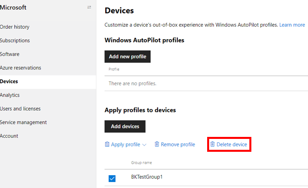
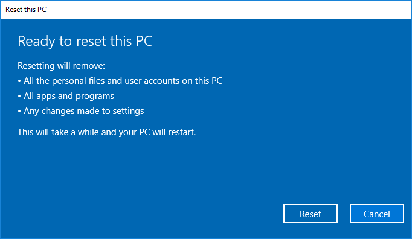
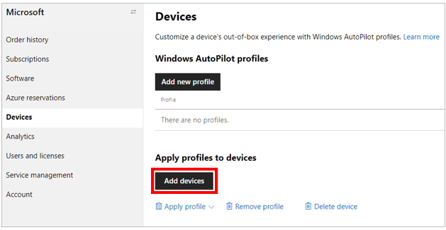
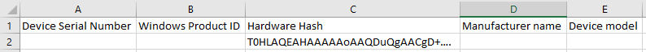

# Windows Autopilot motherboard replacement scenario guidance

**Applies to**

- Windows 10


This document offers guidance on how Microsoft partners should handle Motherboard Replacement (MBR) situations and other servicing scenarios with Autopilot devices.

This document only addresses the most common repair scenarios.  

Repairing Autopilot enrolled devices is complex, as it tries to balance OEM requirements with Windows Autopilot requirements.  Specifically, OEM’s require strict uniqueness across motherboards, MAC addresses, etc., while Windows Autopilot requires strict uniqueness at the Hardware ID level for each device (for successful registrations).  The Hardware ID does not always accommodate all the OEM hardware component requirements, thus these requirements are sometimes at odds, making some repair scenarios unsupportable currently.

## Motherboard Replacement (MBR) 

If a motherboard replacement is needed on an Autopilot device, use the following process if possible:

1. [Deregister the device](#deregister-the-autopilot-device-from-the-autopilot-program)
2. [Replace the motherboard](#replace-the-motherboard)
3. [Capture a new device ID (4K HH)](#capture-a-new-autopilot-device-id-4k-hh-from-the-device)
4. [Reregister the repaired device](#reregister-the-repaired-device-using-the-new-device-id)
5. [Return the repaired device](#return-the-repaired-device-to-the-customer)

### Deregister the Autopilot device from the Autopilot program

Only the entity that registered the device can deregister it.  Therefore, before the device arrives at the repair facility, it should be deregistered by whomever registered it, whether that’s the customer IT Admin, the OEM, or the CSP partner.  If the IT Admin registered the device, they likely did so via Intune (or the Microsoft Store for Business).  In that case, they should deregister the device from Intune (or MSfB).  This is necessary because devices registered in Intune will not show up in MPC.  However, if the OEM or CSP partner registered the device, they likely did so via MPC.  In that case, they should deregister the device from MPC (which will also remove it from the customer IT Admin’s Intune account).  Below, we describe the steps an IT Admin would go through to deregister a device from Intune, and the steps an OEM or CSP would go through to deregister a device from MPC.

NOTE:  Whenever possible, an OEM or CSP should register Autopilot devices (rather than having the customer do it).  This will avoid problems where OEMs or CSPs may not be able to deregister a device if, for example, a customer leasing a device goes out of business before deregistering it themselves.

EXCEPTION:  If a customer grants an OEM permission to register devices on their behalf via the automated consent process, then an OEM can use the API to deregister devices they didn’t register themselves (instead, the customer registered the devices).  But keep in mind that this would only remove those devices from the Autopilot program, it would not disenroll them from Intune or disjoin them from AAD.  The customer must do those steps (if desired) through Intune.

#### Deregister from Intune

To deregister an Autopilot device from Intune, an IT Admin would:

1. Log into their Intune account
2. Navigate to Intune > Groups > All groups
3. Remove desired device(s) from its group
4. Navigate to Intune > Devices > All devices
5. Select the checkbox next to the device(s) you want to delete, then click the Delete button along the top menu
6. Navigate to Intune > Devices > Azure AD devices
7. Select the checkbox next to the device(s) you want to delete, then click the Delete button along the top menu
8. Navigate to Intune > Device enrollment > Windows enrollment > Devices
9. Select the checkbox next to the device(s) you want to deregister
10. Click the extended menu icon (“…”) on the far right end of the line containing the device you want to deregister in order to expose an additional menu with the option to “unassign user”
11.	Click “Unassign user” if the device was previously assigned to a user; if not, this option will be grayed-out and can be ignored
12.	With the unassigned device still selected, click the Delete button along the top menu to remove this device

NOTE:  These steps deregister the device from Autopilot, but also unenroll the device from Intune, and disjoin the device from AAD.  While it may appear that only deregistering the device from Autopilot is needed, there are certain barriers in place within Intune that necessitate all the steps above be done, which is best practice anyway in case the device gets lost or becomes unrecoverable, to eliminate the possibility of orphaned devices existing in the Autopilot database, or Intune, or AAD.  If a device gets into an unrecoverable state, you can contact the appropriate [Microsoft support alias](autopilot-support.md) for assistance.

The deregistration process will take about 15 minutes.  You can accelerate the process by clicking the “Sync” button, then “Refresh” the display until the device(s) is no longer present.

More details on deregistering devices from Intune can be found [here](https://docs.microsoft.com/intune/enrollment-autopilot#create-an-autopilot-device-group).

#### Deregister from MPC

To deregister an Autopilot device from Microsoft Partner Center (MPC), a CSP would:

1. Log into MPC
2. Navigate to Customer > Devices
3. Select the device(s) to be deregistered and click the “Delete device” button



NOTE: Deregistering a device from Autopilot in MPC does only that; it does not also unenroll the device from the MDM (Intune), nor does it disjoin the device from AAD.  Therefore, if possible, the OEM/CSP ideally should work with the customer IT Admin to have the device(s) fully removed per the Intune steps in the previous section.

NOTE: Alternatively, an OEM partner that has integrated the OEM Direct APIs can deregister a device by calling the AutopilotDeviceRegistration API with the TenantID and TenantDomain fields left blank in the request call.  

NOTE: Because the repair facility will not have access to the user’s login credentials, the repair facility will have to reimage the device as part of the repair process.  This means that the customer should do three things before sending the device off for repair:
1. Copy all important data off the device.
2. Let the repair facility know which version of Windows they should reinstall after the repair.
3. If applicable, let the repair facility know which version of Office they should reinstall after the repair.

### Replace the motherboard

Technicians replace the motherboard (or other hardware) on the broken device.  A replacement DPK is injected.

Repair and key replacement processes vary between facilities.  Sometimes repair facilities receive motherboard spare parts from OEMs that have replacement DPKs already injected, but sometimes not.  Sometimes repair facilities receive fully-functional BIOS tools from OEMs, but sometimes not.  This means that the quality of the data in the BIOS after a MBR varies.  To ensure the repaired device will still be Autopilot-capable following its repair, the new (post-repair) BIOS should be able to successfully gather and populate  the following information at a minimum:

- DiskSerialNumber
- SmbiosSystemSerialNumber
- SmbiosSystemManufacturer
- SmbiosSystemProductName
- SmbiosUuid
- TPM EKPub
- MacAddress
- ProductKeyID
- OSType

NOTE:  For simplicity (and because processes vary between repair facilities), we have excluded many of the additional steps often used in a MBR, such as:
- Verify that the device is still functional
- Disable BitLocker*
- Repair the Boot Configuration Data (BCD)
- Repair/verify the network driver operation

*BitLocker need only be suspended, if the technician has the ability/access to resume it after the repair.

### Capture a new Autopilot device ID (4K HH) from the device

Repair technicians will have to log into the repaired device to capture the new device ID.  Assuming the repair technician does NOT have access to the customer’s login credentials, they will have to reimage the device in order to gain access, per the following steps:

1. Repair technician creates a [WinPE bootable USB drive](https://docs.microsoft.com/windows-hardware/manufacture/desktop/oem-deployment-of-windows-10-for-desktop-editions#create-a-bootable-windows-pe-winpe-partition)
2. Repair technician boot the device to WinPE
3. Repair technician [applies a new Windows image to the device](https://docs.microsoft.com/windows-hardware/manufacture/desktop/work-with-windows-images)

    NOTE:  Ideally, the same version of Windows should be reimaged onto the device that was originally on the device, so some coordination will be required between the repair facility and customer to capture this information at the time the device arrives for repair.  This might include the customer sending the repair facility a customized image (.ppk file) via a USB stick, for example.
 
4. Repair technician boots the device into the new Windows image
5. Once on the desktop, the repair technician captures the new device ID (4K HH) off the device using either the OA3 Tool or the PowerShell script, as described below

Those repair facilities with access to the OA3 Tool (which is part of the ADK) can use the tool to capture the 4K Hardware Hash (4K HH).

Alternatively, the [WindowsAutoPilotInfo Powershell script](https://www.powershellgallery.com/packages/Get-WindowsAutoPilotInfo) can be used to capture the 4K HH by following these steps:

1. Install the script from the [PowerShell Gallery](https://www.powershellgallery.com/packages/Get-WindowsAutoPilotInfo) or from the command line.
2. Navigate to the script and run it on the device when the device is either in Full OS or Audit Mode.

    ```powershell
    md c:\HWID
    Set-Location c:\HWID
    Set-ExecutionPolicy -Scope Process -ExecutionPolicy Unrestricted -Force
    Install-Script -Name Get-WindowsAutopilotInfo -Force
    $env:Path += ";C:\Program Files\WindowsPowerShell\Scripts"
    Get-WindowsAutopilotInfo.ps1 -OutputFile AutopilotHWID.csv
    ```

If you are prompted to install the NuGet package, choose **Yes**.

The script creates a csv file that contains the device information, including the complete 4K HH.  The service facility would then use this 4K HH to reregister device as described in the next step.

NOTE:  If the repair facility does not have the ability to run the OA3 tool or PowerShell script to capture the new 4K HH, then the CSP (or OEM) partners must do this for them.  Without some entity capturing the new 4K HH, there is no way to reregister this device as an Autopilot device.

Since the device was required to be in Full OS or Audit Mode to capture the 4K HH, the repair facility must reset the image back to a pre-OOBE state before returning it to the customer.  One way this can be accomplished is by using the built-in reset feature in Windows, as follows:

On the device, go to Settings > Update & Security > Recovery and click on Get started.  Under Reset this PC, select Remove everything and Just remove my files. Finally, click on Reset.



However, it’s likely the repair facility won’t have access to Windows because they lack the user credentials to login, in which case they need to use other means to reimage the device, such as the [Deployment Image Servicing and Management tool](https://docs.microsoft.com/windows-hardware/manufacture/desktop/oem-deployment-of-windows-10-for-desktop-editions#use-a-deployment-script-to-apply-your-image).
 
### Reregister the repaired device using the new device ID

If an OEM is not available to (or not willing to) reregister the device, then the repair facility or CSP should reregister the device using MPC, or the customer IT Admin should be advised to reregister the device via Intune (or MSfB).  Both ways of reregistering a device are shown below.

#### Reregister from Intune

To reregister an Autopilot device from Intune, an IT Admin would:
1. Log into Intune
2. Navigate to Device enrollment > Windows enrollment > Devices > Import
3. Click the “import” button to upload a csv file containing the device ID of the device to be reregistered (the device ID was the 4K HH captured by the PowerShell script or OA3 tool described previously in this document).

The following video provides a good overview of how to (re)register devices via MSfB.

<iframe width="560" height="315" src="https://www.youtube.com/watch?v=IpLIZU_j7Z0" frameborder="0" allow="accelerometer; autoplay; encrypted-media; gyroscope; picture-in-picture" allowfullscreen></iframe>

#### Reregister from MPC

To reregister an Autopilot device from MPC, an OEM or CSP would:

1. Log into MPC
2. Navigate to the Customer > Devices page and click the “Add devices” button to upload the csv file.

<br>


In the case of reregistering a repaired device through MPC, the uploaded csv file must contain the 4K HH for the device, and not just the PKID or Tuple (SerialNumber + OEMName + ModelName).  If only the PKID or Tuple were used, the Autopilot service would be unable to find a match in the Autopilot database, since no 4K HH info was ever previously submitted for this essentially “new” device, and the upload will fail, likely returning a ZtdDeviceNotFound error.  So, again, only upload the 4K HH, not the Tuple or PKID.

NOTE:  When including the 4K HH in the csv file, you do NOT also need to include the PKID or Tuple.  Those columns may be left blank, as shown below:



### Return the repaired device to the customer

After completing the above steps, the repaired device can now be returned to the customer, and will be auto-enrolled into the Autopilot program on first boot-up during OOBE.

NOTE:  If the repair facility did NOT reimage the device, they could be sending it back in a potentially broken state (e.g., there’s no way to log into the device because it’s been dissociated from the only known user account), in which case they should tell the organization that they need to fix the registration and OS themselves.

NOTE:  A device can be “registered” for Autopilot prior to being powered-on, but the device isn’t actually “deployed” to Autopilot (i.e., enabled as an Autopilot device) until it goes through OOBE, which is why resetting the device back to a pre-OOBE state is a required step.

## Specific repair scenarios

This section covers the most common repair scenarios, and their impact on Autopilot enablement.

NOTES ON TEST RESULTS:

- Scenarios below were tested using Intune only (no other MDMs were tested).
- In most test scenarios below, the repaired and reregistered device needed to go through OOBE again for Autopilot to be enabled.
- Motherboard replacement scenarios often result in lost data, so repair centers or customers should be reminded to backup data (if possible) prior to repair.
- In the cases where a repair facility does not have the ability to write device info into the BIOS of the repaired device, new processes need to be created to successfully enable Autopilot.
- Repaired device should have the Product Key (DPK) preinjected in the BIOS before capturing the new 4K HH (device ID)

<table>
<th><td>Scenario<td>Not supported for Autopilot (Y/N)?<br>Yes = device will be reenabled for Autopilot successfully<br>No = after repair, device will NOT be enabled for Autopilot<td>Microsoft Recommendation
<tr><td>Motherboard Replacement (MBR) in general<td>Yes<td>The recommended course of action for MBR scenarios is:

1. Autopilot device is deregistered from the Autopilot program
2. The motherboard is replace
3. The device is reimaged (with BIOS info and DPK reinjected)*
4. A new Autopilot device ID (4K HH) is captured off the device
5. The repaired device is reregistered for the Autopilot program using the new device ID
6. The repaired device is reset to boot to OOBE
7. The repaired device is shipped back to the customer

*It’s not necessary to reimage the device if the repair technician has access to the customer’s login credentials.  It’s technically possible to do a successful MBR and Autopilot re-enablement without keys or certain BIOS info (e.g., serial #, model name, etc.), but doing so is only recommended for testing/educational purposes.

<tr><td>MBR when motherboard has a TPM chip (enabled) and only one onboard network card (that also gets replaced)<td>Yes<td>

1. Deregister damaged device
2. Replace motherboard
3. Reimage device (to gain access), unless have access to customers’ login credentials
4. Write device info into BIOS
5. Capture new 4K HH
6. Reregister repaired device
7. Reset device back to OOBE
8. Go through Autopilot OOBE (customer)
9. Autopilot successfully enabled

<tr><td>MBR when motherboard has a TPM chip (enabled) and a second network card (or network interface) that is not replaced along with the motherboard<td>No<td>This scenario is not recommended, as it breaks the Autopilot experience, because the resulting Device ID will not be stable until after TPM attestation has completed, and even then registration may give incorrect results because of ambiguity with MAC Address resolution.
<tr><td>MBR where the NIC card, HDD, and WLAN all remain the same after the repair<td>Yes<td>

1. Deregister damaged device
2. Replace motherboard (with new RDPK preinjected in BIOS)
3. Reimage device (to gain access), unless have access to customers’ login credentials
4. Write old device info into BIOS (same s/n, model, etc.)*
5. Capture new 4K HH
6. Reregister repaired device
7. Reset device back to OOBE
8. Go through Autopilot OOBE (customer)
9. Autopilot successfully enabled

*Note that for this and subsequent scenarios, rewriting old device info would not include the TPM 2.0 endorsement key, as the associated private key is locked to the TPM device

<tr><td>MBR where the NIC card remains the same, but the HDD and WLAN are replaced<td>Yes<td>

1. Deregister damaged device
2. Replace motherboard (with new RDPK preinjected in BIOS)
3. Insert new HDD and WLAN
4. Write old device info into BIOS (same s/n, model, etc.)
5. Capture new 4K HH
6. Reregister repaired device
7. Reset device back to OOBE
8. Go through Autopilot OOBE (customer)
9. Autopilot successfully enabled

<tr><td>MBR where the NIC card and WLAN remains the same, but the HDD is replaced<td>Yes<td>

1. Deregister damaged device
2. Replace motherboard (with new RDPK preinjected in BIOS)
3. Insert new HDD
4. Write old device info into BIOS (same s/n, model, etc.)
5. Capture new 4K HH
6. Reregister repaired device
7. Reset device back to OOBE
8. Go through Autopilot OOBE (customer)
9. Autopilot successfully enabled

<tr><td>MBR where only the MB is replaced (all other parts remain same) but new MB was taken from a previously used device that had NOT been Autopilot-enabled before.<td>Yes<td>

1. Deregister damaged device
2. Replace motherboard (with new RDPK preinjected in BIOS)
3. Reimage device (to gain access), unless have access to customers’ login credentials
4. Write old device info into BIOS (same s/n, model, etc.)
5. Capture new 4K HH
6. Reregister repaired device
7. Reset device back to OOBE
8. Go through Autopilot OOBE (customer)
9. Autopilot successfully enabled

<tr><td>MBR where only the MB is replaced (all other parts remain same) but new MB was taken from a previously used device that HAD been Autopilot-enabled before.<td>Yes<td>

1. Deregister old device from which MB will be taken
2. Deregister damaged device (that you want to repair)
3. Replace motherboard in repair device with MB from other Autopilot device (with new RDPK preinjected in BIOS)
4. Reimage device (to gain access), unless have access to customers’ login credentials
5. Write old device info into BIOS (same s/n, model, etc.)
6. Capture new 4K HH
7. Reregister repaired device
8. Reset device back to OOBE
9. Go through Autopilot OOBE (customer)
10. Autopilot successfully enabled

NOTE:  The repaired device can also be used successfully as a normal, non-Autopilot device.

<tr><td>BIOS info excluded from MBR device<td>No<td>Repair facility does not have BIOS tool to write device info into BIOS after MBR.

1. Deregister damaged device
2. Replace motherboard (BIOS does NOT contain device info)
3. Reimage and write DPK into image
4. Capture new 4K HH
5. Reregister repaired device
6. Create Autopilot profile for device
7. Go through Autopilot OOBE (customer)
8. Autopilot FAILS to recognize repaired device

<tr><td>MBR when there is no TPM chip<td>Yes<td>Though we do not recommend enabling an Autopilot devices without a TPM chip (which is recommended for BitLocker encryption), it is possible to enable an Autopilot devices in “standard user” mode (but NOT Self-deploying mode) that does not have a TPM chip.  In this case, you would:

1. Deregister damaged device
2. Replace motherboard
3. Reimage device (to gain access), unless have access to customers’ login credentials
4. Write old device info into BIOS (same s/n, model, etc.)
5. Capture new 4K HH
6. Reregister repaired device
7. Reset device back to OOBE
8. Go through Autopilot OOBE (customer)
9. Autopilot successfully enabled

<tr><td>New DPK written into image on repaired Autopilot device with a new MB<td>Yes<td>Repair facility replaces normal MB on damaged device.  MB does not contain any DPK in the BIOS.  Repair facility writes DPK into image after MBR.  

1. Deregister damaged device
2. Replace motherboard – BIOS does NOT contain DPK info
3. Reimage device (to gain access), unless have access to customers’ login credentials
4. Write device info into BIOS (same s/n, model, etc.)
5. Capture new 4K HH
6. Reset or reimage device to pre-OOBE and write DPK into image
7. Reregister repaired device
8. Go through Autopilot OOBE
9. Autopilot successfully enabled

<tr><td>New Repair Product Key (RDPK)<td>Yes<td>Using a MB with a new RDPK preinjected results in a successful Autopilot refurbishment scenario. 

1. Deregister damaged device
2. Replace motherboard (with new RDPK preinjected in BIOS)
3. Reimage or rest image to pre-OOBE
4. Write device info into BIOS 
5. Capture new 4K HH
6. Reregister repaired device
7. Reimage or reset image to pre-OOBE
8. Go through Autopilot OOBE
9. Autopilot successfully enabled

<tr><td>No Repair Product Key (RDPK) injected<td>No<td>This scenario violates Microsoft policy and breaks the Windows Autopilot experience.
<tr><td>Reimage damaged Autopilot device that was not deregistered prior to repair<td>Yes, but the device will still be associated with previous tenant ID, so should only be returned to same customer<td>

1. Reimage damaged device
2. Write DPK into image
3. Go through Autopilot OOBE
4. Autopilot successfully enabled (to previous tenant ID)

<tr><td>Disk replacement from a non-Autopilot device to an Autopilot device<td>Yes<td>

1. Do not deregister damaged device prior to repair
2. Replace HDD on damaged device
3. Reimage or reset image back to OOBE
4. Go through Autopilot OOBE (customer)
5. Autopilot successfully enabled (repaired device recognized as its previous self)

<tr><td>Disk replacement from one Autopilot device to another Autopilot device<td>Maybe<td>If the device from which the HDD is taken was itself previously deregistered from Autopilot, then that HDD can be used in a repair device.  But if the HDD was never previously deregistered from Autopilot before being used in a repaired device, the newly repaired device will not have the proper Autopilot experience.

Assuming the used HDD was previously deregistered (before being used in this repair):

1. Deregister damaged device
2. Replace HDD on damaged device using a HDD from another deregistered Autopilot device
3. Reimage or rest the repaired device back to a pre-OOBE state
4. Go through Autopilot OOBE (customer)
5. Autopilot successfully enabled

<tr><td>Third party network card replacement <td>No<td>Whether from a non-Autopilot device to an Autopilot device, from one Autopilot device to another Autopilot device, or from an Autopilot device to a non-Autopilot device, any scenario where a 3rd party (not onboard) Network card is replaced will break the Autopilot experience, and is not recommended.
<tr><td>A device repaired more than 3 times<td>No<td>Autopilot is not supported when a device is repeatedly repaired, so that whatever parts NOT replaced become associated with too many parts that have been replaced, which would make it difficult to uniquely identify that device in the future.
<tr><td>Memory replacement<td>Yes<td>Replacing the memory on a damaged device does not negatively affect the Autopilot experience on that device.  No de/reregistration is needed.  The repair technician simply needs to replace the memory.
<tr><td>GPU replacement<td>Yes<td>Replacing the GPU(s) on a damaged device does not negatively affect the Autopilot experience on that device.  No de/reregistration is needed.  The repair technician simply needs to replace the GPU.
</table>

NOTE:  When scavenging parts from another Autopilot device, we recommend unregistering the scavenged device from Autopilot, scavenging it, and then NEVER REGISTERING THE SCAVENGED DEVICE (AGAIN) FOR AUTOPILOT, because reusing parts this way may cause two active devices to end up with the same ID, with no possibility of distinguishing between the two.

NOTE:  The following parts may be replaced without compromising Autopilot enablement or requiring special additional repair steps:
- Memory (RAM or ROM)
- Power Supply
- Video Card
- Card Reader
- Sound card
- Expansion card
- Microphone
- Webcam
- Fan
- Heat sink
- CMOS battery

NOTE:  Other repair scenarios not yet tested and verified include:
- Daughterboard replacement
- CPU replacement
- Wifi replacement
- Ethernet replacement

## FAQ

| Question | Answer |
| --- | --- |
| If we have a tool that programs product information into the BIOS after the MBR, do we still need to submit a CBR report for the device to be Autopilot-capable? | No.  Not if the in-house tool writes the minimum necessary information into the BIOS that the Autopilot program looks for to identify the device, as described earlier in this document. |
| What if only some components are replaced rather than the full motherboard? | While it’s true that some limited repairs do not prevent the Autopilot algorithm from successfully matching the post-repair device with the pre-repair device, it is best to ensure 100% success by going through the MBR steps above even for devices that only needed limited repairs. |
| How does a repair technician gain access to a broken device if they don’t have the customer’s login credentials? | The technician will have to reimage the device and use their own credentials during the repair process. |

## Related topics

[Device guidelines](autopilot-device-guidelines.md)<br>
