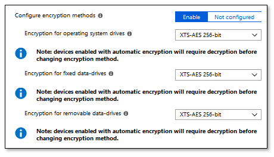

# Setting the BitLocker encryption algorithm for Autopilot devices

With Windows Autopilot, you can configure the BitLocker encryption settings to be applied before automatic encryption is started. This ensures that the default encrytion algorithm is not applied automatically when this is not the desired setting. Other BitLocker policies that must be applied prior to encryption can also be delivered before automatic BitLocker encryption begins. 

The BitLocker encryption algorithm is used when BitLocker is first enabled, and sets the strength to which full volume encryption should occur. Available encryption algorithms are: AES-CBC 128-bit, AES-CBC 256-bit, XTS-AES 128-bit or XTS-AES 256-bit encryption. The default value is XTS-AES 128-bit encryption. See [BitLocker CSP](https://docs.microsoft.com/en-us/windows/client-management/mdm/bitlocker-csp) for information about the recommended encryption algorithms to use.

To ensure the desired BitLocker encryption algorithm is set before automatic encryption occurs for Autopilot devices:

1. Configure the [encryption method settings](https://docs.microsoft.com/intune/endpoint-protection-windows-10#windows-encryption) in the Windows 10 Endpoint Protection profile to the desired encryption algorithm. 
2. [Assign the policy](https://docs.microsoft.com/intune/device-profile-assign) to your Autopilot device group. 
    - **IMPORTANT**: The encryption policy must be assigned to **devices** in the group, not users.
3. Enable the Autopilot [Enrollment Status Page](https://docs.microsoft.com/windows/deployment/windows-autopilot/enrollment-status) (ESP) for these devices. 
    - **IMPORTANT**: If the ESP is not enabled, the policy will not apply before encryption starts.

An example of Microsoft Intune Windows Encryption settings is shown below.

   

Note that a device which is encrypted automatically will need to be decrypted prior to changing the encyption algorithm.

The settings are available under Device Configuration -> Profiles -> Create profile -> Platform = Windows 10 and later, Profile type = Endpoint protection -> Configure -> Windows Encryption -> BitLocker base settings, Configure encryption methods = Enable.

Note: It is also recommended to set Windows Encryption -> Windows Settings -> Encrypt = **Require**.

## Requirements

Windows 10, version 1809 or later.

## See also

[Bitlocker overview](https://docs.microsoft.com/en-us/windows/security/information-protection/bitlocker/bitlocker-overview)
