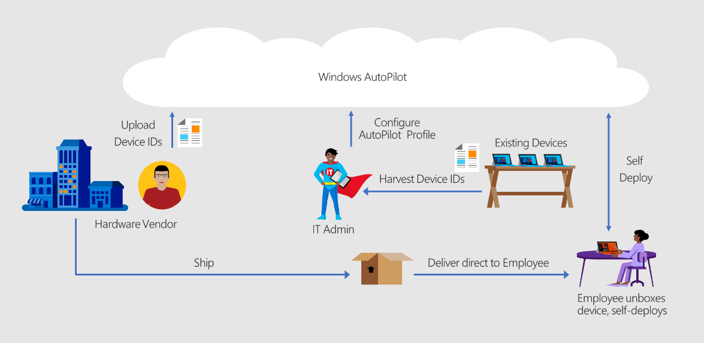

# Configure Autopilot deployment

**Applies to**

-   Windows 10

## Configuring Autopilot to deploy new devices

When deploying new devices using Windows Autopilot, the following steps are required:

1.  [Register devices](add-devices.md). Ideally, this step would be performed by the OEM, reseller, or distributor from which the devices were purchased, but this can also be done by the organization by collecting the hardware identity and uploading it manually.
2.  [Configure device profiles](profiles.md), specifying how the device should be deployed and what user experience should be presented.
3.  Boot the device. When the device is connected to a network with internet access, it will contact the Windows Autopilot deployment service to see if the device is registered, and if it is, it will download profile settings such as the [Enrollment Status page](enrollment-status.md), which are used to customize the end user experience.

## Other configuration settings

- [Bitlocker encryption settings](bitlocker.md): You can configure the BitLocker encryption settings to be applied before automatic encryption is started.
- [Cortana voiceover and speech recognition](windows-autopilot-scenarios.md): In Windows 10, version 1903 and later Cortana voiceover and speech recognition during OOBE is DISABLED by default for all Windows 10 Pro, Education and Enterprise SKUs.

## Related topics

[Windows Autopilot scenarios](windows-autopilot-scenarios.md)
