# Demonstrate Autopilot deployment

**Applies to**

-   Windows 10

To get started with Windows Autopilot, you should try it out with a virtual machine (VM) or you can use a physical device that will be wiped and then have a fresh install of Windows 10.

In this topic you'll learn how to set-up a Windows Autopilot deployment for a VM using Hyper-V. Note: Although there are [multiple platforms](administer.md) available to enable Autopilot, this lab primarily uses Intune.

>Hyper-V and a VM are not required for this lab. You can also use a physical device. However, the instructions assume that you are using a VM. To use a physical device, skip the instructions to install Hyper-V and create a VM. All references to 'device' in the guide refer to the client device, either physical or virtual.

The following video provides an overview of the process:

</br>
<iframe width="560" height="315" src="https://www.youtube-nocookie.com/embed/KYVptkpsOqs" frameborder="0" allow="autoplay; encrypted-media" allowfullscreen></iframe> 

>For a list of terms used in this guide, see the [Glossary](#glossary) section.

## Prerequisites

These are the things you'll need to complete this lab:
<table><tr><td>Windows 10 installation media</td><td>Windows 10 Professional or Enterprise (ISO file), version 1703 or later is required. If you do not already have an ISO to use, a link is provided to download an <a href="https://www.microsoft.com/evalcenter/evaluate-windows-10-enterprise" data-raw-source="[evaluation version of Windows 10 Enterprise](https://www.microsoft.com/evalcenter/evaluate-windows-10-enterprise)">evaluation version of Windows 10 Enterprise</a>.</td></tr>
<tr><td>Internet access</td><td>If you are behind a firewall, see the detailed <a href="windows-autopilot-requirements-network.md" data-raw-source="[networking requirements](windows-autopilot-requirements-network.md)">networking requirements</a>. Otherwise, just ensure that you have a connection to the Internet.</td></tr>
<tr><td>Hyper-V or a physical device running Windows 10</td><td>The guide assumes that you will use a Hyper-V VM, and provides instructions to install and configure Hyper-V if needed. To use a physical device, skip the steps to install and configure Hyper-V.</td></tr>
<tr><td>A Premium Intune account</td><td>This guide will describe how to obtain a free 30-day trial premium account that can be used to complete the lab.</td></tr></table>

## Procedures

A summary of the sections and procedures in the lab is provided below. Follow each section in the order it is presented, skipping the sections that do not apply to you. Optional procedures are provided in the appendix.

[Verify support for Hyper-V](#verify-support-for-hyper-v)
<br>[Enable Hyper-V](#enable-hyper-v)
<br>[Create a demo VM](#create-a-demo-vm)
<br>&nbsp;&nbsp;&nbsp; [Set ISO file location](#set-iso-file-location)
<br>&nbsp;&nbsp;&nbsp; [Determine network adapter name](#determine-network-adapter-name)
<br>&nbsp;&nbsp;&nbsp;  [Use Windows PowerShell to create the demo VM](#use-windows-powershell-to-create-the-demo-vm)
<br>&nbsp;&nbsp;&nbsp; [Install Windows 10](#install-windows-10)
<br>[Capture the hardware ID](#capture-the-hardware-id)
<br>[Reset the VM back to Out-Of-Box-Experience (OOBE)](#reset-the-vm-back-to-out-of-box-experience-oobe)
<br>[Verify subscription level](#verify-subscription-level)
<br>[Configure company branding](#configure-company-branding)
<br>[Configure Microsoft Intune auto-enrollment](#configure-microsoft-intune-auto-enrollment)
<br>[Register your VM](#register-your-vm)
<br>&nbsp;&nbsp;&nbsp; [Autopilot registration using Intune](#autopilot-registration-using-intune)
<br>&nbsp;&nbsp;&nbsp; [Autopilot registration using MSfB](#autopilot-registration-using-msfb)
<br>[Create and assign a Windows Autopilot deployment profile](#create-and-assign-a-windows-autopilot-deployment-profile)
<br>&nbsp;&nbsp;&nbsp; [Create a Windows Autopilot deployment profile using Intune](#create-a-windows-autopilot-deployment-profile-using-intune)
<br>&nbsp;&nbsp;&nbsp;&nbsp;&nbsp;&nbsp; [Assign the profile](#assign-the-profile)
<br>&nbsp;&nbsp;&nbsp; [Create a Windows Autopilot deployment profile using MSfB](#create-a-windows-autopilot-deployment-profile-using-msfb)
<br>[See Windows Autopilot in action](#see-windows-autopilot-in-action)
<br>[Remove devices from Autopilot](#remove-devices-from-autopilot)
<br>&nbsp;&nbsp;&nbsp; [Delete (deregister) Autopilot device](#delete-deregister-autopilot-device)
<br>[Appendix A: Verify support for Hyper-V](#appendix-a-verify-support-for-hyper-v)
<br>[Appendix B: Adding apps to your profile](#appendix-b-adding-apps-to-your-profile)
<br>&nbsp;&nbsp;&nbsp; [Add a Win32 app](#add-a-win32-app)
<br>&nbsp;&nbsp;&nbsp;&nbsp;&nbsp;&nbsp; [Prepare the app for Intune](#prepare-the-app-for-intune)
<br>&nbsp;&nbsp;&nbsp;&nbsp;&nbsp;&nbsp; [Create app in Intune](#create-app-in-intune)
<br>&nbsp;&nbsp;&nbsp;&nbsp;&nbsp;&nbsp; [Assign the app to your Intune profile](#assign-the-app-to-your-intune-profile)
<br>&nbsp;&nbsp;&nbsp; [Add Office 365](#add-office-365)
<br>&nbsp;&nbsp;&nbsp;&nbsp;&nbsp;&nbsp; [Create app in Intune](#create-app-in-intune)
<br>&nbsp;&nbsp;&nbsp;&nbsp;&nbsp;&nbsp; [Assign the app to your Intune profile](#assign-the-app-to-your-intune-profile)
<br>[Glossary](#glossary)

## Verify support for Hyper-V

If you don't already have Hyper-V, we must first enable this on a computer running Windows 10 or Windows Server (2012 R2 or later). 

>If you already have Hyper-V enabled, skip to the [create a demo VM](#create-a-demo-vm) step. If you are using a physical device instead of a VM, skip to [Install Windows 10](#install-windows-10).

If you are not sure that your device supports Hyper-V, or you have problems installing Hyper-V, see [appendix A](#appendix-a-verify-support-for-hyper-v) below for details on verifying that Hyper-V can be successfully installed.

## Enable Hyper-V

To enable Hyper-V, open an elevated Windows PowerShell prompt and run the following command:

```powershell
Enable-WindowsOptionalFeature -Online -FeatureName Microsoft-Hyper-V -All
```

This command works on all operating systems that support Hyper-V, but on Windows Server operating systems you must type an additional command (below) to add the Hyper-V Windows PowerShell module and the Hyper-V Manager console. The following command will also install Hyper-V if it isn't already installed, so if you're using Windows Server, you can just type the following command instead of using the Enable-WindowsOptionalFeature command:

```powershell
Install-WindowsFeature -Name Hyper-V -IncludeManagementTools
```

When you are prompted to restart the computer, choose **Yes**. The computer might restart more than once. 

>Alternatively, you can install Hyper-V using the Control Panel in Windows under **Turn Windows features on or off** for a client operating system, or using Server Manager's **Add Roles and Features Wizard** on a server operating system, as shown below:

   

   

<P>If you choose to install Hyper-V using Server Manager, accept all default selections. Also be sure to install both items under <strong>Role Administration Tools\Hyper-V Management Tools</strong>.

After installation is complete, open Hyper-V Manager by typing **virtmgmt.msc** at an elevated command prompt, or by typing **Hyper-V** in the Start menu search box.

To read more about Hyper-V, see [Introduction to Hyper-V on Windows 10](https://docs.microsoft.com/virtualization/hyper-v-on-windows/about/) and [Hyper-V on Windows Server](https://docs.microsoft.com/windows-server/virtualization/hyper-v/hyper-v-on-windows-server).

## Create a demo VM

Now that Hyper-V is enabled, we need to create a VM running Windows 10. We can [create a VM](https://docs.microsoft.com/virtualization/hyper-v-on-windows/quick-start/create-virtual-machine) and [virtual network](https://docs.microsoft.com/virtualization/hyper-v-on-windows/quick-start/connect-to-network) using Hyper-V Manager, but it is simpler to use Windows PowerShell. 

To use Windows Powershell we just need to know two things:

1. The location of the Windows 10 ISO file.
   - In the example, we assume the location is **c:\iso\win10-eval.iso**. 
2. The name of the network interface that connects to the Internet.
   - In the example, we use a Windows PowerShell command to determine this automatically. 

After we have set the ISO file location and determined the name of the appropriate network interface, we can install Windows 10.

### Set ISO file location

You can download an ISO file for an evaluation version of the latest release of Windows 10 Enterprise [here](https://www.microsoft.com/evalcenter/evaluate-windows-10-enterprise). 
- When asked to select a platform, choose **64 bit**. 

After you download this file, the name will be extremely long (ex: 17763.107.101029-1455.rs5_release_svc_refresh_CLIENTENTERPRISEEVAL_OEMRET_x64FRE_en-us.iso). 

1. So that it is easier to type and remember, rename the file to **win10-eval.iso**. 
2. Create a directory on your computer named **c:\iso** and move the **win10-eval.iso** file there, so the path to the file is **c:\iso\win10-eval.iso**.
3. If you wish to use a different name and location for the file, you must modify the Windows PowerShell commands below to use your custom name and directory.

### Determine network adapter name

The Get-NetAdaper cmdlet is used below to automatically find the network adapter that is most likely to be the one you use to connect to the Internet. You should test this command first by running the following at an elevated Windows PowerShell prompt:

```powershell
(Get-NetAdapter |?{$_.Status -eq "Up" -and !$_.Virtual}).Name
```

The output of this command should be the name of the network interface you use to connect to the Internet. Verify that this is the correct interface name. If it is not the correct interface name, you'll need to edit the first command below to use your network interface name. 

For example, if the command above displays Ethernet but you wish to use Ethernet2, then the first command below would be New-VMSwitch -Name AutopilotExternal -AllowManagementOS $true -NetAdapterName **Ethernet2**.

### Use Windows PowerShell to create the demo VM 

All VM data will be created under the current path in your PowerShell prompt. Consider navigating into a new folder before running the following commands.

>[!IMPORTANT]
>**VM switch**: a VM switch is how Hyper-V connects VMs to a network. <br><br>If you have previously enabled Hyper-V and your Internet-connected network interface is already bound to a VM switch, then the PowerShell commands below will fail. In this case, you can either delete the existing VM switch (so that the commands below can create one), or you can reuse this VM switch by skipping the first command below and either modifying the second command to replace the switch name **AutopilotExternal** with the name of your switch, or by renaming your existing switch to "AutopilotExternal."<br><br>If you have never created an external VM switch before, then just run the commands below.

```powershell
New-VMSwitch -Name AutopilotExternal -AllowManagementOS $true -NetAdapterName (Get-NetAdapter |?{$_.Status -eq "Up" -and !$_.Virtual}).Name 
New-VM -Name WindowsAutopilot -MemoryStartupBytes 2GB -BootDevice VHD -NewVHDPath .\VMs\WindowsAutopilot.vhdx -Path .\VMData -NewVHDSizeBytes 80GB -Generation 2 -Switch AutopilotExternal
Add-VMDvdDrive -Path c:\iso\win10-eval.iso -VMName WindowsAutopilot
Start-VM -VMName WindowsAutopilot
```

After entering these commands, connect to the VM that you just created and wait for a prompt to press a key and boot from the DVD.  You can connect to the VM by double-clicking it in Hyper-V Manager.

See the sample output below. In this sample, the VM is created under the **c:\autopilot** directory and the vmconnect.exe command is used (which is only available on Windows Server). If you installed Hyper-V on Windows 10, use Hyper-V Manager to connect to your VM.

<pre style="overflow-y: visible">
PS C:\autopilot&gt; dir c:\iso


    Directory: C:\iso


Mode                LastWriteTime         Length Name
----                -------------         ------ ----
-a----        3/12/2019   2:46 PM     4627343360 win10-eval.iso

PS C:\autopilot&gt; (Get-NetAdapter |?{$<em>.Status -eq &quot;Up&quot; -and !$</em>.Virtual}).Name
Ethernet
PS C:\autopilot&gt; New-VMSwitch -Name AutopilotExternal -AllowManagementOS $true -NetAdapterName (Get-NetAdapter |?{$<em>.Status -eq &quot;Up&quot; -and !$</em>.Virtual}).Name

Name              SwitchType NetAdapterInterfaceDescription
----              ---------- ------------------------------
AutopilotExternal External   Intel(R) Ethernet Connection (2) I218-LM

PS C:\autopilot&gt; New-VM -Name WindowsAutopilot -MemoryStartupBytes 2GB -BootDevice VHD -NewVHDPath .\VMs\WindowsAutopilot.vhdx -Path .\VMData -NewVHDSizeBytes 80GB -Generation 2 -Switch AutopilotExternal

Name             State CPUUsage(%) MemoryAssigned(M) Uptime   Status             Version
----             ----- ----------- ----------------- ------   ------             -------
WindowsAutopilot Off   0           0                 00:00:00 Operating normally 8.0

PS C:\autopilot&gt; Add-VMDvdDrive -Path c:\iso\win10-eval.iso -VMName WindowsAutopilot
PS C:\autopilot&gt; Start-VM -VMName WindowsAutopilot
PS C:\autopilot&gt; vmconnect.exe localhost WindowsAutopilot
PS C:\autopilot&gt; dir

    Directory: C:\autopilot

Mode                LastWriteTime         Length Name
----                -------------         ------ ----
d-----        3/12/2019   3:15 PM                VMData
d-----        3/12/2019   3:42 PM                VMs

PS C:\autopilot&gt;
</pre>

### Install Windows 10

Ensure the VM booted from the installation ISO, click **Next** then click **Install now** and complete the Windows installation process. See the following examples:

   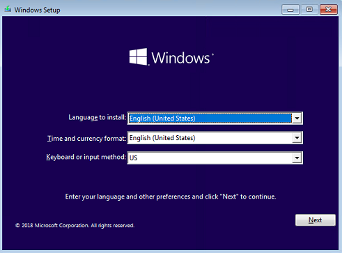
   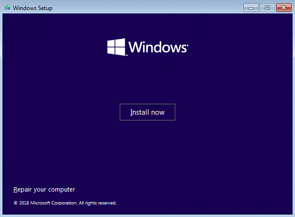
   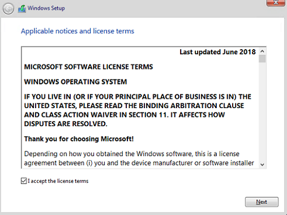
   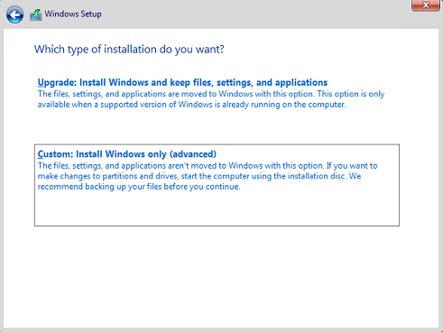
   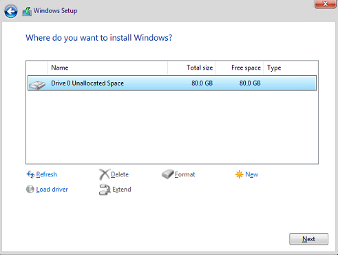
   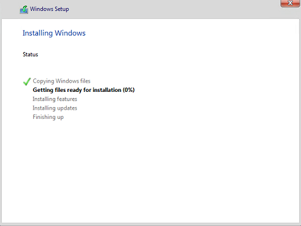

>After the VM restarts, during OOBE, it’s fine to select **Set up for personal use** or **Domain join instead** and then choose an offline account on the **Sign in** screen.  This will offer the fastest way to the desktop. For example:

   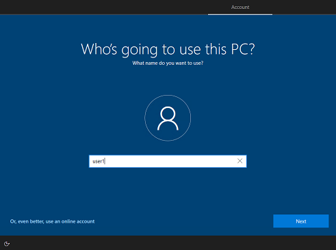 

Once the installation is complete, sign in and verify that you are at the Windows 10 desktop, then create your first Hyper-V checkpoint. Checkpoints are used to restore the VM to a previous state. You will create multiple checkpoints throughout this lab, which can be used later to go through the process again.

   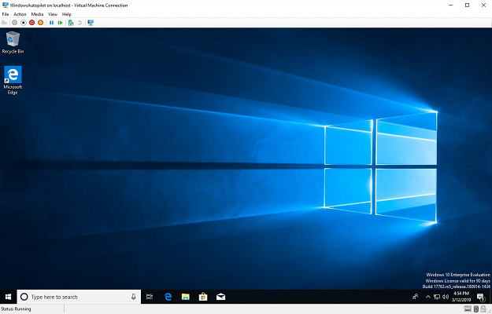 

To create your first checkpoint, open an elevated Windows PowerShell prompt on the computer running Hyper-V (not on the VM) and run the following:

```powershell
Checkpoint-VM -Name WindowsAutopilot -SnapshotName "Finished Windows install"
```

Click on the **WindowsAutopilot** VM in Hyper-V Manager and verify that you see **Finished Windows Install** listed in the Checkpoints pane.

## Capture the hardware ID

>NOTE: Normally, the Device ID is captured by the OEM as they run the OA3 Tool on each device in the factory.  The OEM then submits the 4K HH created by the OA3 Tool to Microsoft by submitting it with a Computer Build Report (CBR).  For purposes of this lab, you are acting as the OEM (capturing the 4K HH), but you’re not going to use the OA3 Tool to capture the full 4K HH for various reasons (you’d have to install the OA3 tool, your device couldn’t have a volume license version of Windows, it’s a more complicated process than using a PS script, etc.).  Instead, you’ll simulate running the OA3 tool by running a PowerShell script, which captures the device 4K HH just like the OA3 tool.

Follow these steps to run the PS script:

1. Open an elevated Windows PowerShell prompt and run the following commands. These commands are the same regardless of whether you are using a VM or a physical device:

    ```powershell
    md c:\HWID
    Set-Location c:\HWID
    Set-ExecutionPolicy -Scope Process -ExecutionPolicy Unrestricted -Force
    Install-Script -Name Get-WindowsAutopilotInfo -Force
    $env:Path += ";C:\Program Files\WindowsPowerShell\Scripts"
    Get-WindowsAutopilotInfo.ps1 -OutputFile AutopilotHWID.csv
    ```

When you are prompted to install the NuGet package, choose **Yes**.

See the sample output below.

<pre>
PS C:\> md c:\HWID

    Directory: C:\

Mode                LastWriteTime         Length Name
----                -------------         ------ ----
d-----        3/14/2019  11:33 AM                HWID

PS C:\> Set-Location c:\HWID
PS C:\HWID> Set-ExecutionPolicy -Scope Process -ExecutionPolicy Unrestricted -Force
PS C:\HWID> Install-Script -Name Get-WindowsAutopilotInfo -Force

NuGet provider is required to continue
PowerShellGet requires NuGet provider version '2.8.5.201' or newer to interact with NuGet-based repositories. The NuGet
 provider must be available in 'C:\Program Files\PackageManagement\ProviderAssemblies' or
'C:\Users\user1\AppData\Local\PackageManagement\ProviderAssemblies'. You can also install the NuGet provider by running
 'Install-PackageProvider -Name NuGet -MinimumVersion 2.8.5.201 -Force'. Do you want PowerShellGet to install and
import the NuGet provider now?
[Y] Yes  [N] No  [S] Suspend  [?] Help (default is "Y"): Y
PS C:\HWID> $env:Path += ";C:\Program Files\WindowsPowerShell\Scripts"
PS C:\HWID> Get-WindowsAutopilotInfo.ps1 -OutputFile AutopilotHWID.csv
PS C:\HWID> dir

    Directory: C:\HWID

Mode                LastWriteTime         Length Name
----                -------------         ------ ----
-a----        3/14/2019  11:33 AM           8184 AutopilotHWID.csv

PS C:\HWID>
</pre>

Verify that there is an **AutopilotHWID.csv** file in the **c:\HWID** directory that is about 8 KB in size.  This file contains the complete 4K HH.  

**Note**: Although the .csv extension might be associated with Microsoft Excel, you cannot view the file properly by double-clicking it. To correctly parse the comma delimiters and view the file in Excel, you must use the **Data** > **From Text/CSV** function in Excel to import the appropriate data columns. You don't need to view the file in Excel unless you are curious. The file format will be validated when it is imported into Autopilot. An example of the data in this file is shown below.


You will need to upload this data into Intune to register your device for Autopilot, so it needs to be transferred to the computer you will use to access the Azure portal.  If you are using a physical device instead of a VM, you can copy the file to a USB stick.  If you’re using a VM, you can right-click the AutopilotHWID.csv file and copy it, then right-click and paste the file to your desktop (outside the VM). 

If you have trouble copying and pasting the file, just view the contents in Notepad on the VM and copy the text into Notepad outside the VM. Do not use another text editor to do this.

>[!NOTE]
>When copying and pasting to or from VMs, avoid clicking other things with your mouse cursor between the copy and paste process as this can empty or overwrite the clipboard and require that you start over. Go directly from copy to paste.

## Reset the VM back to Out-Of-Box-Experience (OOBE)

With the hardware ID captured in a file, prepare your Virtual Machine for Windows Autopilot deployment by resetting it back to OOBE.

On the Virtual Machine, go to **Settings > Update & Security > Recovery** and click on **Get started** under **Reset this PC**.
Select **Remove everything** and **Just remove my files**. Finally, click on **Reset**.

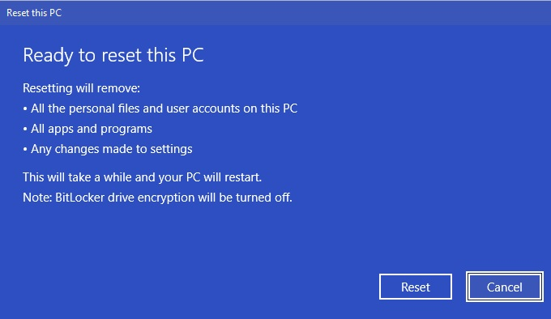

Resetting the VM or device can take a while. Proceed to the next step (verify subscription level) during the reset process.

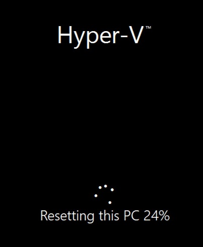

## Verify subscription level

For this lab, you need an AAD Premium subscription.  You can tell if you have a Premium subscription by navigating to the [MDM enrollment configuration](https://portal.azure.com/#blade/Microsoft_AAD_IAM/ActiveDirectoryMenuBlade/Mobility) blade. See the following example:

**Azure Active Directory** > **Mobility (MDM and MAM)** > **Microsoft Intune**

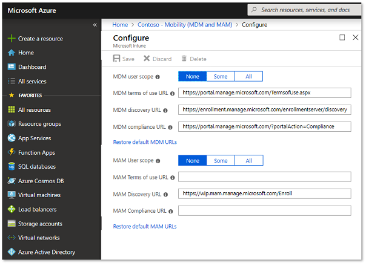

If the configuration blade shown above does not appear, it’s likely that you don’t have a **Premium** subscription.  Auto-enrollment is a feature only available in AAD Premium.  

To convert your Intune trial account to a free Premium trial account, navigate to **Azure Active Directory** > **Licenses** > **All products** > **Try / Buy** and select **Free trial** for Azure AD Premium, or EMS E5.

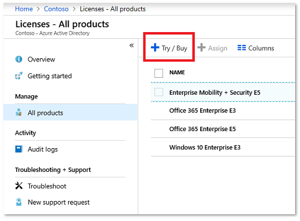

## Configure company branding

If you already have company branding configured in Azure Active Directory, you can skip this step.

>[!IMPORTANT]
>Make sure to sign-in with a Global Administrator account.

Navigate to [Company branding in Azure Active Directory](https://portal.azure.com/#blade/Microsoft_AAD_IAM/ActiveDirectoryMenuBlade/LoginTenantBranding), click on **Configure** and configure any type of company branding you'd like to see during the OOBE.

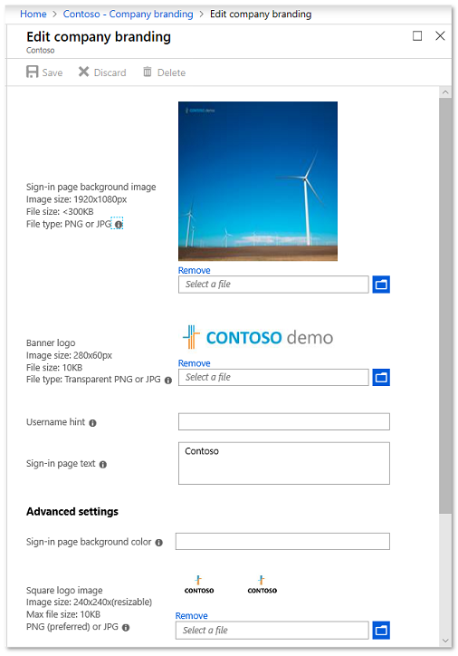

When you are finished, click **Save**.

>[!NOTE]
>Changes to company branding can take up to 30 minutes to apply.

## Configure Microsoft Intune auto-enrollment

If you already have MDM auto-enrollment configured in Azure Active Directory, you can skip this step.

Open [Mobility (MDM and MAM) in Azure Active Directory](https://portal.azure.com/#blade/Microsoft_AAD_IAM/ActiveDirectoryMenuBlade/Mobility) and select **Microsoft Intune**. If you do not see Microsoft Intune, click **Add application** and choose **Intune**.

For the purposes of this demo, select **All** under the **MDM user scope** and click **Save**.

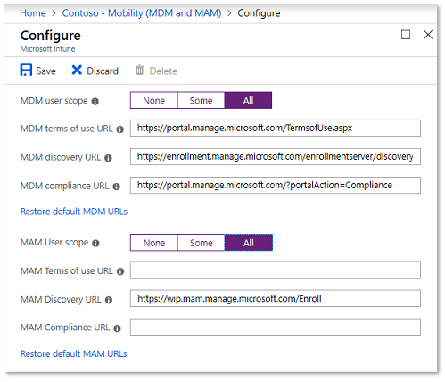

## Register your VM

Your VM (or device) can be registered either via Intune or Microsoft Store for Business (MSfB).  Both processes are shown here, but <u>only pick one</u> for purposes of this lab. We highly recommend using Intune rather than MSfB.

### Autopilot registration using Intune

1. In Intune in the Azure portal, choose **Device enrollment** > **Windows enrollment** > **Devices** > **Import**.

    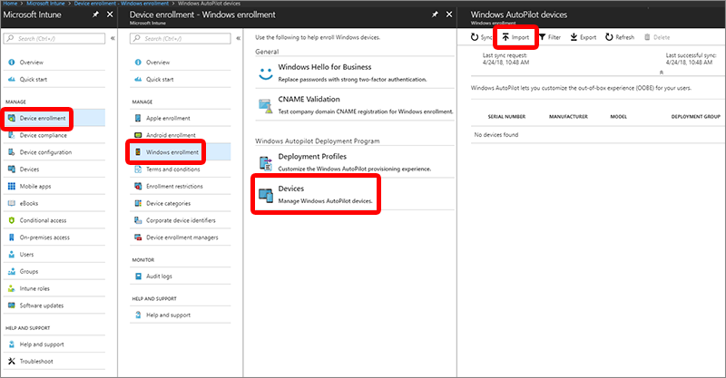

    >[!NOTE]
    >If menu items like **Windows enrollment** are not active for you, then look to the far-right blade in the UI.  You might need to provide Intune configuration privileges in a challenge window that appeared.

2. Under **Add Windows Autopilot devices** in the far right pane, browse to the **AutopilotHWID.csv** file you previously copied to your local computer.  The file should contain the serial number and 4K HH of your VM (or device).  It’s okay if other fields (Windows Product ID) are left blank.

    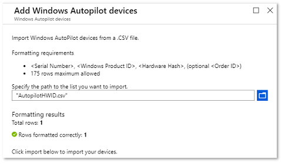

    You should receive confirmation that the file is formatted correctly before uploading it, as shown above.

3. Click **Import** and wait until the import process completes. This can take up to 15 minutes. 

4. Click **Sync** to sync the device you just registered. Wait a few moments before refreshing to verify your VM or device has been added. See the following example.

   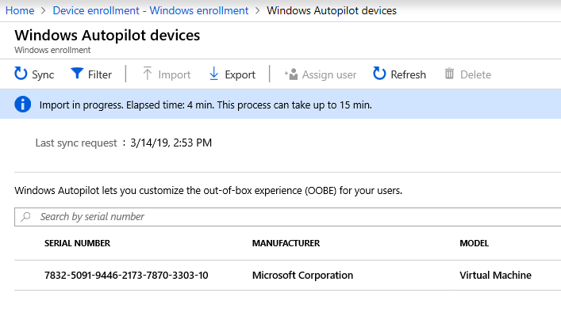

### Autopilot registration using MSfB

>[!IMPORTANT]
>If you've already registered your VM (or device) using Intune, then skip this step.

Optional: see the following video for an overview of the process.

&nbsp;

> [!video https://www.youtube.com/embed/IpLIZU_j7Z0]

First, you need a MSfB account.  You can use the same one you created above for Intune, or follow [these instructions](https://docs.microsoft.com/microsoft-store/windows-store-for-business-overview) to create a new one.

Next, sign in to [Microsoft Store for Business](https://businessstore.microsoft.com/en-us/store) using your test account by clicking **Sign in** in the upper-right-corner of the main page.

Select **Manage** from the top menu, then click the **Windows Autopilot Deployment Program** link under the **Devices** card. See the following example:

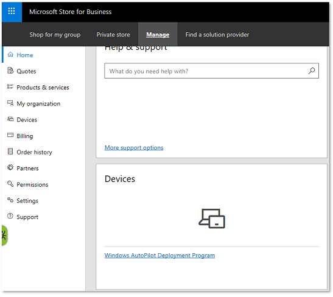

Click the **Add devices** link to upload your CSV file. A message will appear indicating your request is being processed. Wait a few moments before refreshing to see your new device has been added.

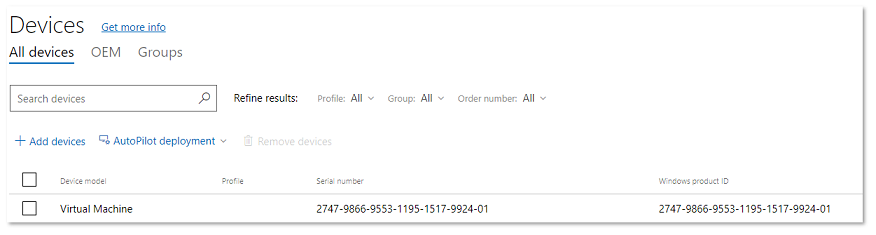

## Create and assign a Windows Autopilot deployment profile

>[!IMPORTANT]
>Autopilot profiles can be created and assigned to your registered VM or device either through Intune or MSfB.  Both processes are shown here, but only <U>pick one for purposes of this lab</U>:

Pick one:
- [Create profiles using Intune](#create-a-windows-autopilot-deployment-profile-using-intune)
- [Create profiles using MSfB](#create-a-windows-autopilot-deployment-profile-using-msfb)

### Create a Windows Autopilot deployment profile using Intune

>[!NOTE]
>Even if you registered your device in MSfB, it will still appear in Intune, though you might have to **sync** and then **refresh** your device list first:

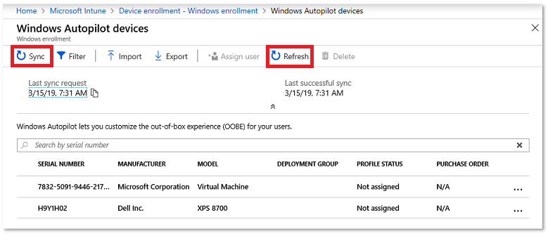

>The example above lists both a physical device and a VM. Your list should only include only one of these.

To create a Windows Autopilot profile, select **Device enrollment** > **Windows enrollment** > **Deployment profiles**

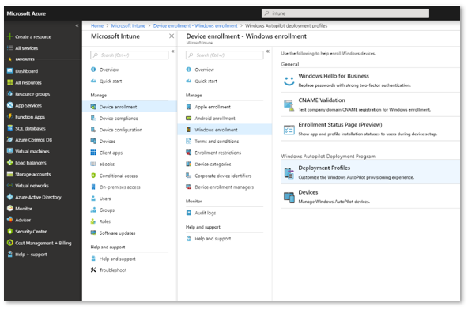

Click on **Create profile**.

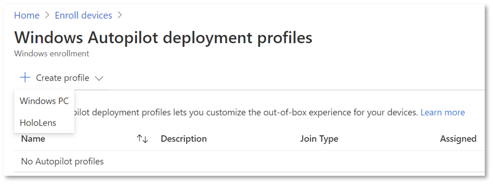

On the **Create profile** blade, use the following values:

| Setting | Value |
|---|---|
| Name | Autopilot Lab profile |
| Description | blank |
| Convert all targeted devices to Autopilot | No |
| Deployment mode | User-driven |
| Join to Azure AD as | Azure AD joined |

Click on **Out-of-box experience (OOBE)** and configure the following settings:

| Setting | Value |
|---|---|
| EULA | Hide |
| Privacy Settings | Hide |
| Hide change account options | Hide |
| User account type | Standard |
| Apply device name template | No |

See the following example:

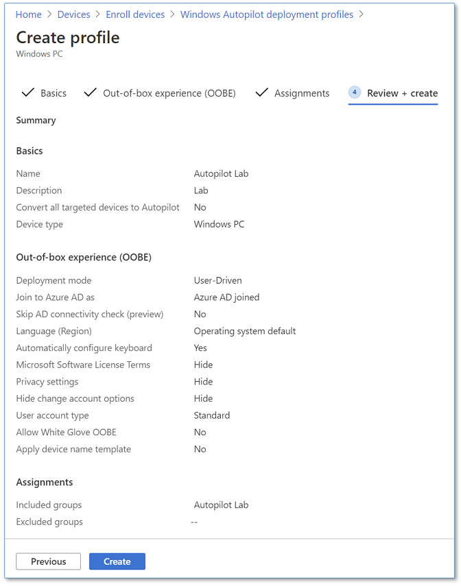

Click on **OK** and then click on **Create**.

>If you want to add an app to your profile via Intune, the OPTIONAL steps for doing so can be found in [Appendix B: Adding apps to your profile](#appendix-b-adding-apps-to-your-profile).

#### Assign the profile

Profiles can only be assigned to Groups, so first you must create a group that contains the devices to which the profile should be applied. This guide will provide simple instructions to assign a profile, for more detailed instructions, see [Create an Autopilot device group](https://docs.microsoft.com/intune/enrollment-autopilot#create-an-autopilot-device-group) and [Assign an Autopilot deployment profile to a device group](https://docs.microsoft.com/intune/enrollment-autopilot#assign-an-autopilot-deployment-profile-to-a-device-group), as optional reading.

To create a Group, open the Azure Portal and select **Azure Active Directory** > **Groups** > **All groups**:

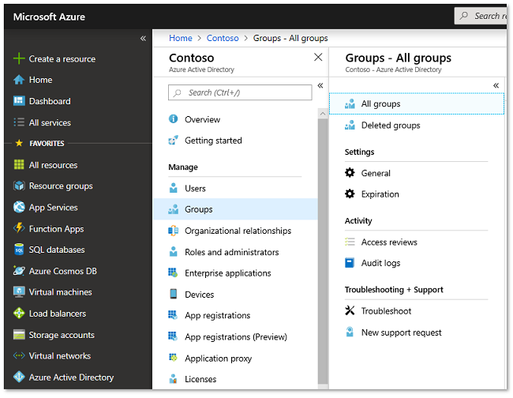

Select New group from the Groups blade to open the new groups UI.  Select the “Security” group type, name the group, and select the “Assigned” membership type:

Before clicking **Create**, expand the **Members** panel, click your device's serial number (it will then appear under **Selected members**) and then click **Select** to add that device to this group.

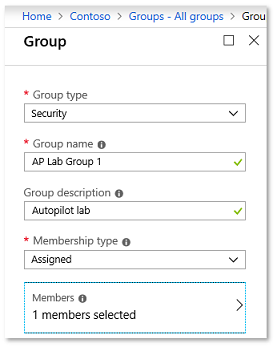

Now click **Create** to finish creating the new group.

Click on **All groups** and click **Refresh** to verify that your new group has been successfully created.

With a group created containing your device, you can now go back and assign your profile to that group. Navigate back to the Intune page in the Azure portal (one way is to type **Intune** in the top banner search bar and select **Intune** from the results).

From Intune, select **Device enrollment** > **Windows enrollment** > **Deployment Profiles** to open the profile blade.  Click on the name of the profile you previously created (Autopilot Lab profile) to open the details blade for that profile:

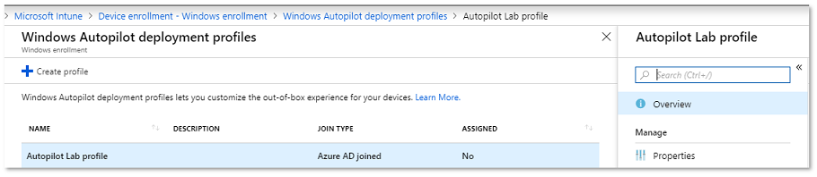

Under **Manage**, click **Assignments**, and then with the **Include** tab highlighted, expand the **Select groups** blade and click **AP Lab Group 1** (the group will appear under **Selected members**).

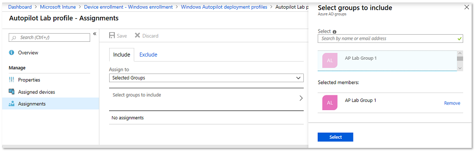

Click **Select** and then click **Save**.


It’s also possible to assign specific users to a profile, but we will not cover this scenario in the lab. For more detailed information, see [Enroll Windows devices in Intune by using Windows Autopilot](https://docs.microsoft.com/intune/enrollment-autopilot).

### Create a Windows Autopilot deployment profile using MSfB

If you have already created and assigned a profile via Intune by using the steps immediately above, then skip this section.

A [video](https://www.youtube.com/watch?v=IpLIZU_j7Z0) is available that covers the steps required to create and assign profiles in MSfB. These steps are also summarized below.

First, sign in to the [Microsoft Store for Business](https://businessstore.microsoft.com/manage/dashboard) using the Intune account you initially created for this lab.

Click **Manage** from the top menu, then click **Devices** from the left navigation tree.

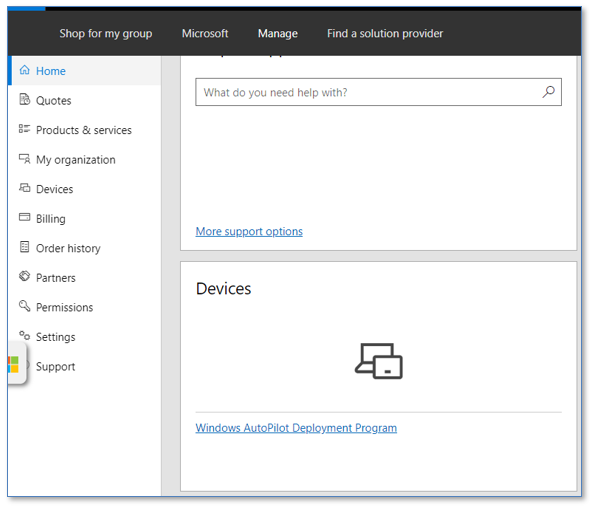

Click the **Windows Autopilot Deployment Program** link in the **Devices** tile.

To CREATE the profile:

Select your device from the **Devices** list:

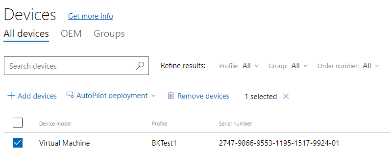

On the Autopilot deployment dropdown menu, select **Create new profile**:

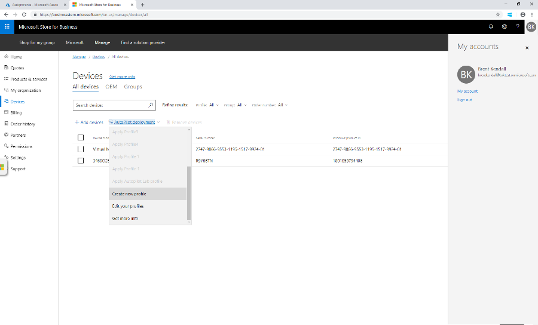

Name the profile, choose your desired settings, and then click **Create**:

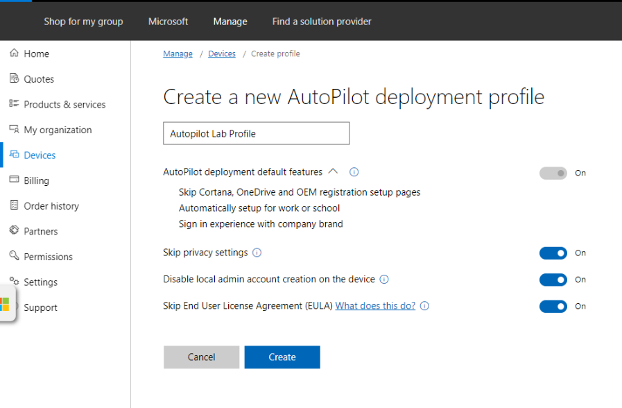

The new profile is added to the Autopilot deployment list.

To ASSIGN the profile:

To assign (or reassign) the profile to a device, select the checkboxes next to the device you registered for this lab, then select the profile you want to assign from the **Autopilot deployment** dropdown menu as shown:

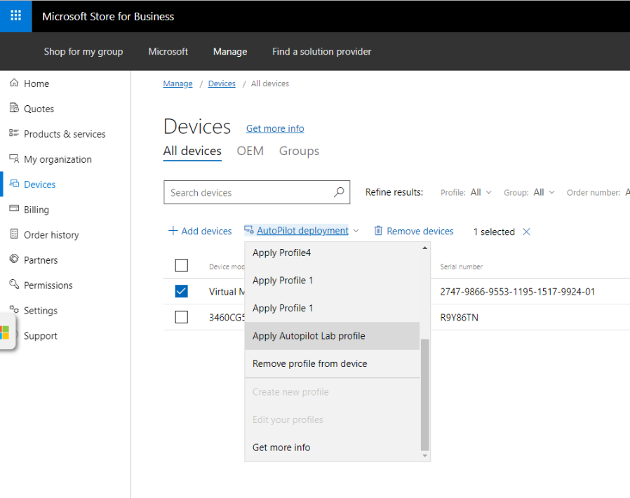

Confirm the profile was successfully assigned to the intended device by checking the contents of the **Profile** column:

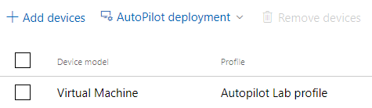

>[!IMPORTANT]
>The new profile will only be applied if the device has not been started, and gone through OOBE. Settings from a different profile can't be applied when another profile has been applied. Windows would need to be reinstalled on the device for the second profile to be applied to the device.

## See Windows Autopilot in action

If you shut down your VM after the last reset, it’s time to start it back up again, so it can progress through the Autopilot OOBE experience but do not attempt to start your device again until the **PROFILE STATUS** for your device in Intune has changed from **Not assigned** to **Assigning** and finally **Assigned**:

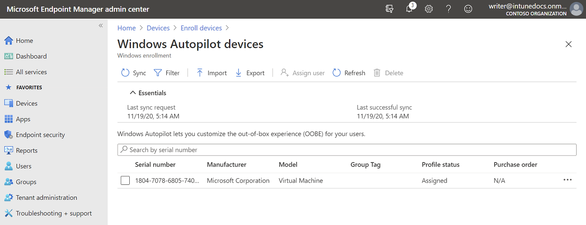

Also, make sure to wait at least 30 minutes from the time you've [configured company branding](#configure-company-branding), otherwise these changes might not show up.

>[!TIP]
>If you reset your device previously after collecting the 4K HH info, and then let it restart back to the first OOBE screen, then you might need to restart the device again to ensure the device is recognized as an Autopilot device and displays the Autopilot OOBE experience you’re expecting.  If you do not see the Autopilot OOBE experience, then reset the device again (Settings > Update & Security > Recovery and click on Get started.  Under Reset this PC, select Remove everything and Just remove my files. Click on Reset).

- Ensure your device has an internet connection.
- Turn on the device
- Verify that the appropriate OOBE screens (with appropriate Company Branding) appear.  You should see the region selection screen, the keyboard selection screen, and the second keyboard selection screen (which you can skip).

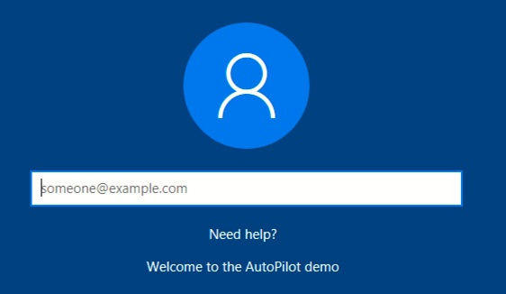 

Soon after reaching the desktop, the device should show up in Intune as an **enabled** Autopilot device.  Go into the Intune Azure portal, and select **Devices > All devices**, then **Refresh** the data to verify that your device has changed from disabled to enabled, and the name of the device is updated.


Once you select a language and a keyboard layout, your company branded sign-in screen should appear. Provide your Azure Active Directory credentials and you're all done.

Windows Autopilot will now take over to automatically join your device into Azure Active Directory and enroll it to Microsoft Intune. Use the checkpoints you've created to go through this process again with different settings.

## Remove devices from Autopilot

To use the device (or VM) for other purposes after completion of this lab, you will need to remove (deregister) it from Autopilot via either Intune or MSfB, and then reset it.  Instructions for deregistering devices can be found [here](https://docs.microsoft.com/intune/enrollment-autopilot#create-an-autopilot-device-group) and [here](https://docs.microsoft.com/intune/devices-wipe#delete-devices-from-the-azure-active-directory-portal) and below.

### Delete (deregister) Autopilot device

You need to delete (or retire, or factory reset) the device from Intune before deregistering the device from Autopilot. To delete the device from Intune (not Azure Active Directory), log into your Intune Azure portal, then navigate to **Intune > Devices > All Devices**.  Select the checkbox next to the device you want to delete, then click the Delete button along the top menu.

 

Click **X** when challenged to complete the operation:

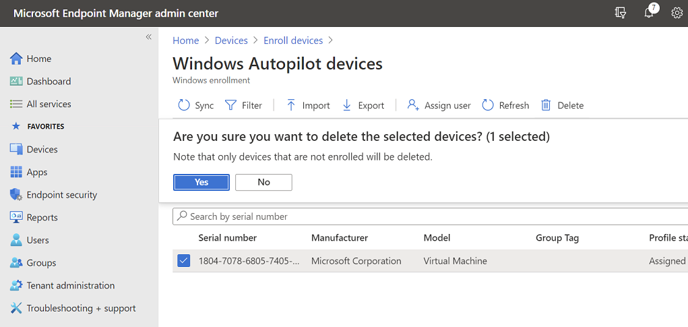 

This will remove the device from Intune management, and it will disappear from **Intune > Devices > All devices**. But this does not yet deregister the device from Autopilot, so the device should still appear under **Intune > Device Enrollment > Windows Enrollment > Windows Autopilot Deployment Program > Devices**.

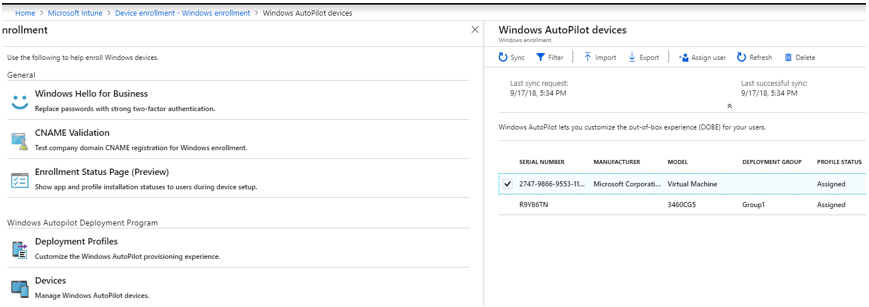 

The **Intune > Devices > All Devices** list and the **Intune > Device Enrollment > Windows Enrollment > Windows Autopilot Deployment Program > Devices** list mean different things and are two completely separate datastores.  The former (All devices) is the list of devices currently enrolled into Intune.  Note: A device will only appear in the All devices list once it has booted.  The latter (Windows Autopilot Deployment Program > Devices) is the list of devices currently registered from that Intune account into the Autopilot program - which may or may not be enrolled to Intune.

To remove the device from the Autopilot program, select the device and click Delete.

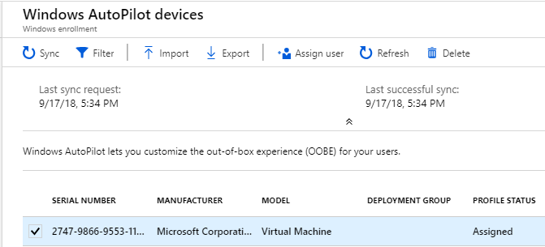 

A warning message appears reminding you to first remove the device from Intune, which we previously did.

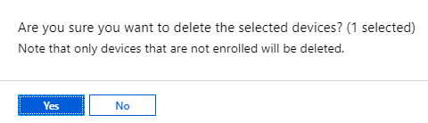 

At this point, your device has been unenrolled from Intune and also deregistered from Autopilot.  After several minutes, click the **Sync** button, followed by the **Refresh** button to confirm the device is no longer listed in the Autopilot program:

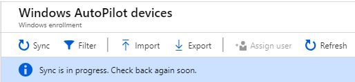 

Once the device no longer appears, you are free to reuse it for other purposes.

If you also (optionally) want to remove your device from AAD, navigate to **Azure Active Directory > Devices > All Devices**, select your device, and click the delete button:

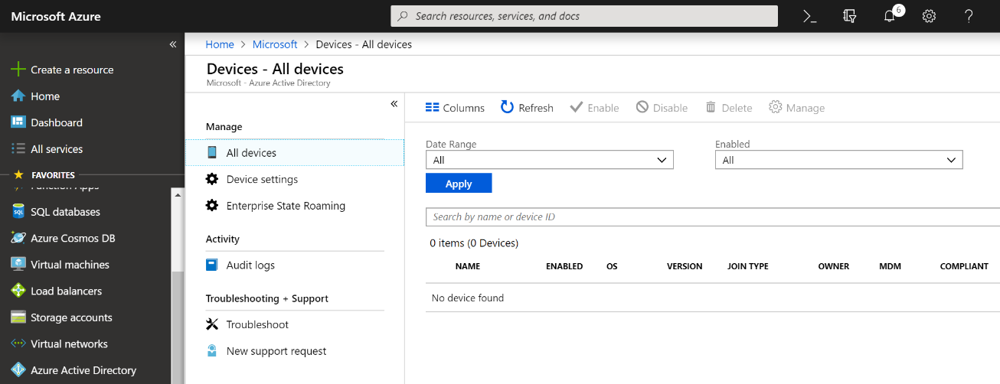 

## Appendix A: Verify support for Hyper-V

Starting with Windows 8, the host computer’s microprocessor must support second level address translation (SLAT) to install Hyper-V. See [Hyper-V: List of SLAT-Capable CPUs for Hosts](https://social.technet.microsoft.com/wiki/contents/articles/1401.hyper-v-list-of-slat-capable-cpus-for-hosts.aspx) for more information.

To verify your computer supports SLAT, open an administrator command prompt,  type **systeminfo**, press ENTER, scroll down, and review the section displayed at the bottom of the output, next to Hyper-V Requirements. See the following example:

<pre style="overflow-y: visible">
C:>systeminfo

...
Hyper-V Requirements:      VM Monitor Mode Extensions: Yes
                           Virtualization Enabled In Firmware: Yes
                           Second Level Address Translation: Yes
                           Data Execution Prevention Available: Yes
</pre>

In this example, the computer supports SLAT and Hyper-V.

>If one or more requirements are evaluated as **No** then the computer does not support installing Hyper-V.  However, if only the virtualization setting is incompatible, you might be able to enable virtualization in the BIOS and change the **Virtualization Enabled In Firmware** setting from **No** to **Yes**. The location of this setting will depend on the manufacturer and BIOS version, but is typically found associated with the BIOS security settings.

You can also identify Hyper-V support using [tools](https://blogs.msdn.microsoft.com/taylorb/2008/06/19/hyper-v-will-my-computer-run-hyper-v-detecting-intel-vt-and-amd-v/) provided by the processor manufacturer, the [msinfo32](https://technet.microsoft.com/library/cc731397.aspx) tool, or you can download the [coreinfo](https://technet.microsoft.com/sysinternals/cc835722) utility and run it, as shown in the following example:

<pre style="overflow-y: visible">
C:>coreinfo -v

Coreinfo v3.31 - Dump information on system CPU and memory topology
Copyright (C) 2008-2014 Mark Russinovich
Sysinternals - www.sysinternals.com

Intel(R) Core(TM) i7-2600 CPU @ 3.40GHz
Intel64 Family 6 Model 42 Stepping 7, GenuineIntel
Microcode signature: 0000001B
HYPERVISOR      -       Hypervisor is present
VMX             *       Supports Intel hardware-assisted virtualization
EPT             *       Supports Intel extended page tables (SLAT)
</pre>

Note: A 64-bit operating system is required to run Hyper-V.

## Appendix B: Adding apps to your profile

### Add a Win32 app

#### Prepare the app for Intune

Before we can pull an application into Intune to make it part of our AP profile, we need to “package” the application for delivery using the [IntuneWinAppUtil.exe command-line tool](https://github.com/Microsoft/Intune-Win32-App-Packaging-Tool).  After downloading the tool, gather the following three bits of information to use the tool:

1. The source folder for your application
2. The name of the setup executable file 
3. The output folder for the new file

For the purposes of this lab, we’ll use the Notepad++ tool as our Win32 app.

Download the Notepad++ msi package [here](https://www.hass.de/content/notepad-msi-package-enterprise-deployment-available) and then opy the file to a known location, such as C:\Notepad++msi.

Run the IntuneWinAppUtil tool, supplying answers to the three questions, for example:

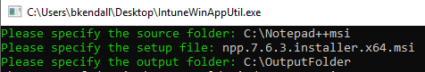 

After the tool finishes running, you should have an .intunewin file in the Output folder, which you can now upload into Intune using the following steps.

#### Create app in Intune

Log into the Azure portal and select **Intune**.

Navigate to **Intune > Clients apps > Apps**, and then click the **Add** button to create a new app package.

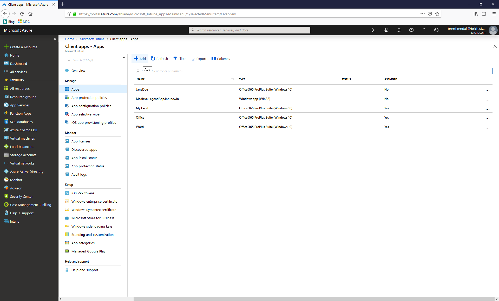 

Under **App Type**, select **Windows app (Win32)**:

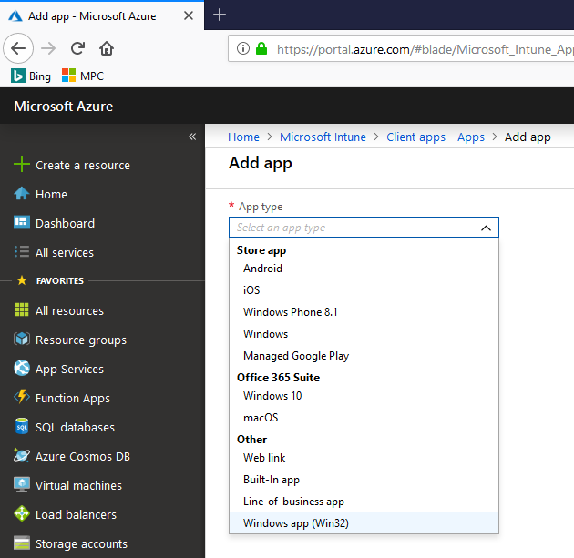 

On the **App package file** blade, browse to the **npp.7.6.3.installer.x64.intunewin** file in your output folder, open it, then click **OK**:

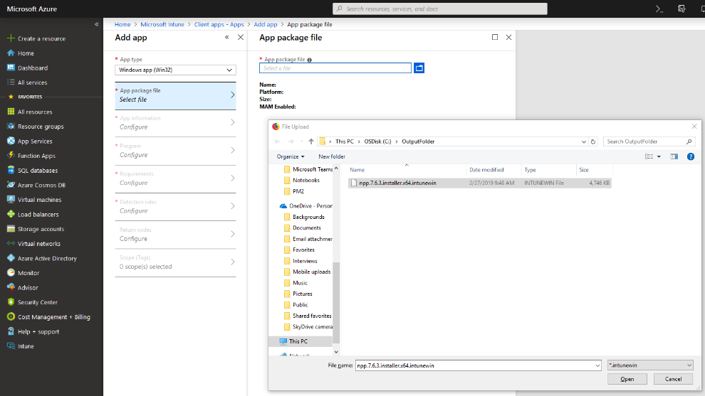 

On the **App Information Configure** blade, provide a friendly name, description, and publisher, such as:

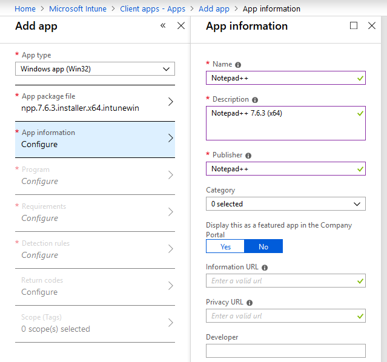 

On the **Program Configuration** blade, supply the install and uninstall commands:

Install:  msiexec /i "npp.7.6.3.installer.x64.msi" /q
Uninstall:  msiexec /x "{F188A506-C3C6-4411-BE3A-DA5BF1EA6737}" /q

NOTE:  Likely, you do not have to write the install and uninstall commands yourself because the [IntuneWinAppUtil.exe command-line tool](https://github.com/Microsoft/Intune-Win32-App-Packaging-Tool) automatically generated them when it converted the .msi file into a .intunewin file.

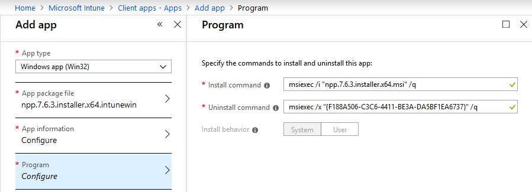 

Simply using an install command like “notepad++.exe /S” will not actually install Notepad++; it will only launch the app.  To actually install the program, we need to use the .msi file instead.  Notepad++ doesn’t actually have an .msi version of their program, but we got an .msi version from a [third party provider](https://www.hass.de/content/notepad-msi-package-enterprise-deployment-available).  

Click **OK** to save your input and activate the **Requirements** blade.

On the **Requirements Configuration** blade, specify the **OS architecture** and the **Minimum OS version**:

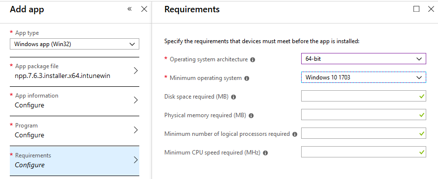 

Next, configure the **Detection rules**.  For our purposes, we will select manual format:

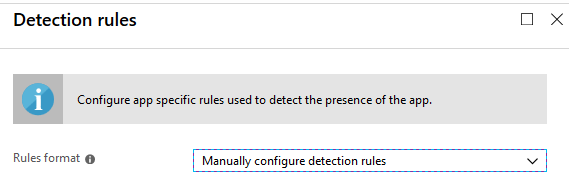 

Click **Add** to define the rule properties.  For **Rule type**, select **MSI**, which will automatically import the right MSI product code into the rule:

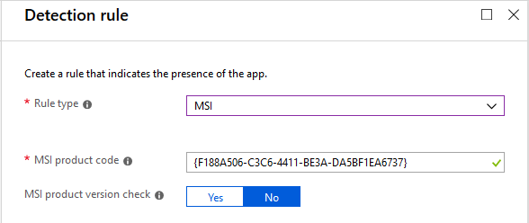 

Click **OK** twice to save, as you back out to the main **Add app** blade again for the final configuration.  

**Return codes**:  For our purposes, leave the return codes at their default values:

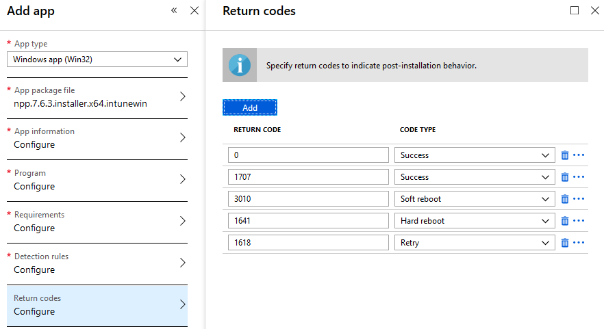 

Click **OK** to exit.

You may skip configuring the final **Scope (Tags)** blade.

Click the **Add** button to finalize and save your app package.

Once the indicator message says the addition has completed.

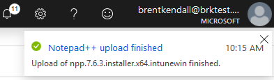 

You will be able to find your app in your app list:

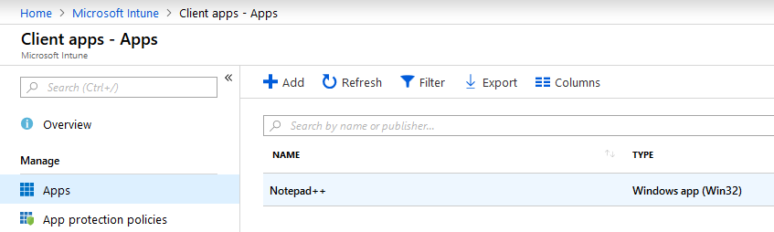 

#### Assign the app to your Intune profile

**NOTE**: The following steps only work if you previously [created a GROUP in Intune and assigned a profile to it](#assign-the-profile).  If you have not done that, please return to the main part of the lab and complete those steps before returning here.
	
In the **Intune > Client Apps > Apps** pane, select the app package you already created to reveal its properties blade.  Then click **Assignments** from the menu:

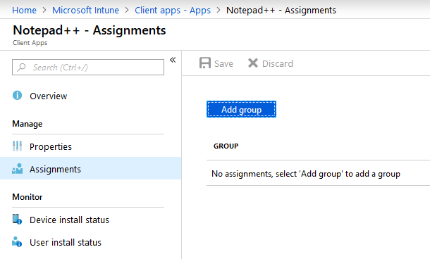 

Select **Add Group** to open the **Add group** pane that is related to the app.

For our purposes, select *8Required** from the **Assignment type** dropdown menu:

>**Available for enrolled devices** means users install the app from the Company Portal app or Company Portal website.

Select **Included Groups** and assign the groups you previously created that will use this app:

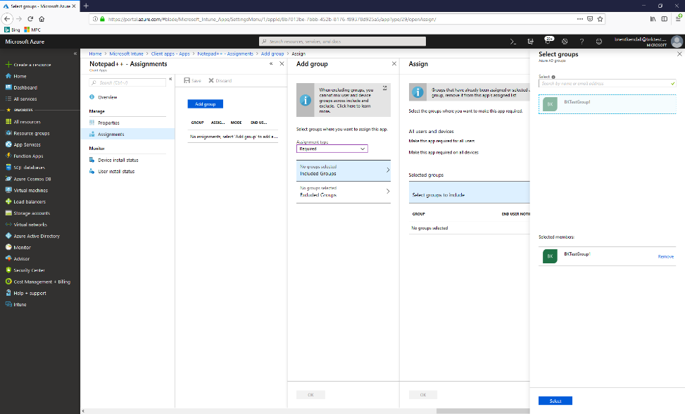 

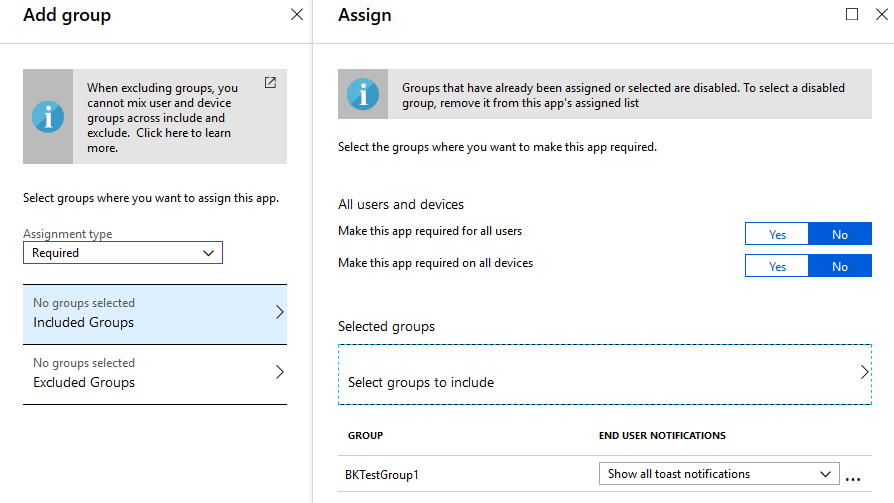 

In the **Select groups** pane, click the **Select** button.

In the **Assign group** pane, select **OK**.

In the **Add group** pane, select **OK**.

In the app **Assignments** pane, select **Save**.

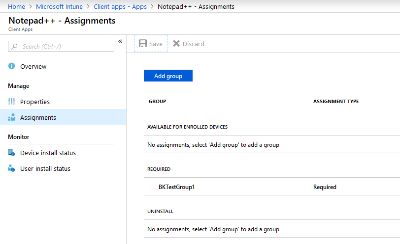 

At this point, you have completed steps to add a Win32 app to Intune.

For more information on adding adds to Intune, see [Intune Standalone - Win32 app management](https://docs.microsoft.com/intune/apps-win32-app-management).

### Add Office 365

#### Create app in Intune

Log into the Azure portal and select **Intune**.

Navigate to **Intune > Clients apps > Apps**, and then click the **Add** button to create a new app package.

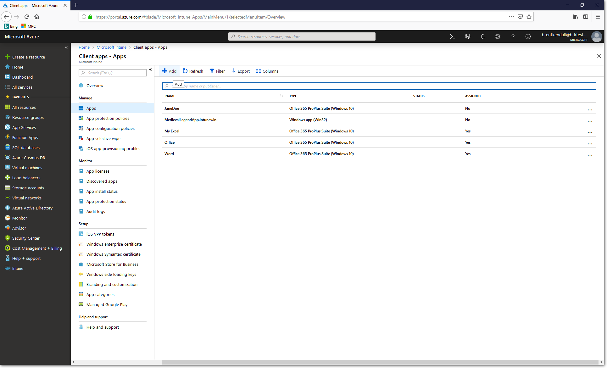 

Under **App Type**, select **Office 365 Suite > Windows 10**:

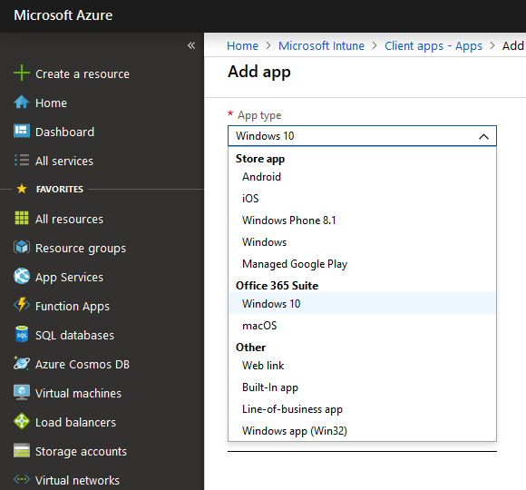 

Under the **Configure App Suite** pane, select the Office apps you want to install.  For the purposes of this labe we have only selected Excel:

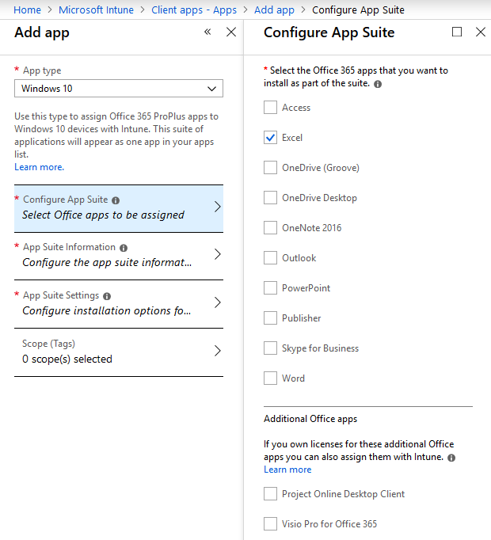 

Click **OK**.

In the **App Suite Information** pane, enter a <i>unique</i> suite name, and a suitable description.  

>Enter the name of the app suite as it is displayed in the company portal. Make sure that all suite names that you use are unique. If the same app suite name exists twice, only one of the apps is displayed to users in the company portal. 

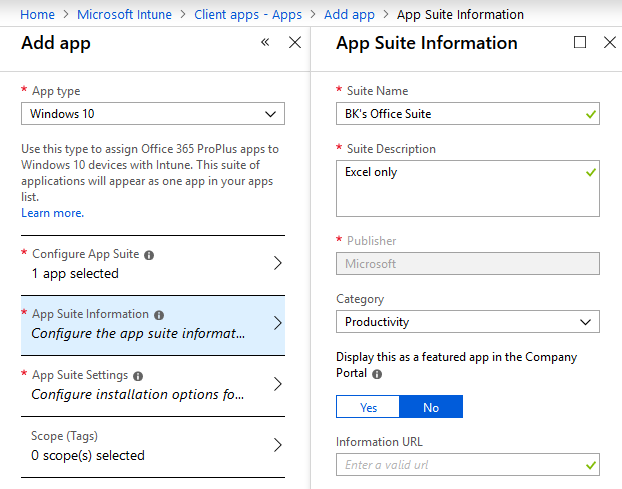 

Click **OK**.

In the **App Suite Settings** pane, select **Monthly** for the **Update channel** (any selection would be fine for the purposes of this lab).  Also select **Yes** for **Automatically accept the app end user license agreement**:

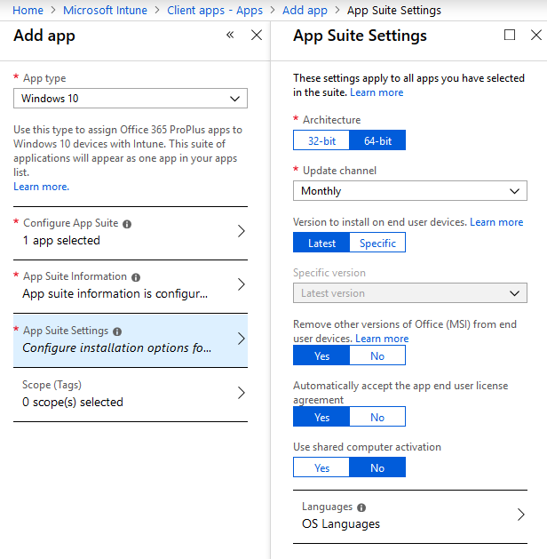 

Click **OK** and then click **Add**.

#### Assign the app to your Intune profile

**NOTE**: The following steps only work if you previously [created a GROUP in Intune and assigned a profile to it](#assign-the-profile).  If you have not done that, please return to the main part of the lab and complete those steps before returning here.
	
In the **Intune > Client Apps > Apps** pane, select the Office package you already created to reveal its properties blade.  Then click **Assignments** from the menu:

 

Select **Add Group** to open the **Add group** pane that is related to the app.

For our purposes, select **Required** from the **Assignment type** dropdown menu:

>**Available for enrolled devices** means users install the app from the Company Portal app or Company Portal website.

Select **Included Groups** and assign the groups you previously created that will use this app:

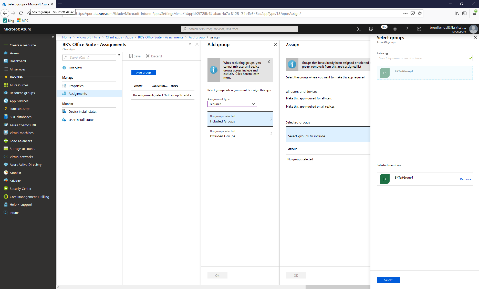 

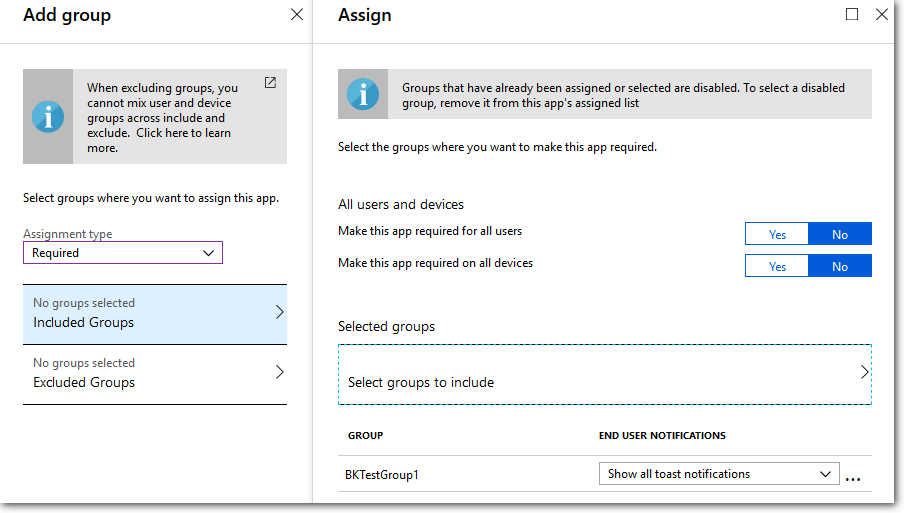 

In the **Select groups** pane, click the **Select** button.

In the **Assign group** pane, select **OK**.

In the **Add group** pane, select **OK**.

In the app **Assignments** pane, select **Save**.

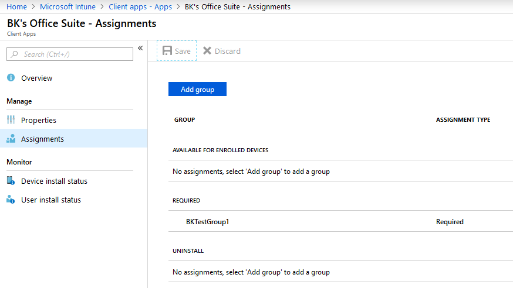 

At this point, you have completed steps to add Office to Intune.

For more information on adding Office apps to Intune, see [Assign Office 365 apps to Windows 10 devices with Microsoft Intune](https://docs.microsoft.com/intune/apps-add-office365).

If you installed both the win32 app (Notepad++) and Office (just Excel) per the instructions in this lab, your VM will show them in the apps list, although it could take several minutes to populate:

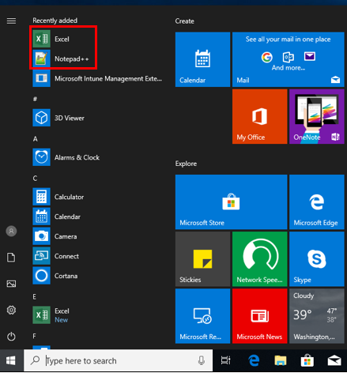 

## Glossary

<table border="1">
<tr><td>OEM</td><td>Original Equipment Manufacturer</td></tr>
<tr><td>CSV</td><td>Comma Separated Values</td></tr>
<tr><td>MPC</td><td>Microsoft Partner Center</td></tr>
<tr><td>CSP</td><td>Cloud Solution Provider</td></tr>
<tr><td>MSfB</td><td>Microsoft Store for Business</td></tr>
<tr><td>AAD</td><td>Azure Active Directory</td></tr>
<tr><td>4K HH</td><td>4K Hardware Hash</td></tr>
<tr><td>CBR</td><td>Computer Build Report</td></tr>
<tr><td>EC</td><td>Enterprise Commerce (server)</td></tr>
<tr><td>DDS</td><td>Device Directory Service</td></tr>
<tr><td>OOBE</td><td>Out of the Box Experience</td></tr>
<tr><td>VM</td><td>Virtual Machine</td></tr>
</table>
