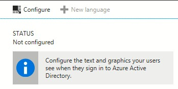
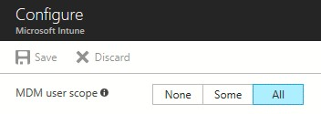
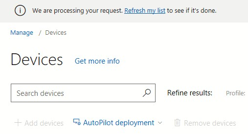
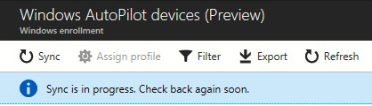

# Demonstrate Autopilot deployment on a VM

**Applies to**

-   Windows 10

In this topic you'll learn how to set-up a Windows Autopilot deployment for a Virtual Machine using Hyper-V. Watch the following video to see an overview of the process:

</br>
<iframe width="560" height="315" src="https://www.youtube-nocookie.com/embed/KYVptkpsOqs" frameborder="0" allow="autoplay; encrypted-media" allowfullscreen></iframe> 

## Prerequisites

These are the thing you'll need on your device to get started:
* Installation media for the latest version of Windows 10 Professional or Enterprise (ISO file)
* Internet access (see [Network connectivity requirements](https://docs.microsoft.com/windows/deployment/windows-autopilot/windows-autopilot#network-connectivity-requirements))
* Hypervisor needs to be unoccupied, or used by Hyper-V, as we will be using Hyper-V to create the Virtual Machine

See additional prerequisites in the [Windows Autopilot overview topic](https://docs.microsoft.com/windows/deployment/windows-autopilot/windows-autopilot#prerequisites).

## Create your Virtual Machine

### Enable Hyper-V
The first thing to do, is to enable the Hyper-V feature on your device.
>[!IMPORTANT]
>If you already have Hyper-V enabled, skip this step.

Open a PowerShell prompt **as an administrator** and run the following:
```powershell
Enable-WindowsOptionalFeature -Online -FeatureName Microsoft-Hyper-V -All
```

You will be prompted to restart your device, so save all your work and restart it before you continue.

### Create and start your demo Virtual Machine

Now that Hyper-V is enabled, proceed to create your Virtual Machine.

Open a PowerShell prompt **as an administrator** and run the following:
```powershell
New-VMSwitch -Name AutopilotExternal -NetAdapterName <Name of Network Adapter with internet access> -AllowManagementOS $true
New-VM -Name WindowsAutopilot -MemoryStartupBytes 2GB -BootDevice VHD -NewVHDPath .\VMs\WindowsAutopilot.vhdx -Path .\VMData -NewVHDSizeBytes 80GB -Generation 2 -Switch AutopilotExternal
Add-VMDvdDrive -Path <Path to Windows 10 ISO> -VMName WindowsAutopilot
Start-VM -VMName WindowsAutopilot
```

>[!IMPORTANT]
>Make sure to replace <*Name of Network Adapter with internet access*> and <*Path to Windows 10 ISO*> with the appropriate values.
>Additionally, note that all Virtual Machine related data will be created under the current path in your PowerShell prompt. Consider navigating into a new folder before running the above.

### Install Windows 10

Now that the Virtual Machine was created and started, open **Hyper-V Manager** and connect to the **WindowsAutopilot** Virtual Machine.
Make sure the Virtual Machine booted from the installation media you've provided and complete the Windows installation process.

Once the installation is complete, create a checkpoint. You will create multiple checkpoints throughout this process, which you can later use to go through the process again.

To create the checkpoint, open a PowerShell prompt **as an administrator** and run the following:
```powershell
Checkpoint-VM -Name WindowsAutopilot -SnapshotName "Finished Windows install"
```

## Capture your Virtual Machine's hardware ID

On the newly created Virtual Machine, open a PowerShell prompt **as an administrator** and run the following:
```powershell
md c:\HWID
Set-Location c:\HWID
Set-ExecutionPolicy Unrestricted
Install-Script -Name Get-WindowsAutopilotInfo
Get-WindowsAutopilotInfo.ps1 -OutputFile AutopilotHWID.csv
```

>[!NOTE]
>Accept all prompts while running the above cmdlets.

### Mount the Virtual Hard Drive (VHD)

To gain access to the AutopilotHWID.csv that contains the hardware ID, stop the Virtual Machine to unlock the Virtual Hard Drive. 

To do that, on your device (**not** on the Virtual Machine), open a PowerShell prompt **as an administrator** and run the following:
```powershell
Stop-VM -VMName WindowsAutopilot
```

Once the Virtual Machine has stopped, create a checkpoint:
```powershell
Checkpoint-VM -Name WindowsAutopilot -SnapshotName "HWID captured"
```

With the checkpoint created, continue to mount the VHD:
```powershell
Mount-VHD -path (Get-VMHardDiskDrive -VMName WindowsAutopilot).Path
```

Once mounted, navigate to the new drive and copy **AutopilotHWID.csv** to a location on your device.

Before you proceed, unmount the VHD to unlock it and start the Virtual Machine:
```powershell
Dismount-VHD -path (Get-VMHardDiskDrive -VMName WindowsAutopilot).Path
Start-VM -VMName WindowsAutopilot
```

## Reset Virtual Machine back to Out-Of-Box-Experience (OOBE)

With the hardware ID captured, prepare your Virtual Machine for Windows Autopilot deployment by resetting it back to OOBE.

On the Virtual Machine, go to **Settings > Update & Security > Recovery** and click on **Get started** under **Reset this PC**.
Select **Remove everything** and **Just remove my files**. Finally, click on **Reset**.


Resetting your Virtual Machine can take a while. Proceed to the next steps while your Virtual Machine is resetting.


## Configure company branding

>[!IMPORTANT]
>If you already have company branding configured in Azure Active Directory, you can skip this step.

Navigate to [Company branding in Azure Active Directory](https://portal.azure.com/#blade/Microsoft_AAD_IAM/ActiveDirectoryMenuBlade/LoginTenantBranding).

>[!IMPORTANT]
>Make sure to sign-in with a Global Administrator account.

Click on **Configure** and configure any type of company branding you'd like to see during the OOBE.



Once finished, click **Save**.

>[!NOTE]
>Changes to company branding can take up to 30 minutes to apply.


## Configure Microsoft Intune auto-enrollment

>[!IMPORTANT]
>If you already have MDM auto-enrollment configured in Azure Active Directory, you can skip this step.

Navigate to [Mobility (MDM and MAM) in Azure Active Directory](https://portal.azure.com/#blade/Microsoft_AAD_IAM/ActiveDirectoryMenuBlade/Mobility) and select **Microsoft Intune**.

For the purposes of this demo, select **All** under the **MDM user scope** and click **Save**.



## Register your Virtual Machine to your organization

Navigate to [Microsoft Store for Business device management](https://businessstore.microsoft.com/en-us/manage/devices). Click on **Add devices** and select the **AutopilotHWID.csv** you've saved earlier. A message will appear indicating your request is being processed. Wait a few moments before refreshing to see your Virtual Machine added.



## Create and assign a Windows Autopilot deployment profile

Navigate to [Windows enrollment in Microsoft Intune](https://portal.azure.com/#blade/Microsoft_Intune_Enrollment/OverviewBlade/windowsEnrollment).

Make sure to sync the device you've just registered, by clicking on **Devices** under **Windows Autopilot Deployment Program (Preview)** and selecting **Sync**. Wait a few moments before refreshing to see your Virtual Machine added.



### Create a Windows Autopilot deployment profile

Click on **Deployment profiles** under **Windows Autopilot Deployment Program (Preview)** and select **Create profile**.


In the **Create profile** blade, set the name to **Autopilot Intune Demo**, click on **Out-of-box experience (OOBE)** and configure the following:
| Setting name | Value |
|---|---|
|Privacy Settings|Hide|
|End user license agreement (EULA)|Hide|
|User account type|Standard|

Click on **Save** and **Create**.


### Assign a Windows Autopilot deployment profile

With the deployment profile created, go back to **Devices** under **Windows Autopilot Deployment Program (Preview)** and select your Virtual Machine. Click on **Assign profile** and in the **Assign Profile** blade select **Autopilot Intune Demo** under the **Autopilot profile**. Click on **Assign**.


Wait a few minutes for all changes to apply.

## See Windows Autopilot in action

By now, your Virtual Machine should be back to OOBE. Make sure to wait at least 30 minutes from the time you've [configured company branding](#configure-company-branding)
, otherwise those changes might not show up.

Once you select a language and a keyboard layout, your company branded sign-in screen should appear. Provide your Azure Active Directory credentials and you're all done.


Windows Autopilot will now take over to automatically join your Virtual Machine into Azure Active Directory and enroll it to Microsoft Intune. Use the checkpoints you've created to go through this process again with different settings.

