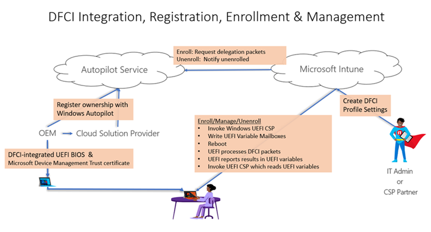

# DFCI Management

**Applies to**

-   Windows 10

With Windows Autopilot Deployment and Intune, you can manage Unified Extensible Firmware Interface (UEFI) settings after they're enrolled by using the Device Firmware Configuration Interface (DFCI).  DFCI [enables Windows to pass management commands](https://docs.microsoft.com/windows/client-management/mdm/uefi-csp) from Intune to UEFI to Autopilot deployed devices. This allows you to limit end user's control over BIOS settings. For example, you can lock down the boot options to prevent users from booting up another OS, such as one that doesn't have the same security features.

If a user reinstalls a previous Windows version, install a separate OS, or format the hard drive, they can't override DFCI management. This feature can also prevent malware from communicating with OS processes, including elevated OS processes. DFCI’s trust chain uses public key cryptography, and doesn't depend on local UEFI password security. This layer of security blocks local users from accessing managed settings from the device’s UEFI menus.

For an overview of DFCI benefits, scenarios, and prerequisites, see [Device Firmware Configuration Interface (DFCI) Introduction](https://microsoft.github.io/mu/dyn/mu_plus/DfciPkg/Docs/Dfci_Feature/).

## DFCI management lifecycle

The DFCI management lifecycle can be viewed as UEFI integration, device registration, profile creation, enrollment, management, retirement, and recovery. See the following figure.

   

## Requirements

- Windows 10, version 1809 or later and a supported UEFI is required.
- The device manufacturer must have DFCI added to their UEFI firmware in the manufacturing process, or as a firmware update that you install. Work with your device vendors to determine the [manufacturers that support DFCI](#oems-that-support-dfci), or the firmware version needed to use DFCI.
- The device must be managed with Microsoft Intune. For more information, see [Enroll Windows devices in Intune using Windows Autopilot](https://docs.microsoft.com/intune/enrollment/enrollment-autopilot).
- The device must be registered for Windows Autopilot by a [Microsoft Cloud Solution Provider (CSP) partner](https://partner.microsoft.com/membership/cloud-solution-provider), or registered directly by the OEM. 

>[!IMPORTANT]
>Devices manually registered for Autopilot (such as by [importing from a csv file](https://docs.microsoft.com/intune/enrollment/enrollment-autopilot#add-devices)) are not allowed to use DFCI. By design, DFCI management requires external attestation of the device’s commercial acquisition through an OEM or a Microsoft CSP partner registration to Windows Autopilot. When your device is registered, its serial number is displayed in the list of Windows Autopilot devices.

## Managing DFCI profile with Windows Autopilot

There are four basic steps in managing DFCI profile with Windows Autopilot:

1. Create an Autopilot Profile
2. Create an Enrollment status page profile
3. Create a DFCI profile
4. Assign the profiles

See [Create the profiles](https://docs.microsoft.com/intune/configuration/device-firmware-configuration-interface-windows#create-the-profiles) and [Assign the profiles, and reboot](https://docs.microsoft.com/intune/configuration/device-firmware-configuration-interface-windows#assign-the-profiles-and-reboot) for details.

You can also [change existing DFCI settings](https://docs.microsoft.com/intune/configuration/device-firmware-configuration-interface-windows#update-existing-dfci-settings) on devices that are in use. In your existing DFCI profile, change the settings and save your changes. Since the profile is already assigned, the new DFCI settings take effect when next time the device syncs or the device reboots.

## OEMs that support DFCI

- [Microsoft Surface](https://docs.microsoft.com/surface/surface-manage-dfci-guide)

Additional OEMs are pending.

## See also

[Microsoft DFCI Scenarios](https://microsoft.github.io/mu/dyn/mu_plus/DfciPkg/Docs/Scenarios/DfciScenarios/) 
[Windows Autopilot and Surface devices](https://docs.microsoft.com/surface/windows-autopilot-and-surface-devices) 