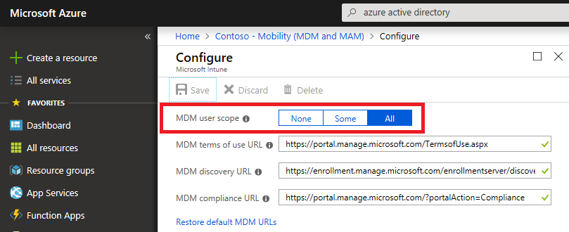
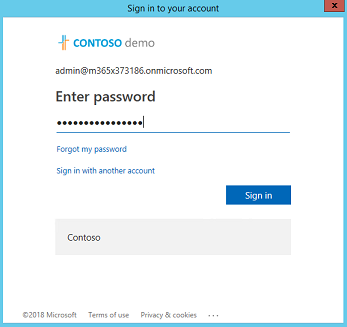
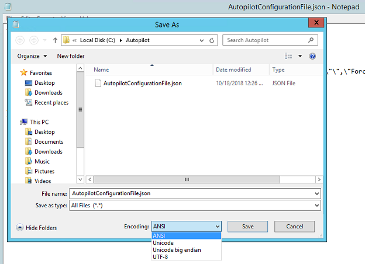
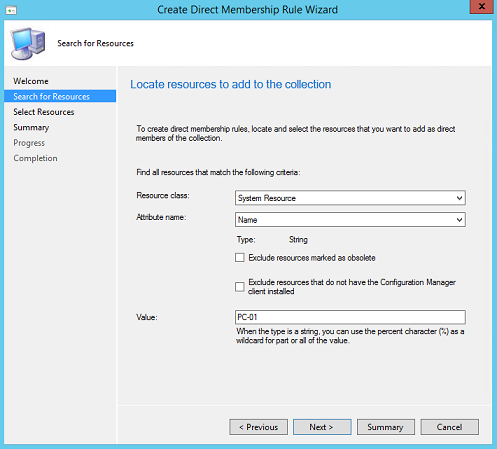
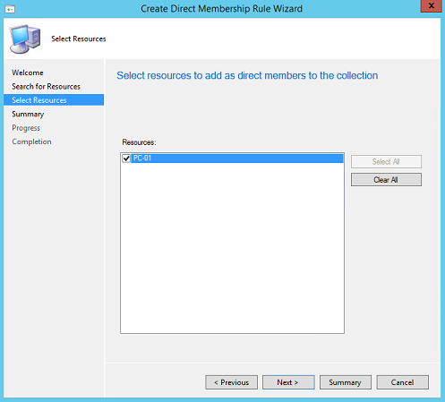
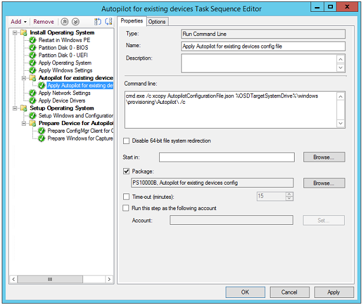
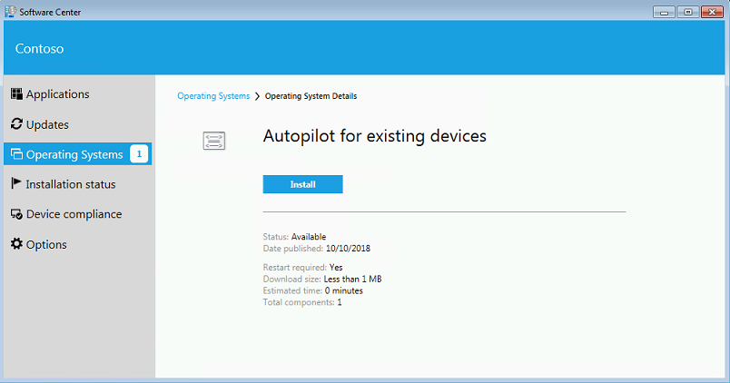
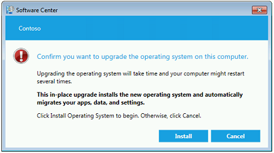

# Windows Autopilot for existing devices

**Applies to: Windows 10**

Modern desktop deployment with Windows Autopilot enables you to easily deploy the latest version of Windows 10 to your existing devices. The apps you need for work can be automatically installed. Your work profile is synchronized, so you can resume working right away.

This topic describes how to convert Windows 7 or Windows 8.1 domain-joined computers to Windows 10 devices joined to either Azure Active Directory or Active Directory (Hybrid Azure AD Join) by using Windows Autopilot.

>[!NOTE]
>Windows Autopilot for existing devices only supports user-driven Azure Active Directory and Hybrid Azure AD profiles. Self-deploying profiles are not supported.

## Prerequisites

- System Center Configuration Manager Current Branch (1806) OR System Center Configuration Manager Technical Preview (1808)
- The [Windows ADK](https://developer.microsoft.com/en-us/windows/hardware/windows-assessment-deployment-kit) 1803 or later
    - Note: Config Mgr 1806 or later is required to [support](https://docs.microsoft.com/sccm/core/plan-design/configs/support-for-windows-10#windows-10-adk) the Windows ADK 1809.
- Assigned Microsoft Intune Licenses
- Azure Active Directory Premium
- Windows 10 version 1809 or later imported into Config Mgr as an Operating System Image

## Procedures

### Configure the Enrollment Status Page (optional)

If desired, you can set up an [enrollment status page](https://docs.microsoft.com/windows/deployment/windows-autopilot/enrollment-status) for Autopilot using Intune.

To enable and configure the enrollment and status page:

1. Open [Intune in the Azure portal](https://aka.ms/intuneportal).
2. Access **Intune > Device enrollment > Windows enrollment** and [Set up an enrollment status page](https://docs.microsoft.com/intune/windows-enrollment-status). 
3. Access **Azure Active Directory > Mobility (MDM and MAM) > Microsoft Intune** and [Configure automatic MDM enrollment](https://docs.microsoft.com/sccm/mdm/deploy-use/enroll-hybrid-windows#enable-windows-10-automatic-enrollment) and configure the MDM user scope for some or all users. 

See the following examples.

<br><br>


### Create the JSON file 

>[!TIP]
>To run the following commands on a computer running Windows Server 2012/2012 R2 or Windows 7/8.1, you must first download and install the [Windows Management Framework](https://www.microsoft.com/en-us/download/details.aspx?id=54616).

1. On an Internet connected Windows PC or Server open an elevated Windows PowerShell command window
2. Enter the following lines to install the necessary modules

    #### Install required modules

    ```
    Install-PackageProvider -Name NuGet -MinimumVersion 2.8.5.201 -Force
    Install-Module AzureAD -Force
    Install-Module WindowsAutopilotIntune -Force
    ```

3. Enter the following lines and provide Intune administrative credentials
   - In the following command, replace the example user principal name for Azure authentication (admin@M365x373186.onmicrosoft.com) with your user account. Be sure that the user account you specify has sufficient administrative rights.

     ```
     Connect-AutopilotIntune -user admin@M365x373186.onmicrosoft.com
     ```
     The password for your account will be requested using a standard Azure AD form. Type your password and then click **Sign in**. 
     <br>See the following example:

     

     If this is the first time you’ve used the Intune Graph APIs, you’ll also be prompted to enable read and write permissions for Microsoft Intune PowerShell. To enable these permissions:
   - Select **Consent on behalf or your organization**
   - Click **Accept**

4. Next, retrieve and display all the Autopilot profiles available in the specified Intune tenant in JSON format:

    #### Retrieve profiles in Autopilot for existing devices JSON format

    ```
    Get-AutopilotProfile | ConvertTo-AutopilotConfigurationJSON
    ```

    See the following sample output:
    <pre style="overflow-y: visible">
    PS C:\> Get-AutopilotProfile | ConvertTo-AutopilotConfigurationJSON
    {
        "CloudAssignedTenantId":  "1537de22-988c-4e93-b8a5-83890f34a69b",
        "CloudAssignedForcedEnrollment":  1,
        "Version":  2049,
        "Comment_File":  "Profile Autopilot Profile",
        "CloudAssignedAadServerData":  "{\"ZeroTouchConfig\":{\"CloudAssignedTenantUpn\":\"\",\"ForcedEnrollment\":1,\"CloudAssignedTenantDomain\":\"M365x373186.onmicrosoft.com\"}}",
        "CloudAssignedTenantDomain":  "M365x373186.onmicrosoft.com",
        "CloudAssignedDomainJoinMethod":  0,
        "CloudAssignedOobeConfig":  28,
        "ZtdCorrelationId":  "7F9E6025-1E13-45F3-BF82-A3E8C5B59EAC"
    }</pre>

    Each profile is encapsulated within braces **{ }**. In the previous example, a single profile is displayed.     

    See the following table for a description of properties used in the JSON file.


   |                          Property                          |                                                                                                                                                                        Description                                                                                                                                                                         |
   |------------------------------------------------------------|------------------------------------------------------------------------------------------------------------------------------------------------------------------------------------------------------------------------------------------------------------------------------------------------------------------------------------------------------------|
   |                 Version (number, optional)                 |                                                                                                                 The version number that identifies the format of the JSON file.  For Windows 10 1809, the version specified must be 2049.                                                                                                                  |
   |           CloudAssignedTenantId (guid, required)           |                                                                                      The Azure Active Directory tenant ID that should be used.  This is the GUID for the tenant, and can be found in properties of the tenant.  The value should not include braces.                                                                                       |
   |        CloudAssignedTenantDomain (string, required)        |                                                                                                                                  The Azure Active Directory tenant name that should be used, e.g. tenant.onmicrosoft.com.                                                                                                                                  |
   |         CloudAssignedOobeConfig (number, required)         |                                                                           This is a bitmap that shows which Autopilot settings were configured. Values include: SkipCortanaOptIn = 1, OobeUserNotLocalAdmin = 2, SkipExpressSettings = 4, SkipOemRegistration = 8, SkipEula = 16                                                                           |
   |      CloudAssignedDomainJoinMethod (number, required)      |                                                                                                                                    This property specifies whether the device should join Azure Active Directory or Active Directory (Hybrid Azure AD Join).  Values include: Active AD Join = 0, Hybrid Azure AD Join = 1                                                        |
   |      CloudAssignedForcedEnrollment (number, required)      |                                                                                                                         Specifies that the device should require AAD Join and MDM enrollment.  <br>0 = not required, 1 = required.                                                                                                                         |
   |             ZtdCorrelationId (guid, required)              | A unique GUID (without braces) that will be provided to Intune as part of the registration process. ZtdCorrelationId will be included in enrollment message as “OfflineAutoPilotEnrollmentCorrelator”. This attribute will be present only if the enrollment is taking place on a device registered with Zero Touch Provisioning via offline registration. |
   | CloudAssignedAadServerData (encoded JSON string, required) |                                                  An embedded JSON string used for branding. It requires AAD corp branding enabled. <br> Example value: "CloudAssignedAadServerData":  "{\"ZeroTouchConfig\":{\"CloudAssignedTenantUpn\":\"\",\"CloudAssignedTenantDomain\":\"tenant.onmicrosoft.com\"}}"                                                   |
   |         CloudAssignedDeviceName (string, optional)         |                                                                          The name automatically assigned to the computer.  This follows the naming pattern convention that can be configured in Intune as part of the Autopilot profile, or can specify an explicit name to use.                                                                           |


5. The Autopilot profile must be saved as a JSON file in ASCII or ANSI format. Windows PowerShell defaults to Unicode format, so if you attempt to redirect output of the commands to a file, you must also specify the file format. For example, to save the file in ASCII format using Windows PowerShell, you can create a directory (ex: c:\Autopilot) and save the profile as shown below:

    ```
    Get-AutopilotProfile | ConvertTo-AutopilotConfigurationJSON | Out-File c:\Autopilot\AutopilotConfigurationFile.json -Encoding ASCII
    ```
    **IMPORTANT**: The file name must be named **AutopilotConfigurationFile.json** in addition to being encoded as ASCII/ANSI. 

    If preferred, you can save the profile to a text file and edit in Notepad. In Notepad, when you choose **Save as** you must select Save as type: **All Files** and choose ANSI from the drop-down list next to **Encoding**. See the following example.

    

    After saving the file, move the file to a location suitable as an SCCM package source.

    >[!IMPORTANT]
    >Multiple JSON profile files can be used, but each must be named **AutopilotConfigurationFile.json** in order for OOBE to follow the Autopilot experience. The file also must be encoded as ANSI. <br><br>**Saving the file with Unicode or UTF-8 encoding or saving it with a different file name will cause Windows 10 OOBE to not follow the Autopilot experience**.<br>


### Create a package containing the JSON file

1. In Configuration Manager, navigate to **\Software Library\Overview\Application Management\Packages**
2. On the ribbon, click **Create Package**
3. In the **Create Package and Program Wizard** enter the following **Package** and **Program Type** details:<br>
    - <u>Name</u>: **Autopilot for existing devices config**
    - Select the **This package contains source files** checkbox
    - <u>Source folder</u>: Click **Browse** and specify a UNC path containing the AutopilotConfigurationFile.json file. 
    - Click **OK** and then click **Next**.
    - <u>Program Type</u>: **Do not create a program**
4. Click **Next** twice and then click **Close**.

**NOTE**: If you change user-driven Autopilot profile settings in Intune at a later date, you must also update the JSON file and redistribute the associated Config Mgr package.

### Create a target collection

>[!NOTE]
>You can also choose to reuse an existing collection

1. Navigate to **\Assets and Compliance\Overview\Device Collections**
2. On the ribbon, click **Create** and then click **Create Device Collection**
3. In the **Create Device Collection Wizard** enter the following **General** details:
   - <u>Name</u>: **Autopilot for existing devices collection**
   - Comment: (optional)
   - <u>Limiting collection</u>: Click **Browse** and select **All Systems**

     >[!NOTE]
     >You can optionally choose to use an alternative collection for the limiting collection. The device to be upgraded must be running the ConfigMgr agent in the collection that you select.

4. Click **Next**, then enter the following **Membership Rules** details:
   - Click **Add Rule** and specify either a direct or query based collection rule to add the target test Windows 7 devices to the new collection.
   - For example, if the hostname of the computer to be wiped and reloaded is PC-01 and you wish to use Name as the attribute, click **Add Rule > Direct Rule > (wizard opens) > Next** and then enter **PC-01** next to **Value**. Click **Next** and then choose **PC-01** under **Resources**. See the following examples.

     
     

5. Continue creating the device collection with the default settings:
    - Use incremental updates for this collection: not selected
    - Schedule a full update on this collection: default
    - Click **Next** twice and then click **Close**

### Create an Autopilot for existing devices Task Sequence

>[!TIP]
>The next procedure requires a boot image for Windows 10 1803 or later. Review your available boot images in the Configuration Manager conole under **Software Library\Overview\Operating Systems\Boot images** and verify that the **OS Version** is 10.0.17134.1 (Windows 10 version 1803) or later.

1. In the Configuration Manager console, navigate to **\Software Library\Overview\Operating Systems\Task Sequences**
2. On the Home ribbon, click **Create Task Sequence**
3. Select **Install an existing image package** and then click **Next**
4. In the Create Task Sequence Wizard enter the following details:
   - <u>Task sequence name</u>: **Autopilot for existing devices**
   - <u>Boot Image</u>: Click **Browse** and select a Windows 10 boot image (1803 or later)
   - Click **Next**, and then on the Install Windows page click **Browse** and select a Windows 10 **Image package** and **Image Index**, version 1803 or later.
   - Select the **Partition and format the target computer before installing the operating system** checkbox.
   - Select or clear **Configure task sequence for use with Bitlocker** checkbox. This is optional.
   - <u>Product Key</u> and <u>Server licensing mode</u>: Optionally enter a product key and server licencing mode.
   - <u>Randomly generate the local administrator password and disable the account on all support platforms (recommended)</u>: Optional.
   - <u>Enable the account and specify the local administrator password</u>: Optional.
   - Click **Next**, and then on the Configure Network page choose **Join a workgroup** and specify a name (ex: workgroup) next to **Workgroup**.

     >[!IMPORTANT]
     >The Autopilot for existing devices task sequence will run the **Prepare Windows for capture** action which calls the System Preparation Tool (syeprep). This action will fail if the target machine is joined to a domain.

5. Click **Next** and then click **Next** again to accept the default settings on the Install Configuration Manager page.
6. On the State Migration page, enter the following details:
   - Clear the **Capture user settings and files** checkbox.
   - Clear the **Capture network settings** checkbox.
   - Clear the **Capture Microsoft Windows settings** checkbox.
   - Click **Next**.

     >[!NOTE]
     >The Autopilot for existing devices task sequence will result in an Azure Active Directory Domain (AAD) joined device. The User State Migration Toolkit (USMT) does not support AAD joined devices.

7. On the Include Updates page, choose one of the three available options. This selection is optional.
8. On the Install applications page, add applications if desired. This is optional.
9. Click **Next**, confirm settings, click **Next** and then click **Close**.
10. Right click on the Autopilot for existing devices task sequence and click **Edit**.
11. In the Task Sequence Editor under the **Install Operating System** group, click the **Apply Windows Settings** action.
12. Click **Add** then click **New Group**.
13. Change the group **Name** from **New Group** to **Autopilot for existing devices config**.
14. Click **Add**, point to **General**, then click **Run Command Line**.
15. Verify that the **Run Command Line** step is nested under the **Autopilot for existing devices config** group.
16. Change the **Name** to **Apply Autopilot for existing devices config file** and paste the following into the **Command line** text box, and then click **Apply**:
    ```
    cmd.exe /c xcopy AutopilotConfigurationFile.json %OSDTargetSystemDrive%\windows\provisioning\Autopilot\ /c
    ```
    -  **AutopilotConfigurationFile.json** must be the name of the JSON file present in the Autopilot for existing devices package created earlier.

17. In the **Apply Autopilot for existing devices config file** step, select the **Package** checkbox and then click **Browse**.
18. Select the **Autopilot for existing devices config** package created earlier and click **OK**. An example is displayed at the end of this section.
19. Under the **Setup Operating System** group, click the **Setup Windows and Configuration Manager** task.
20. Click **Add** and then click **New Group**.
21. Change **Name** from **New Group** to **Prepare Device for Autopilot**
22. Verify that the **Prepare Device for Autopilot** group is the very last step in the task sequence. Use the **Move Down** button if necessary.
23. With the **Prepare device for Autopilot** group selected, click **Add**, point to **Images** and then click **Prepare ConfigMgr Client for Capture**.
24. Add a second step by clicking **Add**, pointing to **Images**, and clicking **Prepare Windows for Capture**. Use the following settings in this step:
    - <u>Automatically build mass storage driver list</u>: **Not selected**
    - <u>Do not reset activation flag</u>: **Not selected**
    - <u>Shutdown the computer after running this action</u>: **Optional**

    

25. Click **OK** to close the Task Sequence Editor.

### Deploy Content to Distribution Points

Next, ensure that all content required for the task sequence is deployed to distribution points.

1. Right click on the **Autopilot for existing devices** task sequence and click **Distribute Content**.
2. Click **Next**, **Review the content to distribute** and then click **Next**.
3. On the Specify the content distribution page click **Add** to specify either a **Distribution Point** or **Distribution Point Group**.
4. On the a Add Distribution Points or Add Distribution Point Groups wizard specify content destinations that will allow the JSON file to be retrieved when the task sequence is run.
5. When you are finished specifying content distribution, click **Next** twice then click **Close**.

### Deploy the OS with Autopilot Task Sequence

1. Right click on the **Autopilot for existing devices** task sequence and then click **Deploy**.
2. In the Deploy Software Wizard enter the following **General** and **Deployment Settings** details:
    - <u>Task Sequence</u>:  **Autopilot for existing devices**.
    - <u>Collection</u>: Click **Browse** and then select **Autopilot for existing devices collection** (or another collection you prefer).
    - Click **Next** to specify **Deployment Settings**.
    - <u>Action</u>: **Install**.
    - <u>Purpose</u>: **Available**. You can optionally select **Required** instead of **Available**. This is not recommended during the test owing to the potential impact of inadvertent configurations.
    - <u>Make available to the following</u>: **Only Configuration Manager Clients**. Note: Choose the option here that is relevant for the context of your test. If the target client does not have the Configuration Manager agent or Windows installed, you will need to select an option that includes PXE or Boot Media.
    - Click **Next** to specify **Scheduling** details.
    - <u>Schedule when this deployment will become available</u>: Optional
    - <u>Schedule when this deployment will expire</u>: Optional
    - Click **Next** to specify **User Experience** details.
    - <u>Show Task Sequence progress</u>: Selected.
    - <u>Software Installation</u>: Not selected.
    - <u>System restart (if required to complete the installation)</u>: Not selected.
    - <u>Commit changed at deadline or during a maintenance windows (requires restart)</u>: Optional.
    - <u>Allow task sequence to be run for client on the Internet</u>: Optional
    - Click **Next** to specify **Alerts** details.
    - <u>Create a deployment alert when the threshold is higher than the following</u>: Optional.
    - Click **Next** to specify **Distribution Points** details.
    - <u>Deployment options</u>: **Download content locally when needed by the running task sequence**.
    - <u>When no local distribution point is available use a remote distribution point</u>: Optional.
    - <u>Allow clients to use distribution points from the default site boundary group</u>: Optional.
    - Click **Next**, confirm settings, click **Next**, and then click **Close**.

### Complete the client installation process

1. Open the Software Center on the target Windows 7 or Windows 8.1 client computer. You can do this by clicking Start and then typing **software** in the search box, or by typing the following at a Windows PowerShell or command prompt:

    ```
    C:\Windows\CCM\SCClient.exe
    ```

2. In the software library, select **Autopilot for existing devices** and click **Install**. See the following example:

    
    

The Task Sequence will download content, reboot, format the drives and install Windows 10. The device will then proceed to be prepared for Autopilot. Once the task sequence has completed the device will boot into OOBE and provide an Autopilot experience.


>[!NOTE]
>If joining devices to Active Directory (Hybrid Azure AD Join), it is necessary to create a Domain Join device configuration profile that is targeted to "All Devices" (since there is no Azure Active Directory device object for the computer to do group-based targeting).  See [User-driven mode for hybrid Azure Active Directory join](https://docs.microsoft.com/en-us/windows/deployment/windows-autopilot/user-driven#user-driven-mode-for-hybrid-azure-active-directory-join) for more information.

### Register the device for Windows Autopilot

Devices provisioned through Autopilot will only receive the guided OOBE Autopilot experience on first boot. Once updated to Windows 10, the device should be registered to ensure a continued Autopilot experience in the event of PC reset. You can enable automatic registration for an assigned group using the **Convert all targeted devices to Autopilot** setting. For more information, see [Create an Autopilot deployment profile](https://docs.microsoft.com/intune/enrollment-autopilot#create-an-autopilot-deployment-profile).

Also see [Adding devices to Windows Autopilot](https://docs.microsoft.com/windows/deployment/windows-autopilot/add-devices).

## Speeding up the deployment process

To remove around 20 minutes from the deployment process, see Michael Niehaus's blog with instructions for [Speeding up Windows Autopilot for existing devices](https://blogs.technet.microsoft.com/mniehaus/2018/10/25/speeding-up-windows-autopilot-for-existing-devices/).
