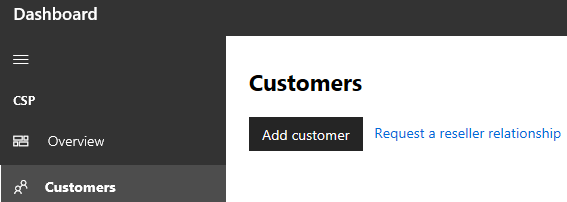
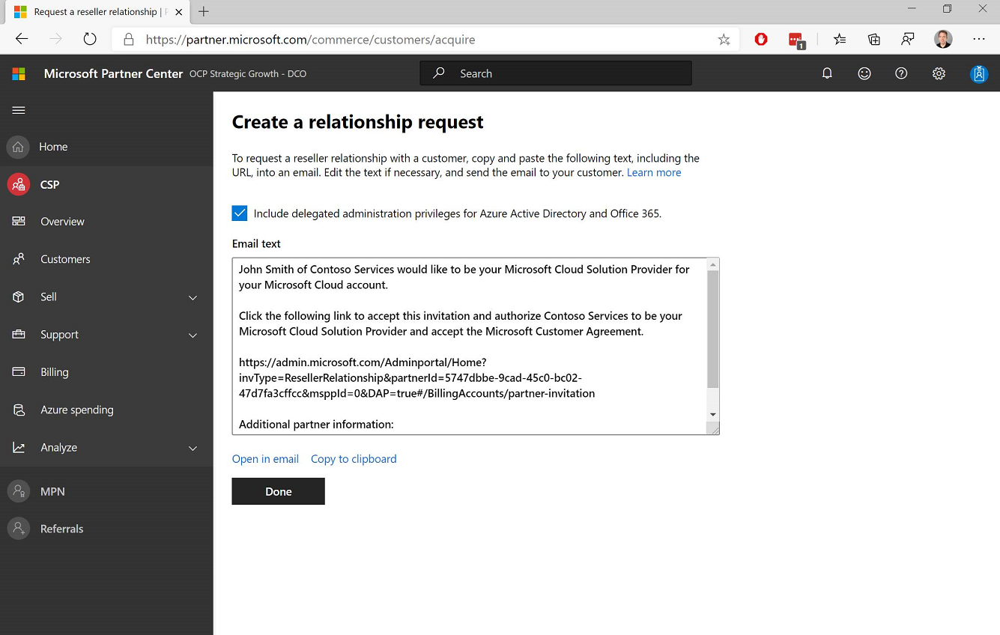
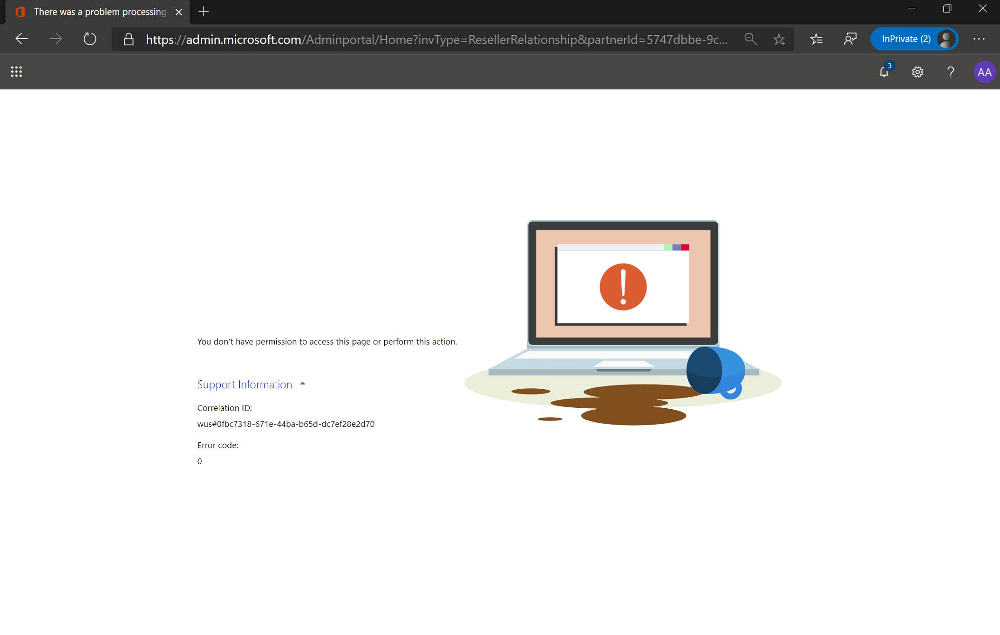
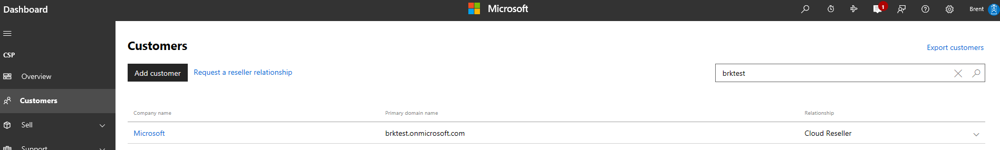
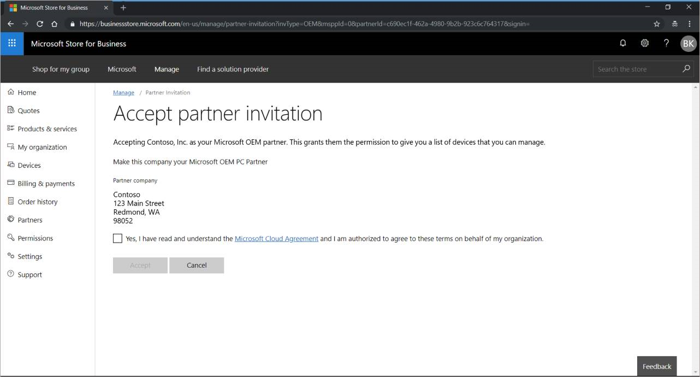
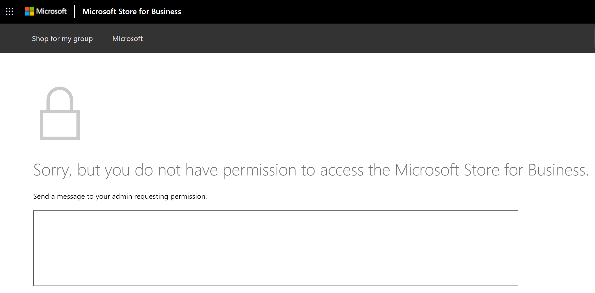

# Windows Autopilot customer consent

**Applies to: Windows 10**

This article describes how a cloud service provider (CSP) partner (direct bill, indirect provider, or indirect reseller) or an OEM can get customer authorization to register Windows Autopilot devices on the customer’s behalf.

## CSP authorization

CSP partners can get customer authorization to register Windows Autopilot devices on the customer’s behalf per the following restrictions:

<table>
<tr><td>Direct CSP<td>Gets direct authorization from the customer to register devices.
<tr><td>Indirect CSP Provider<td>Gets implicit permission to register devices through the relationship their CSP Reseller partner has with the customer.  Indirect CSP Providers register devices through Microsoft Partner Center.
<tr><td>Indirect CSP Reseller<td>Gets direct authorization from the customer to register devices.  At the same time, their indirect CSP Provider partner also gets authorization, which mean that either the Indirect Provider or the Indirect Reseller can register devices for the customer.  However, the Indirect CSP Reseller must register devices through the MPC UI (manually uploading CSV file), whereas the Indirect CSP Provider has the option to register devices using the MPC APIs.
</table>

### Steps

For a CSP to register Windows Autopilot devices on behalf of a customer, the customer must first grant that CSP partner permission using the following process:

1.	CSP sends link to customer requesting authorization/consent to register/manage devices on their behalf.  To do so:
    - CSP logs into Microsoft Partner Center
    - Click **Dashboard** on the top menu
    - Click **Customer** on the side menu
    - Click the **Request a reseller relationship** link:
    
    - Select the checkbox indicating whether or not you want delegated admin rights:
    
    - NOTE: Depending on your partner, they might request Delegated Admin Permissions (DAP) when requesting this consent.  You should ask them to use the newer DAP-free process (shown in this document) if possible. If not, you can easily remove their DAP status either from Microsoft Store for Business or the Office 365 admin portal:  https://docs.microsoft.com/en-us/partner-center/customers_revoke_admin_privileges
    - Send the template above to the customer via email.
2. Customer with global administrator privileges in Microsoft Store for Business (MSfB) clicks the link in the body of the email once they receive it from the CSP, which takes them directly to the following MSfB page:

    

    NOTE: A user without global admin privileges who clicks the link will see a message similar to the following:

    

3.	Customer selects the **Yes** checkbox, followed by the **Accept** button. Authorization happens instantaneously.
4.	The CSP will know that this consent/authorization request has been completed because the customer will show up in the CSP’s MPC account under their **customers** list, for example:

## OEM authorization

Each OEM has a unique link to provide to their respective customers, which the OEM can request from Microsoft via msoemops@microsoft.com.

1.	OEM emails link to their customer.
2.	Customer with global administrator privileges in Microsoft Store for Business (MSfB) clicks the link once they receive it from the OEM, which takes them directly to the following MSfB page:

    

    NOTE: A user without global admin privileges who clicks the link will see a message similar to the following:

    
3.	Customer selects the **Yes** checkbox, followed by the **Accept** button, and they’re done.  Authorization happens instantaneously.

4.	The OEM can use the Validate Device Submission Data API to verify the consent has completed.  This API is discussed in the latest version of the API Whitepaper, p. 14ff [https://devicepartner.microsoft.com/assets/detail/windows-autopilot-integration-with-oem-api-design-whitepaper-docx](https://devicepartner.microsoft.com/assets/detail/windows-autopilot-integration-with-oem-api-design-whitepaper-docx). **Note**: this link is only accessible by Microsoft Device Partners. As discussed in this whitepaper, it’s a best practice recommendation for OEM partners to run the API check to confirm they’ve received customer consent before attempting to register devices, thus avoiding errors in the registration process.

## Summary

At this stage of the process, Microsoft is no longer involved; the consent exchange happens directly between the OEM and the customer.  And, it all happens instantaneously - as quickly as buttons are clicked.

