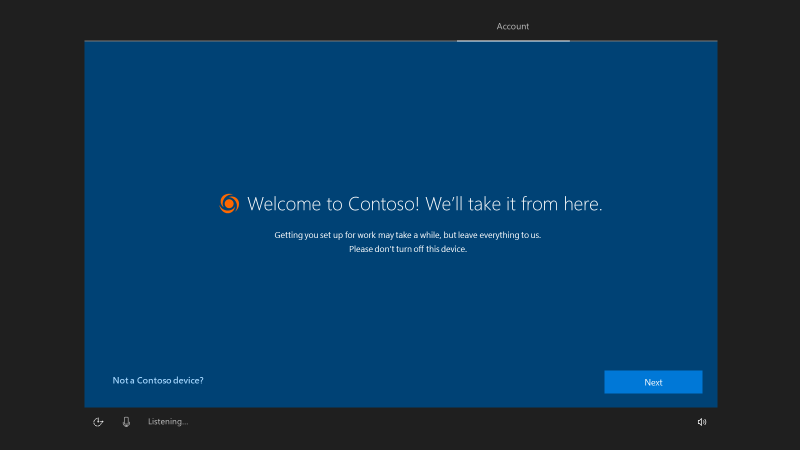

# Windows Autopilot Self-Deploying mode

**Applies to: Windows 10, version 1903 or later**

Windows Autopilot self-deploying mode enables a device to be deployed with little to no user interaction. For devices with an Ethernet connection, no user interaction is required; for devices connected via Wi-fi, no interaction is required after making the Wi-fi connection (choosing the language, locale, and keyboard, then making a network connection).  

Self-deploying mode joins the device into Azure Active Directory, enrolls the device in Intune (or another MDM service) leveraging Azure AD for automatic MDM enrollment, and ensures that all policies, applications, certificates, and networking profiles are provisioned on the device, leveraging the enrollment status page to prevent access to the desktop until the device is fully provisioned. 

>[!NOTE]
>Self-deploying mode does not support Active Directory Join or Hybrid Azure AD Join.  All devices will be joined to Azure Active Directory.

Self-deploying mode is designed to deploy Windows 10 as a kiosk, digital signage device, or a shared device. When setting up a kiosk, you can leverage the new Kiosk Browser, an app built on Microsoft Edge that can be used to create a tailored, MDM-managed browsing experience. When combined with MDM policies to create a local account and configure it to automatically log on, the complete configuration of the device can be automated. Find out more about these options by reading simplifying kiosk management for IT with Windows 10.  See [Set up a kiosk or digital sign in Intune or other MDM service](https://docs.microsoft.com/windows/configuration/setup-kiosk-digital-signage#set-up-a-kiosk-or-digital-sign-in-intune-or-other-mdm-service) for additional details.

>[!NOTE]
>Self-deploying mode does not presently associate a user with the device (since no user ID or password is specified as part of the process).  As a result, some Azure AD and Intune capabilities (such as BitLocker recovery, installation of apps from the Company Portal, or Conditional Access) may not be available to a user that signs into the device.

## Requirements

Because self-deploying mode uses a device’s TPM 2.0 hardware to authenticate the device into an organization’s Azure AD tenant, devices without TPM 2.0 cannot be used with this mode.  The devices must also support TPM device attestation.  (All newly-manufactured Windows devices should meet these requirements.)

>[!IMPORTANT]
>If you attempt a self-deploying mode deployment on a device that does not have support TPM 2.0 or on a virtual machine, the process will fail when verifying the device with an 0x800705B4 timeout error (Hyper-V virtual TPMs are not supported).. Also note that Window 10, version 1903 or later is required to use self-deploying mode due to issues with TPM device attestation in Windows 10, version 1809. Since Windows 10 Enterprise 2019 LTSC is based on Windows 10 version 1809, self-deploying mode is also not supported on Windows 10 Enterprise 2019 LTSC.

In order to display an organization-specific logo and organization name during the Autopilot process, Azure Active Directory Company Branding needs to be configured with the images and text that should be displayed.  See [Quickstart: Add company branding to your sign-in page in Azure AD](https://docs.microsoft.com/azure/active-directory/fundamentals/customize-branding) for more details. 

## Step by step

In order to perform a self-deploying mode deployment using Windows Autopilot, the following preparation steps need to be completed:

-   Create an Autopilot profile for self-deploying mode with the desired settings.  In Microsoft Intune, this mode is explicitly chosen when creating the profile. (Note that it is not possible to create a profile in the Microsoft Store for Business or Partner Center for self-deploying mode.)
-   If using Intune, create a device group in Azure Active Directory and assign the Autopilot profile to that group.  Ensure that the profile has been assigned to the device before attempting to deploy that device.
-   Boot the device, connecting it to Wi-fi if required, then wait for the provisioning process to complete.

## Validation

When performing a self-deploying mode deployment using Windows Autopilot, the following end-user experience should be observed:

-   Once connected to a network, the Autopilot profile will be downloaded.
-   If the Autopilot profile has been configured to automatically configure the language, locale, and keyboard layout, these OOBE screens should be skipped as long as Ethernet connectivity is available.  Otherwise, manual steps are required:
    -   If multiple languages are preinstalled in Windows 10, the user must pick a language.
    -   The user must pick a locale and a keyboard layout, and optionally a second keyboard layout.
-   If connected via Ethernet, no network prompt is expected.  If no Ethernet connection is available and Wi-fi is built in, the user needs to connect to a wireless network.
-   Windows 10 will check for critical OOBE updates, and if any are available they will be automatically installed (rebooting if required).
-   The device will join Azure Active Directory.
-   After joining Azure Active Directory, the device will enroll in Intune (or other configured MDM services).
-   The [enrollment status page](enrollment-status.md) will be displayed.
-   Depending on the device settings deployed, the device will either:
    -   Remain at the logon screen, where any member of the organization can log on by specifying their Azure AD credentials.
    -   Automatically sign in as a local account, for devices configured as a kiosk or digital signage.

>[!NOTE]
>Deploying EAS policies using self-deploying mode for kiosk deployments will cause auto-logon functionality to fail. 

In case the observed results do not match these expectations, consult the [Windows Autopilot Troubleshooting](troubleshooting.md) documentation.
