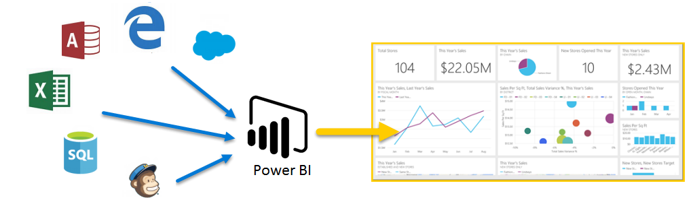

Welcome to **Guided Learning** for Power BI. This self-paced online course explains Power BI in a sequential way, so you can build your knowledge from the ground up.

The course is designed to provide guidance in understandable chunks, with logical flow that helps you absorb concepts, details, and examples. It includes lots of visuals and videos to help you learn, too.

This **Guided Learning** course contains many **sections**, and each section has many **topics**. After the first few topics in this **Getting Started** section, nearly every topic includes a video describing what you’ll learn. The content below the video further explains the concept, letting you review and learn at your own pace.

If you're a **beginner** with Power BI this course will get you going, and if you're a Power BI **veteran** this course will tie concepts together, and fill in the gaps. We hope you enjoy the course, and look forward to including more content in the future.

## What is Power BI?
**Power BI** is a collection of software services, apps, and connectors that work together to turn your unrelated sources of data into coherent, visually immersive, and interactive insights. Whether your data is a simple Excel spreadsheet, or a collection of cloud-based and on-premises hybrid data warehouses, **Power BI** lets you easily connect to your data sources, visualize (or discover) what’s important, and share that with anyone or everyone you want.

**Power BI** can be simple and fast – capable of creating quick insights from an Excel spreadsheet or a local database. But **Power BI** is also robust and enterprise-grade, ready for extensive modeling and real-time analytics, as well as custom development. So it can be your personal report and visualization tool, and can also serve as the analytics and decision engine behind group projects, divisions, or entire corporations.

## The parts of Power BI
Power BI consists of a Windows desktop application called **Power BI Desktop**, an online SaaS (*Software as a Service*) service called the **Power BI service**, and mobile Power BI **apps** available on Windows phones and tablets, as well as for iOS and Android devices.

These three elements – the **Desktop**, the **service**, and **Mobile** – are designed to let people create, share, and consume business insights in the way that serves them, or their role, most effectively.

## How Power BI matches your role
How you use Power BI may depend on your role in a project or on a team. And other people, in other roles, might use Power BI differently, which is just fine.

For example, you might primarily use the **Power BI service**, but your number-crunching, business-report-creating coworker might make extensive use of **Power BI Desktop** (and publish Desktop reports to the Power BI service, which you then view). And another coworker, in sales, might mainly use her Power BI phone app to monitor progress on her sales quotas, and to drill into new sales lead details.

You also might use each element of **Power BI** at different times, depending on what you’re trying to achieve or what your role is for a given project or effort.

Perhaps you view inventory and manufacturing progress in a real-time dashboard in the service, and also use **Power BI Desktop** to create reports for your own team about customer engagement statistics. How you use Power BI can be based on which feature or service of Power BI is the best tool for your situation – but each part of Power BI is available to you, which is why it’s so flexible and compelling.

We discuss these three elements – the **Desktop**, **service**, and **Mobile** apps – with more detail a little later in this **Guided Learning** course. We’ll also create reports in Power BI Desktop, share them in the service, and drill into them on our Mobile device in upcoming articles, too.

## The flow of work in Power BI
A common flow of work in Power BI begins in **Power BI Desktop**, where a report is created. That report is then published to the Power BI **service**, and then shared so users of **Power BI Mobile** apps can consume the information.

It doesn’t always happen that way, and that’s okay, but we’ll use that flow to help you learn the various parts of Power BI, and how they complement one another.

Okay, now that we have an overview of this course, what Power BI is, and its three main elements, let's take a look at what using **Power BI** is like.

