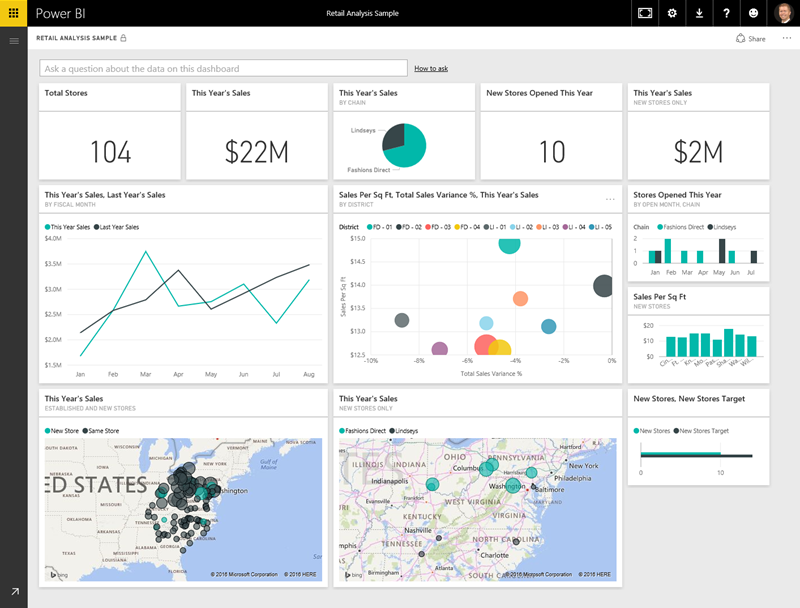
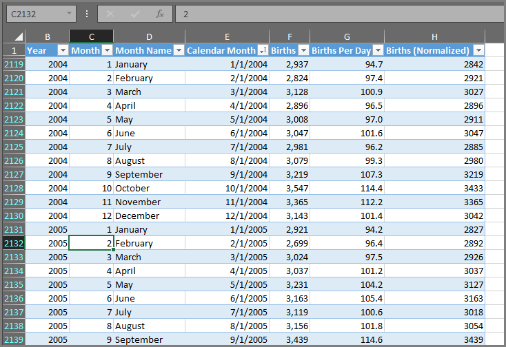
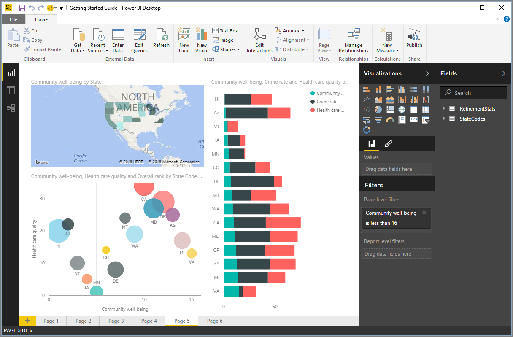
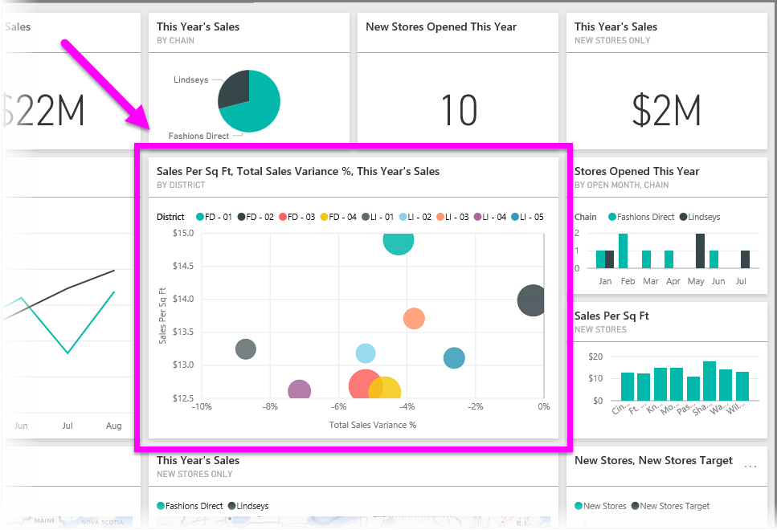

Everything you do in Power BI can be broken down into a few basic **building blocks**. Once you understand these building blocks, you can expand on each of them and begin creating elaborate and complex reports. After all, even seemingly complex things are built from basic building blocks – buildings are created with wood, steel, concrete and glass. Cars are made from metal, fabric, and rubber. Of course, buildings and cars can be basic or elaborate as well – depending on how those basic building blocks are arranged.

Let’s take a look at these basic building blocks, discuss some simple things that can be built with them, then provide a glimpse into how complex things can be created as well.

The basic building blocks in Power BI are the following:

* Visualizations
* Datasets
* Reports
* Dashboards
* Tiles

## Visualizations
A **visualization** (sometimes also referred to as a **visual**) is a visual representation of data, such as a chart, a graph, a color-coded map, or other interesting things you can create to represent your data visually. Power BI has all sorts of different visualization types, and more coming all the time. The following image shows a collection of different visualizations that were created in the Power BI service.

Visualizations can be simple – like a single number that represents something significant – or they can be visually complex – like a gradient-colored map that shows voter sentiment toward a certain social issue or concern. The goal of a visual is to present data in a way that provides context and insights, either of which would likely be difficult to discern from a raw table of numbers or text.

## Datasets
A **dataset** is a collection of data that Power BI uses to create its visualizations.

You can have a simple dataset based on a single table from Excel workbook, similar to what’s shown in the following image.

**Datasets** can also be a combination of many different sources, which you can filter and combine to provide a unique collection data (a dataset) for use in Power BI.

For example, you could create a dataset from three different database fields, one website table, an Excel table, and online results of an email marketing campaign. That unique combination is still considered a single **dataset**, even though it was pulled together from many different sources.

Filtering data before bringing it into Power BI lets you focus on the data that matters to you. For example, you could filter your contact database so only customers who received emails from the marketing campaign were included in the dataset. Then you could create visuals based on that subset (that filtered collection) of customers who were included in the campaign. Filtering helps you focus your data, and your efforts.

An important and enabling part of Power BI is the multitude of data **connectors** that are included. Whether the data you want is in Excel or an SQL database, in Azure or Oracle, or in a service like Facebook, Salesforce, or MailChimp, Power BI has built-in data connectors that let you easily connect to that data, filter it if necessary, and bring it into your dataset.

Once you have a dataset, you can begin creating visualizations that display different portions of that dataset in different ways, and with what you see, gain insights. That’s where reports come in.

## Reports
In Power BI, a **report** is a collection of visualizations that appear together on one or more pages. Just like any other report you might create for a sales presentation, or a report you would write for a school assignment, in Power BI a **report** is a collection of items that are related to one another. The following image shows a **report** in Power BI Desktop – in this case, it’s the fifth page in a six-page report. You can also create reports in the Power BI service.

Reports let you create many visualizations, on multiple different pages if necessary, and lets you arrange them in whatever way best tells your story.

You might have a report about quarterly sales, a report about product growth in a particular segment, or you might create a report about migration patterns of polar bears. Whatever your subject may be, reports let you gather and organize your visualizations onto one (or more) pages.

## Dashboards
When you’re ready to share a single page from a report, or share a collection of visualizations, you create a **dashboard**. Much like the dashboard in a car, a Power BI **dashboard** is a collection of visuals from a single page that you can share with others. Often, it’s a selected group of visuals that provide quick insight into the data or story you’re trying to present.

A dashboard has to fit on a single page, often called a canvas (the canvas is the blank backdrop in Power BI Desktop, or the service, where you place visualizations). Think of it like the canvas that an artist or painter uses – a workspace where you create, combine, and rework interesting and compelling visuals.
You can share dashboards with other users or groups, who can then interact with your dashboard when they’re in Power BI service, or on their mobile device.

## Tiles
In Power BI, a **tile** is a single visualization found in a report or on a dashboard. It’s the rectangular box that contains each individual visual. In the following image, you see one tile (highlighted by a bright box) which is also surrounded by other tiles.

When you’re *creating* a report or a dashboard in Power BI, you can move or arrange tiles however you want to present your information. You can make them bigger, change their height or width, and snuggle them up to other tiles however you want.

When you’re *viewing*, or *consuming* a dashboard or report – which means you’re not the creator or owner, but it’s been shared with you – you can interact with it, but not change the size of the tiles or change how they’re arranged.

## All together now
Those are the basics of Power BI, and its building blocks. Let’s take a moment to review.

Power BI is a collection of services, apps, and connectors that enables you to connect to your data – wherever it happens to reside – filter it if necessary, then bring it into Power BI where you can create compelling visualizations you can share with others.  

Now that you understand the handful of basic building blocks of Power BI, it becomes clear that you can create datasets that make sense *to you*, and create visually compelling reports that tell your story. Stories told with Power BI don’t have to be complex, or complicated, to be compelling.

For some people, using a single Excel table in a dataset, then sharing a dashboard with their team, will be an incredibly valuable way to use Power BI.

For others, using real-time Azure SQL Data Warehouse tables that combine with other databases and real-time source, which then get filtered in real-time to build a dataset that monitors moment-by-moment manufacturing progress will be the value in Power BI that they seek.

For both, the process is the same: create datasets, build compelling visuals, and share them with others. And similarly, the result of both (for each) is the same: harness your ever-expanding world of data, and turn it into actionable insights.

Whether your data insights require straightforward or complex datasets, Power BI helps you get started quickly, and can expand with your needs to be as complex as your world of data requires. And since Power BI is a Microsoft product, you can count on it being robust, extensible, Office-friendly, and enterprise-ready.

Now, let's see how this works. We'll start by taking a quick look at the Power BI service.

