In this topic, we take a closer look at how the first two parts of Power BI fit together:

* Create a report in **Power BI Desktop**
* Publish the report in the **Power BI service**

We’ll start in Power BI Desktop, and select **Get Data**. The collection of data sources appears, allowing you to choose a data source. The following image shows selecting a Web page as the source, in the video above, Will selected an **Excel** workbook.

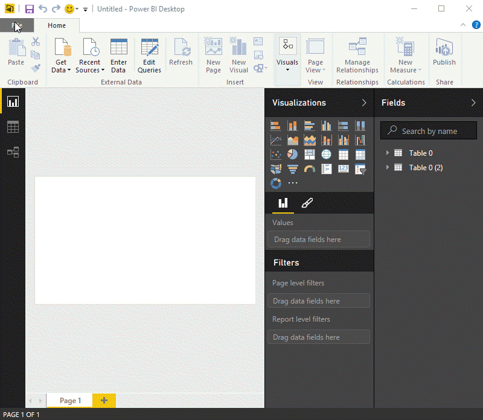

Regardless of which data source you choose, Power BI connects to that data source, and shows you the data available from that source. The following image is another example, this one is from a Web page that analyzes different states and some interesting retirement statistics.

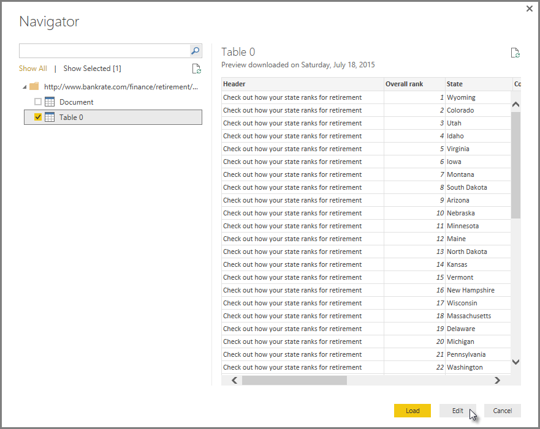

In Power BI Desktop **Report** view, you can begin to build reports.

The **Report** view has five main areas:

1. The ribbon, which displays common tasks associated with reports and visualizations
2. The **Report** view, or canvas, where visualizations are created and arranged
3. The **Pages** tab area along the bottom, which lets you select or add a report page
4. The **Visualizations** pane, where you can change visualizations, customize colors or axes, apply filters, drag fields, and more
5. The **Fields** pane, where query elements and filters can be dragged onto the **Report** view, or dragged to the **Filters** area of the **Visualizations** pane

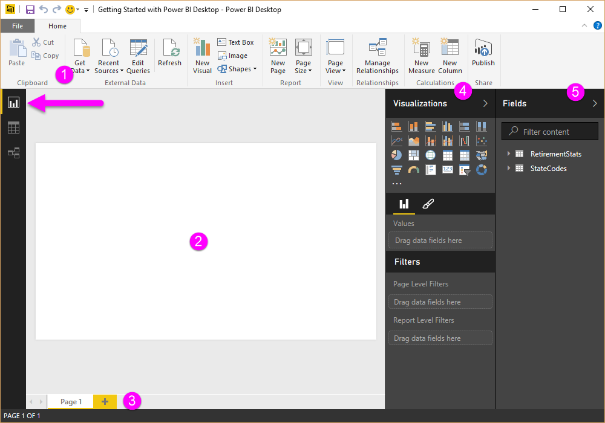

The **Visualizations** and **Fields** pane can be collapsed by selecting the small arrow along the edge, providing more space in the **Report** view to build cool visualizations. When modifying visualizations, you'll also see these arrows pointing up or down, which means you can expand or collapse that section, accordingly.

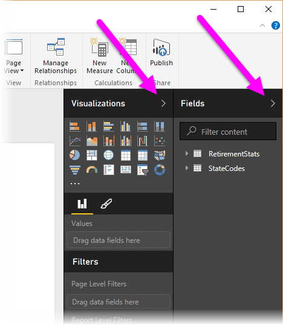

To create a visualization, just drag a field from the **Fields** list onto the **Report** view. In this case, let’s drag the State field from *RetirementStats*, and see what happens.

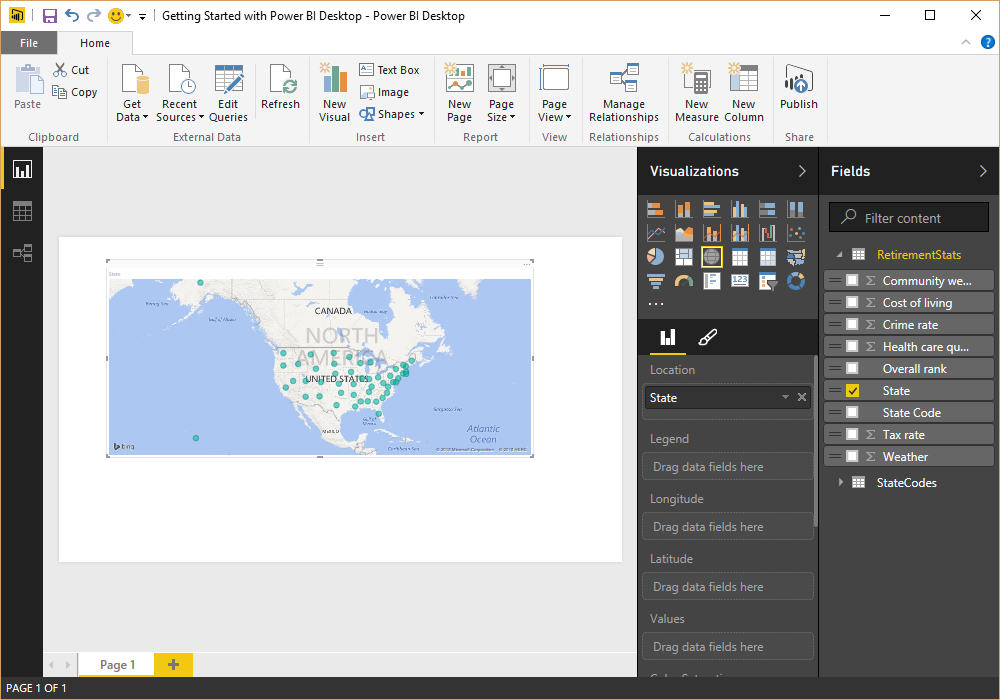

Look at that... Power BI Desktop automatically created a map-based visualization, because it recognized that the State field contained geolocation data.

Now let’s fast-forward a bit, and after creating a report with a few visualizations, we’re ready to publish this to the Power BI service. On the **Home** ribbon in Power BI Desktop, select **Publish**.

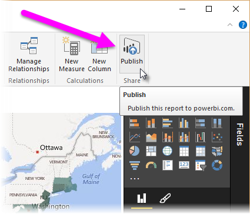

You’ll be prompted to sign in to Power BI.

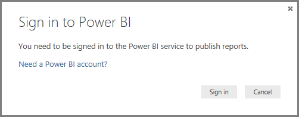

When you've signed in and the publish process is complete, you see the following dialog. You can select the link (below **Success!**) to be taken to the Power BI service, where you can see the report you just published.

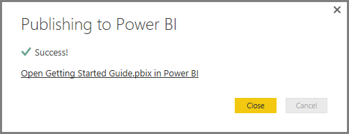

When you sign in to Power BI, you'll see Power BI Desktop file you just published in the service. In the image below, the report created in Power BI Desktop is shown in the **Reports** section.

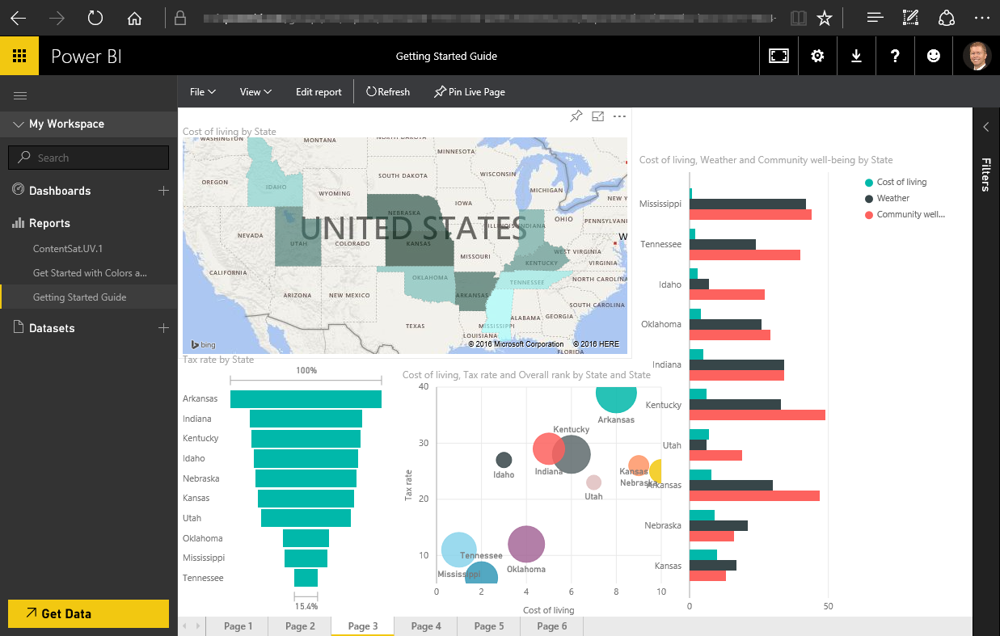

In that report, I can choose the **Pin** icon to pin that visual to a dashboard. The following image shows the pin icon highlighted with a bright box and arrow.

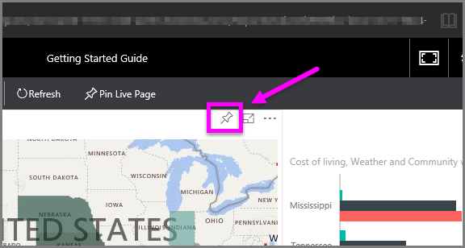

When I select that, the following dialog appears, letting me pin the visual to an existing dashboard, or to create a new dashboard.

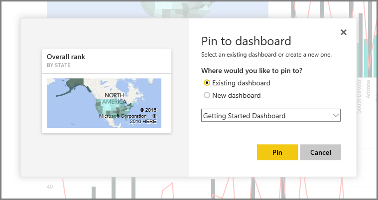

When we pin a couple of visuals from our report, we can see them in the dashboard.

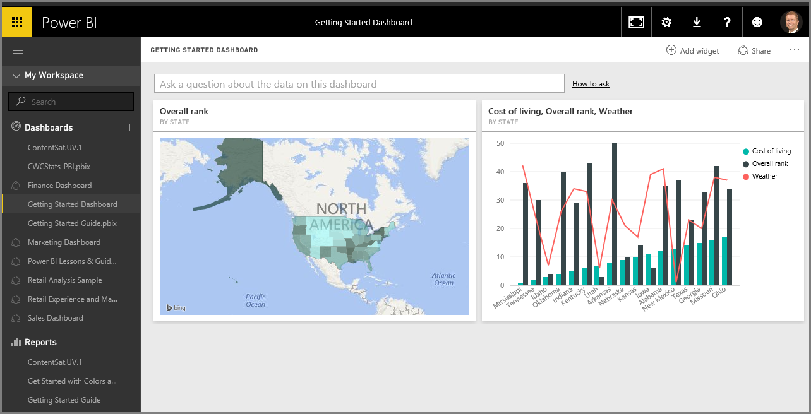

There’s a lot more you can do with Power BI, of course, such as sharing the dashboards you create. We'll discuss sharing later on in this course.

Next, we look at a feature that can automatically create dashboards for you, just by connecting to a cloud service like Facebook, Salesforce, and many others.

