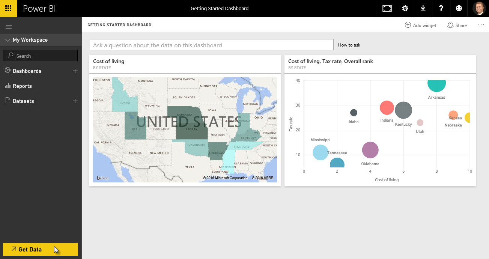
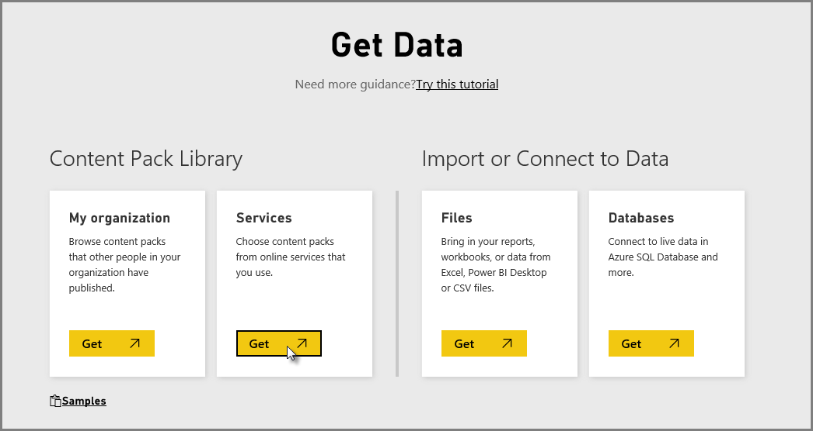
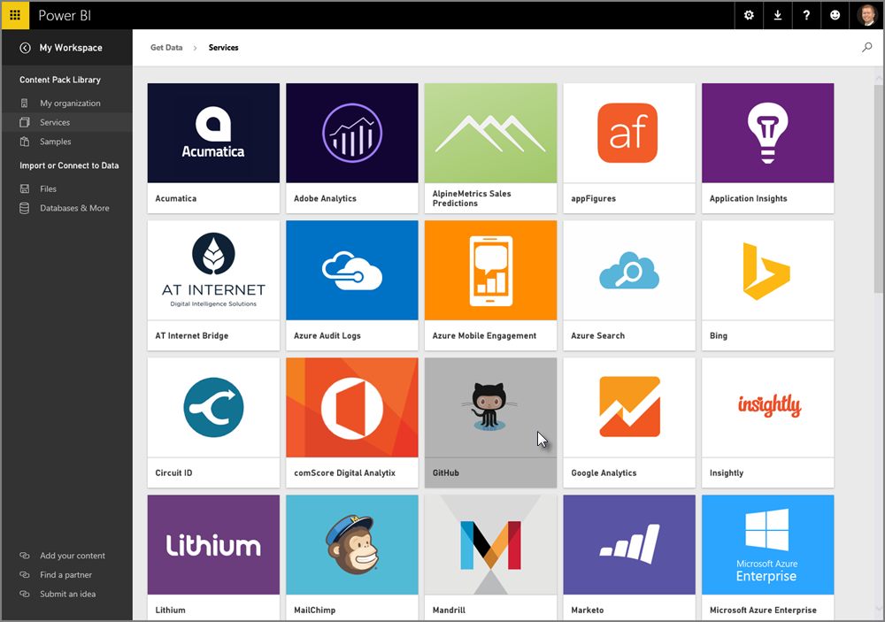
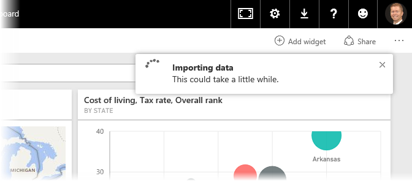
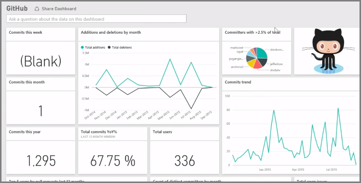
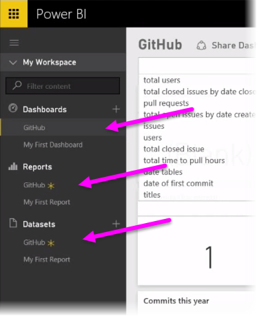
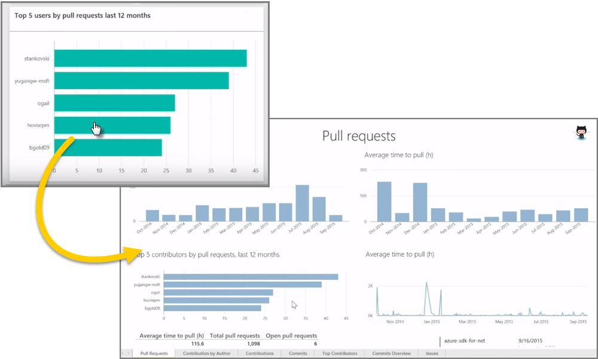
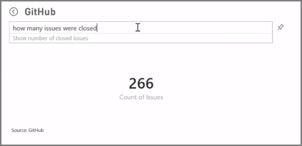
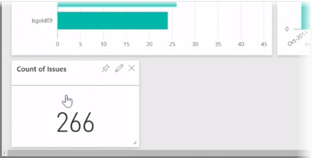

As we learned, the common flow of work in Power BI is to create a report in Power BI Desktop, publish it to the Power BI service, then share it with others so they can view it in the service or on a mobile app.

Some people begin in the Power BI service, though, so let's take a quick look at the service, and learn about an easy and popular way to quickly create visuals in Power BI: *content packs*.

A **content pack** is a collection of pre-configured, ready-made visuals and reports based on specific data sources, such as Salesforce. Using a content pack is like microwaving a TV dinner or ordering a fast-food value meal: with just a few clicks and comments, you're quickly served up a collection of entrees designed to go well together, all presented in a tidy, ready-to-consume package.

So let's take a quick look at content packs, the service, and how it works. We go into more detail about content packs (and the service) in upcoming sections; think of this as a bit of taste-testing to whet your appetite.

## Create out-of-the-box dashboards with cloud services
With Power BI, connecting to data is easy. From the Power BI service, you can simply select the **Get Data** button in the bottom left corner of the home screen.

The *canvas* (the area in the center of the Power BI service) shows you the available sources of data in the Power BI service. In addition to common data sources such as Excel files, databases, or Azure data, Power BI can connect to **software services** (also called SaaS providers, or cloud services) such as Salesforce, Facebook, Google Analytics, and a whole assortment of other SaaS services just as easily.

For these software services, the **Power BI service** provides a collection of ready-made visuals, pre-arranged in dashboards and reports called **Content Packs**. Content packs get you up and running in Power BI quickly with data from the service that you select. For example, when you use the Salesforce content pack, Power BI connects to your Salesforce account (once you provide your credentials) and then populates a pre-defined collection of visuals and dashboards in Power BI.

Power BI provides content packs for all sorts of services. The following image shows the first screen of services, in alphabetical order, that is displayed when you select **Get** from the **Services** box (shown in the previous image). As you can see from the image below, there are many to choose from.

For our purposes, we’ll choose **GitHub**. GitHub is an application for online source control. Once I enter the information and credentials for the GitHub content pack, it begins importing my data.

Once the data is loaded, the pre-defined GitHub content pack dashboard appears.

In addition to the **Dashboard**, the **Report** that was generated (as part of the GitHub content pack) to create the dashboard is available too, as is the **Dataset** (the collection of data pulled from GitHub) that was created during the data import, and used to create the GitHub Report.

On the Dashboard, you can click on any of the visuals, and automatically be taken to the **Report** page from which that visual was created. So when the **Top 5 users by pull requests** visual is clicked, Power BI opens the **Pull Requests** page in the Report (the Report page from which that visual was created).

## Asking questions of your data
You can also ask questions of your data, and the Power BI service will create visuals based on your question, in real time. In the following image, you can see Power BI creates a number visual showing the Count of Issues closed, based on what is typed in the **Natural Language Query** bar.

When you have a visual that you like, you can select the **Pin** icon, to the right of the Natural Language Query bar, to pin that visual to the dashboard. In this case, the visual is pinned to the GitHub dashboard, since that’s the dashboard currently selected.

## Refreshing data in the Power BI service
You can also choose to **refresh** the dataset for a content pack, or other data you use in Power BI. To set refresh settings, select the ellipses (the three dots) next to a data set, and a menu appears.

Select the **Schedule Refresh** option from the bottom of that menu. The Settings dialog appears on the canvas, letting you set the refresh settings that meet your needs.

That's enough for our quick look at the Power BI service. There are many more things you can do with the service, which we'll cover later in this course. Remember, too, that there are many different types of data you can connect to, and all sorts of content packs, with more of each coming all the time.

Okay, let's move to the next topic, where we summarize this **Getting Started** section, and get you ready for what's next.

