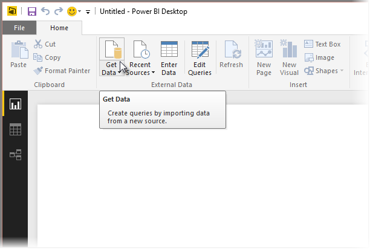
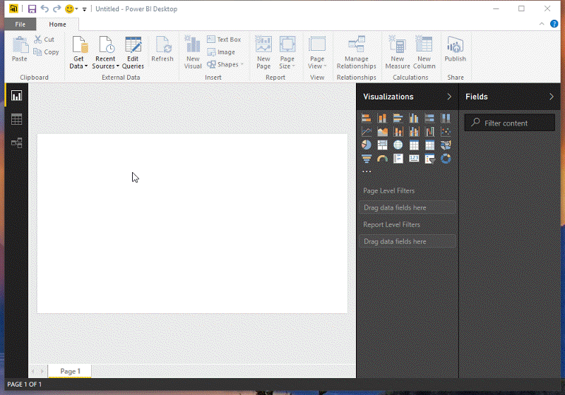
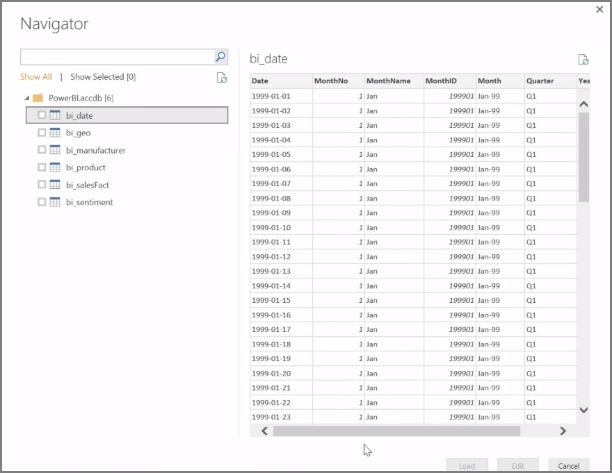
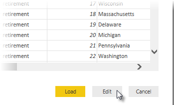

**Power BI Desktop** can connect to a whole range of data sources, including on-premises databases, Excel workbooks, and cloud services. Currently, over 59 different cloud services such as GitHub and Marketo have specific connectors, and you can connect to generic sources through XML, CSV, text, and ODBC. Power BI will even scrape tabular data directly from a website URL! But let's start from the beginning, with opening Power BI Desktop and connecting to data.

When you start **Power BI Desktop** and move past the Start Screen, you can choose Get Data from the ribbon on the **Home** tab.

There are monthly updates to Power BI Desktop, and with each update, the **Power BI Desktop What's New** page gets updated with information about the updates, links to the blog, and a download link.

In Power BI Desktop, there are all sorts of different data sources available. Select a source to establish a connection. Depending on your selection, you will be asked to find the source on your computer or network, or be prompted to sign in to a service to authenticate your request.

After connecting, the first window you'll see is the **Navigator**. The Navigator displays the tables or entities of your data source, and clicking on one gives you a preview of its contents. You can then import your selected tables or entities immediately, or select **Edit** to transform and clean your data before importing.

Once you've selected the tables you'd like to bring into Power BI Desktop, you can choose to load them into Power BI Desktop by selecting the **Load** button in the bottom right corner of **Navigator**. There are times, however, where you might want to make changes to those tables before you load them into Power BI Desktop. You might want only a subset of customers, or filter that data for sales that occurred only in a specific country. In those cases, you can select the Edit button and filter or transform that data before bringing it all into Power BI Desktop.

We'll pick up there, and edit our data, in the next section.

