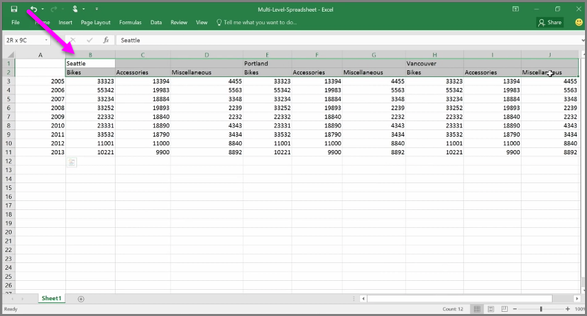
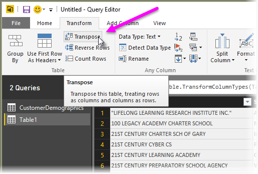
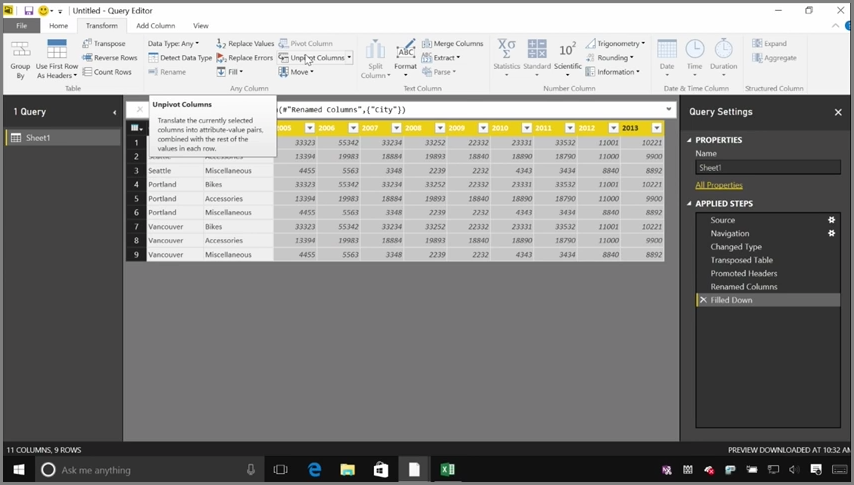
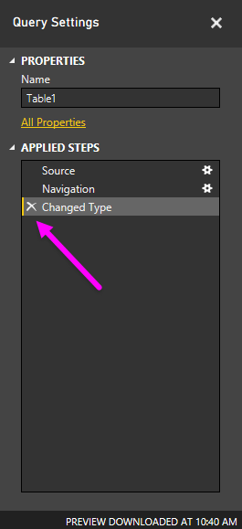
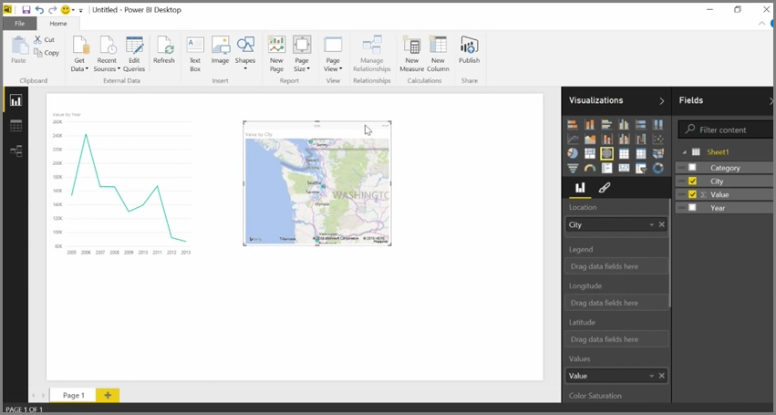

While Power BI can import your data from almost any source, its visualization and modeling tools work best with columnar data. Sometimes your data will not be formatted in simple columns, which is often the case with Excel spreadsheets, where a table layout that looks good to the human eye is not necessarily optimal for automated queries. For example, the following spreadsheet has headers that span multiple columns.

Fortunately, Power BI has tools to quickly transform multi-column tables into datasets that you can use.

## Transpose data
For example, using **Transpose** in **Query Editor**, you can flip data (turn columns to rows, and rows into columns) so you can break data down into formats that you can manipulate.

Once you do that a few times, as described in the video, your table begins to shape into something that Power BI can more easily work with.

## Format data
You also may need to format data, so Power BI can properly categorize and identify that data once it's imported.

With a handful of transformations, including *promoting rows into headers* into to break headers, using **Fill** to turn *null* values into the values found above or below in a given column, and **Unpivot Columns**, you can cleanse that data into a dataset that you can use in Power BI.

With Power BI, you can experiment with these transformations on your data, and determine which types get your data into the columnar format that lets Power BI work with it. And remember, all actions you take are recorded in the Applied Steps section of Query Editor, so if a transformation doesn't work the way you intended, you can simply click the **x** next to the step, and undo it.

## Create visuals
Once your data is in a format that Power BI can use, by transforming and cleansing the data, you can begin to create visuals.

## Next steps
**Congratulations!** You've completed this section of the **Guided Learning** course for Power BI. You now know how to **get data** into Power BI Desktop, and how to *shape* or *transform* that data, so you can create compelling visuals.

The next step in learning how Power BI works, and how to make it work *for you*, is to understand what goes into **modeling**. As you learned, a **dataset** is a basic building block of Power BI, but some datasets can be complex and based on many different sources of data. And sometimes, you need to add your own special touch (or *field*) to the dataset you create.

You'll learn about **modeling**, and a whole lot more, in the next section. See you there!

