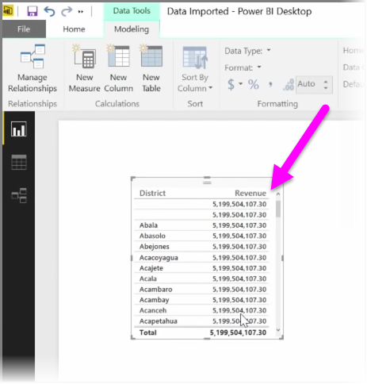
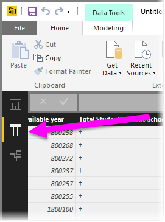
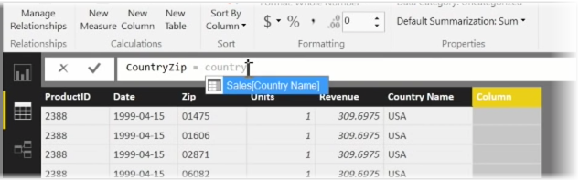
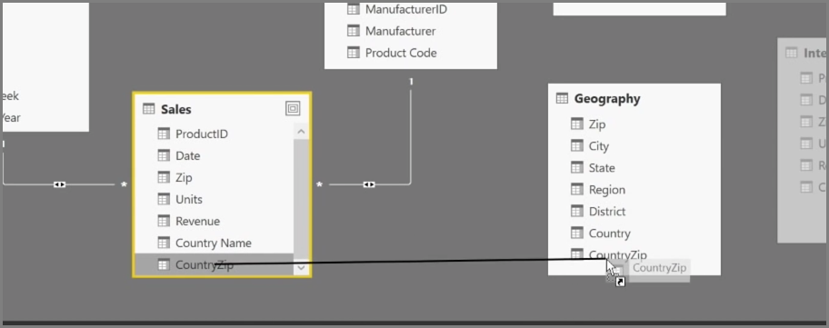
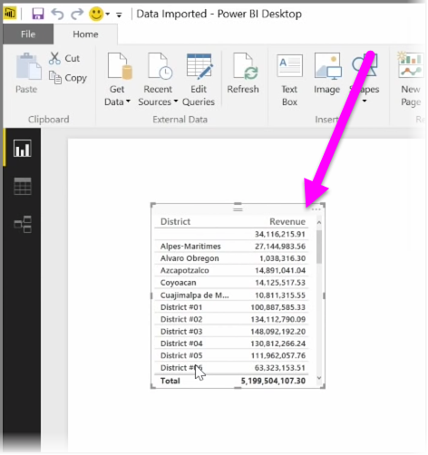

Creating calculated columns is a simple way to enrich and enhance your data. A **calculated column** is a new column that you create by defining a calculation that transforms or combines two or more elements of existing data. For example, you can create a new column by combining two columns into one.

One useful reason for creating a calculated column is to establish a relationship between tables, when no unique fields exist that can be used to establish a relationship. The lack of a relationship becomes apparent when you create a simple table visual in Power BI Desktop, and you get the same value for all entries, yet you know the underlying data is different.

To create a relationship with unique fields in data, you can, for example, create a new calculated column for "Full Phone Number" by combining the values from the "Area Code" and "Local Number" columns when those values exist in your data. Calculated columns are a useful tool for quickly creating models and visualizations.

To create a calculated column, select the **Data view** in Power BI Desktop from the left side of the report canvas.

From the Modeling tab, select **New Column**. This will enable the formula bar where you can enter calculations using DAX (Data Analysis Expressions) language. DAX is a powerful formula language, also found in Excel, that lets you build robust calculations. As you type a formula, Power BI Desktop displays matching formulas or data elements to assist and accelerate the creation of your formula.

The Power BI formula bar will suggest specific DAX functions and related data columns as you enter your expression.

Once the calculated columns are created in each table, they can be used as a unique key to establish a relationship between them. Going to **Relationship** view, you can then drag the field from one table to the other to create the relationship.

Returning to **Report** view, you now see a different value for each district.

There are all sorts of other things you can do by creating calculated columns, too.

