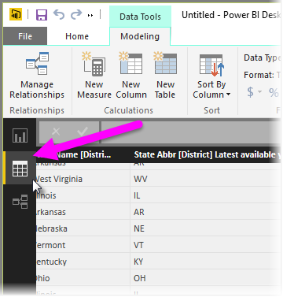
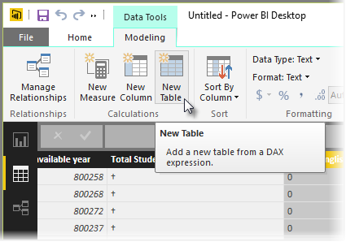
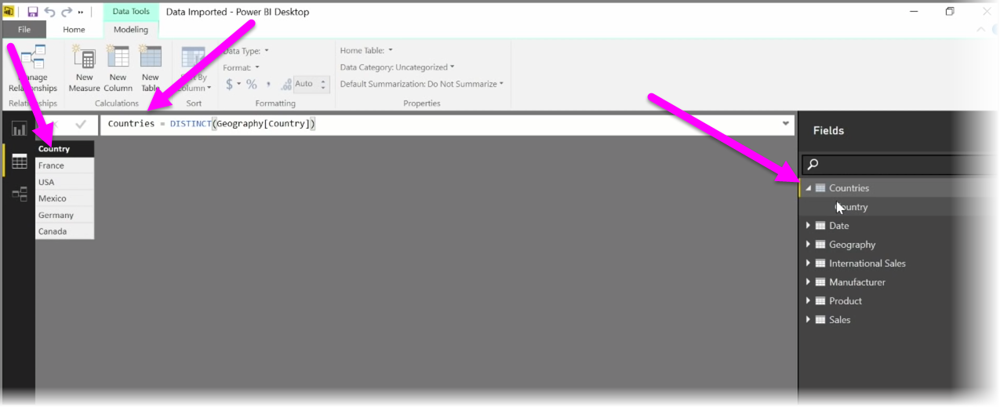

Calculated tables are a function within DAX that allows you to express a whole range of new modeling capabilities. For example, if you want to do different types of merge joins or create new tables on the fly based on the results of a functional formula, calculated tables are the way to accomplish that.

To create a calculated table, go to **Data view** in Power BI Desktop, which you can activate from the left side of the report canvas.

Select **New Table** from the Modeling tab to open the formula bar.

Type the name of your new table on the left side of the equal sign, and the calculation that you want to use to form that table on the right. When you're finished your calculation, the new table appears in the Fields pane in your model.

Once created, you can use your calculated table as you would any other table in relationships, formulas, and reports.

