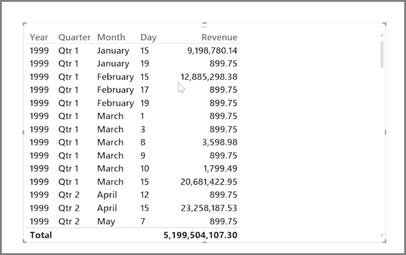
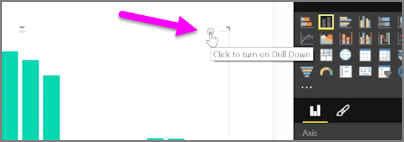
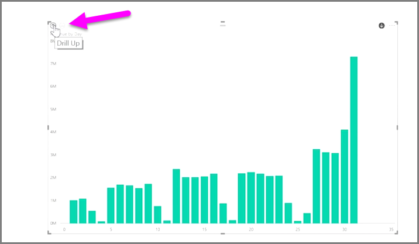
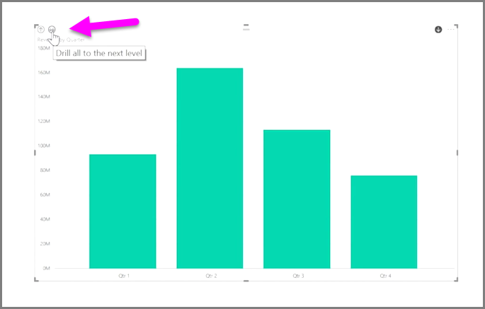
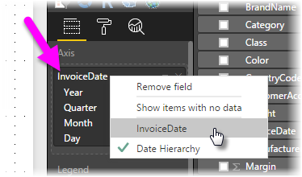
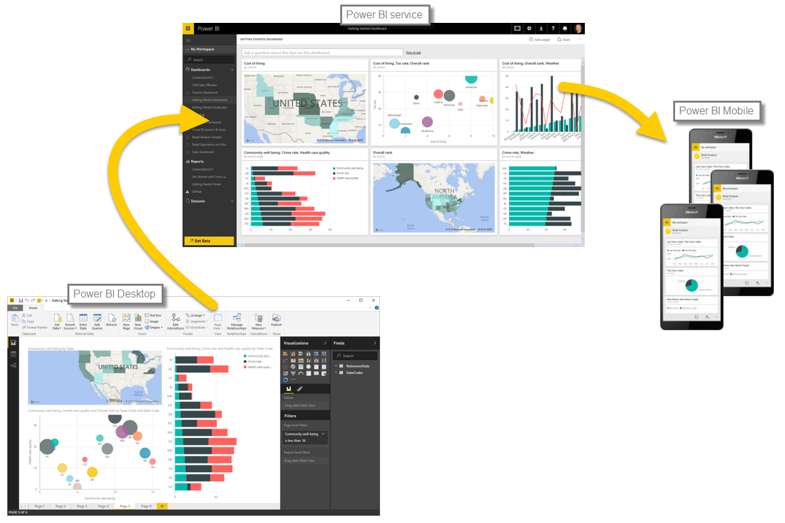

It's easy to analyze time-based data with Power BI. The modeling tools in Power BI Desktop automatically include generated fields that let you drill down through years, quarters, months, and days with a single click.  

When you create a table visualization in your report using a date field, Power BI Desktop automatically includes breakdowns by time period. For example, the single date field in the **Date** table was automatically separated into Year, Quarter, Month and Day by Power BI, as shown in the following image.

Visualizations display data at the *year* level by default, but you can change that by turning on **Drill Down** in the top right-hand corner of the visual.

Now when you click on the bars or lines in your chart, it drills down to the next level of time hierarchy, for example from *years* to *quarters*. You can continue to drill down until you reach the most granular level of the hierarchy, which in this example is *days*. To move back up through the time hierarchy, click on **Drill Up** in the top left-hand corner of the visual.

You can also drill down through all of the data shown on the visual, rather than one selected period, by using the **Drill All** double-arrow icon, also in the top right-hand corner of the visual.

As long as your model has a date field, Power BI will automatically generate different views for different time hierarchies.

To get back to individual dates rather than using the date hierarchy, simply right-click the column name in the **Fields** well (in the following image, the name of the column is *InvoiceDate*), then select the column name from the menu that appears, rather than **Date Hierarchy**. Your visual then shows the data based on that column data, without using the date hierarchy. Need to go back to using the date hierarchy? No problem - just right-click again and select **Date Hierarchy** from the menu.

## Next steps
**Congratulations!** You've completed this section of the **Guided Learning** course for Power BI. Now that you know about *modeling* data, you're ready to learn about the fun stuff waiting in the next section: **Visualizations**.

As mentioned before, this course builds your knowledge by following the common flow of work in Power BI:

* Bring data into **Power BI Desktop**, and create a report.
* Publish to the Power BI service, where you create new **visualizations** and build dashboards
* **Share** your dashboards with others, especially people who are on the go
* View and interact with shared dashboards and reports in **Power BI Mobile** apps

While you might not do all that work yourself, you'll *understand* how those dashboards were created, and how they connected to the data... and when you're done with this course, you'll be able to create one of your own.

See you in the next section!

