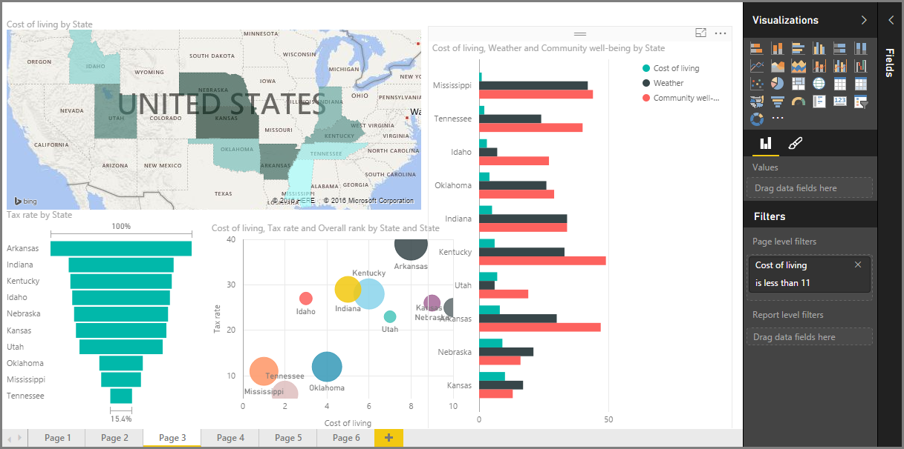

Welcome to the **Visualizations** section of the **Guided Learning** course for Power BI. Get ready for a fun, interesting, and enlightening tour of the many, many visualizations Power BI has to offer. And this isn't all of them - there are more visualizations coming all the time!

Of course, visuals are the end-result of any business intelligence undertaking... we want to take data, present it in a compelling and insightful way, and *show* what stands out. And Power BI has all sorts of compelling visuals - and a nearly limitless way to customize them - so this is an important section!

It might seem like there are lots of topics in this section, but don't worry: each topic is short, filled with (you guessed it) visuals, and easy to absorb. You'll likely find yourself cruising through this section, and imagining how you'll make these visuals present your own data.

We'll start with the mainstays of visualizations - the simple visuals we're all familiar with - and make sure you know the ins and outs. Then we'll get more advanced, or at least a little less common, and fill up your report-creating toolbox.

Have fun - there's a lot to learn here!

## Introduction to visuals in Power BI
Visualizing data is one of the core parts of Power BI - a basic building block as we defined it earlier in this course - and creating visuals is the easiest way to find and share your insights.

Power BI has a whole range of visualizations available by default, from simple bar charts to pie charts to maps, and even more esoteric offerings like waterfalls, funnels, gauges, and more. Power BI Desktop also offers extensive page formatting tools, such as shapes and images, that help bring your report to life.

