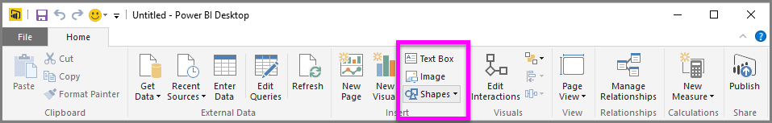
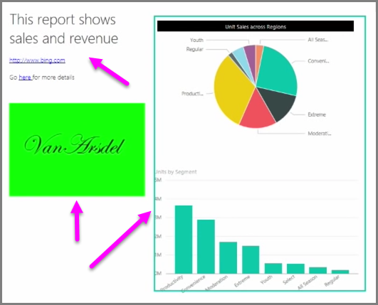

Along with data-bound visuals, you can also add static elements such as text boxes, images, and shapes to improve the visual design of your reports. To add a visual element, select **Text Box**, **Image**, or **Shapes** from the **Home** tab.

**Text boxes** are an ideal way to display large titles, captions, or short paragraphs of information along with your visualizations. Text boxes can include links, either through a written URL or by highlighting an anchor phrase and selecting the link symbol on the text box options bar. You can include URLs in text boxes, and Power BI automatically detects the link, and makes it live.

Selecting **Image** will open a file browser where you can select the image from your computer or other networked source. By default, resizing an image in your report will maintain its aspect ratio, but this can be disabled in the visual formatting options.

**Shapes** have five different options for form, including rectangles and arrows. Shapes can be opaque, or transparent with a colored border. (The latter is useful for creating borders around groups of visualizations.)

