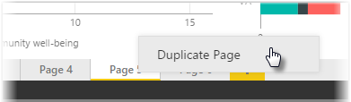

Individual pages of a report can be quite complex, with multiple visualizations that interact in specific ways and have precise formatting. Occasionally when building a report, you may want to use the same visuals and layouts for two different page topics. For example, if you've just put together a report page on gross revenue, you may want an almost identical page on net revenue.

Recreating all of your work would be difficult, but with Power BI Desktop you can just duplicate a report page.

Right-click on the tab you want to copy, and select **Duplicate Page**.

You can then rename the new page tab as appropriate, update the text title if you have one, and then update your visuals with the new field you want to track.

