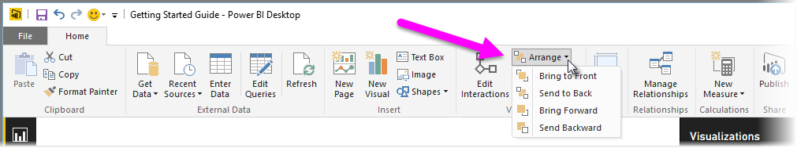
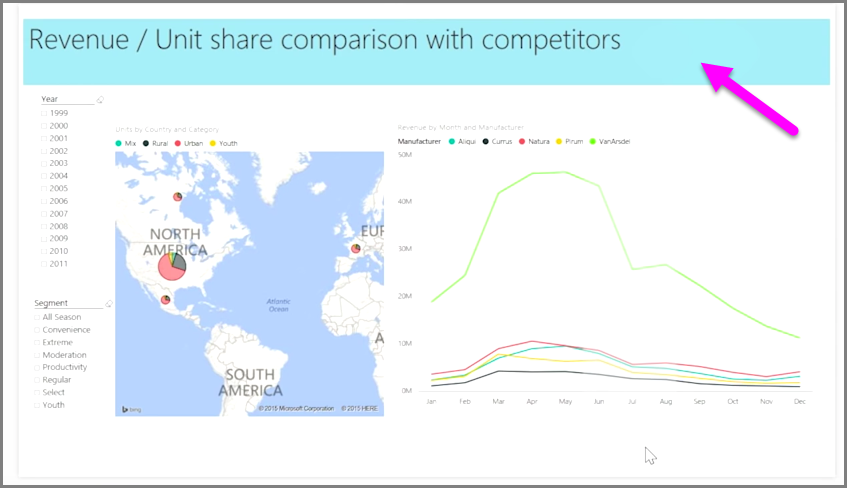

When you have lots of elements on a report, Power BI lets you manage how they overlap with each other. How items are layered, or arranged on top of one another, is often referred to as the z-order.

To manage the z-order of elements in a report, select an element, and use the **Arrange** button on the **Home** tab of the ribbon to change its z-order.

By using the options in the **Arrange** button menu, you can get the ordering of elements on your report just the way you want it. You can move a visual one layer forward or backward, or send it all the way to the front of the back of the order.

Using the Arrange button is particularly useful when using shapes as decorative backgrounds or borders, or to highlight particular sections of an individual chart or graph. You can also use them to create a background, such as the following light-blue rectangle being used for a report title background.

