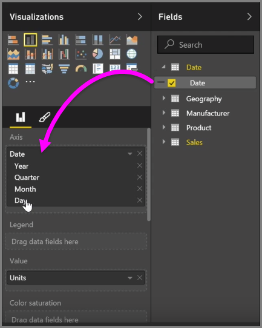
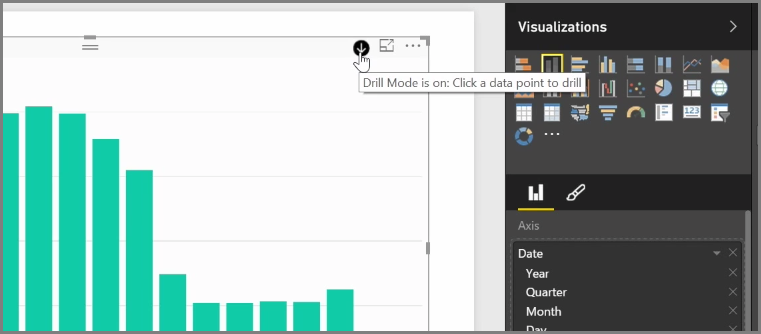
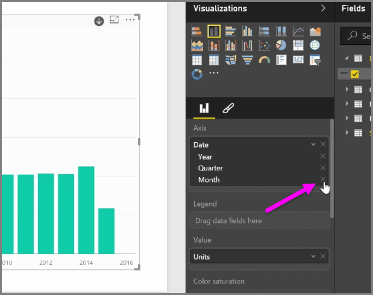
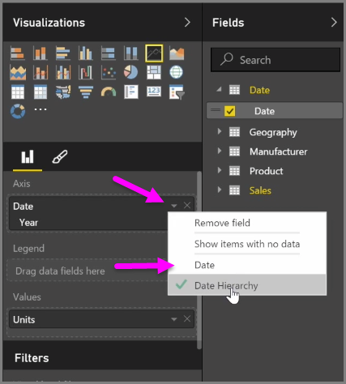
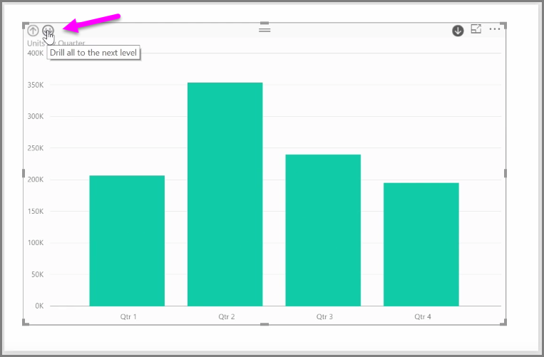

When you add a *date* field to a visual in the *Axis* field bucket, Power BI automatically adds a time hierarchy that includes *Year*, *Quarter*, *Month* and *Day*. By doing this, Power BI allows your visuals to have time-based interaction with those viewing your reports, by letting users drill-down through those different time levels.

With a hierarchy in place, you can begin drilling down through the time hierarchy. For example, clicking a year in the chart drills down to the next level in the hierarchy, in this case *Quarters*, which are then displayed in the visual.

In that automatically created hierarchy, you can also manage to which level your shared report allows people to drill. To do this, in the Visualizations pane, simply click the X beside the hierarchy that you want to remove. The deleted level is removed from the report, and drilling no longer displays that level.

If you need to get that level of the hierarchy back, just remove the *date* field, and then add it again from the **Fields** pane, and the hierarchy is once again created for you automatically.

There may be times when you don't want the hierarchy to be used for a visual. You can control that by selecting the down-arrow button beside the *Date* field (once you've added it to a visual), and select **Date** rather than **Date Hierarchy**. That prompts Power BI to show the raw date values in the visual.

You can also expand all data elements currently visible at once, rather than selecting a single quarter, or a single year. To do that, select the *Drill all* icon in the top left of the visual, which is a double-down arrow icon.

