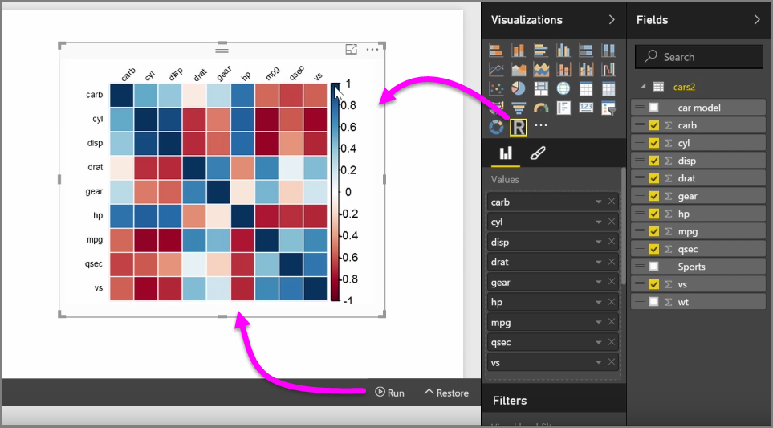
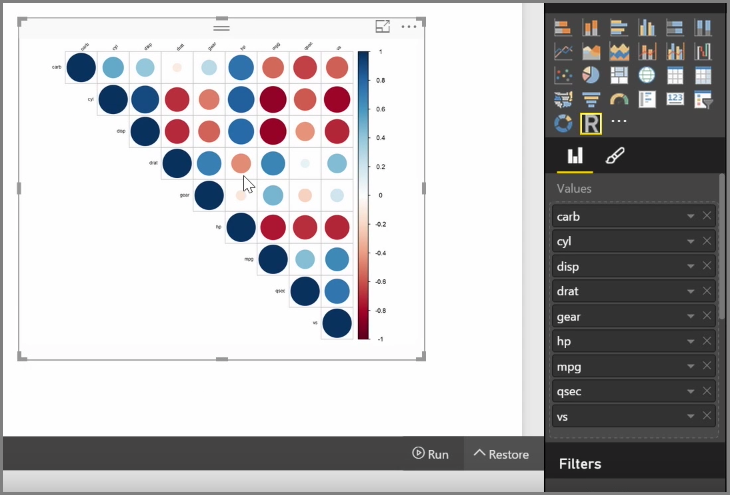

With Power BI Desktop, you can perform analytical and statistical analysis and create compelling visuals by integrating with R. You can host those R visualizations within the Power BI Desktop report.

When you select the **R visual** icon from the **Visualizations** pane, Power BI creates a placeholder on the canvas to host your R visual, and then presents an R script editor for you to use right on the canvas. As you add fields to the R visual, Power BI Desktop adds them to the R script editor pane.

Below what Power BI generates in the R script editor, you can begin creating your R script to generate the visual. Once your script is complete, select **Run** and the following occurs:

1. The data added to the visual (from the **Fields** pane) is sent from Power BI Desktop to the local installation of R
2. The script created in the Power BI Desktop R script editor is run on that local installation of R
3. Then Power BI Desktop gets a visual back from the R installation, and displays it on the canvas

It all happens quite quickly, and the result appears in the **R visual** visualization on the canvas.

You can change the R visual by adjusting the R script, and then selecting **Run** again. In the following image, we changed the visual to display circles instead of squares.

And since the R visual is just like any other visual in Power BI Desktop, you can interact with it and make connections with other visuals on the canvas as well. When you interact with other visuals on the canvas, through filtering or highlighting, the R visual automatically reacts just like any other Power BI visual, without needing to adjust the R script.

It's a great way to use the power of R, right in Power BI Desktop.

## Next steps
**Congratulations!** You've completed this **Visualizations** section of the **Guided Learning** course for Power BI. You can consider yourself well-versed in the many visualizations offered in Power BI, and also knowledgeable about how to use, modify, and customize them. And good news: visualizations are essentially the same in Power BI Desktop and the Power BI service, so what you learned applies to both.

You're now ready to head to the cloud and get immersed in the Power BI service, where you can **Explore Data**. As you know, the flow of work looks something like the following:

* Bring data into **Power BI Desktop**, and create a report.
* Publish to the Power BI service, where you create new **visualizations** and build dashboards
* **Share** your dashboards with others, especially people who are on the go
* View and interact with shared dashboards and reports in **Power BI Mobile** apps

Whether you create reports or just view and interact with them, you now know how all those cool visuals are created, and how they connected to the data. Next we get to see those visuals and reports in action.

See you in the next section!

