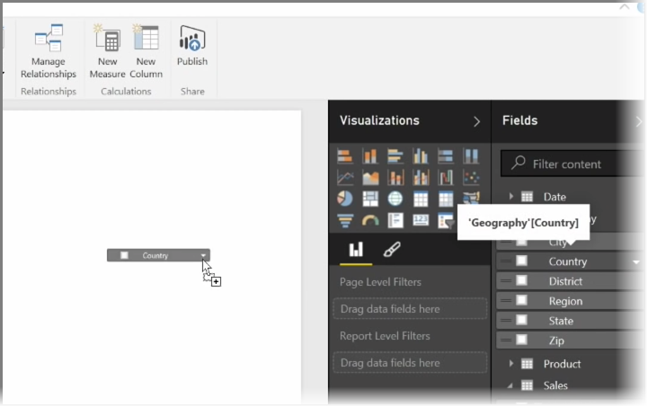
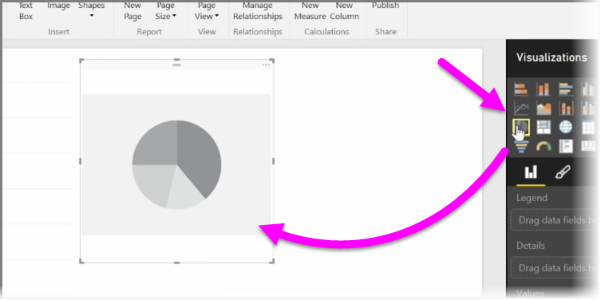
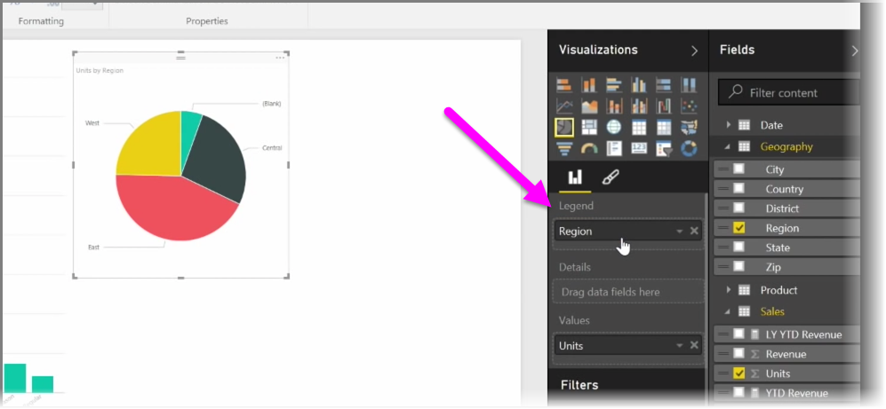
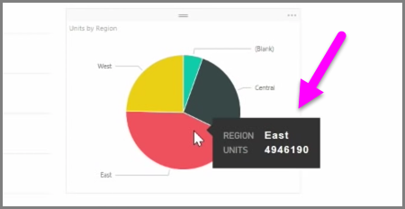
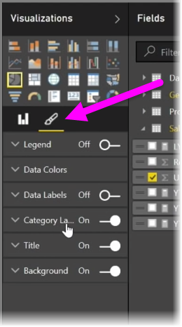

In this article you learn how to create new bar charts, pie charts, and treemaps, and customize them to suit your reports.

There are two different ways to create a new visualization in Power BI Desktop:

* You can drag field names from the **Fields** pane, and drop them on the report canvas. By default your visualization appears as a table of data.
  
  
* You can also click the type of visualization you want to create in the **Visualizations** pane. With this method, the default visual is a blank placeholder that resembles the type of visual you selected.
  
  

Once you create your graph, map, or chart, you can begin dragging data fields onto the bottom portion of the **Visualization** pane to build and organize your visual. The available fields will change based on the type of visualization that you selected. As you drag and drop data fields, your visualization will automatically update to reflect changes.

You can resize your visualization by selecting it and then dragging the handles in or out. You can also move your visualization anywhere on the canvas by clicking and then dragging it. If you want to convert between different types of visualizations, select the visual you want to change and simply select a different visual from the icons in the **Visualization** pane. Power BI attempts to convert your selected fields to the new visual type as closely as possible.

As you hover over parts of your visualizations, you'll get a tooltip that contains details about that segment, such as labels and total value.

Select the **paintbrush** icon on the **Visualizations** pane to make cosmetic changes to your visual, such as background alignment, title text, and data colors.

The available options for cosmetic changes to your visual vary depending on the type of visual you have selected.

