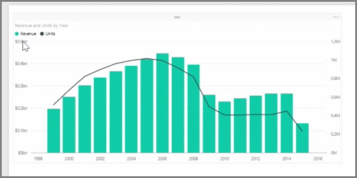
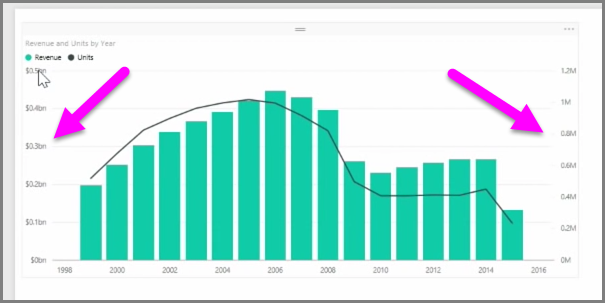
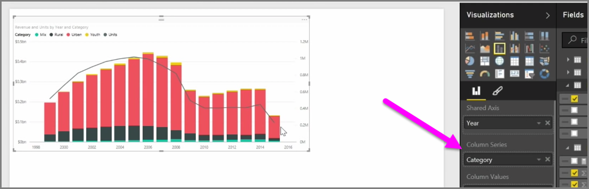

When you want to visualize two measures that have very different scales, such as revenue and units, a **combination chart** that shows a line and a bar with different axis scales is very useful. Power BI supports many different types of combination charts by default, including the popular **Line** and **Stacked Columns** charts.

When you create a combination chart, you're presented with a field for **Shared Axis** (the X-axis), and then values for your two fields, in this case a column and a line. The two Y-axis legends appear on either side of the visualization.

You can also split each column by category, by dragging a category into the Column Series field in the Visualizations pane. When you do so, each bar is proportionately colored based on the values within each category.

Combination charts are an effective way to visualize multiple measures that have very different scales in a single visualization.

