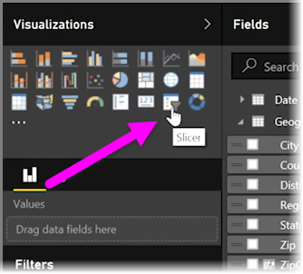
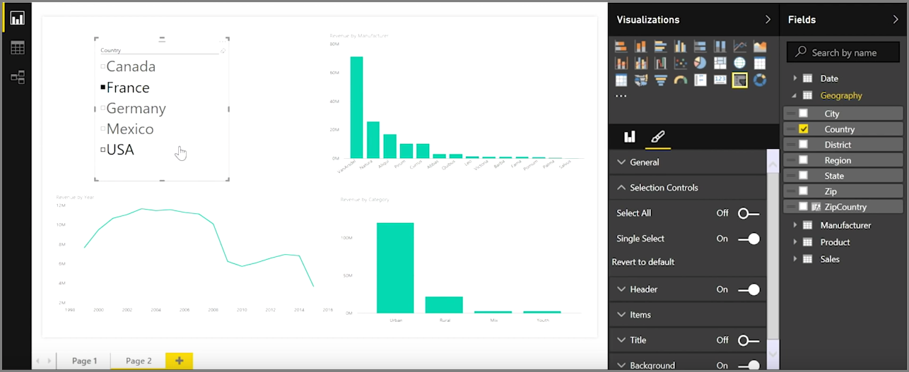
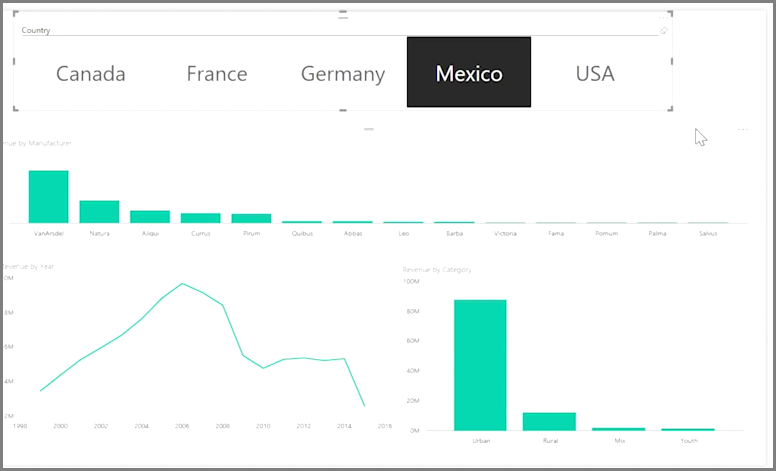

Slicers are one of the most powerful types of visualizations, particularly as part of a busy report. A **slicer** is an on-canvas visual filter in **Power BI Desktop** that lets anyone looking at a report segment the data by a particular value, such as by year or by geographical location.

To add a slicer to your report, select **Slicer** from the **Visualizations** pane.

Drag the field by which you want to slice and drop it top of the slicer placeholder. The visualization turns into a list of elements with checkboxes. These elements are your filters - select the box next to one to segment, and all other visualizations on the same report page are filtered, or *sliced*, by your selection.

There are a few different options available to format your slicer. You can set it to accept multiple inputs at once, or toggle **Single Select** mode to use one at a time. You can also add a **Select All** option to your slicer elements, which is helpful when you have a particularly long list. Change the orientation of your slicer from the vertical default to horizontal, and it becomes a selection bar rather than a checklist.

