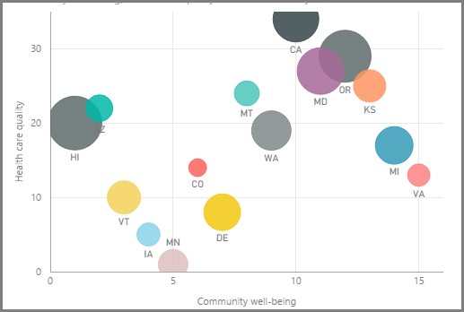
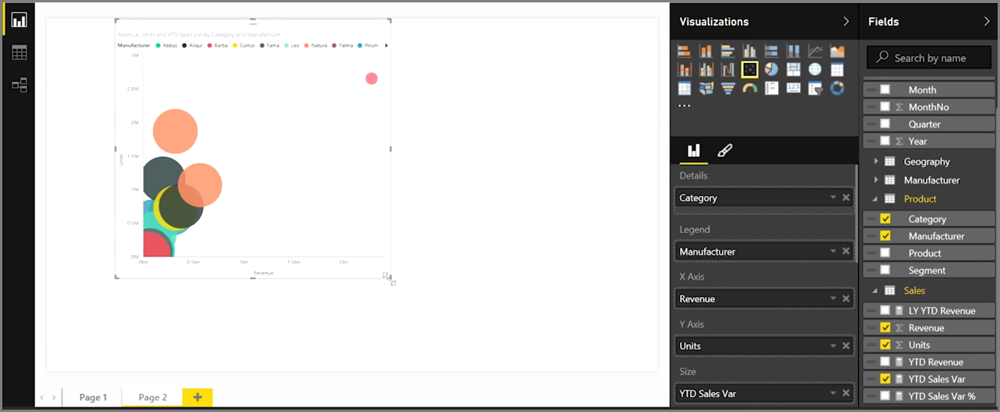
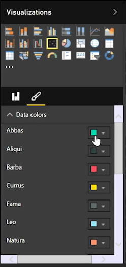
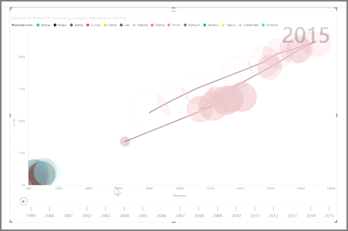

If you want to compare two different measures, such as unit sales verses revenue, a common visualization to use is a scatter chart.

To create a blank chart, select **Scatter chart** from the **Visualizations** pane. Drag and drop the two fields you want to compare from the **Fields** pane to the *X Axis* and *Y Axis* options buckets. At this point, your scatter chart probably just has a small bubble in the center of the visual - you need to add a measure to the *Details* bucket to indicate how you would like to segment your data. For example, if are comparing item sales and revenue, perhaps you want to split the data by category, or manufacturer, or month of sale.

Adding an additional field to the *Legend* bucket color-codes your bubbles according to the field's value. You can also add a field to the *Size* bucket to alter the bubble size according to that value.

Scatter charts have many visual formatting options as well, such as turning on an outline for each colored bubble and toggling individual labels. You can change the data colors for other chart types, as well.

You can create an animation of your bubble chart's changes over time by adding a time-based field to the *Play Axis* bucket. Click on a bubble during an animation to see a trace of its path.

>[!NOTE]
>Remember, if you only see one bubble in your scatter chart, it's because Power BI is aggregating your data, which is the default behavior. Add a category to the *Details* bucket, in the **Visualizations** pane, to get more bubbles.
> 
> 

