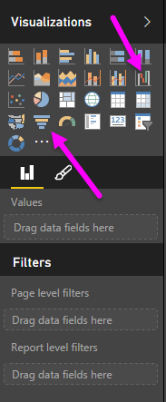
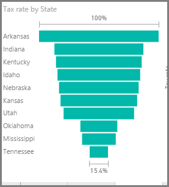

Waterfall and funnel charts are two of the more interesting (and perhaps uncommon) standard visualizations that are included in Power BI. To create a blank chart of either type, select its icon from the **Visualizations** pane.

**Waterfall charts** are typically used to show changes in a particular value over time.

Waterfalls only have two bucket options: *Category* and *Y Axis*. Drag a time-based field such as *year* to the *Category* bucket, and the value you want to track to the *Y Axis* bucket. Time periods where there was an increase in value are displayed in green by default, while periods with a decrease in value are displayed in red.

**Funnel charts** are typically used to show changes over a particular process, such as a sales pipeline or website retention efforts.

Both **Waterfall** and **Funnel** charts can be sliced and visually customized.

