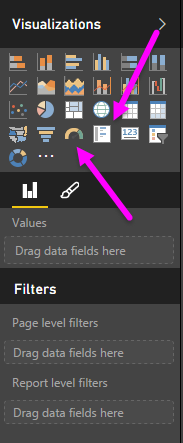
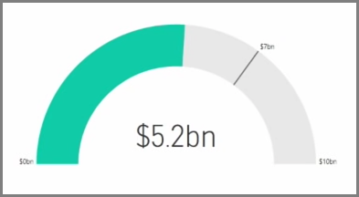
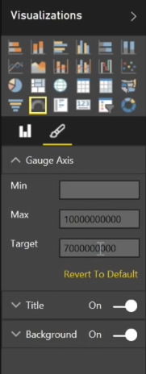
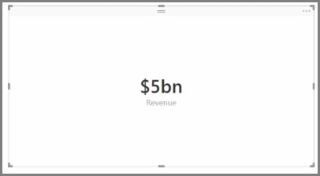
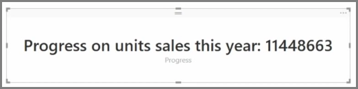

Generally, visualizations are used to compare two or more different values. However, sometimes when building reports you may want to track a just single Key Performance Indicator (KPI) or metric over time. The way to do this in Power BI Desktop is with a **Gauge** or **single number** card visual. To create a blank chart of either type, select its icon from the **Visualizations** pane.

Gauges are particularly useful when you are building dashboards and want to show progress towards a particular target. To create a gauge, select its icon from the **Visualizations** pane, and drag the field you want to track into the *Value* bucket.

Gauges appear by default at 50%, or double the *Value*, and there are two ways to adjust this setting. To dynamically set the values, drag fields to the *Minimum*, *Maximum*, and *Target* Value buckets. Alternatively, use the visual formatting options to manually customize the range of your gauge.

Card visualizations simply show a numeric representation of a field. By default card visuals use display units to keep the number short, for example displaying "$5bn" instead of "$5,000,000,000". Use the visual formatting options to change the unit being used, or disable it completely.

One interesting application of cards is to have them display a custom measure that you've concatenated with text. To use the earlier example, with a custom measure your card could include advanced DAX functions and display something like, "Total revenue this year: $5bn" or "Progress on unit sales this year:" and then add the number that represents the progress.

