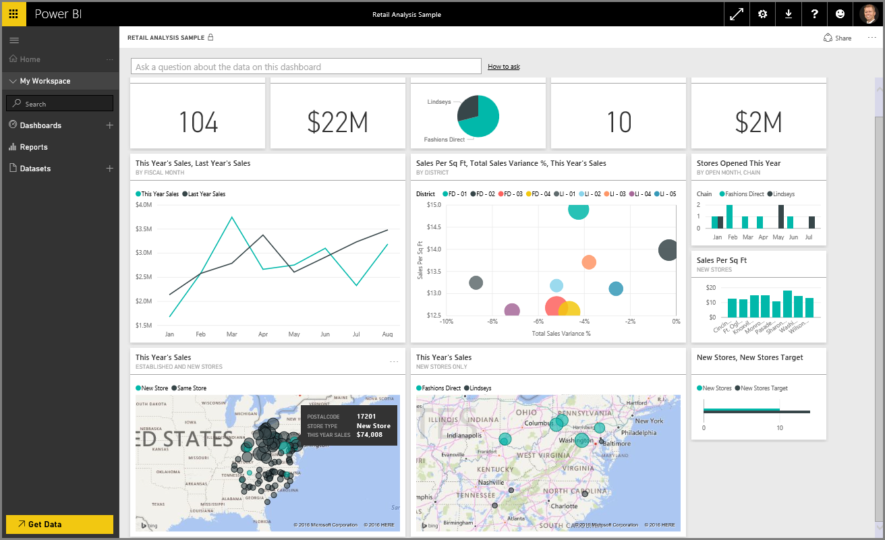
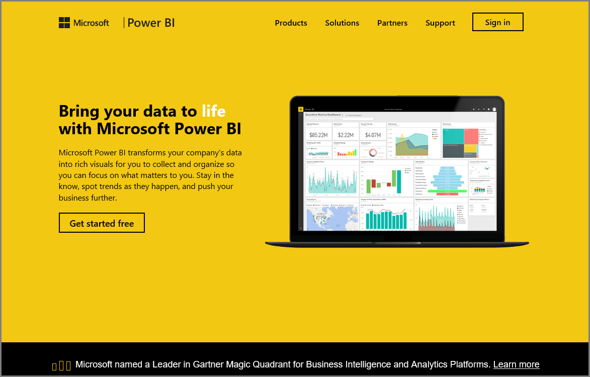

Welcome to the **Exploring Data** section of the **Guided Learning** course for Power BI. Now that you know about Power BI Desktop, and how to get and visualize data, you're ready to explore data in the Power BI service.

There are all sorts of things to learn in this section, and the compelling  interactivity and sharing of Power BI really shines here. So get ready for an engaging and interesting section.

## Introduction to the Power BI service
*See what the Power BI service can do for your organization*

The Power BI service is the natural extension of **Power BI Desktop**, and its features include uploading reports, creating dashboards, and asking questions of your data using natural language. You can use the service to set data refresh times, share data with your organization, and create customized service packs.

In the following topics, we'll explore the Power BI service, and show you how it can turn your business intelligence data into data insights and a collaborative decision-driving environment.

