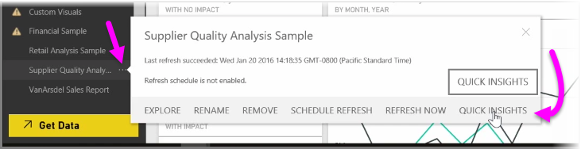
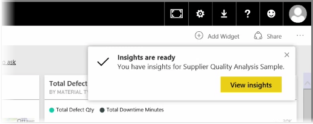
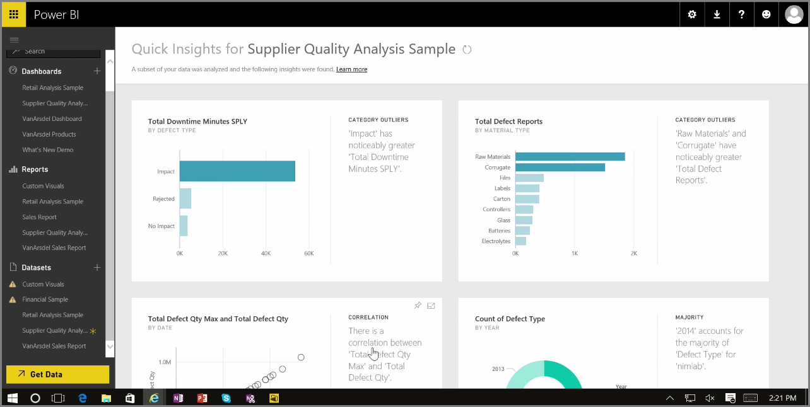

When you're working with a dashboard, report, or dataset in the Power BI service, you can have Power BI look for quick insights into the data. In Power BI, from the **Datasets** section in the left pane, select the *ellipses* (the three dots) beside the dataset you're interested in. A menu of options appears, and on the far right you'll see an option called **Quick Insights**.

When you select Quick Insights, Power BI performs some machine learning and searches the data, analyzing it to find quick insights. You'll see a notification in the upper-right side of the service that indicated Power BI is working on finding insights.

After fifteen seconds or so, the notification changes to let you know that Power BI found some insights.

When you select the **View insights** button on the notification, you're presented with a page of visuals that show the insights that Power BI found, similar to what you see in the following image. There are a bunch of insights, which you can scroll down through the page to view and consider.

Like any other visual, you can interact with the visuals in the Quick Insights page, and you can also pin any of them to a dashboard that you might have, or further filter one or more of them (or as many as you like), to search for additional insights that might be waiting on your curiosity to uncover.

With **Quick Insights**, you can let Power BI do the work to spot outliers and trends in your data, then use those findings in your dashboards, or further refine and filter them to get to the insights that are most important to you.

