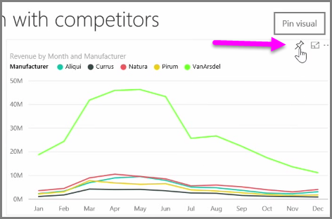
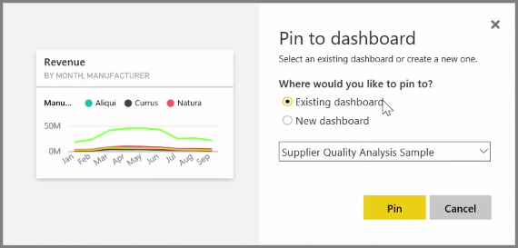
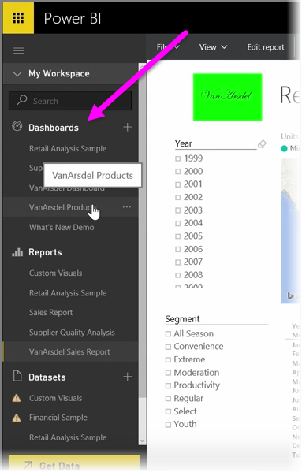
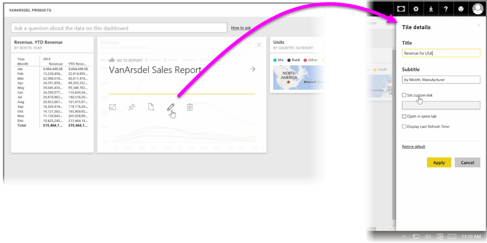

**Dashboards** in Power BI are one-page collections of visualizations that are created from within the Power BI service. You create dashboards by **pinning** visualizations from reports that you authored and published using Power BI Desktop, or visualizations you created within the Power BI service itself. **Pinning** a visual to a dashboard is a lot like pinning a picture to a corkboard on a wall - it sticks the visual there, in a particular spot, for others to see. To pin a visual, open its report on the Power BI service. Hover over the visual you want to pin and select the **pin** icon.

A dialog appears, where you select a destination dashboard for the visual from the drop-down menu, or you can create a new dashboard. You also get a preview of what the pinned visual will look like in the dashboard. You can pin visualizations from multiple reports and pages to a single dashboard, allowing you to combine different datasets and sources into a single page of insights.

On **Dashboards**, you can add any sort of visualization including graphs, maps, images, and shapes, by "pinning" them. Once a visual is pinned to a dashboard, it's called a **tile**.

Your dashboards, including any new ones, appear in the Dashboards section on the left side of the Power BI service. Select a dashboard from the list to view it.

You can change the layout of visuals on a dashboard however you'd like. To resize a tile, drag its handles in or out. To move a tile, simply click and drag it to a different location on the dashboard. Hover over a tile and click the **pencil** icon to open the **Tile Details**, where you can change the **Title** or **Subtitle**.

Click on a dashboard tile to view the report from which it originated. This lets you quickly view the underlying data beneath a visual. You can also change that link by using the **Set custom link** field in **Tile Details**.

You can pin tiles from one dashboard to another, for example if you have a collection of dashboards and want to create one summary board. The process is the same: hover over the tile and select the **pin icon**. Dashboards are easy to create, and to change. And you can customize them to make your one-page dashboard show exactly what it should.

