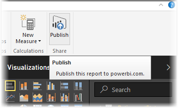
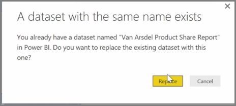
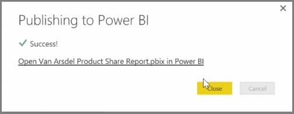

You can update reports and datasets that you've already published from Power BI Desktop to the Power BI service. To do so, select **Publish** from the **Home** tab in the ribbon.

When you publish a report that already exists in the Power BI service, you're prompted to confirm that you want to replace the previous dataset and reports with the edited version you just chose to update.

When you select **Replace**, the datasets and reports in the Power BI service are overwritten with the datasets and reports in the most recent Power BI Desktop version of the file.

And just like any other **Publish** event from Power BI Desktop, you see a dialog that tells you the publish event was successful, and you get a link to the report in the Power BI service.

This is a way to manually refresh your data. You can also automatically update datasets and reports; that process is covered in another learning topic.

