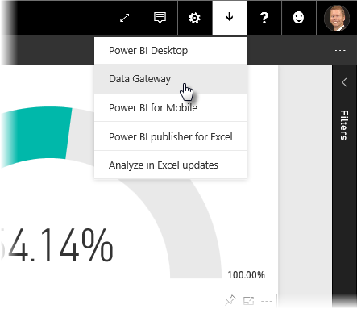
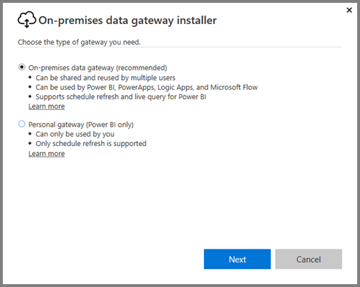
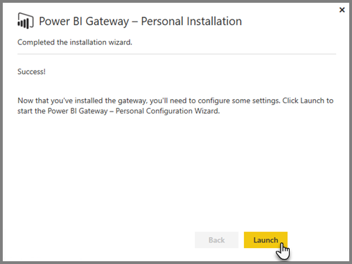
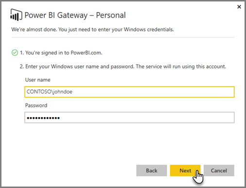
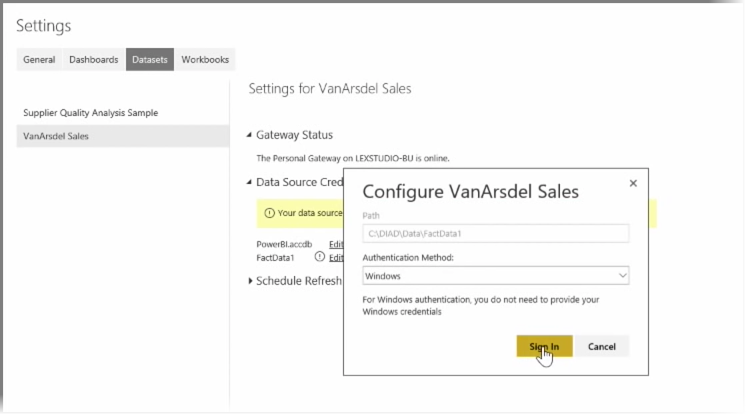
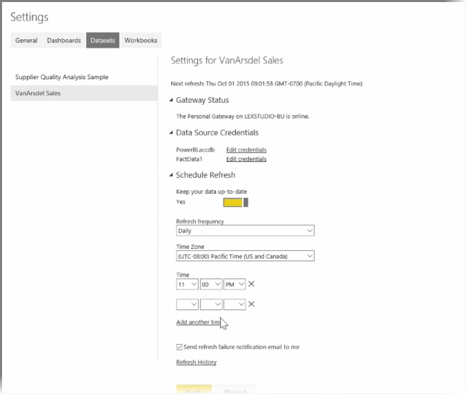

In previous topics we've looked at how you can use Power BI to connect to data sources, and how to manually refresh your datasets on the Power BI service. However, you're not going to want to manually refresh things every time your data changes, so you can use Power BI to set up a scheduled refresh that will connect to your data sources and publish them into the Power BI Service automatically. This also gives you a way to connect the service with any on-premises data sources, including Excel files, Access databases, SQL databases, and more.

The system that lets you connect your on-premises data sources to the Power BI service is called the **data gateway**. It's a small application that runs on your computer, and uses a pre-arranged schedule to connect to your data, gather any updates, and push them up to the Power BI service. The **personal gateway** is a version of the **data gateway** that can be used without any administrator configuration.

>[!NOTE]
>The computer  that is running the Power BI personal gateway *must* be on and connected to the Internet for **personal gateway** to work properly.
> 

To set up your **personal gateway**, first sign in to the Power BI service. Select the **Download** icon in the top right-hand corner of the screen, and then select **Data Gateways** from the menu.

From there you'll be taken to a web page where you can select the **Power BI Gateway - Personal**, as shown below.

Run the application once it finishes downloading, and complete the installation wizard.

You'll then be prompted to launch the configuration wizard to set up your gateway.

You'll be asked first to sign in to your Power BI service account, and then to sign in to the machine's Windows account, since the gateway service runs under your account.

Return to the Power BI service. Select the ellipsis (three dots) menu next to the dataset you want to refresh, and then select **Schedule Refresh**. This opens the **Refresh Settings** page. Power BI detects that you've installed a **personal gateway**, and lets you know its status.

Select **Edit credentials** next to each applicable data source and set up authentication.

Finally, set the options under **Schedule Refresh** to activate automatic updates and set when and how frequently they occur.

And that's it. On the scheduled times, Power BI will go out to those data sources, using the credentials you provided and the connection to the computer that has your **personal gateway** running, and update the reports and datasets according to your schedule. The next time you go to Power BI, those dashboards, reports, and datasets will reflect data as of the most recent scheduled refresh.

## Next steps
**Congratulations!** You've completed this **Exploring Data** section of the **Guided Learning** course for Power BI. The Power BI service is full of interesting ways to explore data, share insights, and interact with visuals. And it's all accessible from a browser, from a service that you can connect to wherever you are.

One powerful and well-known partner of Power BI is **Excel**. Power BI and Excel are designed to work well together; your workbooks will feel at home in Power BI, and it's easy to get them there.

How easy? In the next section, **Power BI and Excel** you learn exactly that.

See you in the next section!

