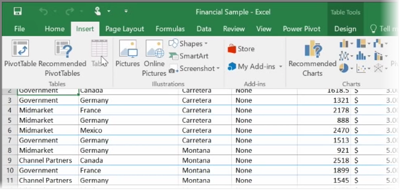
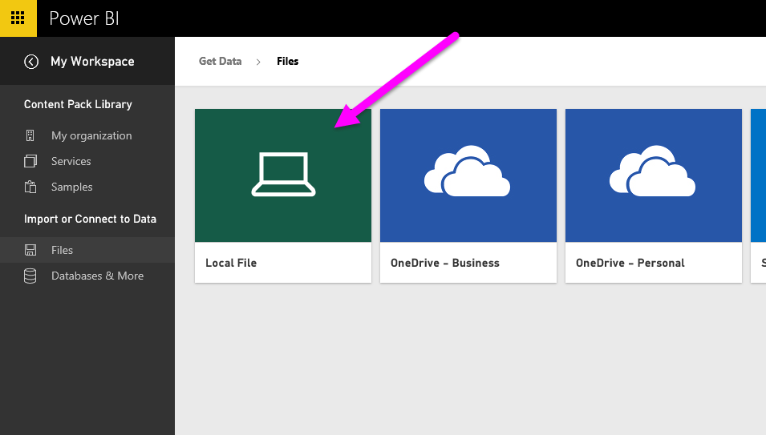
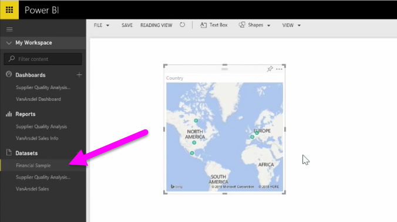

In this topic, we'll first take a look at how you can import an Excel workbook file containing a simple **table** from a local drive into Power BI. You'll then learn how you can begin exploring that table's data in Power BI by creating a report.

## Make sure your data is formatted as a table
In order for Power BI to import data from your workbook, that data needs to be  **formatted as a table**. It's easy. In Excel, you can highlight a range of cells, then on the **Insert** tab of the Excel ribbon, click **Table**.

You'll want to make sure each column has a good name. It will make it easier to find the data you want when creating your reports in Power BI.

## Import from a local drive
Wherever you keep your files, Power BI makes it easy to import them. In Power BI, you can use **Get Data** > **Files** > **Local File**, to find and select the Excel file we want.

Once imported into Power BI, you can begin creating reports.

Your files don't have to be on a local drive, of course. If you save your files on OneDrive or SharePoint Team Site, that's even better. We'll go into more details about that in a later topic.

## Start creating reports
Once your workbook's data has been imported, a dataset is created in Power BI. It appears under **Datasets**. Now you can begin exploring your data by creating reports and dashboards. Just click on the **Open menu** icon next to the dataset and then click **Explore**. A new blank report canvas appears. Over on the right, under **Fields**, you'll see your tables and columns. Just select the fields you want to create a new visualization on the canvas.

You can change the type of visualization and apply **filters** and other properties under **Visualizations**.

