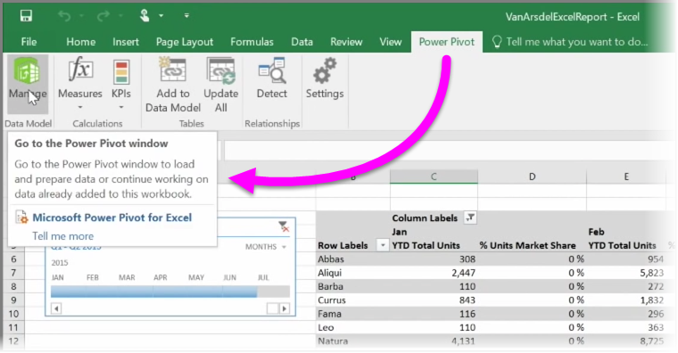
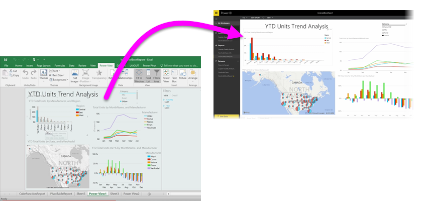

If you use any of Excel's advanced BI features like **Power Query** (called **Get & Transform** in Excel 2016), to query and load data, **Power Pivot** to create powerful data models, and **Power View** to create dynamic reports, you can import those into Power BI, too.

If you use **Power Pivot** to create advanced data models, like those with multiple related tables, measures, calculated columns, and hierarchies, Power BI will import all of that as well.

If your workbook has **Power View sheets**, no problem. Power BI will re-create them as new **Reports** in Power BI. You can start pinning visualizations to dashboards right away.

And here's one of the great features of Power BI: If you use Power Query or Power Pivot to connect to, query, and load data from an external data source, once you've imported your workbook into Power BI, you can setup **scheduled refresh**. By using scheduled refresh, Power BI will use the connection information from your workbook to connect directly to the datasource and query and load any data that has changed. Any visualizations in reports will automatically be updated, too.

