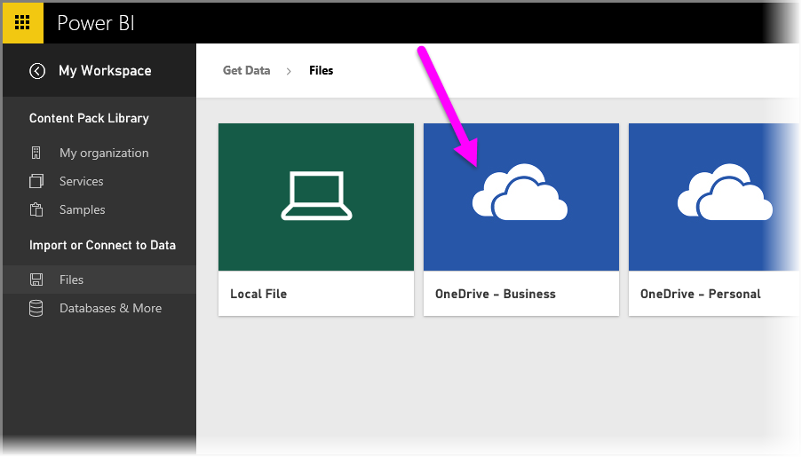
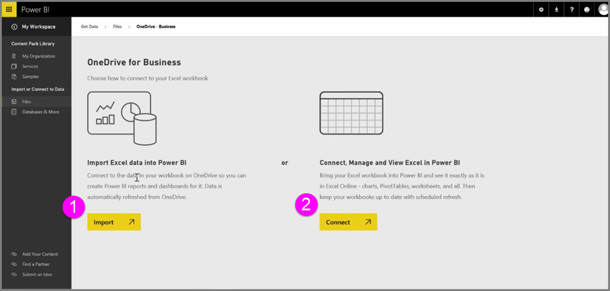
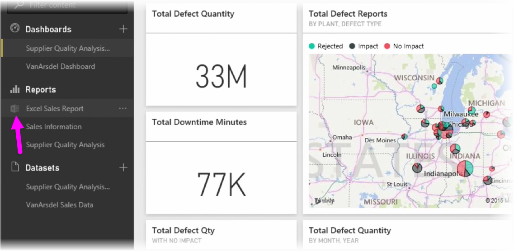
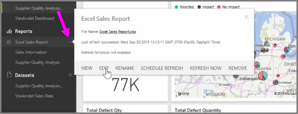

Get seamless integration between Power BI and Excel when you save your Excel workbooks to OneDrive.

Because OneDrive is in the cloud, just like Power BI, a live connection is made between Power BI and OneDrive. If you make changes to your workbook on OneDrive, those changes are *automatically synchronized* with Power BI. Your visualizations in reports and dashboards are kept up-to-date. If your workbook connects to external data sources like a database or an OData feed, you can use Power BI's **Schedule refresh** features to check for updates. Need to ask questions about data in your workbook? No problem. You can use Power BI's **Q & A** features to do just that.

There are two ways to connect to your Excel files on OneDrive for Business:

1. Import Excel data into Power BI
2. Connect, manage, and view Excel in Power BI

### Import Excel data into Power BI
When you choose to import Excel data into Power BI, table data from your workbook is loaded into a new dataset in Power BI. If you have any **Power View** sheets in your workbook, those are imported and new reports are automatically created in Power BI, too.

Power BI will maintain the connection between it and the workbook file on your OneDrive for Business. If you make any changes to your workbook, when you save, those changes will be *automatically synchronized** with Power BI, usually within an hour. If your workbook connects to external data sources, you can setup scheduled refresh so the dataset in Power BI is kept up-to-date. Because visualizations in reports and dashboard in Power BI will use the data from the dataset, as you explore, your queries are lightning fast.

### Connect, manage and view Excel in Power BI
When you choose to connect to the Excel workbook, you'll get a seamless experience of working with your workbook in Excel and Power BI. When you connect this way, the workbook's report has a small Excel icon next to it.

In the report, you see your Excel workbook in Power BI just as you would in **Excel Online**. You can explore and edit your worksheets in Excel Online by selecting Edit from the ellipses menu. When you make changes, any visualizations you've pinned to dashboards are updated automatically.

No dataset is created in Power BI. All of the data remains in the workbook on OneDrive. One of the many advantages to this approach is that you can setup **scheduled refresh** if your workbook connects to external data sources. You can select elements such as PivotTables and charts and **pin** them right to dashboards in Power BI. If you make any changes, they're automatically reflected in Power BI. And, you can use Power BI's awesome **Q & A** features to ask questions about the data in your workbook.  

